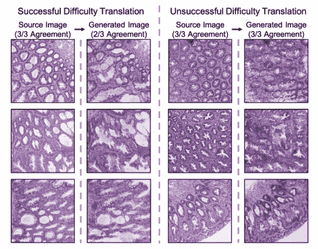
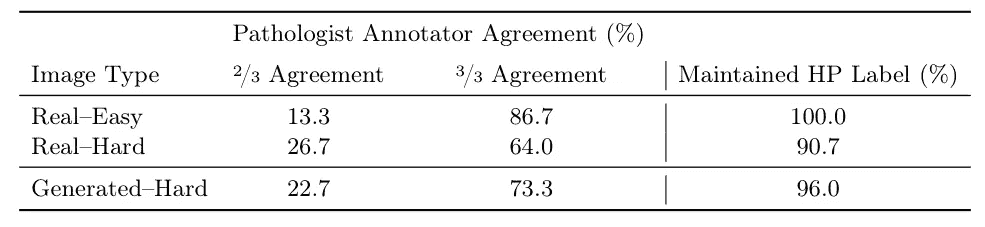
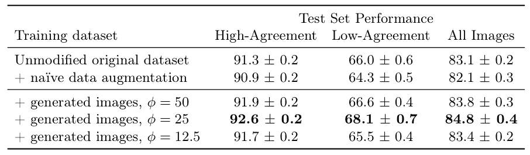

# 通过改变图像的难度来提高分类器性能

> 原文：<https://towardsdatascience.com/improving-classifier-performance-by-changing-the-difficulty-of-images-cae33464e8d3?source=collection_archive---------80----------------------->

## 我们提出了一个难度转换模型，该模型修改了结肠直肠组织病理学图像，使分类变得更具挑战性，发现用生成的图像作为增强数据训练的图像分类器表现更好。

**概述。**在这项研究中，我与一组研究人员合作，为组织病理学图像创建了一个难度翻译模型。换句话说，给定一些癌症的图像，我们将其修改成一个更难分类的图像。这是基于这样的动机，即这些图像具有一系列决定它们将如何被分类的特征，这不同于像 ImageNet 这样的一般计算机视觉数据集(例如，没有猫和狗的范围)。

如果你想更详细地了解我们的工作，可以在[这里](https://arxiv.org/pdf/2004.12535.pdf)找到全文。

病理学家对生成的图像的认同度较低。左边的一组图片显示的是更难分类的翻译图片。右边的一组图像显示了图像翻译，并没有变得更难分类。

**数据集。**数据集由来自达特茅斯-希区柯克医疗中心的结肠直肠癌图像组成，它已被分为 2，051 个图像的训练集和 1，101 个图像的测试集。这些图像中的每一个都被标记为过度增生性息肉(HP)或无柄锯齿状腺瘤(SSA)。

**模型。**我们的模块由一个评分器和一个循环一致的生成对抗网络(CycleGAN)图像翻译器组成，前者预测给定图像的难度，后者将容易分类的图像翻译成较难分类的图像。通过这种配置，该模块能够将给定的图像翻译成类似的示例，该示例将被分类为具有相同的标签，但是将更加难以分类。

**生成更难的训练数据。**在本模块中，我们将 image translator 的源域设置为简单惠普映像，并将目标域设置为硬惠普映像。通过这样做，图像翻译器学会了将简单的 HP 图像转换成硬的 HP 图像。

为了评估翻译图像的难度，我们与三位病理学家一起进行了图灵测试。每个病理学家被给予 75 个随机采样的真实简易 HP 图像、75 个随机采样的真实硬 HP 图像、75 个从选择的简易 HP 图像翻译的生成的 HP 图像和 75 个 SSA 图像。病理学家被要求将每个图像分类为 HP 或 SSA。我们发现病理学家在生成的图像上比他们真正的对手有更多的分歧，这意味着生成的图像确实更难分类。完整的结果可以在下面看到。

与真实图像相比，病理学家对生成的 HP 图像的真实标签认同较少。大多数生成的图像保留了它们的 HP 标签，因为源图像和它们相应的生成图像都被大多数病理学家分类为 HP。

**提高分类器的性能。**生成的图像也可以作为附加数据，更好地训练深度学习分类器。为了测试这一点，我们首先将生成的 HP 图像添加回原始训练数据集中。然后，我们在这个新的训练数据集上训练了一个新的分类器，并将其性能与我们以前的分类器进行了比较。我们将我们的方法与一种更简单的数据增强方法进行了比较，在该方法中，简单图像和困难图像被拼接在一起，发现我们优于基线增强，并且使用生成的图像作为增强数据始终提高了性能。完整的结果可以在下面看到。

图像分类器的性能(% AUC)使用生成的图像作为具有高注释者一致性(即，容易图像)、低注释者一致性(即，困难图像)和所有测试集图像的增强数据进行训练。

**总结。**在我们的研究中，我们证明了改变图像的难度并使用困难的例子作为附加数据是一种改善深度学习分类器性能的有前途的方法。在我们的数据集上，我们的方法能够将性能提高大约 2%，这是一个显著的改进。我们希望这些结果鼓励其他人探索在其他环境中使用改变图像难度，如课程学习或对抗性攻击。

如果你想阅读我们的全文，可以在这里找到。