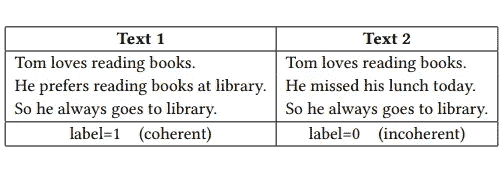
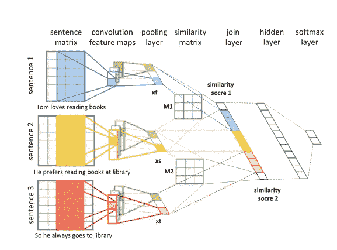
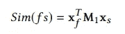
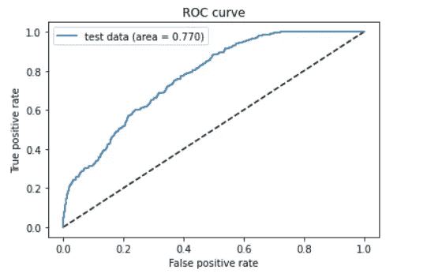
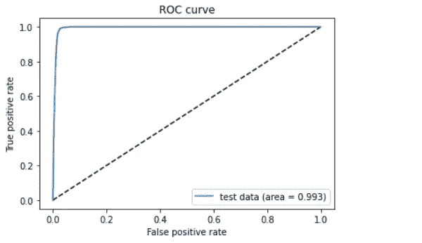

# 我们如何使用类平衡方法改进用于文本一致性建模的卷积神经网络

> 原文：<https://towardsdatascience.com/improving-convolutional-neural-networks-for-text-coherence-modelling-using-class-balancing-dc9083dd8987?source=collection_archive---------43----------------------->

最近，深度学习由于在处理非常复杂的问题时在准确性方面的优势而越来越受欢迎。它在 NLP 中被证明是有效的，并被许多问题广泛采用，为更有意义和更准确的建模方法打开了新的大门。

虽然自然语言处理中的许多问题涉及文本合成，如文本生成和多文档摘要，但文本质量度量成为一个核心需求，并且对它们进行建模是一个活跃的问题。在这些措施中，语篇连贯是关键，需要特别处理。

语篇连贯(Text coherence)是指语篇逻辑一致性的程度，这个问题可以追溯到 20 世纪 80 年代，当时提出了几个模型。但是由于连贯性的概念过于抽象，因此制定一个衡量标准相当困难。我们讨论了使用最先进的方法对文本连贯性建模，以及我们为获得更准确的结果而对其进行的改进。图 1 显示了两段文本:文本 1 是连贯的，其中句子是逻辑有序的，而文本 2 具有不连贯的句子顺序。

图一。连贯和不连贯的文本样本

# 相干建模

## 统计方法

在深度学习兴起之前，有人建议用统计方法来模拟连贯性的意义；隐马尔可夫模型(HMM)被建议通过将文本视为主题序列来捕获全局连贯，连贯通过主题转移来捕获，其他方法使用词汇和句法特征。这些方法显示了良好但不是最好的结果。后来，提出了一种更有前途的基于深度学习的方法，使用递归神经网络(RNNs)⁵.然而，这种方法很少注意句子之间的语义关系。由于消失梯度问题，它也受到了 RNNs 处理长句的限制。

## CNN 模型

2017 年，Yingming Li 等人提出了一种基于深度学习的文本连贯性分析，该分析利用卷积神经网络(CNN)的能力，将输入句子映射到专注于低级特征的高级表示中，并利用这些特征来捕捉更准确的句子语义交互，从而克服了以前模型的局限性。该模式建议同时学习句子分布表征和连贯；通过映射句子和学习句子级别的交互，如相似性，可以实现对文本连贯性的有意义的评分。然后在句子排序任务上对该模型进行评估。

## 了解模型

该模型将文档分成被称为 n 个句子的集团的段落。原始文档的派系是一致的；标记为 1。然后，它生成文档的 20 个排列，其中形成排列文档的集团被认为是不一致的；标记为 0。因此，文档的一致性分数是其所有派系的产物。

一个 3 人集团模型应该是这样的:

图二。文本连贯性测量的 CNN 模型

卷积层将句子映射到高级表示中，在该表示中捕获细粒度特征，然后根据图 3 中的等式计算相似性，在图 3 中还学习了相似性矩阵。

相似性方程使用训练的相似性矩阵 M1 来测量团体的第一个句子 Xf 和第二个句子 Xs 之间的相似性。同样的等式适用于第二句和第三句；Xs 和 Xt。第一句和第三句的相似度既然是传递关系，那就从前两个分数推断出来，不需要计算。

最后，致密层负责决定句子是否连贯。

图 3。相似方程

该模型的结果得到了认可，并且优于其他方法。正如该报所报道的:在由美国国家运输安全委员会官员撰写的航空事故报告集上测试该模型的结果是 **95.0%** 的准确率。

# 模型实现和分析

我和我的团队在“单文档摘要和评估”中实现了这篇论文，作为我们毕业论文的一部分，其中我们给生成的摘要一个一致性分数(代码可在 GitHub [这里](https://github.com/AhmedSalemElhady/NLP/blob/master/CNN%20coherence%20model.ipynb)获得)，据我们搜索，这是这篇论文唯一可用的开源实现(有另一个资源库的作者宣布它是一个不正确的实现)。
我们首先按照论文的建议，使用相同的事故数据集训练模型。我们使用分层 k 折叠交叉验证进行 10 个折叠的模型训练，结果与论文报道的几乎相同；平均模型准确率为 **95.38%**

然后，我们开始解决模型的弱点。主要地，为训练数据中的每个文档创建 20 个排列，然后将其分成单独的集团的建议产生了不平衡的数据集。如 Buda 等人(⁴)所讨论的，具有类别不平衡数据会导致模型表现显著不佳。这可以通过调查下图 4 中测试数据的建议模型的 ROC 曲线来显示，其中模型的 AUC 为 0.77

图 4。基于测试数据的不平衡基本模型 ROC 曲线

尽管由于 CNN 使用共享参数并且该架构所建议的密集层较浅，所以该模型不会遭受过拟合，但是所建议的模型允许进一步改进。

# 改进模型

为了解决阶级不平衡的问题，我们采用了两种方法来比较它们是如何工作的:获取更多的数据，并试图克服阶级不平衡的问题。

## 1.访问更大的数据集:

首先，我们试图获得更多的数据。由于模型没有对文档进行限制，我们可以使用由数百万篇文章组成的 CNN/Daily Mail 数据集来增加数据集的大小。这种方法仅将精度提高到了 **~98%** ，并允许架构有更深的密集层。但是 ROC 曲线几乎保持不变。

## 2.使用过采样平衡等级:

改进模型的第二种方法是使用布达和 al.⁴建议的过采样，通过随机重复数据中的少数类观察值来平衡类，直到它们几乎平衡。这种技术非常有效，并允许更深层次的网络架构，导致分层 10 倍验证准确性的平均 **~99%** 和测试数据的 **98.3%** 准确性。

如图 5 所示，不仅提高了模型准确性，而且测试 ROC 曲线也接近最优，AUC 等于 **0.993** 。

图 5。基于测试数据的平衡基础模型 ROC 曲线

# 参考

[1] Pascale Fung 和 Grace Ngai。2006.一个故事，一个流程:用于多语言多文档摘要的隐马尔可夫故事模型。TSLP 3，2 (2006)，1–16。

[2]安妮·路易斯和阿尼·年科娃。2012.基于句法模式的连贯模型。在 EMNLP-CoNLL。1157–1168.

[3]崔，b，李，y，张，y，张，z:基于深度神经网络的语篇连贯分析。载于:CIKM 2017，第 2027–2030 页。美国计算机学会(2017 年)

[4] Mateusz Buda、Atsuto Maki 和 Maciej A Mazurowski。卷积神经网络中类不平衡问题的系统研究。神经网络，2018。

[5]李继伟和爱德华·h·霍维。2014.基于分布式句子表示的连贯模型。在 EMNLP。2039–2048.