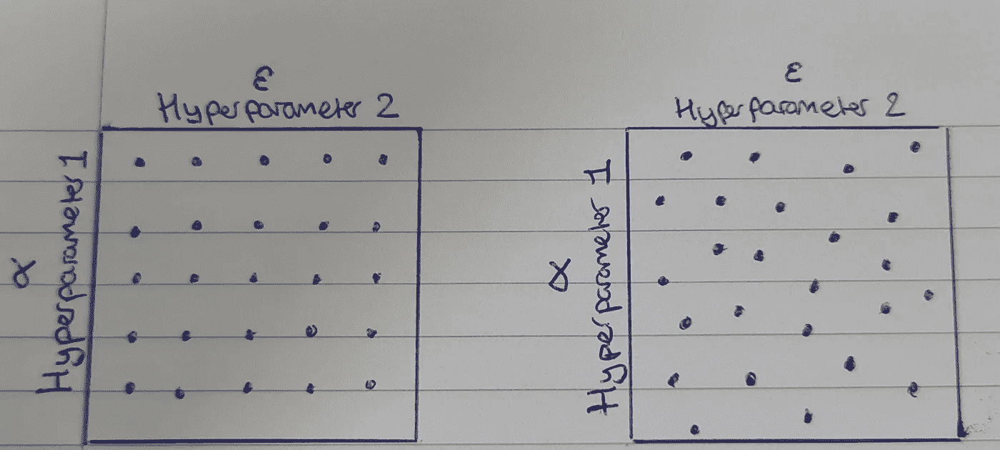
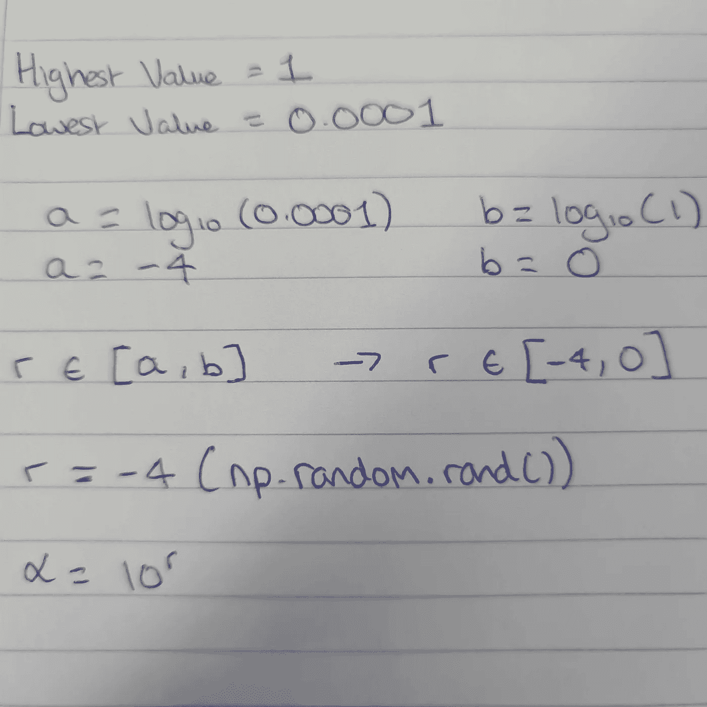
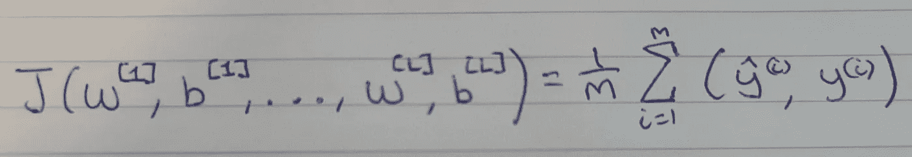
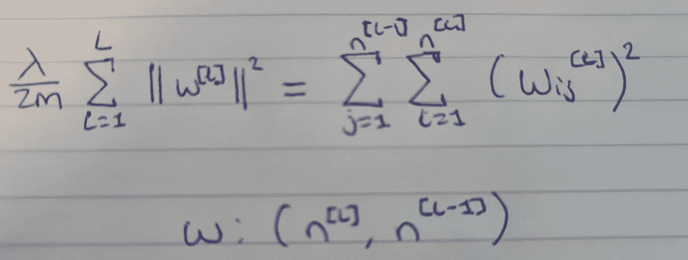
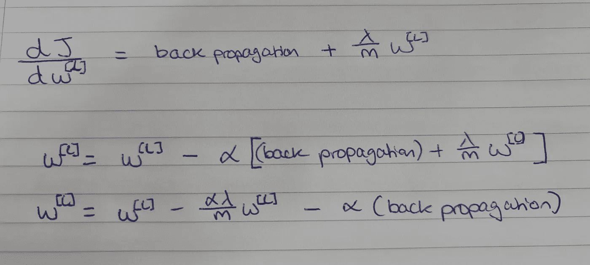
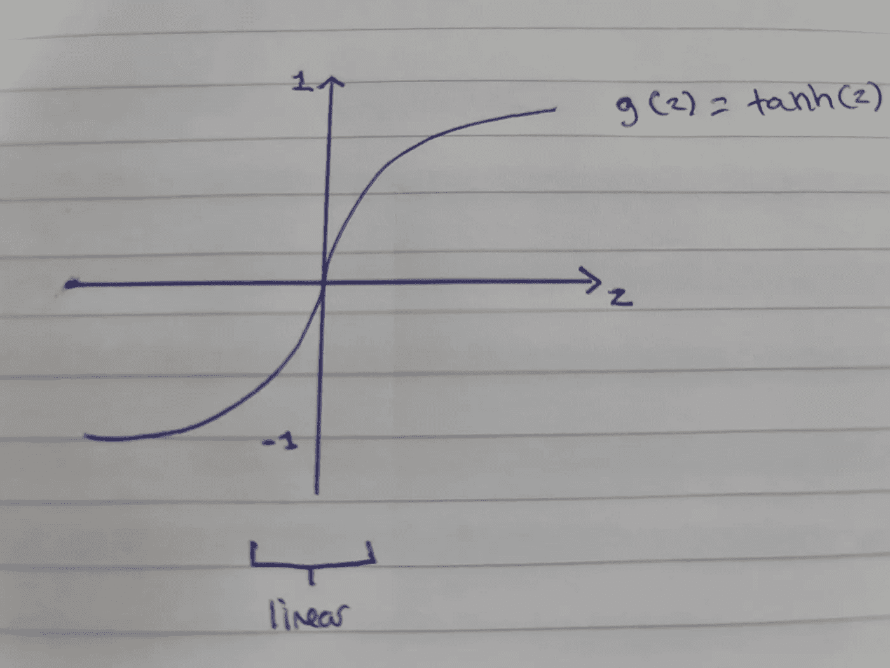

# 改进深度神经网络

> 原文：<https://towardsdatascience.com/improving-deep-neural-networks-d5d096065276?source=collection_archive---------43----------------------->

## 吴恩达在深度学习专业课程中对超参数调整和正则化的建议。

帕维尔·卡迪什

我最近一直在学习 Coursera 的深度学习专业课程，该课程由吴恩达设计和教授。第二个子课程是改进深度神经网络:超参数调整、正则化和优化。在我开始这个子课程之前，我已经在我以前的项目中完成了传统机器学习算法的所有步骤。我调优了决策树的超参数，比如 max_depth 和 min_samples_leaf，还调优了 SVM 的 C、kernel 和 gamma。为了正则化，我将 Ridge (L2 惩罚)、Lasso (L1 惩罚)和 ElasticNet (L1 和 L2)应用于回归模型。所以我想这不会比把这些概念翻译到神经网络上多多少。好吧，我在某种程度上是对的，但是考虑到吴恩达是如何解释数学和直观地展示这些优化方法的内部运作的，我从基础层面上有了更好的理解。

在这篇文章中，我想回顾一下 Andrew 对这些技术的一些解释，并附有一些数学和图表。

## 超参数调谐

以下是一些针对深度网络调整的流行超参数:

*   α(阿尔法):学习率
*   β(β):动量
*   层数
*   隐藏单元的数量
*   学习率衰减
*   小批量

还有其他特定于优化技术的，例如，对于 Adam 优化，有β1、β2 和ε。

**网格搜索 vs 随机搜索**

假设对于一个模型，我们有一个以上的超参数正在调整，一个超参数可能会比另一个超参数对训练/验证精度有更大的影响。在这种情况下，我们可能希望为更有影响力的超参数尝试更广泛的值，但同时，我们也不想运行太多模型，因为这很耗时。

对于这个例子，假设我们正在优化两个不同的超参数，α和ε。我们知道α更重要，需要通过尝试尽可能多的不同值来调整。然后你仍然想尝试 5 个不同的ε值。所以，如果我选择尝试 5 个不同的α值，那么就有 25 个不同的模型。我们已经用 5 α和 5 ε的不同组合运行了 25 个模型。

但是我们想在不增加模型数量的情况下尝试更多的α值。以下是安德鲁的解决方案:

为此，我们使用随机搜索，其中我们为每个α和ε选择 25 个不同的随机值，每对值用于每个模型。现在我们只需要运行 25 个模型，但是我们可以尝试 25 个不同的α值，而不是网格搜索中的 5 个。

左:网格搜索，右:随机搜索

额外收获:使用由粗到细的方法有助于进一步提高调音效果。这包括放大表现最佳的超参数的较小区域，然后在该区域内创建更多模型，以更精确地调整这些超参数。

**选择音阶**

当尝试不同的超参数值时，选择正确的比例可能会很困难，尤其是要确保在一个非常大的数字范围和一个非常小的数字范围内进行彻底的搜索。

学习率是一个超参数，可以根据模型的不同而有很大的变化，它可以在 0.000001 和 0.000002 之间，或者在 0.8 和 0.9 之间。当查看线性标尺时，很难同时在这两个不同的范围之间进行公平的搜索，但是我们可以使用对数标尺来解决这个问题。

假设α的值在 0.0001 到 1 之间。使用线性标度意味着 10%的尝试α值在 0.0001 和 0.1 之间，90%在 0.1 和 1 之间。这很糟糕，因为我们没有对如此广泛的值进行彻底的搜索。通过使用 10 标度的对数，25%的α值在 0.0001 和 0.001 之间，25%在 0.001 和 0.01 之间，25%在 0.01 和 0.1 之间，最后 25%在 0.1 和 1 之间。这样我们对α进行了彻底的搜索。0.0001 到 0.1 的范围对于线性标度是 10%，而对于对数标度是 75%。

左:线性标度，右:对数标度

这里有一点数学知识，用一个 numpy 函数来演示它如何对α的随机值起作用。

## 规范化

由于高方差，过度拟合可能是模型的一个巨大问题，这可以通过获得更多的训练数据来解决，但这并不总是可能的，所以一个很好的替代方法是正则化。

**L2 正规化(‘重量衰减’)**

正则化利用 L1 和 L2 两种惩罚技术中的一种，主要使用神经网络 L2。

我们必须首先看一下神经网络的成本函数:

价值函数

然后加上 L2 罚项，其中包含了弗罗贝纽斯范数:

L2 刑罚术语，包括弗罗贝纽斯规范

通过 L2 正则化，权重不仅通过学习速率和反向传播降低，而且通过包括正则化超参数λ (lambda)的中间项降低。λ越大，w 越小。

重量衰减

**规范化如何防止过度拟合？**

我们看到 L2 正则化使用λ惩罚来减少权重 w，但是这如何减少方差并防止模型的过度拟合呢？

λ上升，w 下降，改变 z 的幅度

如果 w 很小，z 的大小也会下降，如果 z 是一个大的正数，它会变小，如果是一个大的负数，它会变大，接近 0。当通过激活函数传递 z 时，我们有一个更线性的效果(如下图所示，tanh 曲线在 0 附近更线性)。

双曲正切激活函数的图形，显示了 z 值的减小如何使函数更加线性

这里 g(z)对于 tanh 激活函数大致是线性的。“最佳拟合线”的决策边界将更简单，更接近线性，这将消除训练数据中的过度拟合。

这是吴恩达深度学习专业化课程的一小部分，我觉得非常有用，并想写下来，但课程提供了更多。如果你对学习深度神经网络感兴趣，并希望从基础水平理解所有事情，对所有过程进行彻底的数学论证，并进行编码练习，我强烈建议你完成本课程。