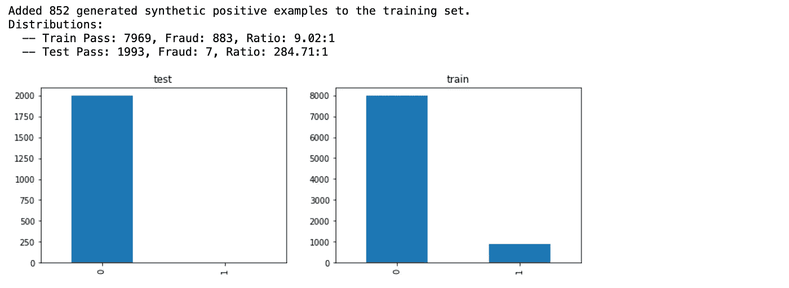

# 用合成数据改进机器学习中的大规模不平衡数据集

> 原文：<https://towardsdatascience.com/improving-massively-imbalanced-datasets-in-machine-learning-with-synthetic-data-7dd3d856bbdf?source=collection_archive---------37----------------------->

## 我们将使用合成数据和 SMOTE 中的一些概念来提高欺诈、网络安全或任何极少数类别分类的模型准确性

在机器学习中处理不平衡的数据集是一项艰巨的挑战，可能包括支付欺诈、诊断癌症或疾病，甚至网络安全攻击等主题。所有这些交易的共同点是，在所有交易中，只有很小一部分是真正的欺诈，而这些交易才是我们真正关心的。在本帖中，我们将通过训练一个生成合成数据模型来创建额外的欺诈记录，从而提高[流行的 Kaggle 欺诈数据集](https://www.kaggle.com/mlg-ulb/creditcardfraud)的准确性。独特的是，该模型将结合来自欺诈性记录及其最近邻居的特征，这些特征被标记为非欺诈性的，但与欺诈性记录足够接近，以至于有点“可疑”。

特征图像 Gretel.ai

# 我们不平衡的数据集

在这篇文章中，我们选择了 Kaggle 上流行的“[信用卡欺诈检测](https://www.kaggle.com/mlg-ulb/creditcardfraud)”数据集。该数据集包含 2013 年 9 月欧洲信用卡持有者的标记交易。为了保护用户身份，数据集将敏感特征降维为 27 个浮点列(V1–27)和一个时间列(数据集中此事务和第一个事务之间经过的秒数)。在这篇文章中，我们将使用信用卡欺诈数据集中的前 10k 条记录——点击下面的链接，在 Google 联合实验室中生成下面的图表。

 [## 分类并可视化欺诈数据集

colab.research.google.com](https://colab.research.google.com/github/gretelai/gretel-synthetics/blob/master/examples/research/synthetics_knn_classify_and_visualize.ipynb) 

一个极度不平衡的数据集

# 度量陷阱

让我们看看使用最先进的 ML 分类器检测欺诈记录可以获得什么样的性能。我们首先将数据集分为训练集和测试集。

对我们的默认欺诈数据集进行分类的结果

哇，99.75%的检出率。太棒了，对吧？！也许——查看整体模型准确性只是显示模型在整个集合中的表现有多好，而不是我们在检测欺诈记录方面做得有多好。要了解我们的实际表现，请打印一份混淆矩阵和准确性报告。

> 从上面我们可以看到，尽管我们的总体准确率为 99.75%，但在我们的测试集中，我们对 43%的欺诈示例进行了错误分类！

# 用合成数据增加欺诈案例

在本节中，我们将重点关注如何通过使用 [gretel-synthetics](https://github.com/gretelai/gretel-synthetics) 生成欺诈记录的更多示例，来提高欺诈记录的模型性能和泛化能力。让我们从我们想要完成的事情开始——我们的目标是生成额外的欺诈记录样本，这将帮助我们的分类器进行归纳，并更好地检测我们测试集中的欺诈记录。

# 合成少数过采样技术

数据科学社区中实现这一点的一种流行技术被称为 SMOTE(**S**yn intestic**M**inority**O**versampling**Te**technique)，由 Nitesh Chawla 等人在他们 2002 年的[论文](https://arxiv.org/abs/1106.1813)中描述。SMOTE 的工作方式是从少数类中选择样本，在少数类中找到它们最近的邻居，并在它们之间有效地插入新点。SMOTE 不能合并来自少数类之外的记录的数据，在我们的示例中，这些记录可能包含有用的信息——包括欺诈性的或贴错标签的记录。

# Gretel 合成了 SMOTE 的概念

我们的训练集中只有 31 个欺诈数据的例子，这给泛化带来了独特的挑战，因为 [gretel-synthetics](https://github.com/gretelai/gretel-synthetics) 利用深度学习技术来学习和生成新的样本，这在传统上需要大量数据才能收敛。打开下面的笔记本，使用 Google Colab 免费生成您自己的合成欺诈数据集。

 [## 格雷特-合成-生成-欺诈-数据

colab.research.google.com](https://colab.research.google.com/github/gretelai/gretel-synthetics/blob/master/examples/research/synthetics_knn_generate.ipynb) 

通过借用 SMOTE 找到欺诈集的最近邻居的方法，并结合来自多数类的几个最近邻居，我们有机会扩展我们的训练集示例，并结合从我们的欺诈类(**姑且称之为可疑**)记录中获得的一些知识。这种方法不需要对 [Gretel Synthetics](https://github.com/gretelai/gretel-synthetics) 做任何更改，我们只是智能地从欺诈+最近正邻居(shady)记录中挑选数据集。我们开始吧！

为了构建我们的合成模型，将使用 Gretel 的新[数据框架训练模式](https://gretel-synthetics.readthedocs.io/en/stable/api/batch.html)默认值和以下几个参数集来优化结果:

1.  `epochs: 7`。将 epochs 设置为尽可能低的设置，以平衡创建有效记录，而不会过度适应我们有限的训练集。
2.  `dp: False`。在这种情况下，不需要考虑运行差分隐私对准确性的影响。
3.  `gen_lines: 1000`。我们将生成 1000 条记录，以增强我们现有的 31 个正面示例。注意，并不是所有从我们的模型生成的记录都是正面的，因为我们合并了一些负面的例子——但是我们至少应该有几百个新的正面例子。
4.  `batch_size=32`。将所有 30 行放入单个神经网络模型中，以保留所有字段-字段相关性，代价是更多记录未通过验证。
5.  训练模型，生成行，并且只保留由合成数据模型创建的“欺诈性”记录

# 检查我们的合成数据集

现在，让我们来看看我们的合成数据，看看我们是否可以直观地确认我们的合成记录是他们接受培训的欺诈记录的代表。我们的数据集有 30 个维度，因此我们将使用数据科学中的一种称为主成分分析(PCA)的降维技术来以 2D 和 3D 方式可视化数据。

下面我们可以看到我们的训练、合成和测试数据集被压缩成二维。从视觉上看，除了 31 个原始训练示例之外，883 个新的欺诈性合成记录可能对分类器非常有帮助。我们添加了 7 个测试集正面例子(其中我们的默认模型误分类了 3/7，我们希望增强的合成数据将有助于提高检测。

从我们的图表中可以看出，我们合成生成的欺诈示例可能真的很有用！注意在训练负集附近出现的假阳性例子。如果你看到很多这样的例子，试着将`NEAREST_NEIGHBOR_COUNT`从 5 减少到 3 以获得更好的结果。让我们把同样的 PCA 可视化 3 维。

查看上面的数据集，似乎用合成数据增强我们的少数欺诈记录集可能对模型性能有很大帮助。我们试试吧！

# 用合成数据增强我们的训练数据集

现在，我们重新加载训练和测试数据集，但这一次用新生成的合成记录增加了现有的训练数据。

增加 852 个合成例子，使我们的负/正比从 257 降低到 9 倍！

在扩充数据集上训练 XGBoost，针对测试数据集运行模型，并检查混淆矩阵。

借助额外的欺诈示例检测，欺诈检测率提高了 14%!

正如我们所见，训练机器学习模型来准确检测极端少数类是一个严峻的挑战。但是，合成数据创造了一种提高准确性的方法，并有可能提高模型归纳到新数据集的能力，并且可以独特地将整个数据集的特征和相关性合并到合成欺诈示例中。

接下来，试着用你自己的数据运行上面的笔记本。想了解更多关于合成数据的信息吗？点击这里的和这里的查看关于数据科学的文章。

# 结束语

在 [Gretel.ai](https://gretel.ai/) ，我们对使用合成数据来增强训练集以创建 ML 和 ai 模型的可能性感到非常兴奋，这些模型可以更好地概括未知数据，并减少算法偏差。我们很乐意听到您的使用案例——欢迎在评论、 [twitter](https://twitter.com/gretel_ai) 或 [hi@gretel.ai](mailto:hi@gretel.ai) 中联系我们进行更深入的讨论。关注我们，用合成数据跟上最新趋势！

有兴趣在自己的数据集上进行训练吗？ [Gretel-synthetics](https://github.com/gretelai/gretel-synthetics) 是免费开源的，你可以通过[联合实验室](https://camo.githubusercontent.com/52feade06f2fecbf006889a904d221e6a730c194/68747470733a2f2f636f6c61622e72657365617263682e676f6f676c652e636f6d2f6173736574732f636f6c61622d62616467652e737667)在几秒钟内开始实验。如果你喜欢 gretel-synthetics，请在 GitHub 上给我们一个⭐！