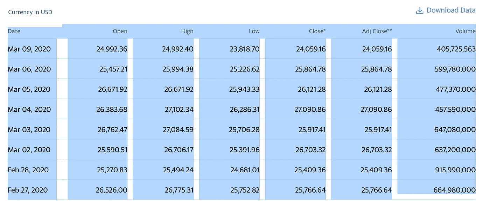
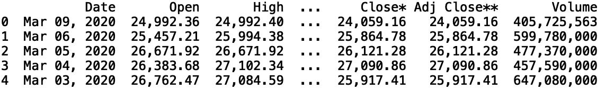
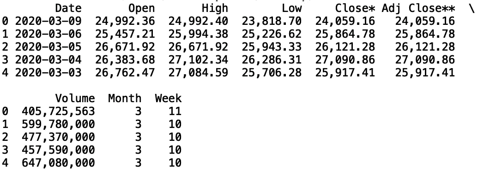
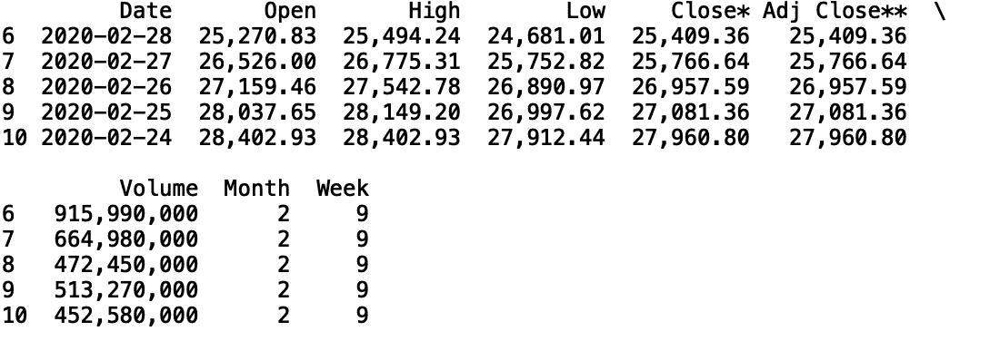
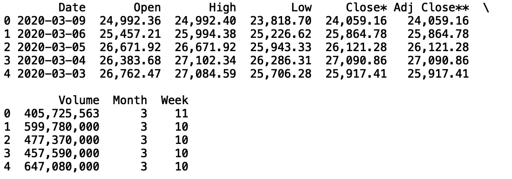
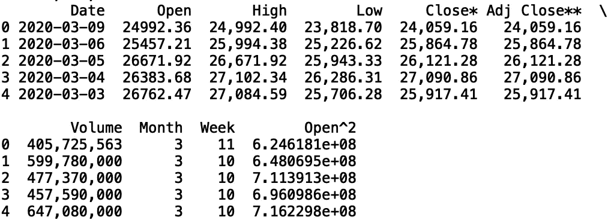
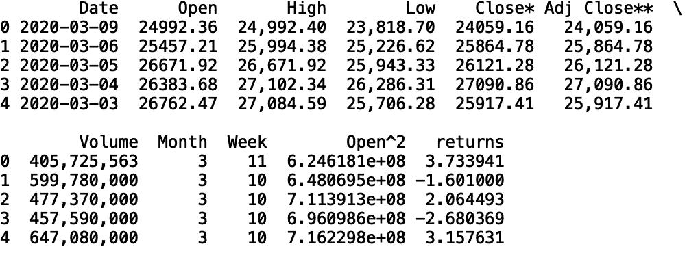

# 磨练熊猫的知识

> 原文：<https://towardsdatascience.com/improving-pandas-knowledge-e84865ac41f0?source=collection_archive---------18----------------------->

## 三个有用的熊猫方法


照片由[戴安娜·西拉瑞亚](https://www.pexels.com/@diana-silaraja-794257)在[像素](https://www.pexels.com/photo/photo-of-panda-and-cub-playing-1661535/)上拍摄

Pandas 是 python 中的一个库，通常用于统计分析、数据聚合等等。在这篇文章中，我将讨论熊猫中非常有用的三种方法。我将讨论“read_clipboard()”方法、“query()”方法和“apply()”方法。

我们开始吧！

# **读取剪贴板的方法**

“read_clipboard()”方法提供了一种在数据框中存储复制到剪贴板的文本的简单方法。首先，去雅虎财经搜索道琼斯工业平均指数。接下来，单击历史数据并突出显示前几行，如下所示:



并按“CTRL + c”。最后，我们可以通过执行以下命令将复制的文本存储在数据框中:

```
import pandas as pd 
df = pd.read_clipboard()
print(df.head())
```



让我们将此数据帧写入“csv ”,因为我们将在后续示例中继续使用此数据。

```
df.to_csv("dow_jones.csv")
```

接下来，让我们继续讨论“query()”方法。

# 查询方法

“query()”方法提供了一种使用字符串表达式选择数据的简单方法。让我们使用上面的相同数据来演示这种方法的使用。

让我们将 csv 文件读入数据帧:

```
df = pd.read_csv("dow_jones.csv")
```

让我们将日期列转换成日期时间对象:

```
df['Date'] = pd.to_datetime(df['Date'])
```

接下来，让我们创建月和周列:

```
df['Month'] = df['Date'].dt.month
df['Week'] = df['Date'].dt.week
```

让我们也放宽对行和列的显示限制:

```
pd.set_option('display.max_columns', None)
pd.set_option('display.max_rows', None)print(df.head())
```



最后，让我们使用“query()”方法来选择基于周的数据:

```
df = df.query('Week < 10')
print(df.head())
```



我们也可以按月份过滤:

```
df = df.query('Month == 3')
print(df.head())
```



就此而言，我们也可以基于任何其他列进行筛选。

现在让我们继续讨论“apply()”方法。

# 该应用方法

我们将讨论的下一个方法是“apply()”方法。假设我们想取“开放”列的平方。要使用“apply()演示这一点，让我们首先从“Open”列中的字符串值中删除逗号，并将字符串值转换为浮点型:

```
df['Open'] = df['Open'].str.replace(',', '')
df['Open'] = df['Open'].astype(float)
```

然后，我们可以使用“apply()”方法对列中的值求平方:

```
df['Open^2'] = df['Open'].apply(lambda x:x**2)
print(df.head())
```



一个更实际的用例是使用带有自定义函数的 apply 方法。假设我们想从“Open”和“Close*”值计算回报。让我们从“Close*”列的字符串值中删除逗号，并将字符串值转换为浮点数:

```
df['Close*'] = df['Close*'].str.replace(',', '')
df['Close*'] = df['Close*'].astype(float)
```

接下来，让我们定义一个用于计算回报的函数:

```
def calculate_returns(df_in):
    returns = (df_in[1] — df_in[0])/(df_in[0])*100
    return returns
```

回报的公式是:

```
(df['Close*'] — df['Open'])/(df['Open'])*100
```

现在，让我们使用“apply()”方法和我们的自定义函数来计算将存储在新列中的回报:

```
df['returns'] = df[['Open', 'Close*']].apply(calculate_returns, axis = 1)
```

让我们打印前五行:

```
print(df.head())
```



# 结论

总之，在这篇文章中，我们讨论了熊猫的三种方法。我们讨论了“read_clipboard()”方法，该方法允许我们将复制到剪贴板的文本读入数据框。我们还讨论了“query()”方法，它允许我们用字符串表达式选择和过滤数据。最后，我们讨论了“apply()”方法，该方法允许我们用相对简单的代码转换和创建新列。这篇文章的代码可以在 GitHub 上找到。感谢您的阅读！