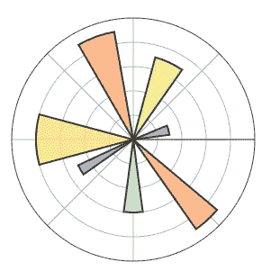
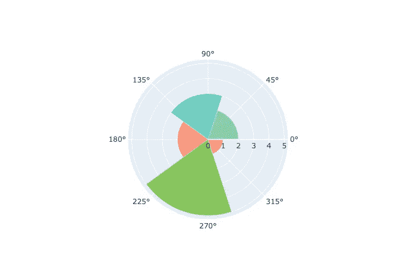
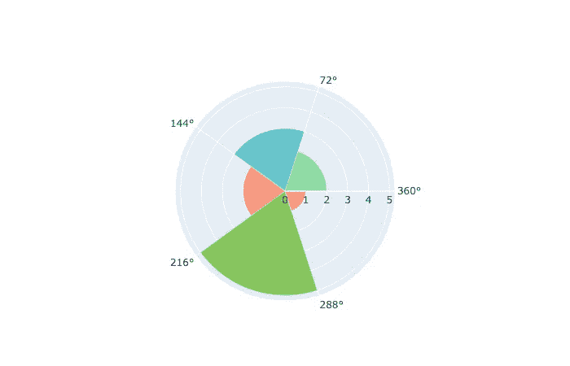
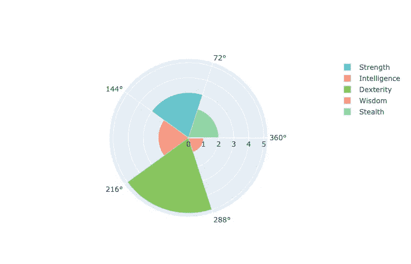
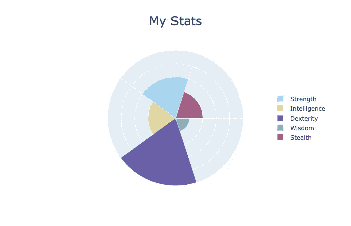

# 改进 Plotly 的极坐标条形图

> 原文：<https://towardsdatascience.com/improving-plotlys-polar-bar-charts-43f6eec867b7?source=collection_archive---------33----------------------->

## 超越默认设置，创建漂亮且可复制的图表


由[凯文·Ku](https://unsplash.com/@ikukevk?utm_source=unsplash&utm_medium=referral&utm_content=creditCopyText)在 [Unsplash](https://unsplash.com/s/photos/python-code?utm_source=unsplash&utm_medium=referral&utm_content=creditCopyText) 上拍摄

如果您想将更多的注意力吸引到具有更高值的类别上，极坐标条形图是显示分类信息的好方法。它们在《华尔街日报》关于亚马逊 HQ2 候选名单的文章中发挥了巨大作用。但是，即使有了强大的可视化工具，制作这样的图表也需要一些跑腿的工作。

今天我在这里向你们提供将 [Plotly 的极坐标条形图](https://plotly.com/python/polar-chart/#polar-bar-chart)转化为视觉上可接受的东西所需的几何图形。到最后，你可以把这些烦人的内务代码扔进一个函数里，再也不去想它了。



这是 Plotly 的教程代码产生的情节。

虽然我知道他们在演示如何用更少的代码行创建 Matplotlib 徽标，但是这个例子对于实际应用程序并没有什么用处。

下面，我将以一种可重现的方式解决我在这个例子中遇到的主要问题。这些问题是:

*   图和背景的切片在数量上是不同的，并且没有对齐。
*   图切片之间的间隙不一致。
*   从例子看不清楚怎么做传奇。

像往常一样，您可以跳到最后查看完整的代码片段。

## 切片对齐又称角度窗格条

让我们从框定我们的问题开始。我们有一组值，我们希望将每个值映射到一个圆形切片的半径。也许我们也有每个值的标签。

```
vals = [3, 2, 5, 1, 2]
labels = ["Strength", "Intelligence", "Dexterity", "Wisdom", "Stealth"]
```

仅从这些值，我们想要确定切片和背景的定位和对齐。

每个切片的半径、位置和宽度分别由 [Plotly barpolar](https://plotly.github.io/plotly.py-docs/generated/plotly.graph_objects.Barpolar.html) 函数的`r`、`theta`和`width`参数决定。注意`theta`对应每个切片的*中心*的角度。

如果我们希望切片之间没有间隔，并且宽度相等，我们可以从原始值的长度推断出这些参数。

```
num_slices = len(vals)
theta = [(i + 1.5) * 360 / num_slices for i in range(num_slices)]
width = [360 / num_slices for _ in range(num_slices)]
```

这里“+ 1.5”将确保我们的第一个切片的右边缘在零度。

我喜欢做的另一件事是通过调色板(如粉彩)为我的切片产生一个颜色序列:

```
color_seq = px.colors.qualitative.Pastel
color_indices = range(0, len(color_seq), len(color_seq) // num_slices)
colors = [color_seq[i] for i in color_indices]
```

让我们来看看我们的进展:

```
fig = go.Figure(go.Barpolar(r=vals, theta=theta, width=width, marker_color=colors))
fig.show()
```



越来越好了！如您所见，切片从零度开始，间隔均匀。但是背景还是完全不对齐。

## 角窗格条第 2 部分:背景对齐

对齐背景就是调整图形的`polar_angularaxis_tickvals`布局选项。我们将推断角度的顺序，类似于我们对切片所做的那样。

```
angular_tickvals = [(i + 1) * 360 / num_slices for i in range(num_slices)]
fig.update_layout(polar_angularaxis_tickvals=angular_tickvals)fig.show()
```



很好，现在背景和切片对齐了。你可以用`update_layout`调整更多的选项，让剧情更有美感。最后我会给你们留下一些。

## 痕迹和传说带来的麻烦

现在，如何添加将标签与每个切片相关联的图例？如果你只是使用`name`参数，你会遇到一个问题:Plotly 将我们所有的切片视为一个单独的*轨迹*，它只能与一个单独的名字相关联。

我们如何将每个单独的切片与其自己的名称关联起来？

这并不理想，但目前我发现为每个切片制作一个单独的条形图是最好的方法。我希望存在一种更好的方法，或者至少一种方法将很快被开发出来。

```
barpolar_plots = [go.Barpolar(r=[r], theta=[t], width=[w], name=n, marker_color=[c])
for r, t, w, n, c in zip(vals, theta, width, labels, colors)]fig = go.Figure(barpolar_plots)angular_tickvals = [(i + 1) * 360 / num_slices for i in range(num_slices)]
fig.update_layout(polar_angularaxis_tickvals=angular_tickvals)fig.show()
```



## 将所有东西打包在一起

因为我们只是从原始值中推断出所有的角度参数，所以将所有的工作打包到一个函数中是有意义的。我已经用一些额外的布局选项演示了它的用法。您可以在 [Plotly 图参考](https://plotly.com/python/reference/)中找到更多信息。



目前，从 Plotly 的教程极坐标条形图到一些可用的东西需要一点工作。特别是，需要一些角度格来对齐切片和背景。此外，添加图例并没有想象中那么简单。

在这里，我已经完成了进行这种调整所需的步骤，并将它们打包到一个可重用的函数中。希望对你有帮助。