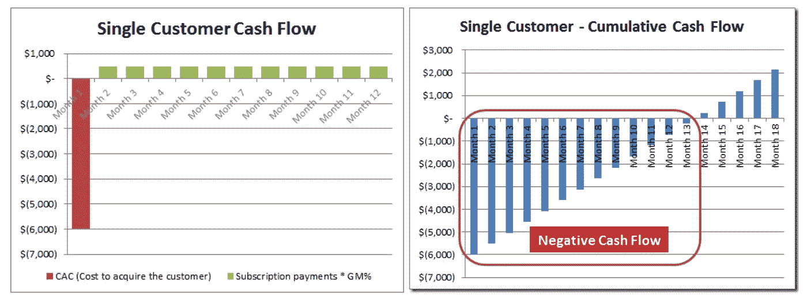

# 用数据科学改善 SaaS

> 原文：<https://towardsdatascience.com/improving-saas-with-data-science-e2cf3720bc90?source=collection_archive---------33----------------------->

## 我们的实习团队如何利用数据帮助一家 SaaS 公司改善其客户拓展和维系战略

[数据科学可以推动变革](https://pixabay.com/illustrations/web-domain-service-website-3967926/)

作为一名[加州大学戴维斯分校 MSBA 分校](https://gsm.ucdavis.edu/msba-masters-science-business-analytics)的学生，我是[实习团队](https://gsm.ucdavis.edu/msba-practicum-projects)的一员，为一家 SaaS 公司从事**数据科学项目。这个为期 10 个月的项目致力于帮助他们的销售团队改进客户拓展和保留策略。在我开始深入细节之前，先来看看我将在这个博客上涵盖的内容:**

*   什么？那么，SaaS 到底是什么？
*   **为什么** —为什么订阅很重要？
*   **谁**—SaaS 公司和我们加州大学戴维斯分校 MSBA 团队
*   **如何** —我们利用他们的数据改善业务的计划

# 什么是 SaaS？

[软件即服务](https://pixabay.com/illustrations/software-selling-buying-box-4429957/)

SaaS 代表软件即服务。这意味着供应商通过互联网向客户提供基于云的服务(即托管/维护组成应用程序的服务器、数据库和代码)。软件咨询，一家 Gartner 公司，软件服务的领导者之一，[解释说](https://www.softwareadvice.com/resources/saas-10-faqs-software-service/)SaaS 的最大优势之一是它允许客户消费软件而不必担心硬件和基础设施成本。它在数据方面也更加安全，并且允许定制。

使用 SaaS 的另一个重要优势是定价模型。选择 SaaS 的客户通常会支付满足他们所有需求的年费或月费，而不是购买软件许可证、维护和支持费用。

# ***为什么订阅很重要？***

客户按月或按年向 SaaS 供应商付款。对于这样的 SaaS 公司来说，获得客户是昂贵的，所以他们必须投资于他们的客户，并等待一段时间才能从最初的成本中收回任何利润。连续创业者和《福布斯 2 号最佳创业者网站》的作者 David Skok，[用一个简单的客户现金流的例子说明了这个概念](https://www.forentrepreneurs.com/saas-metrics-2/)。想象一下，你花了 6000 美元获得了一个每月支付你 500 美元的新客户。您需要两年时间才能从该客户身上看到任何利润:

SaaS 企业最终从他们在获取新客户的[初始投资中看到利润](https://www.forentrepreneurs.com/saas-metrics-2/)

正如我们从上面的图表中所看到的，初始投资在一段时间后显示出积极的结果。换句话说，企业在某个时间点后开始创造正现金流。*人越多越好！*如果一个客户获得成功，那么获得*更多的客户*并提高获得率将导致更深的正现金流曲线:

更深的曲线意味着[更高的短期支出，但也会导致更高的长期收益](https://www.forentrepreneurs.com/saas-metrics-2/)

我们已经看到，获得客户是昂贵的，但最终这种投资是值得的。也就是说，在 SaaS 业务中，收入是在很长一段时间内产生的，也就是客户的一生:

*“如果客户对服务***满意，他们就会*长期**，从该客户身上获得的利润就会大大增加。另一方面，如果客户对***不满意，他们会*很快*流失，企业很可能会在获得该客户的投资上赔钱。”—大卫·斯科克****

**这都与**订阅**相关，因为:**

*   **获得客户是昂贵的**
*   **让他们开心，让他们的人生价值最大化，将有助于公司收入最大化**

**我们今天不会关注客户获取部分，而是在 ***让客户开心*** 。**

# **谁参与了这个项目？**

**你已经知道我们是加州大学戴维斯分校 MSBA 实习团队，与 SaaS 的一家公司合作，但是我们与他们公司的谁合作呢？**

**既然我们关心*创造更多的收入*，我们与他们的**销售&运营**团队合作也就不足为奇了。然而，我们也关心*如何让客户满意*，幸运的是，这家公司有一整个团队致力于这一目标，即**客户成功团队**。他们在提供大量有趣的数据方面非常有帮助，这些数据结合了客户使用数据(来自公司的平台)以及客户关系管理(CRM)信息。**

# **我们将如何利用他们的数据创造商业价值？**

**好了，现在进入有趣的部分！**

**我们的实习项目旨在发现客户的关键特征，这些特征表明客户是否准备增加与 SaaS 公司的业务，或者客户是否即将流失。我们将执行**客户细分分析**和**客户流失分析**来确定 SaaS 公司扩大收入的方法。这些模型将帮助该公司从传统的基于直觉的决策过渡到基于数据的决策，并重新定义客户健康指标，从而在未来几年改善他们的客户战略。**

## **客户细分分析**

****

**[细分客户，与他们一起拓展业务](https://pixabay.com/illustrations/community-connection-woman-select-4536852/)**

**我们细分分析的目标是扩大现有客户的业务。为了做到这一点，我们将看看:**

*   ****客户关系管理(CRM)数据**:他们成为客户多久了，他们在公司消费了多少，等等。**
*   ****客户使用数据**:他们使用产品的频率如何，他们使用最多的是什么样的产品功能，他们的问题(如果有的话)得到解决的速度有多快，等等。**

**这个想法是要看看不同类型的客户(大鱼，休闲客户，非常活跃的客户等)的典型行为是什么。)为了根据这些指标对客户进行分类，我们计划执行 **K 均值聚类**。这是一种无监督的学习算法，我们将试图在观察值中找到同质的子群。机器学习专家和 StatQuest 创始人 Josh Starmer ( *他也是一位相当不错的歌手！*)在[这段视频](https://www.youtube.com/watch?v=4b5d3muPQmA)中非常好地解释了 K-means 聚类。**

**我们还将利用至关重要的 **SaaS 指标**，如下所示，这些指标在由 B2B 软件领导者 Joel York 创建的[这份有用的备忘单](http://chaotic-flow.com/saas-metrics-guide-to-saas-financial-performance/)中有详细说明:**

*   ****经常性收入**:由于客户是基于订阅的，他们的经常性收入是他们在一段固定时间内支付的费用，通常按月(MRR)、按季度(QRR)或按年(ARR)计算。**
*   ****客户获取成本**(每个客户):我们之前讨论过这个问题。这是(在营销和销售活动中)激励某人成为实际付费客户的成本。**
*   ****客户终身价值**:客户一生能为公司带来多少价值。这通常是一个固定的时间量，不幸的是，它用一条曲线来表示，最终总是随着时间的推移而减少。不过，这是意料之中的。举例来说，谁会在一生中真正成为 *Prime* 会员？**
*   ****流失率(或损耗)**:客户在特定时间段内取消订阅的概率。该指标也将用于*流失分析*。**
*   ****留存率**:客户在同一时期停留的概率。因此，它是 1-流失率。**

**通过使用这些指标以及来自约克的小抄的更多信息，我们希望这些数据能告诉我们 T21 一个故事。**

## **流失分析**

****

**[阻止顾客离开](https://pixabay.com/illustrations/increase-followers-page-fans-3172499/)**

**流失分析似乎很有前景，我们非常兴奋能够开始这部分的分析！关于这个话题已经做了很多研究，所以有很多资料。一个很酷的例子是 Zuora 的首席数据科学家 Carl Gold 关于用数据对抗流失的博客。我们了解到的一个令人放心的概念是，防止客户流失的方法之一是建立**客户成功**团队。戈尔德解释说，“*客户成功和支持代表通过确保客户采用某个产品来防止客户流失，并在他们不能接受时给予帮助。”*如果您还记得“谁参与了这个项目？”上一节，我们很幸运能与一个客户成功团队合作，该团队正引导我们更好地理解客户行为和业务洞察力。他们不只是向我们扔数据，而是在整个项目中努力与我们合作。**

**这些是我们准备尝试的一些方法，目的是提高*客户保持率*:**

*   **由于客户的异质性，确定动态保留率**
*   **实施人工神经网络来模拟流失**
*   **运行 XGBoost 和/或逻辑回归来预测流失**
*   **查看生存分析，估计客户在特定时间段内流失的可能性**

**有这么多的工具和方法，我们可以为这个部分，它可以是自己的博客！好消息是我们已经准备好了数据，像[这个教程](/churn-prediction-and-prevention-in-python-2d454e5fd9a5)这样的好例子，还有很多时间(期中考试后)来应对这个挑战。**

# **下一步是什么？**

**按照我们项目中的[数据科学工作流程](/life-cycle-of-a-data-science-project-3962b9670e5b)的步骤，我们已经对业务问题有了充分的了解，我们已经修改了数据并准备好进行分析，我们即将开始建模阶段。在整个过程中，我们将与销售&运营和客户成功团队一起检查，以确保我们的分析朝着正确的方向发展。**

**敬请关注，看看我们发现了哪些有趣的见解！**