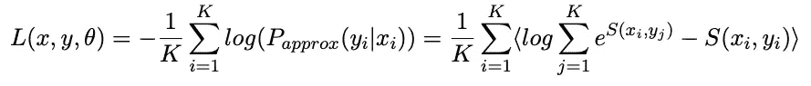

# 用 BERT 和表征学习改进句子嵌入

> 原文：<https://towardsdatascience.com/improving-sentence-embeddings-with-bert-and-representation-learning-dfba6b444f6b?source=collection_archive---------11----------------------->

在这个实验中，我们对 BERT 模型进行了微调，以提高它对短文本进行编码的能力。这为下游 NLP 任务产生了更有用的句子嵌入。

虽然一个普通的 BERT [可以用来编码句子](https://github.com/hanxiao/bert-as-service)，但是用它生成的嵌入并不健壮。正如我们在下面看到的，被模型认为相似的样本通常在词汇上比语义上更相关。输入样本中的小扰动会导致预测相似性的大变化。


平均池 BERT-base 模型编码的句子对之间的相似性

为了改进，我们使用斯坦福自然语言推理数据集，该数据集包含手动标记有*蕴涵*、*矛盾*和*中性*标签*的句子对。对于这些句子，我们将学习这样一种表述，即蕴涵对之间的相似性大于矛盾对之间的相似性。*

为了评估学习嵌入的质量，我们在 STS 和 SICK-R 数据集上测量 Spearman 等级相关性。

这个实验的计划是:

1.  准备 SNLI 和 MNLI 数据集
2.  实现数据生成器
3.  定义损失
4.  构建模型
5.  准备评估管道
6.  训练模型

# 这本指南里有什么？

本指南包含在标记数据上构建和训练句子编码器的代码。

# 需要什么？

对于一个熟悉的读者来说，完成这个指南和训练句子编码器需要大约 90 分钟。代码用 tensorflow==1.15 测试。

# 好吧，给我看看代码。

这个实验的代码可以在[这里](https://colab.research.google.com/drive/1Ns--41DmUN-xwd-rZhoZ1DWIAVojRz6G)获得。这一次，来自[先前实验](/fine-tuning-bert-with-keras-and-tf-module-ed24ea91cff2)的大部分代码被重用。我建议先去看看。

独立版本可以在[库](https://github.com/gaphex/bert_experimental)中找到。

# 步骤 1:设置

我们从下载 [SNLI](https://nlp.stanford.edu/projects/snli/) 、 [MNLI](https://www.nyu.edu/projects/bowman/multinli/) 、 [STS 和 SICK](https://github.com/brmson/dataset-sts) 数据集以及预训练的英语 BERT 模型开始。

为 SNLI *jsonl* 格式定义一个 loader 函数。

为了更方便地处理数据集，我们稍微重新安排了一下。对于每个唯一的锚，我们创建一个 ID 和一个包含*锚*、*蕴涵*和*矛盾*样本的条目。每类缺少至少一个样本的锚被过滤掉。

单个条目如下所示

```
{
  'anchor': ["No, don't answer."],  
  'contradiction': ['Please respond.'],  
  'entailment': ["Don't respond. ", "Don't say a word. "]
}
```

最后，加载 SNLI 和 MNLI 数据集。

# 步骤 2:数据生成器

为了训练模型，我们将对三元组进行采样，由锚、正样本和负样本组成。为了处理复杂的批处理生成逻辑，我们使用以下代码:

高层逻辑包含在 ***generate_batch*** 方法中。

1.  批量锚点 id 是从所有可用 id 中随机选择的。
2.  *锚*样本从其 id 的*锚*样本中检索。
3.  *阳性*样本从其 id 的*蕴涵*样本中检索。
4.  *阴性*样本是从*矛盾*样本中检索出它们的 id。
    这些可以被认为是**硬否定样本，**因为它们通常在语义上与它们的锚相似。为了减少过度拟合，我们将它们与从其他随机 ID 检索的**随机阴性样本**混合。

# 第三步:损失函数

我们可以将学习句子相似性度量的问题框架化为排序问题。假设我们有一个由 k**k**转述的句子对 **x** 和 **y** 组成的语料库，并且想要学习一个函数来估计 **y** 是否是 **x** 的转述**。**对于某些 **x** 我们有单个阳性样本 **y** 和 **k-1** 阴性样本 **y_k** 。这个概率分布可以写成:


使用评分函数估计 **P(x，y)** 的联合概率，S:


在训练期间，对数据集中的所有 **k-1** 阴性样本求和是不可行的。相反，我们通过从我们的语料库中为每一批抽取 **K** 个响应并使用它们作为负样本来近似 **P(x)** 。我们得到:


我们将最小化数据的负对数概率。所以，对于一批 K 个三胞胎的损失我们可以写下:



***注*** :以上表达式称为 Softmax-Loss。

在本实验中，内积用作相似性函数 **S** 。计算最后括号中表达式的代码如下

# 第四步:模型

首先，我们导入之前实验中的微调代码，并构建 BERT 模块。

该模型对于锚、阳性和阴性样本有三个输入。具有平均池操作的 BERT 层被用作共享文本编码器。文本预处理由编码器层处理。对编码的句子计算 Softmax 损失。

为了方便起见，创建了 3 个模型: *enc_model* 用于编码句子， *sim_model* 用于计算句子对之间的相似度， *trn_model* 用于训练。所有型号都使用共享重量。

# 步骤 5:评估渠道

自然语言编码器通常通过嵌入标记的句子对，测量它们之间的某种相似性，然后计算相似性与人类判断的相关性来评估。

我们使用 STS 2012–2016 和 SICK 2014 数据集来评估我们的模型。对于测试集中的所有句子对，我们计算余弦相似度。我们报告了带有人工标注标签的 Pearson 等级相关性。

下面的回调处理评估过程，并在每次达到新的最佳结果时将提供的*保存模型*保存到*保存路径*。

# 第六步:培训

我们训练 10 个时期的模型，每个时期有 256 个批次。每批由 256 个三胞胎组成。我们在每个时期的开始执行评估。

```
trn_model.fit_generator(tr_gen._generator, validation_data=ts_gen._generator, steps_per_epoch=256, validation_steps=32, epochs=5, callbacks=callbacks)*** New best: STS_spearman_r = 0.5426
*** New best: STS_pearson_r = 0.5481
*** New best: SICK_spearman_r = 0.5799
*** New best: SICK_pearson_r = 0.6069
Epoch 1/10
255/256 [============================>.] - ETA: 1s - loss: 0.6858
256/256 [==============================] - 535s 2s/step - loss: 0.6844 - val_loss: 0.4366
*** New best: STS_spearman_r = 0.7186
*** New best: STS_pearson_r = 0.7367
*** New best: SICK_spearman_r = 0.7258
*** New best: SICK_pearson_r = 0.8098
Epoch 2/10
255/256 [============================>.] - ETA: 1s - loss: 0.3950
256/256 [==============================] - 524s 2s/step - loss: 0.3950 - val_loss: 0.3700
*** New best: STS_spearman_r = 0.7337
*** New best: STS_pearson_r = 0.7495
*** New best: SICK_spearman_r = 0.7444
*** New best: SICK_pearson_r = 0.8216
...
Epoch 9/10
255/256 [============================>.] - ETA: 1s - loss: 0.2481
256/256 [==============================] - 524s 2s/step - loss: 0.2481 - val_loss: 0.2631
*** New best: STS_spearman_r = 0.7536
*** New best: STS_pearson_r = 0.7638
*** New best: SICK_spearman_r = 0.7623
*** New best: SICK_pearson_r = 0.8316
Epoch 10/10
255/256 [============================>.] - ETA: 1s - loss: 0.2381
256/256 [==============================] - 525s 2s/step - loss: 0.2383 - val_loss: 0.2492
*** New best: STS_spearman_r = 0.7547
*** New best: STS_pearson_r = 0.7648
*** New best: SICK_spearman_r = 0.7628
*** New best: SICK_pearson_r = 0.8325
```

作为参考，我们可以查看来自 [Sentence-BERT](https://arxiv.org/pdf/1908.10084.pdf) 论文的评估结果，在该论文中，作者对 STS 和 SICK 任务上的几个预训练句子嵌入系统进行了评估。

我们使用普通平均池 BERT 模型的结果与公布的指标一致，在 SICK-R.
上获得 **57.99** Spearman 等级相关分数，在 10 个时期后，最佳 Colab 模型获得 **76.94** ，与通用句子编码器的最佳结果 **76.69** 相当。


Spearman 对句子表述的余弦相似性和各种文本相似性任务的黄金标签之间的相关性进行排序。(摘自句子-伯特:使用暹罗伯特网络的句子嵌入)

由于在一个批次中的所有样本之间共享负面示例，因此使用较大的 batch_size 进行微调往往会将指标提高到某个程度。如果你的 GPU 能够处理的话，解冻更多的编码器层也会有所帮助。

一旦训练完成，我们就可以通过编码测试三元组并并排检查预测的相似性来比较基础模型和训练模型。一些例子:


# 结论

上面我们提出了一种使用标记句子对来改进句子嵌入的方法。

通过显式地训练该模型来根据它们的语义关系对句子对进行编码，我们能够学习更有效和更健壮的句子表示。

自动和人工评估都证明了相对于基线句子表示模型的实质性改进。

## 本系列中的其他指南

1.  [用云 TPU 从头开始预训练 BERT】](/pre-training-bert-from-scratch-with-cloud-tpu-6e2f71028379)
2.  [用 BERT 和 Tensorflow 构建搜索引擎](/building-a-search-engine-with-bert-and-tensorflow-c6fdc0186c8a)
3.  [用 Keras 和 tf 微调 BERT。模块](/fine-tuning-bert-with-keras-and-tf-module-ed24ea91cff2)
4.  [用 BERT 和表征学习改进句子嵌入](/improving-sentence-embeddings-with-bert-and-representation-learning-dfba6b444f6b)
    【你在这里】