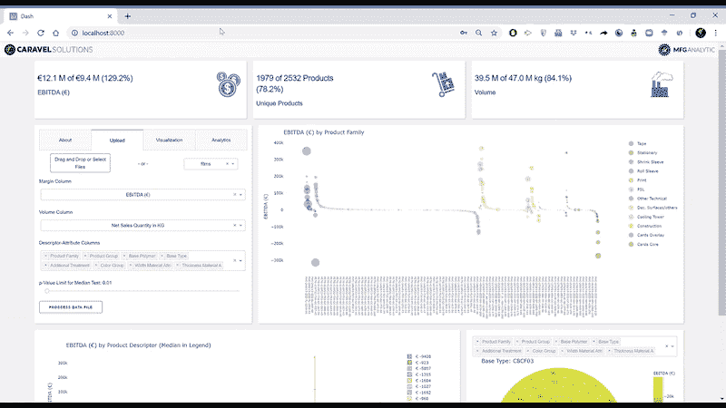
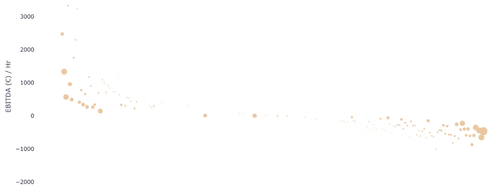
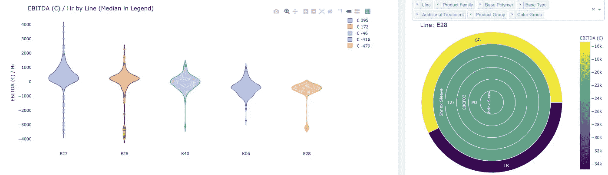

# 利用仪表板提高利益相关者的认同度

> 原文：<https://towardsdatascience.com/improving-stakeholder-buy-in-with-dashboards-ba7e84da1659?source=collection_archive---------62----------------------->

## 数据仪表板是向利益相关者传达分析故事的一个宝贵工具

在 Manufacturing Analytic，我们发现使用交互式仪表板共享我们的运营评估使客户成为发现过程的一部分。仪表板成为持续讨论的推动者——客户可以提问，我们可以即时提供答案。

仪表板原型将高利润和低利润产品与过程变量相关联

我们的方法从我们如何看待生产过程开始:业务不是销售产品；在线出售*时间*，就好像该公司出租其生产资产一样。

企业应该问的是:

我应该优先考虑我生产线上的什么产品，以提高生产线的每小时盈利能力？

我生产的每件产品的利润率*或* EBITDA 率是多少，我如何将其与关键流程变量联系起来？

我们通常发现，误导的先入之见决定了公司优先考虑哪些产品。这些假设是由于将业务团队和工厂运营者分开的组织筒仓。虽然业务团队可能知道与浪费材料、在制品和转换损失相关的实际成本，但他们不关心产品线面临的问题以及这些问题如何扰乱周期时间。将来自工厂车间的知识与业务部门的知识相结合，以提供准确的分析来提高生产率和优先级，这一点至关重要。

这种筒仓效应的一个原因是，制造业中的许多人对最新数据方法的吸收一直很慢。由于缺乏数字基础设施，他们无法贯穿整个流程。一旦渗透到组织中的零散数据集被组合起来，资金模式就变得清晰了。(即带有流程或周期时间数据的产品利润)。

举一个简单的例子，按照 EBITDA 对每种产品进行排序，然后绘制一个 EBITDA/hr 的气泡图，气泡大小与体积成比例，通常会得到以下结果:高和低 EBITDA 尾部以高体积产品为标志，而净零产品的长平台以低体积产品为标志。不足为奇的是，新产品或实验性产品的产量不足以推动利润增长。然而，在某些情况下，低产量产品具有非常高的 EBITDA/hr。如果这些产品具有适当的产量，它们可能会为组织实现更高的回报。如果我们只考虑息税折旧及摊销前利润(EBITDA ),我们会失去这样的洞察力，即我们应该扩展到几个关键的、低产量的产品，因为它们的生产速度更快。

气泡代表一种独特产品的许多生产周期。泡沫从左到右按平均 EBITDA 递减的顺序排列。气泡尺寸与体积成比例，y 轴值为 EBITDA/hr。几种关键的低体积产品比高体积产品提供更高的 EBITDA/hr 比率。

在我们的一次客户分析中，我们发现了他们流程的关键组成部分和产品利润率之间的相关性。在化学组成、颜色、形状、处理和其他因素的数百种组合中，我们能够确定哪些是赢家，哪些是输家。通过将这些分组合并到一个控制面板中，我们能够即时提出问题:如果我们用这个组合替换这个组合，可能会对我们的利润产生影响，但它是否仍然符合最终客户的需求——不会吗？—嗯，这个组合怎么样？诸如此类。它简化了客户会议，使我们能够围绕他们流程中的哪些部分快速制定可行的计划，从而大幅提高他们的盈利能力。

Violin 在左侧绘制了特定产品的等级——逐行排序，即递减的平均 EBITDA。右侧的旭日图显示，对于 E28 系列，该产品的最低 EBITDA 版本与 TR 颜色组中的产品隔离。

智能分析仪表盘是讲述分析故事不可或缺的工具。当组织内的涉众试图向其他业务部门阐明计划的优先级时，他们可以很容易地返回到数据。让算法挑选出哪些过程变量是重要的是一回事。如果它随后将这种洞察力转化为能够以直观的方式深入和总结主题的指标和图表，那就是另一回事了。创建一条所有组织部门都能使用同一种语言的道路是不可或缺的。

概括地说，我们从制造业在数字化和数据科学吸收方面进展缓慢这一事实开始，但他们正开始快速加快步伐。在 MFG Analytic，我们希望我们的客户处于这一潮流的最前沿。您的数字化之旅始于分析，始于充分利用当今组织中现有的数据集。在花大价钱“感知”工厂里的每一个泵、水箱和热交换器之前，使用已经有的东西。找出您所知道的，并让您的下一个数字化步骤成为一个明智的步骤—一个由数据支持的步骤。