# 提高循环一致对抗网络中损失函数的效率

> 原文：<https://towardsdatascience.com/improving-the-efficiency-of-the-loss-function-in-cycle-consistent-adversarial-networks-808cca3669f0?source=collection_archive---------17----------------------->

**CycleGAN** 是一种涉及图像到图像翻译模型的自动训练的技术，不需要成对的例子。我们先来看结果。

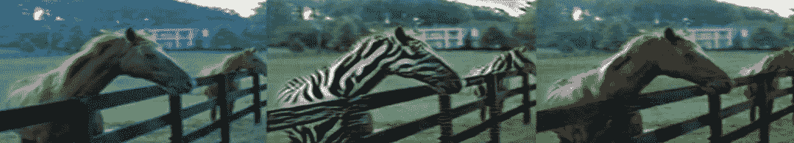

基于循环一致对抗网络的马到斑马翻译

在这篇文章中，你会发现一些关于生成对抗网络、CNN、CycleGAN 技术的小知识。现在让我们从这个概念背后的一些基本信息开始:生成性对抗网络。生成对抗网络(GANs)是一类用于无监督机器学习的神经网络。发生器和鉴别器分开工作，互为对手

# 生成对抗网络

生成对抗网络(GAN)是神经网络中的一种模型，它在机器学习领域提供了很多潜力。在 GAN 中有两个神经网络:第一个是生成网络，第二个是鉴别网络。所以这个项目背后的主要概念是生成性对抗网络。甘是关于创造的东西，这是很难比较的另一个深度学习领域。GAN 的主要重点是从零开始生成数据。GAN 的一个例子是，从马生成斑马。正如我们所见，早期的 GAN 由两个网络组成，即发生器和鉴别器。我们来看图像。

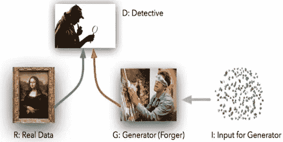

了解 GAN(资料来源:Suransh Chopra 著《CycleGANs 简介》)

CycleGAN 是一种使用生成对抗网络或 GAN 模型架构来处理准备图像到图像翻译模型的方法。

现在，在我们跳到 CycleGAN 之前，我们需要了解 CNN。

# 卷积神经网络

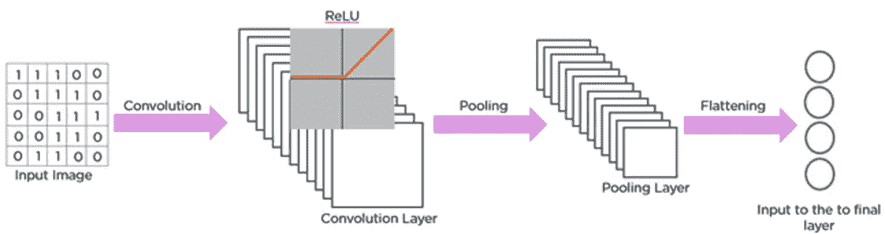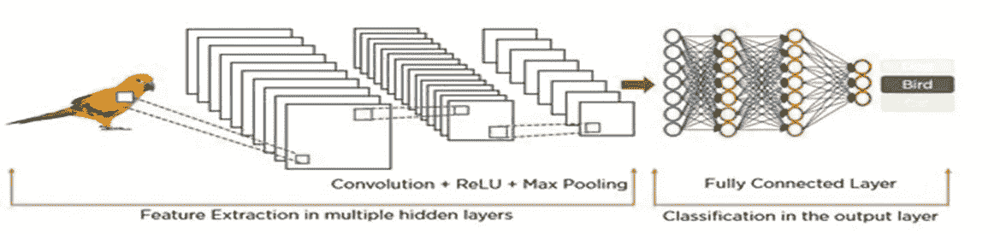

CNN 如何识别图像(来源:Jason Brownlee，“深度学习的 Adam 优化算法的温和介绍”)

CNN 主要用于图像分类或识别。CNN 使功能更加高效，减少了参数。CNN 接受像素值作为网络的输入。用于特征提取的隐藏层和最后完全连接的层识别图像属于哪一类？CNN 有 4 层。卷积层、ReLu 层(激活函数)、池层和全连接层。
卷积层使用图像上的滤波器矩阵或图像上的移位滤波器矩阵，并获得卷积的特征图。
下一层是 ReLu 层。它将所有负像素转换为零并运行，但在 CycleGAN 中，由于负值，我们使用了 LeakyReLu。输出被称为校正特征图。下一层是池层。合并层降低了校正后的特征图的维度，这意味着我们必须从图像中选择最大像素。然后将汇集的特征图转换成长的连续 LV。这整个过程叫拍马屁。谄媚地连接着一个完全连接的图层来对图像进行分类。

# 循环 GAN

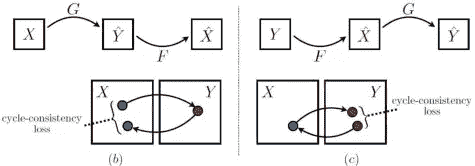

该模型包含两个函数 G: X -> Y 和 F: Y -> X，其中 X 是源域，Y 是目标域。生成器 X2Y 将马转换为斑马，Y2X 将斑马转换为马。CycleGAN 背后的关键思想是，它们允许你将模型指向两个不成对的图像集合。例如，一个图像集合，组 A 是未来的斑马，而另一个集合 B 是马。所以 Cycle-GAN 模型可以计算出如何解释不成对的图片。

这里的主要部分是循环一致性损失，例如，如果我们的输入图像 A 来自域 X，通过生成器 G 转换为目标图像或域 Y 的输出图像 B，然后域 Y 的图像 B 通过生成器 f 转换回域 X，因此这两个图像之间的差异称为循环一致性损失。

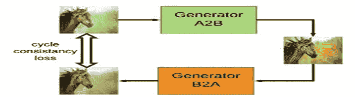

循环损耗(资料来源:Mohan Nikam“改善循环-GAN”)

发电机有三个部分:

I .编码器(提取特征):作为输入，卷积网络拍摄一张图片，我们在输入图片上移动以提取特征的滤波器窗口的大小，以及选择每次前进后我们将移动滤波器窗口的量的步长。

二。Transformer(添加先前结果的余数):因此，为此，我们利用了 9 层 resnet 块来如下改进结果:Resnet 块是包括两个卷积层的神经网络层，其中信息的累积被添加到产出。

三。解码器(解码结果):解码步骤是步骤 1 的特定逆步骤，我们将从元素向量再次返回低级特征。

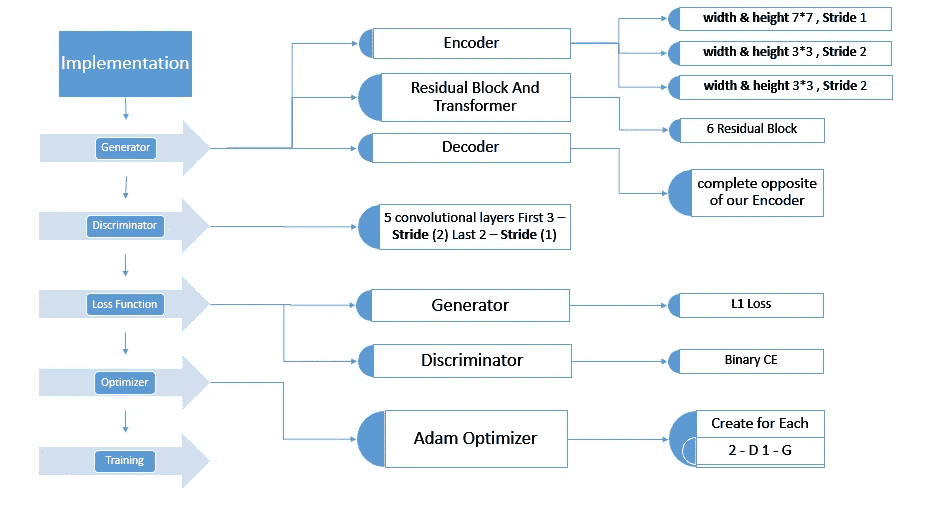

CycleGAN 实施的步骤

周期目标函数、对抗性损失和周期一致性损失。

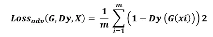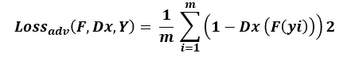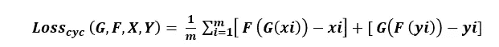

对抗性损失

现在，我们可以通过将这些损失项放在一起，并用超参数λ对循环一致性损失进行加权，来创建完整的目标函数。我们建议设置λ = 10

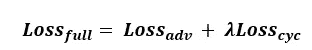

为了测量损失，我们像在大多数深度学习中一样使用交叉熵:p log (q)。

对于生成的图像，我们反转标签(即一减一标签)。所以目标变成了:

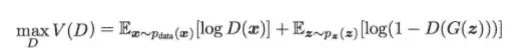

识别真实图像和生成的图像

另一方面，基于等式 1，优化检查发生器图像的 D，目标函数希望模型以最高可能的方式生成图像来欺骗鉴别器。

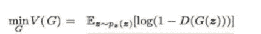

愚弄鉴别者

g 想最小化 V，而 D 想最大化 V。

**通过提升其随机梯度来更新鉴别器:**

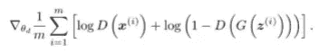

**通过降低其随机梯度来更新生成器:**

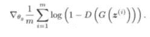

这些算法实际上是由 Ian Goodfellow 使用的，但大多数深度学习研究人员使用 adam optimizer 来获得更好、更高效的结果，因为这种算法的结果与最佳结果相差很远。我使用了亚当优化的最佳效果。

**发电机损耗:**

**发电机损耗是这两项之和:**

**G _ loss _ G = G _ loss _ G _ disc+G _ loss _ G _ cycle**

因为循环损耗非常重要，所以我们想增加它的影响。

我们为这个乘数使用了一个 L1λ常数(在论文中使用了值 10)。

现在发电机损耗看起来像:

**G _ loss _ G = G _ loss _ G _ disc+L1 _λ* G _ loss _ G _ cycle**

**g _ loss _ F = g _ loss _ F _ disc+L1 _λ* g _ loss _ F _ cycle**

**鉴频器损耗:**

鉴别器需要做出两个决定:

1.真实图像应标记为真实(推荐值应尽可能接近 1)

2.鉴别器应该能够识别生成的图像，从而预测假图像为 0。

**减少模型振荡**

*   为了防止模型从一次迭代到另一次迭代发生剧烈变化，鉴别器被输入生成图像的历史，而不仅仅是由最新版本的生成器生成的图像。
*   此外，我们包含了过去 100 张图像的历史来训练鉴别器，为什么我们要做这些事情，因为生成器和鉴别器都可能过度拟合，导致模式崩溃
*   为此，我们保存了 100 张最近生成的图像。基于这种技术，我们减少了模型振荡以及模型过拟合。

**亚当优化器**

Adam 代表*自适应矩估计。*在训练的前半部分，学习率被设置为 0.0002，然后在剩余的迭代中线性降低到零。

就像最初的 GAN 实现一样，我们将创建单独的优化器，这些优化器只能更新网络的某些部分。我们希望两个网络都变得更好。

**优化器是最重要的，因为在每个时期后，学习率会改变，偏差和权重也会改变，我们会获得最佳结果。大多数研究人员使用随机梯度，但随机是恒定的学习率算法，这就是为什么学习率在每个时期后不会改变。利用亚当优化函数和 L1 损失函数达到了较好的效果。** **批量大小被设置为 1，这就是为什么我们称之为实例规范化，而不是批量规范化。**

我们将在这里做同样的事情，只是现在我们有 3 个网络要优化，因此我们需要 3 个优化器:

*   G_xy 和 G_yx 变量将作为生成器进行优化，而 D_x 和 D_y 应该更新两个不同的鉴别器。

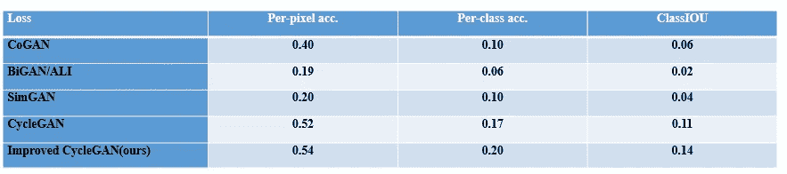

FCN-不同方法的得分，在城市景观标签上进行评估

这是我在表 1 和表 2 中实现的结果，我们考虑的是完全损失的清除。消除 GAN 损失会极大地破坏结果，消除循环一致性损失也是如此。我们沿着这些思路假设这两个术语是我们结果的基础。
我们同样评估我们的策略，仅在一个方向上的周期损失:GAN +正向周期损失或 GAN +反向周期损失。

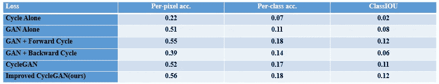

消融研究:FCN——我们方法的不同变体的得分，在城市风景照片→标签上评估

**此外，我们包含了最近 100 张图像的历史记录来训练鉴别器，为什么我们要做这些事情，因为生成器和鉴别器都可能过度拟合自己(例如:普京骑在马上),导致模式崩溃。使用这种鉴别器不会有助于击败发生器。它需要击败最后的 100 个生成器，才能得到最优解。**

**结果(Pytorch)**

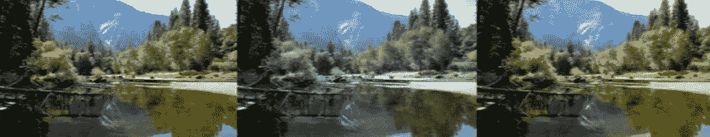

**故障案例(Pytorch)**

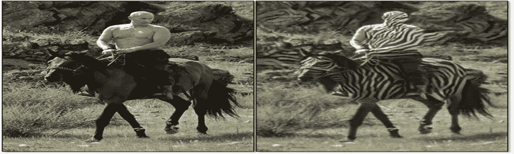

有时生成器崩溃，这就是为什么产生有限的样本数据

# 摘要

在本文中，你发现了在循环一致的敌对网络中提高损失函数的效率。具体来说，您学到了:

执行 CycleGAN 的确切方法，GAN、CNN、随机和 Adma 优化器、发电机损耗、鉴别器损耗的知识，减少模型振荡。

如果您想了解更多的实现细节，可以参考一些非常开放的用法。

# 感谢阅读！

随时给我发信息。

Twitter:aamirjarda
LinkedIn:aamirjarda
insta gram:aamirjarda

你有什么问题吗？在下面的评论中提出你的问题，我会尽力回答。