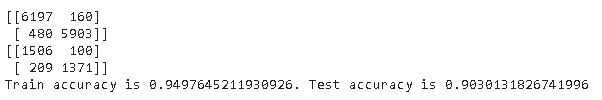
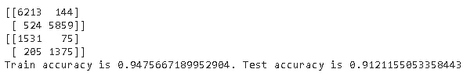
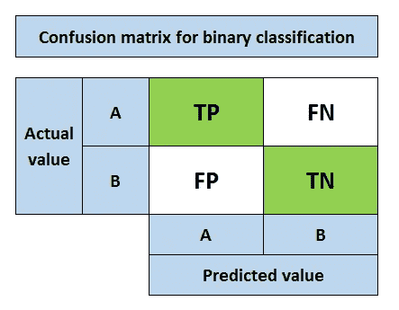
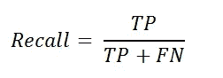
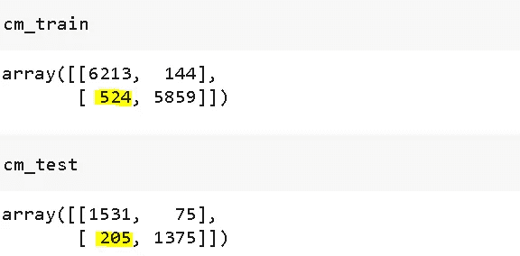
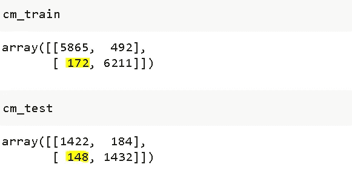
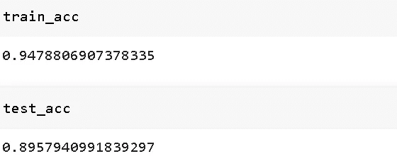
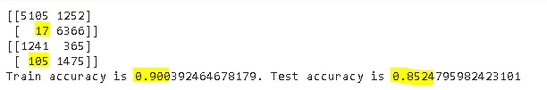

# 提高机器学习模型的性能

> 原文：<https://towardsdatascience.com/improving-the-performance-of-a-machine-learning-model-5637c12fc41c?source=collection_archive---------60----------------------->

## 模拟性能的不同方法


克里斯·利维拉尼在 [Unsplash](https://unsplash.com/s/photos/customer?utm_source=unsplash&utm_medium=referral&utm_content=creditCopyText) 上的照片

在[之前的帖子](/a-practical-machine-learning-guide-fa2111c65f42)中，我们探索并分析了一个客户流失数据集。然后，我们建立了一个机器学习模型来预测客户流失，在训练集和测试集上的准确率分别达到了%91.7 和%90.7。

在本帖中，我们将致力于:

*   如何提高准确率(正负类都有)
*   如何将模型的焦点更多地向正面类倾斜

值得注意的是，提高模型性能的最佳方法通常是收集更多的数据。然而，这并不总是一个可行的选择。

让我们回到我们的话题。

我们构建的模型是一个带有超参数的随机森林分类器:

*   max_depth = 10(森林中一棵树的最大深度)
*   n_estimators = 200(森林中的树木数量)

该模型的性能如下:


第一和第二矩阵分别是训练集和测试集上的混淆矩阵。混淆矩阵通过显示每个类别的正确和不正确(即真或假)预测，比分类准确性更深入。

让我们首先关注准确性，然后深入研究混淆矩阵和相关指标。

提高模型性能的一种方法是搜索最佳超参数。调整超参数就像调整模型一样。[随机森林](https://scikit-learn.org/stable/modules/generated/sklearn.ensemble.RandomForestClassifier.html)有许多超参数，但最重要的是树的数量(n_estimators)和单棵树的最大深度(max_depth)。

我们将使用 scikit-learn 的 **GridSearchCV** 类。它允许从一系列值中选择最佳参数。让我们首先创建一个字典，其中包含一组 n_estimators 和 max_depth 的值。我将选择我们之前使用的值。

```
parameters = {'max_depth':[8,10,12,14], 
              'n_estimators':[175,200,225,250]}
```

可以尝试更多的值或者超参数。没有一个正确的答案。我们现在可以将这个字典和一个估计器一起传递给 GridSearchCV 对象。

```
rf = RandomForestClassifier()gridsearch = GridSearchCV(rf, param_grid=parameters, cv=5)gridsearch.fit(X_train_selected, y_train)
```

**cv** 参数正在进行交叉验证。

我们已经训练了 GridSearchCV 对象。让我们看看最佳参数是什么:

```
gridsearch.best_params_
{'max_depth': 12, 'n_estimators': 225}
```

我用大约 12 和 225 的值再次运行了 GridSearchCV。最好的参数是 13 和 235。

让我们看看这些新的超参数值的混淆矩阵和准确性。

```
rf = RandomForestClassifier(max_depth=13, n_estimators=235)
rf.fit(X_train_selected, y_train)y_pred = rf.predict(X_train_selected)
cm_train = confusion_matrix(y_train, y_pred)
print(cm_train)y_test_pred = rf.predict(X_test_selected)
cm_test = confusion_matrix(y_test, y_test_pred)
print(cm_test)train_acc = (cm_train[0][0] + cm_train[1][1]) / cm_train.sum()
test_acc = (cm_test[0][0] + cm_test[1][1]) / cm_test.sum()print(f'Train accuracy is {train_acc}. Test accuracy is {test_acc}')
```



训练集的准确率提高了，但我们在测试集上没有取得任何成绩。如果我们可以收集更多的数据，这通常是提高准确性的最佳方式，测试准确性也可能随着这些新参数而提高。

如果你还记得[之前的帖子](/a-practical-machine-learning-guide-fa2111c65f42)，我们已经删除了 4 个与其他相比信息量较少的特性。在某些情况下，消除信息量较少或不相关的要素是一种很好的做法，这样可以避免给模型带来不必要的计算负担。然而，这些被消除的特征可能会稍微提高精度，所以这归结为性能增强和计算负担之间的决定。

我摆弄了一下超参数值，并用所有的特性进行了训练。结果如下:



我们已经实现了大约%1 的测试精度增加，这也是在过度拟合方面的改进。

我们的任务是预测客户是否会流失(即不再是客户)。因此，重点应该放在积极的一类(1)上。我们必须正确预测所有的正类(Exited=1)。对于负类(Exited = 0)，我们可以承受一些错误的预测。

我们需要进一步提高精确度。先说混淆矩阵。



(图片由作者提供)

*   **真阳性(TP)** :预测阳性类别为阳性(ok)
*   **假阳性(FP)** :将阴性类别预测为阳性(不正常)
*   **假阴性(FN)** :将阳性类别预测为阴性(不正常)
*   **真阴性(TN)** :预测阴性类为阴性(ok)

因为我们希望尽可能预测客户流失，所以我们的目标是最大化 TP，最小化 FN。

当我们预测“客户不会流失(0)”但在实际情况下，客户会流失时，就会发生 FN。

是时候引入两个指标了，即**精度**和**召回**。

> **Precision** 衡量当预测为正时，我们的模型有多好。


精度的焦点是**正面预测**。它表明有多少积极的预测是正确的。

> **回忆**测量我们的模型在正确预测正类方面有多好。



召回的重点是**实际正班**。它表示模型能够正确预测的阳性类别的数量。

我们希望预测所有积极的类，因此 recall 是我们任务的合适度量。最大化 TP 和/或最小化 FN 将增加召回值。

以下是训练集和测试集的混淆矩阵:



我们需要最小化标有黄色的值，这些值是假阴性(FN)。

实现这一点的一个方法是告诉模型“正类(1)比负类(0)更重要”。使用我们的随机森林分类器，可以通过 **class_weight** 参数来实现。

```
rf = RandomForestClassifier(max_depth=12, n_estimators=245,
                            class_weight={0:1, 1:3})rf.fit(X_train_transformed, y_train)
```

我们传递了一个包含每个类的权重的字典。我设定为 3 比 1 作为例子。

以下是新的混淆矩阵:



假阳性的数量大大减少。积极类上的错误预测比消极类上的错误预测受到更多惩罚。因此，该模型倾向于在尽可能低的正类上犯错误。

这种方法有一个缺点。虽然在预测正类方面越来越好，但整体准确性可能会变得更差。让我们检查一下。



测试集的准确率从%91.21 下降到%89.57。因此，这归结为一个商业决策。如果我们只想预测所有的正类，不关心整体的准确率，可以进一步增加正类的权重。

例如，当我们将权重指定为 10 比 1 时，这是混淆矩阵和准确度:



我们还可以尝试不同的算法，看看性能是否会变得更好。然而，更复杂的模型需要更多的数据。他们渴望数据。梯度增强决策树(GBDT)及其变体(如 XGBOOST、LightGBM)也可以尝试，但我认为性能只会略有提高。

当考虑到任务的复杂性和数据量时，我认为随机森林会做得很好。

感谢您的阅读。如果您有任何反馈，请告诉我。