# 使用 Bagging 提高机器学习模型的性能

> 原文：<https://towardsdatascience.com/improving-the-performance-of-machine-learning-model-using-bagging-534cf4a076a7?source=collection_archive---------24----------------------->

## 理解 Bootstrap Aggregation (Bagging)集成学习的工作原理，并使用 sklearn 库实现一个随机森林 Bagging 模型。


在 [Unsplash](https://unsplash.com?utm_source=medium&utm_medium=referral) 上由 [Carlos Muza](https://unsplash.com/@kmuza?utm_source=medium&utm_medium=referral) 拍摄的照片

机器学习模型的性能告诉我们，对于看不见的数据点，模型的表现如何。有各种各样的策略和技巧来提高 ML 模型的性能，其中一些是:

*   ML 模型的微调超参数
*   使用集成学习。

## 什么是集成学习？

集成学习是一种组合多个 ML 模型以形成单个模型的技术。也被称为**基础模型或弱学习器**的多个 ML 模型可以是不同的算法，也可以是超参数有变化的相同算法。

像分类任务一样，多个 ML 模型可以是逻辑回归、朴素贝叶斯、决策树、SVM 等。对于回归任务，多个 ML 模型可以是线性回归、Lasso 回归、决策树回归等。

集成学习结合了基本模型的优点，以形成具有改进性能的单个鲁棒模型。各种类型的集成学习技术有:

1.  引导聚集
2.  助推
3.  投票
4.  级联
5.  堆垛

还有很多。本文将介绍 Bagging 集成技术的工作和实现。

## Bagging(引导聚合)概述:

Bagging ensemble 技术也称为 Bootstrap Aggregation，它使用随机化来提高性能。在 bagging 中，我们使用在部分数据集上训练的基础模型。在 bagging 中，我们使用**弱学习者**(或**基础模型**)模型作为积木，通过组合其中的几个来设计复杂的模型。

大多数时候，这些基本模型表现不佳，因为它们要么过拟合，要么过拟合。模型的过拟合或欠拟合是由偏差-方差权衡决定的。

> **什么是偏差-方差权衡？[1]**

模型的总体误差取决于模型的偏差和方差，遵循以下等式:

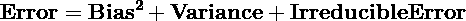

对于一个好的稳健模型，模型的误差尽可能小。为了最小化误差，偏差和方差需要最小，并且不可约误差保持恒定。下面的误差与模型灵活性(自由度)图描述了偏差和方差以及测试和训练误差的变化:

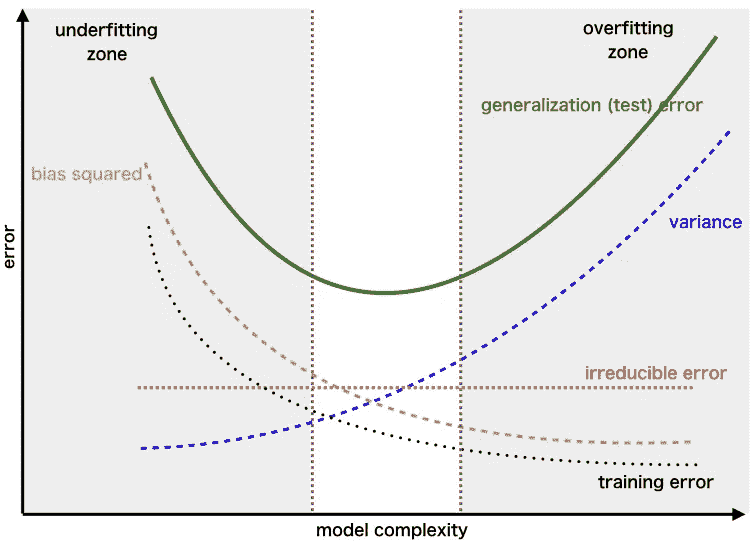

[来源](/the-bias-variance-tradeoff-8818f41e39e9)，偏差-方差权衡误差图

**从上图分析:**

*   当模型处于训练的初始阶段时，训练和测试误差都非常高。
*   当模型训练足够的时候，训练误差很低，测试误差很高。
*   训练和测试误差高的阶段是欠拟合阶段。
*   训练误差低而测试误差高的阶段是过拟合阶段。
*   在训练和测试误差之间存在平衡的阶段是最合适的。
*   欠拟合模型具有低方差和高偏差。
*   过度拟合模型具有高方差和低偏差。

Bagging Ensemble 技术可用于具有低偏差和高方差的基础模型。Bagging ensemble 使用数据集的随机化(将在本文稍后讨论)来**减少基础模型的方差，从而保持较低的偏差**。

## 装袋工作[1]:

现在很清楚，装袋减少了基础模型的方差，保持了较低的偏差。通过结合 bootstrap 抽样和聚集策略来减少基本模型的方差。装袋的整个工作分为三个阶段:

1.  自助抽样
2.  基础建模
3.  聚合

下图描述了具有 n 行的样本数据集 D 的所有三个步骤:

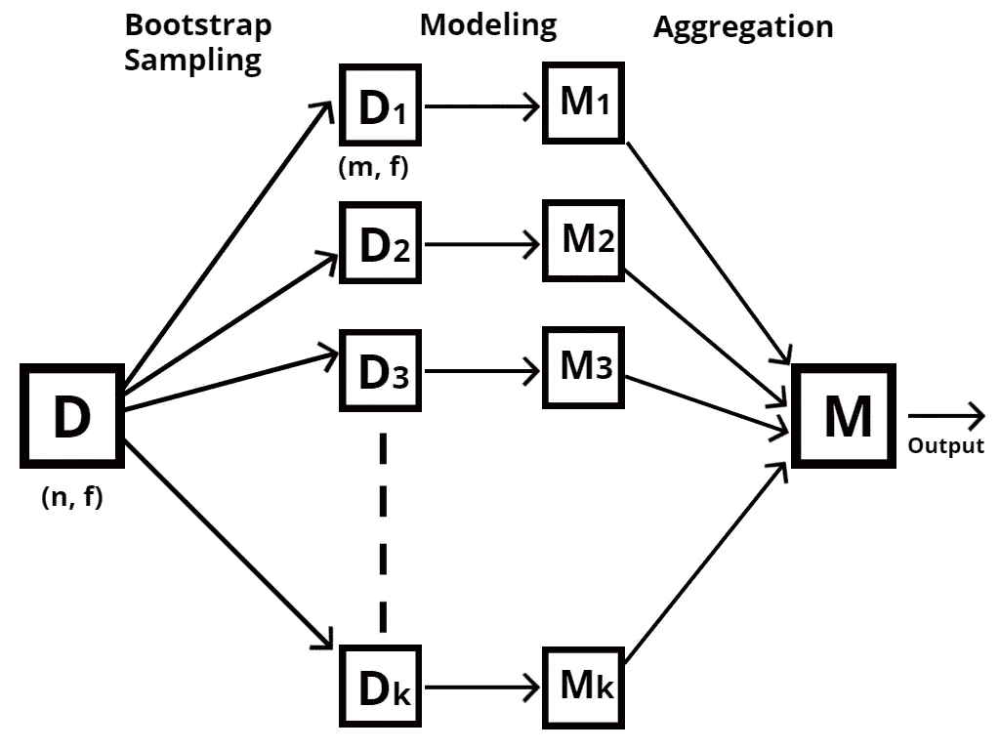

(图片由作者提供)，打包的 3 个步骤——引导取样、建模、汇总

## 自举采样:

**引导样本**是一个较小的样本，是初始数据集的子集。引导样本是通过替换采样从初始数据集创建的。

假设一个数据集有 **n** 行和 **f** 个特征，我们做一个引导取样，它指的是取样替换成 k 个不同的较小数据集，每个数据集大小为 m，具有相同的 **f** 个特征。D_i 形成的每个更小的数据集看到数据集的子集。在下图中，形状为(n，f)的初始数据集 D 被采样为形状为(m，f)的 k 个数据集，其中 m < n

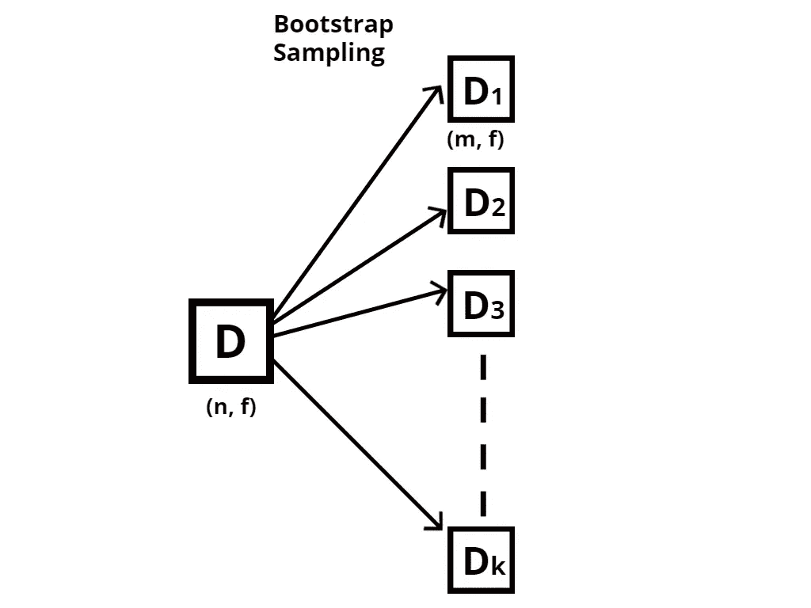

(图片由作者提供)，数据集的自助抽样

下图描述了如何引导样本。具有 10 行的数据集 D 被采样并替换成 k 个更小的数据集，每个数据集具有 5 行。上图中 n=10，m=5。

观察到通过自举形成的每个数据集仅看到原始数据集的一部分，并且所有数据集彼此独立。

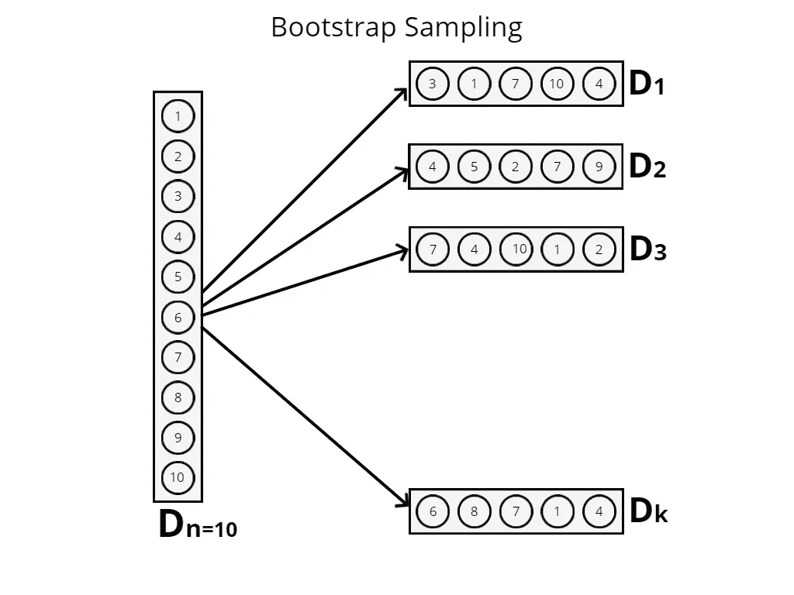

(图片由作者提供)，10 行样本数据集的 Bootstrap 采样。

这是 bagging 集成技术的第一步，其中 k 个较小的数据集通过彼此独立的引导来创建。

## 建模:

建模是装袋的第二步。在通过自举创建了 k 个较小的数据集之后，使用 ML 算法来训练 k 个数据集中的每一个。用于训练 k 数据集的算法在超参数改变或不改变的情况下可以是相同的，或者可以使用不同的算法。

举个例子，

*   决策树算法可以用作基础模型，并改变超参数，如“深度”。
*   可以使用不同算法的组合，例如 SVM、朴素贝叶斯、逻辑回归。

在每个引导数据集上训练的模型被称为基础模型或弱学习器。下图描述了独立模型的每个数据集的训练:

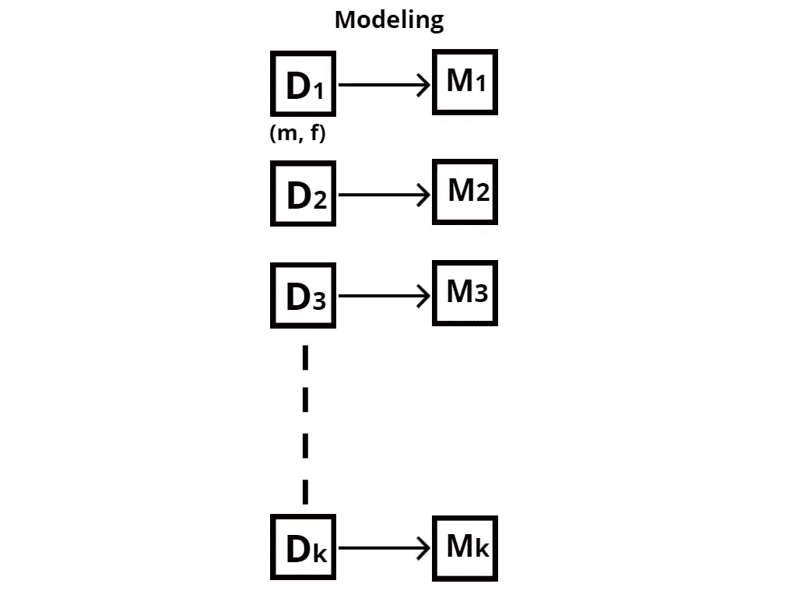

(图片由作者提供)，引导数据集的建模

## 聚合:

通过组合 k 个不同的基础模型来创建最终强大的健壮模型。因为基本模型是在引导样本上训练的，所以每个模型可能有不同的预测。根据问题陈述的不同，聚合技术也不同。

*   对于**回归问题**:聚合可以取每个基础模型预测的平均值。

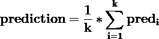

```
Notation,
**prediction:** Final Output of bagging ensemble
**k:** number of base models
**pred_i:** prediction of ith base model
```

*   对于一个**分类问题**:聚集可以使用多数投票，具有最多投票的类可以被声明为最终预测。

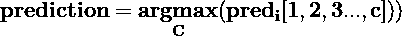

```
Notation,
**prediction:** Final Output of bagging ensemble
**pred_i:** prediction target class of ith base model
**1,2,3...,c:** c different target class
**C:** Target Class having maximum vote
```

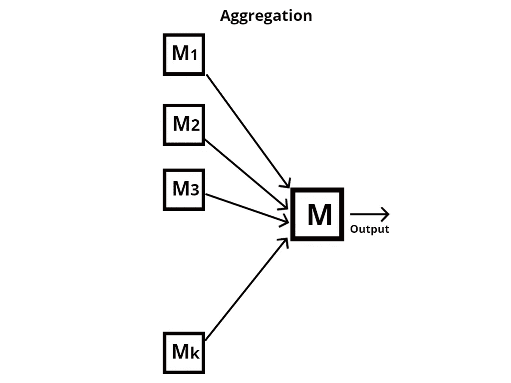

(图片由作者提供)，k 基础模型的聚合

## 随机森林:

随机森林是 bagging 集成学习的一个例子。在随机森林算法中，**基学习器**只是**决策树。**随机森林使用**装袋**和**列抽样**形成稳健模型。

换句话说，RF 使用 bagging 集成学习的实现，除此之外，它在自举步骤期间使用替换进行列采样。引导第一步的变化如下所示:

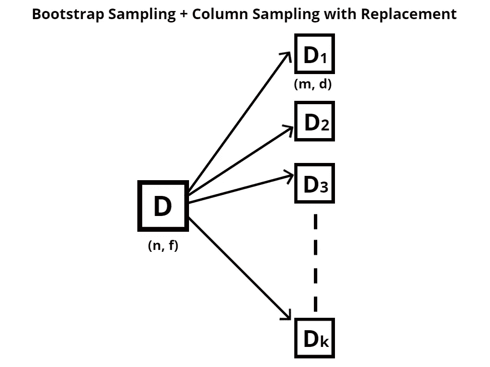

(图片由作者提供)，自举采样和列采样

初始数据集 D 的形状是( **n** 行， **f** 特征)，在 bootstrap 采样+ column 采样的情况下，形成的 k 基数据集是行采样和列采样。基础数据集 D_i 的形状是( **m** 行， **d** 特征)其中 **n > m** 和 **f > d** 。

## 随机森林的实现:

为来自 Kaggle 的 [Pima Indians 糖尿病数据集实施决策树和随机森林分类器。](https://www.kaggle.com/uciml/pima-indians-diabetes-database)

(作者代码)，决策树和随机森林分类器的实现

**决策树分类器的观察:**

决策树分类器针对 X_train 进行训练(第 16–19 行)，DT 分类器模型的性能(第 21–23 行)在 X_test 数据上进行测试。对 DT 模型性能的观察是:

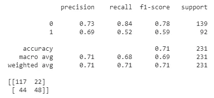

**随机森林分类器的观察:**

k=50 的随机森林分类器针对 X_train 进行训练(第 25–28 行)，RF 分类器模型的性能(第 30–32 行)在 X_test 数据上进行测试。对 RF 模型性能的观察是:

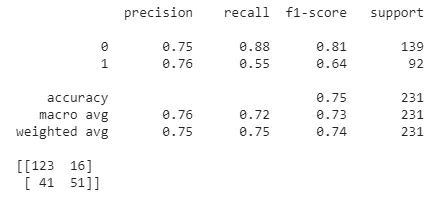

**性能改善观察:**

*   模型的准确率从 71%(对于 DT 分类器)提高到 75%(对于 RF 分类器)。
*   从两个混淆矩阵中可以观察到 FN 和 FP 值减少以及 TP 和 FN 值增加的变化。

**参考文献:**

[1](2019 . 4 . 23)，系综方法:装袋、升压、堆叠:[https://towardsdatascience . com/Ensemble-methods-bagging-boosting-and-stacking-c 9214 a 10 a 205](/ensemble-methods-bagging-boosting-and-stacking-c9214a10a205)

> 感谢您的阅读！