# 利用 Keras 中超参数调整提高 ResNet50 涂鸦图像分类器的性能

> 原文：<https://towardsdatascience.com/improving-the-performance-of-resnet50-graffiti-image-classifier-with-hyperparameter-tuning-in-keras-dbb59f43c6f7?source=collection_archive---------22----------------------->

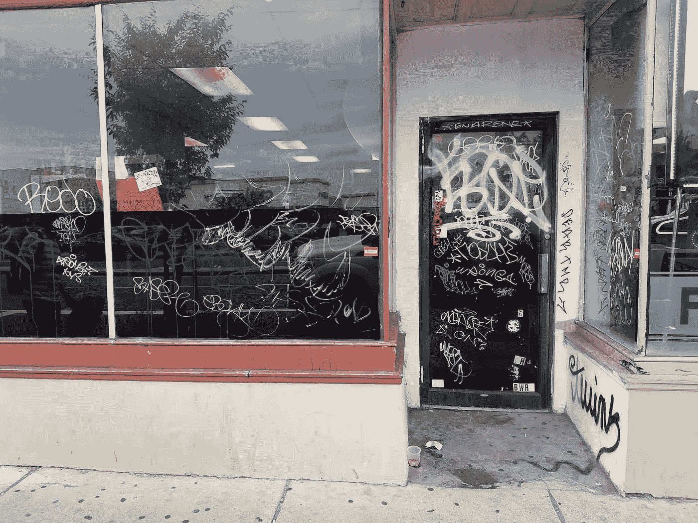

来自数据集的涂鸦图像

## 介绍

在世界各地的绝大多数城市地区，街道周围都有故意破坏的迹象。最常见的破坏形式之一是涂鸦或标记，这也是众所周知的。在世界上任何一个城市的墙上、高速公路上、火车上，都可以发现涂鸦。它们可以是在公共表面上绘制或刮擦的不适当的图像、颜色、字母，这是所有执法机构共有的问题。

[涂鸦破坏行为会影响社区，对旅游业和财产价值造成负面影响。它还会导致零售额下降，并加剧公民的恐惧；这最终耗尽了用于预防措施的税收。](https://www.dentco.com/graffiti-writings-on-the-wall/)为了更好地协助执法部门减少破坏行为，涂鸦图像分类器可以帮助他们完美地识别街道上的涂鸦图像。

本文的重点是通过调整参数，如*学习速率、批量大小和识别最佳冻结层，使用 ResNet50 神经网络来提高 Graffiti 分类器的性能。*

## 为什么要调学习率、批量、冻层？

[学习率是随机梯度下降反向传播中的步长。学习率将告诉我们在反向传播中需要改变多少权重，以便我们的模型预测得更好](https://www.youtube.com/watch?v=bR7z2MA0p-o&t=308s)。对于较大的学习率，训练将是多样化的，并且模型可能表现得更差。因此，选择最佳的学习率对于模型的更好性能至关重要。

批次大小是用于训练模型以更新模型参数的样本数。也可以用单幅图像更新参数，但是这个过程噪声很大，而且损耗会很高。所以我们选择批量。一次用一批图像训练网络，可以更准确地估计误差梯度。

对于神经网络的前几层，网络学习图像的边缘(水平线和垂直线)和形状。在特定层，网络能够区分图像是否是涂鸦。因此，如果我们能够冻结该层并训练其余层，将会提高模型的性能。

## 用于训练/测试模型的图像总数

共有 2256 张图片；1127 个涂鸦，1129 个无涂鸦图片。总图像被分成 0.8:0.1:0.1 的比例作为训练、测试和验证集。要将图像分割成训练、测试和验证文件夹，可以使用“split _ folders”python 包。

*注意:所有模型都是使用 Keras functional API 在 Google Colab (GPU)中运行的。*

> 数据集和代码文件的链接:【https://github.com/ShailuSurya/GraffitiImageClassifier 

## 迁移学习模型

ResNet50 针对 Imagenet 类的一百多万张图像进行了训练。因此，用超过 2000 张图像训练整个网络，对于一台带 CPU 的普通计算机来说是不可能的。因此，通过迁移学习，可以使用预先训练好的网络权重来训练顶层。

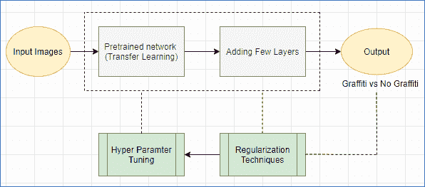

通过迁移学习的神经网络(使用 draw.io 创建)

我在输出中添加的图层是一个全局平均池图层、一个完全连接图层、一个下降图层和一个用于输出图层的 sigmoid 函数。如果对输出不满意，可以使用正则化或超参数技术来提高模型的性能。

我使用数据扩充(shear_range=0.2，horizontal flip=True，zoom_range=0.2)和丢失(rate=0.3)以及早期停止(耐心=10)作为正则化技术来提高模型的性能。

> 注意:在这里，我着重于涂鸦图像比无涂鸦图像更完美的预测。因此，我将检查所有模型的假阴性率；最终优选的模型将是具有高测试准确度和低假阴性率的模型。

## 超参数调整以提高性能

1.  **学习率**

该网络以各种学习率进行调整，例如 0.1、0.01、0.001、0.0001、0.00001。选择一个最佳的学习速度非常重要。如果我们选择一个更高的学习率，通过选择最大损失函数，模型可以表现得更差。

*   对于学习率 0.1 和 0.01，训练准确率达到 80%，而验证和测试准确率为 50%，这是一个直线趋势。这意味着，对于较高的学习率，模型学习不多。
*   对于学习率 0.001，测试准确率为 82%。该模型错误地将 27 个图像预测为没有涂鸦，即使它们是涂鸦图像。总体而言，该模型正确预测了 89%的涂鸦图像。
*   对于学习率 0.0001，测试准确度为 84%。这个模型错误地将 26 个图像预测为涂鸦。该模型的召回率为 77%，准确率为 89%，假阴性率为 8%。
*   对于学习率 0.00001，测试精度为 86%，尽管在训练和验证精度之间存在较小的差异，但这存在欠拟合问题。该模型正确预测 83%的无涂鸦图像和 90%的涂鸦图像，假阴性率为 8%。

总的来说，0.0001 的学习率比其余的学习率表现得更好。因此，有了这个学习率，批量大小和冷冻层数被调整。

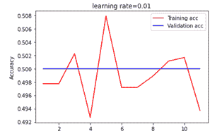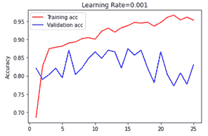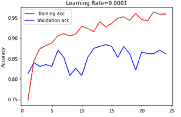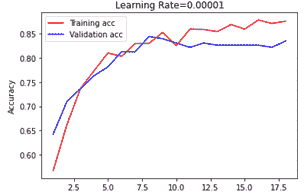

调整不同的学习率 0.01、0.001、0.0001、0.00001

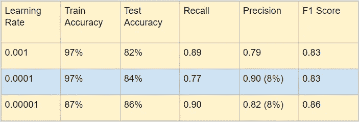

不同学习速率下涂鸦图像预测混淆矩阵的度量

**2。批量大小**

根据 Jason Brownlee 博士关于调整超参数的文章，ResNet50 使用 16、32、64、100 个批量进行了调整，学习率为 0.0001。

*   对于批量 16，测试准确度为 82%。训练和验证准确度之间的波动很大(见下图)。该模型以 88%的精度正确预测了 75%的涂鸦图像。
*   对于批量 32，测试准确度为 84%。该模型以 90%的精度正确预测了 77%的涂鸦图像。
*   对于批量大小 64，测试精度为 85%，该模型以 88%的精度正确预测 81%的图像为涂鸦。该模型的假阴性率为 10.5%，这意味着该模型有 10.5%的可能性预测错误。
*   对于批量大小为 100，测试准确率为 85%，该模型正确预测 86%的图像为涂鸦，82%的图像为无涂鸦，假阴性率为 13.1%。

总的来说，根据需求的优先级，可以在 32、64、100 之间选择任何批量。如果优先考虑的是完美地预测涂鸦图像，那么可以选择批量 64。然而，我们也应该考虑假阴性率。批次大小为 64 时，假阴性率较低。所以，我要 64 号的。

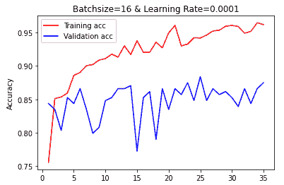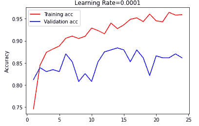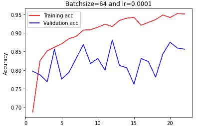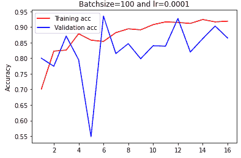

调整批量大小 16、32、64、100

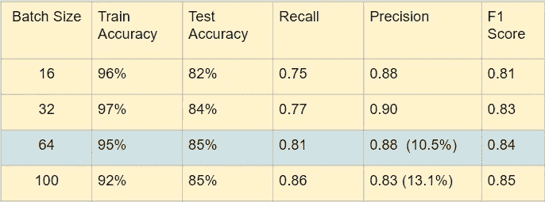

不同批量的涂鸦图像预测混淆矩阵的度量

**3。寻找最佳冷冻层**

根据下面的大小-相似性矩阵，在象限 3 中，如果数据集大小很小，那么我们必须冻结前几层并训练剩余的层。通过这样做，我们的模型可以更多地了解我们的数据集。

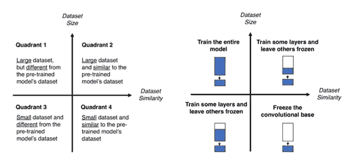

尺寸相似矩阵

基于大小-相似性矩阵，也基于 [加布里埃尔·林斯·特诺里奥](https://www.researchgate.net/profile/Gabriel_Lins_Tenorio)的一篇关于[提高迁移学习性能的文章，我已经冻结了前几层，并训练了剩余的几层。为了让模型更好地学习涂鸦数据集，我已经冻结了除最后 15 层、25 层、32 层、40 层、100 层、150 层以外的所有层。](https://www.semanticscholar.org/paper/Improving-Transfer-Learning-Performance%3A-An-in-the-Tenorio-Villalobos/640ea588ac02dcf73def8a0b80890302d12e6b73)

*   训练最后 15 层，测试准确率 86%。该模型能够正确预测 86%的涂鸦图像。尽管该模型将图像分类为涂鸦，但该图像不是涂鸦的可能性为 19%(假阴性率)。
*   训练最后 25 层，训练准确率为 81%，训练和验证数据集之间的方差较高。这个模型只正确预测了 73%的涂鸦图像。
*   训练最后 32 层，测试准确率 81%。与其他模型相比，该模型在预测涂鸦图像方面表现更好，准确率为 90%。
*   训练最后 40 层，测试准确率 86%。该模型仅能够正确预测 88%的涂鸦图像，但是假阴性率高达 14%。这意味着，有 14%的几率图像不是涂鸦，即使模型预测它是涂鸦。

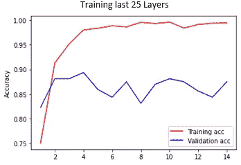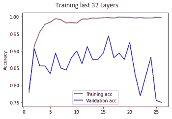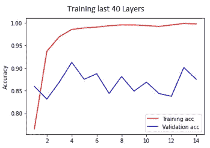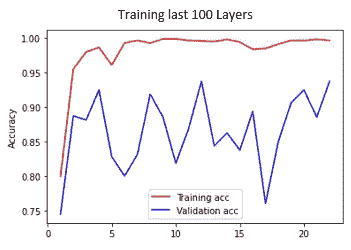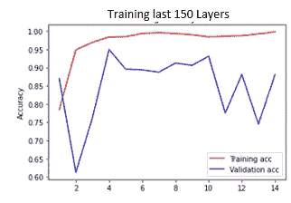

训练最后几层并冻结剩余层

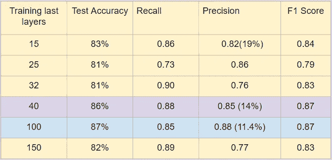

用于训练不同层的来自涂鸦图像预测混淆矩阵的度量

训练最后 100 层，测试准确率 87%。该模型可以正确预测 85%的涂鸦图像。假阴性率为 11.4%，低于“训练最后 40 层”。所以，我要进行最后 100 层的训练。

## 什么样的学习速率、批量大小和冻结层数提高了性能？

总体而言，在**学习率为 0.0001** 的情况下，测试准确率为 84%，假阴性率为 8%。以这个学习率和**批量 64** ，测试准确率为 85%，假阴性率为 10.5%。最终在学习率为 0.0001，批量为 64 的情况下，**训练最后 100 层**，测试准确率提高到 87%。

## 结论

最佳学习速率、批量大小和识别最佳冻结层的选择取决于我们的要求。一些模型完美地预测无涂鸦图像，一些模型更正确地预测涂鸦图像。对于所有的模型，我考虑了假阴性率来决定最佳的参数值。最后，决策取决于需求的优先级。

## 参考

[*电通外部服务管理*](https://www.dentco.com/graffiti-writings-on-the-wall/) *，(2017)。*涂鸦:墙上的文字

加布里埃尔·林斯·特诺里奥、克里斯蒂安·穆尼奥斯·比利亚洛沃斯、莱昂纳多·福雷罗·门多萨、爱德华多·科斯塔·达席尔瓦和沃特·卡尔。[提高迁移学习性能:在遥感数据分类中的应用](https://www.semanticscholar.org/paper/Improving-Transfer-Learning-Performance%3A-An-in-the-Tenorio-Villalobos/640ea588ac02dcf73def8a0b80890302d12e6b73)

莱斯利·史密斯，美国海军研究实验室高级研究科学家。[竞赛获奖学习率](https://www.youtube.com/watch?v=bR7z2MA0p-o&t=308s)。