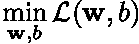

# 罗森布拉特感知机的改进

> 原文：<https://towardsdatascience.com/improving-upon-rosenblatts-perceptron-d0517d3c5939?source=collection_archive---------42----------------------->

## 自适应线性神经元和 Delta 规则

机器学习和人工智能已经在许多领域产生了变革性的影响，从医学科学(例如[成像和 MRI](https://arxiv.org/abs/1811.10052) )到实时战略视频游戏(例如[星际争霸 2](https://deepmind.com/blog/alphastar-mastering-real-time-strategy-game-starcraft-ii/) )。这些成功的关键促成因素是*深度神经网络*，其特点是所谓的隐藏层和人工神经元的数量不断增加。然而，必须强调的是，神经网络最初有着卑微的开端:当弗兰克·罗森布拉特(1928–1971)在 1957 年介绍他的感知机时，它只有一层由单个计算神经元组成，与今天可能有数百层和数千个神经元的神经网络相去甚远。尽管自 20 世纪 50 年代末以来发生了很多变化，但这些系列旨在引导学生了解神经网络的起源。这样做将更容易最终掌握深度学习所依赖的数学，以及现代神经网络是如何成为今天的样子的。为此，今天的主题是*自适应线性神经元和 Delta 规则*，这是由 [Bernard Widrow](https://en.wikipedia.org/wiki/Bernard_Widrow) 和他的学生 [Ted Hoff](https://en.wikipedia.org/wiki/Marcian_Hoff) 于 1960 年提出的。在开始之前，让我们快速回顾一下罗森布拉特的感知机。

左图:伯纳德·维德罗。右:马尔西安“特德”霍夫。

# 快速回顾罗森布拉特的感知机(1957)

 [## 罗森布拉特的感知机，第一个神经网络

### 深度学习快速入门。

towardsdatascience.com](/rosenblatts-perceptron-the-very-first-neural-network-37a3ec09038a) 

当 Rosenblatt 在 1957 年首次为二进制分类问题引入感知器时，他的机器使用了一个单一的计算神经元，如下图所示。

罗森布拉特感知机

给定输入向量

感知器首先计算加权和

然后将其传递给 Heaviside 函数以生成其输出

最终输出是 ***x*** 所属的预测类(0 或 1)。尽管这种人工神经元的数学简单，罗森布拉特的主要成就是设计了一种算法，使它能够直接从训练数据中实际学习一组权重*和偏差 *b* 。今天，这种监督学习算法被称为*感知器学习算法*。*

**

## *感知器训练程序的局限性*

*罗森布拉特的感知机并非没有局限性。其中一些根源于数学模型本身，已经在明斯基于 1969 年出版的一本臭名昭著的书中指出。*

**

***图 1:** 玩具问题考虑。*

*为了说明我们的观点，让我们考虑图 1 中的二元分类玩具问题。这和介绍[罗森布拉特的感知机](/rosenblatts-perceptron-the-very-first-neural-network-37a3ec09038a)时考虑的是一样的。然而，一个单独的训练示例被故意贴错了标签。使用标准的机器学习工具，人们会期望这一个错误标记的训练示例不会显著恶化分类模型的性能。虽然这种直觉对最近的模型可能是正确的，但我们会看到它不适用于罗森布拉特的感知机。*

**

***图 2:** 罗森布拉特感知器的决策边界在 100 个历元上的演变。学习率设置为 1。*

*图 2 描绘了当历元的数量从 1 到 100 变化时，感知机的决策边界的演变(即，我们循环通过整个训练数据集以学习权重 ***w*** 和偏差 *b* 的次数)。很明显，决策边界到处都是。巧合的是，错误分类点的数量从 1 一直到 100 个数据点中的 69。这种不稳定的行为不能通过降低学习速率(默认设置为 1)来缓解，这是一种经典的建议。事实上，回头看看感知器学习算法(见算法 1)，只要感知器误分类哪怕是一个点，权重 ***w*** 和偏差 *b* 就会不断更新。然而，给定我们的训练数据集，感知器实际上不可能正确地分类所有的点，因此学习过程永远继续下去，永远不会收敛！然而，感知器学习算法的这种基本限制和缺乏鲁棒性可以通过稍微修改学习过程来消除。我们将在下文讨论的小修改产生了现在被称为 *ADALINE* 的单层感知器。*

# *适应性线性神经元(1960 年)*

*像罗森布拉特的感知器一样，ADALINE(又名*自适应线性元素*或 *Widrow-Hoff 规则*)是一个单层感知器。然而，它与它的不同之处在于它如何从数据中学习权重 ***w*** 和偏差 *b* 。*

**

*阿达林。与罗森布拉特感知器的图表进行比较。*

*主要区别来自用于调整两个感知器的权重和偏差的反馈误差。Rosenblatt 使用分类误差(即二进制值)，ADALINE 引入了所谓的*损失函数*(有时也称为*成本函数*或*目标函数*)的概念，它依赖于量化前人工神经元的输出(即连续值)。虽然这可能看起来是一个很小的区别，但我们很快就会看到，当涉及到最终的模型时，这实际上是一个很大的区别！*

*损失函数的引入使得 ADALINE 比 Rosenblatt 的感知器更接近现代机器学习方法。给定我们的集合 *m* 例*(****x****【yₘ】*用 *yₘ* ∈ {0，1}表示类**x*所属，ADALINE 的损失函数定义为**

****

**其中 *φ(z)* 为激活函数(即这里的恒等函数)。基于该定义，获得权重 ***w*** 和偏差 *b* 作为最小化问题的解**

****

**即，它们被选择为使得我们的示例集上的误差平方和尽可能小。**

## **损失函数如何最小化？**

**让我们看看如何找到最小化损失函数的权重和偏差集。为此，我们将依赖于损失函数是二次的以及相关的最小化问题是[凸](https://en.wikipedia.org/wiki/Convex_optimization)的事实。如果你不知道什么是凸优化问题，简单来说就是我们知道如何高效求解的优化问题。我们还需要一些基本的高中微积分。**

**一个凸函数ℒ *(z)* 只有一个最小值。它位于ℒ *(z)* 的斜率为零的点 *z* ，即**

****

**我们的目标是找到满足这个条件的一组权重 ***w*** 和偏差 *b* 。这些是导致误差平方和尽可能小的权重和偏差(给定我们的数据)。**

****德尔塔法则:**记住一个函数的梯度表示正斜率最大的方向。因此，寻找函数最小值点的一个简单的启发式方法是向与梯度相反的方向移动。因此，让我们首先计算损失函数的梯度。对于一般激活函数 *φ(z)* ，它由下式给出**

****

**和**

****

**用*φ’(z)*激活函数相对于 *z* 的导数。注意 ADALINE 代表 ADA *感受性线性神经元。*它的激活是恒等式，即 *φ(z) = z* 从而 *φ'(z) = 1* 。因此，损失函数的梯度简化为**

****

**和**

****

**从给定的一组权重 ***w*** 和偏差 *b* 开始，delta 规则规定，为了减少误差平方和，这些权重和偏差需要更新如下**

****

**其中更新∈***w***和∈*b*由下式给出**

****

**和**

****

**这里，α是一个标量，通常称为*学习率*或*步长*。最简单的形式是，德尔塔法则假设α常数。变量 ***w*** 和 *b* 持续更新，直到执行了规定的迭代次数，或者更新的范数小于用户定义的容差。这就是事情的全部。**

**如你所见，德尔塔法则背后的数学和哲学都很简单。尽管如此，它仍然是用于训练更深层次神经网络的更一般的反向传播算法的一个特例，因此它在本系列中很重要。不要犹豫重新推导所有的数学作为练习。同时，现在让我们转移到有趣的东西，用 Python 实现 ADALINE。假设您已经熟悉 Python，下面的代码应该是不言自明的。**

**为了清晰和易用，我们将在整个系列中坚持使用 scikit-learn API。这段代码的扩展版本也可以在我的 TowardsDataScience Github repo 上获得([此处](https://github.com/loiseaujc/TowardsDataScience/tree/master/A%20quick%20introduction%20to%20deep%20learning%20for%20beginners/Adaptative_Linear_Neurons))。**

## ****ADALINE vs. Rosenblatt 的感知器****

****

****图 4:** 随着训练的进行，训练数据集中误分类点的数量。**

****

****图 5:** 罗森布拉特感知器(浅灰色)和 ADALINE(黑色)的决策边界在 100 个历元上的演变。在这两种情况下，学习率都设置为 0.1。**

**图 4 显示了 Rosenblatt 的感知器和 ADALINE 在训练过程中错误分类点的数量，而图 5 描述了两个模型的决策界限的演变。罗森布拉特的感知器无处不在，在某个特定时期的准确率接近 99%，而在下一个时期的准确率不到 50%。这种鲁棒性的缺乏来自于一个错误标记的数据点阻止罗森布拉特的感知机学习任何东西。**

**相比之下，随着训练的进行，ADALINE 的误分类点的数量单调减少。看 ADALINE 的决策边界的演化，可以看出它比 Rosenblatt 的感知器要平滑得多。这种更平滑的演变来自于成本函数的定义，使得训练过程能够基于对当前预测的错误程度的一些评估，而不是简单地基于它是否错误(如罗森布拉特的感知器的情况)，在每一步对权重***【w】***和偏差 *b* 执行小的调整。由损失函数编码的信息因此使得 ADALINE 的训练更加健壮和良好。最后要注意的是，即使这两个类不是线性可分的(由于一个错误标记的数据点)，ADALINE 的最终线性决策边界仍然是基于最小化问题的公式以有原则的方式选择的，从而确保它在某种意义上是最优的。关于 Rosenblatt 的感知器的决策边界，没有这样的事情可以说，因为对于这里考虑的问题，它根本不存在，感知器学习算法不能收敛。这是这两个单层感知器的主要区别…**

## **ADALINE 普通最小二乘法是变相的吗？**

**在结束之前，让我们试着更好地理解 ADALINE 实际上在学习什么。虽然它用于分类目的，但它与最简单的回归模型之一的[普通最小二乘法](https://en.wikipedia.org/wiki/Ordinary_least_squares) (OLS)密切相关。当观察损失函数时，这种紧密的联系清晰可见**

****

**使用简单的变量变化，**

****

**和**

****

**这个损失函数可以重写为**

****

**其中 **X** 的每一行都是给定的训练示例。这个损失函数不过是普通最小二乘最小化的二次损失函数。最优解的封闭形式是**

****

**因此，两个模型之间的这种等价允许我们将 ADALINE 的权重 ***w*** 和偏差 *b* 理解为出现在超平面的方程中的系数，该方程在最小二乘意义上最好地分离了两个类别。**

**尽管 ADALINE 改进了 Rosenblatt 的感知器，但我们将在接下来的帖子中看到*在最小二乘意义上解决问题*并不是一个人可以为分类问题做的最合适的事情…**

# **结论**

**这篇文章是我的深度学习初学者系列的第二篇。这本书应该更早出版，但生活另有决定(新生儿、新房子、工作等)。至于罗森布拉特的感知机的第一篇文章，我知道将自适应线性神经元的文章标记为深度学习可能有些牵强，但相信我，我们会实现的。与此同时，不要犹豫地玩代码(见 [GitHub repo](https://github.com/loiseaujc/TowardsDataScience/tree/master/A%20quick%20introduction%20to%20deep%20learning%20for%20beginners/Adaptative_Linear_Neurons) )，如果有兴趣，自己重新推导所有的数学。没那么复杂。如前所述，ADALINE 比 Rosenblatt 的感知器更接近现代机器学习方法。因此，当我们转向现代神经网络时，很好地理解它所依赖的数学将是非常有价值的！**

**在接下来的几篇文章中，我们将讨论以下主题:**

*   **感知器收敛定理。**
*   **XOR:深度学习的卑微开端。**

**最后，您会在下面找到一个与 ADALINE 相关主题的附加在线资源列表。不要犹豫，看看这些，因为它们可能会处理一些我们可能会忽略的方面！**

**PS:如果你知道任何其他相关链接，不要犹豫给我发消息，我会编辑帖子来添加它:]**

## **其他在线资源**

*   **Sebastian Raschka 关于[单层神经网络和梯度下降](https://sebastianraschka.com/Articles/2015_singlelayer_neurons.html#references)的博客文章以及他的[机器学习常见问题](https://sebastianraschka.com/faq/docs/diff-perceptron-adaline-neuralnet.html)。**
*   **如果你想更多地了解泰德霍夫:[https://computerhistory.org/profile/ted-hoff/](https://computerhistory.org/profile/ted-hoff/)**

> ***想要阅读更多此类内容？*查看我其他关于[低秩结构和数据驱动建模](https://loiseau-jc.medium.com/list/lowrank-structure-and-datadriven-modeling-8f39635a90ea) *的文章或者干脆我的* [*机器学习基础知识*](https://loiseau-jc.medium.com/list/machine-learning-basics-0baf10d8f8b5) ！**

** [## 二元交叉熵和逻辑回归

### 有没有想过我们为什么使用它，它来自哪里，如何有效地优化它？这里有一个解释(代码…

towardsdatascience.com](/binary-cross-entropy-and-logistic-regression-bf7098e75559)**