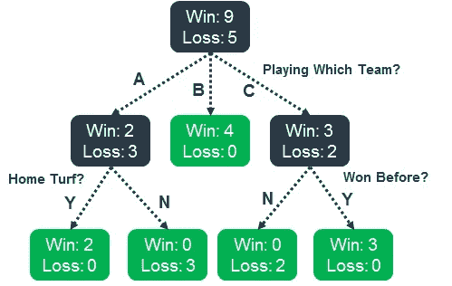
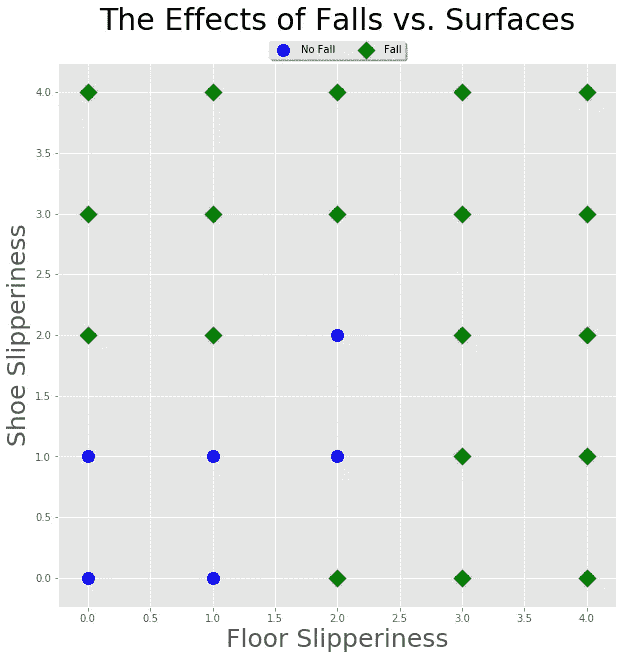
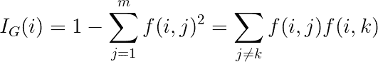
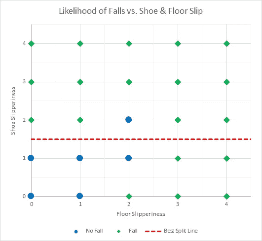
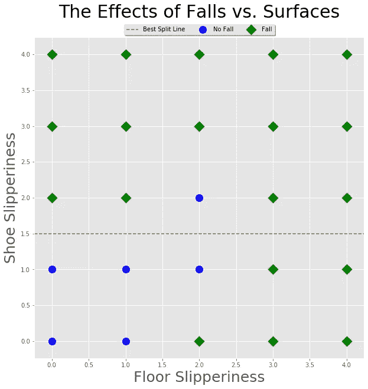

# 杂质和判断分裂——决策树如何工作

> 原文：<https://towardsdatascience.com/impurity-judging-splits-how-a-decision-tree-works-235f2e9e63b7?source=collection_archive---------28----------------------->

罗马卡夫在 [Unsplash](https://unsplash.com?utm_source=medium&utm_medium=referral) 上拍摄的照片

如果你想了解机器学习算法是如何工作的，那么从不起眼的[决策树](https://en.wikipedia.org/wiki/Decision_tree)开始是不会错的。本质上，决策树是一个[流程图](https://en.wikipedia.org/wiki/Flow_diagram)，它询问一系列关于数据点的问题(数据点被赋予一组特征/值)以便对其进行分类(见下文，决策将是绿框中的多数组)。

**注意:**绿框代表叶节点，在这些叶节点上，将组进一步分成“赢”和“输”是没有改进的

为了训练一个决策树，你需要一组训练数据，然后通过在每个点为每个结果组提出最佳问题，找到将它分成越来越相似的组的最佳方法。

例如，在上面的图表中，我们想要分类一支球队是否会赢得比赛(训练集为 9 胜 5 负)，它查询的第一个问题是数据中的列，该列详细说明了他们是与 A 队、B 队还是 C 队比赛，然后将它分成三组。如果你玩的是 B 队，那么它不会再进行分裂，因为最终的小组是你能做到的最纯粹的小组(4 胜 0 负)，所以预测你会赢得任何新的数据点。其他组仍然是“不纯的”(有混合数量的赢和输)，将需要进一步的问题来进一步分裂他们。有趣的是，对于每个组，他们可能不会被问到相同的问题(例如，“主场优势？”或者“以前赢过？”).

决策树的工作方式是一种非常有趣的预测方式，因为:

1.  **它们很直观**——你可以阅读这些问题集，很快就能知道它是如何做出决定的
2.  **您可以按类别或数量**分割数据——如果数据大于某个数量(即一组小于 3，另一组大于或等于 3)，您可以按类别分割数据(一组中的所有“狗”，另一组中的所有其他动物)
3.  这是一种你可以硬编码的东西——你可以将问题物理编码到简单的电子设备中，这比神经网络等更复杂的算法更容易，甚至在某些情况下可以打印出来
4.  **它是更复杂算法**的构建模块(最流行的机器学习算法之一，[随机森林](https://en.wikipedia.org/wiki/Random_forest)，本质上是一组专门构建的决策树)
5.  **他们可以做出非常复杂的决定**——他们处理高维和低维数据，他们甚至可以预测一个数字以及预测一个类别(他们可以进行[分类](https://en.wikipedia.org/wiki/Classification)和[回归](https://en.wikipedia.org/wiki/Regression_analysis)预测)
6.  **可以计算特征重要性** —这个我以后再回答。

你说很好。让我们开始编写代码吧！等等，等等，等等……在我们开始构建一棵树并测试它之前，我们需要回答一个重要的问题。

# 它如何决定要问的最佳问题？

埃文·丹尼斯在 [Unsplash](https://unsplash.com?utm_source=medium&utm_medium=referral) 上拍摄的照片

如果你想到了关于球队获胜的例子，那么算法是如何知道问你在和哪个队比赛是最先问的问题的呢？我们可能会争论“最佳”在这里意味着什么，但我的意思是，对于我们从可用问题列表中提出的每个问题，它应该是将数据分成彼此更相似的组的问题(因此，对于我们之前的示例，我们希望组只包含赢或输)。那么它是如何决定的呢？

照片由 [Justus Menke](https://unsplash.com/@justusmenke?utm_source=medium&utm_medium=referral) 在 [Unsplash](https://unsplash.com?utm_source=medium&utm_medium=referral) 上拍摄

为了观察这一点，我将制作一组虚假的数据，根据你鞋子的抓地力有多滑(4 表示非常滑，0 表示不滑)以及地板表面有多滑，涵盖你是否可能摔倒(“摔倒”)或不摔倒(“没有摔倒”)。想象它，我们有:

假的秋天数据。蓝色不太可能掉(“不掉”)，绿色很可能掉(“掉”)

我们凭直觉知道，如果你有更多防滑鞋，你可以在更滑的地板上保持抓地力，反之亦然。因此，如果您可以将一个轴(地板或鞋子光滑度)上某个值的数据分成两组，这样得到的组会“更纯”，那么您会怎么做呢？更重要的是，算法是如何做到的？是否要在地板光滑度为 2.5 的情况下将数据分成两组？或者是 1.5 的鞋滑度？

这就是我们进入测量分割数据质量的数学的地方。对于每一个问题，我们都希望将一组数据放入问题中，最终得到两组数据，一组包含问题上方的所有数据，另一组包含问题下方的所有数据。我们不会问没有出现分裂的问题(比如将鞋子光滑度 5 分或以上的所有分数放入一个新组，而将其余分数放入另一个新组)，因为我们根本没有改进这些组(没有任何变化)。

# 分裂的纯粹性

汤姆·巴瑞特在 [Unsplash](https://unsplash.com?utm_source=medium&utm_medium=referral) 上的照片

已经存在几种“纯度”或“最佳”分离的数学方法，您可能遇到的主要方法有:

*   Gini 杂质(主要用于正在进行分类的树)
*   熵(同样主要是分类)
*   方差减少(用于正在进行回归的树)

***如果你在 pythons 的 SKLearn 模块中寻找决策树分类器或回归器，你会看到它们列在“标准”选项下。**

本周，我将重点讨论基尼系数不纯度，因为一旦你理解了它的数学原理，你就可以很直观地计算出来(而熵可能会有点困难)。在我们的决策树在未来的版本中工作之后，我们总是可以看看其他的。

# 基尼杂质

(我打赌你能看出为什么我之前一直用“纯”这个词来让你做好准备！)

基尼系数所做的是计算出你从一组数据中选择一个项目的概率，然后计算出你错误分类的概率。

例如，如果我有一袋 6 个蓝色和 4 个黑色的球(上面都有一个说明颜色的小标签),那么纯度测量就是如果我去掉所有的标签，随机选取一个标签放在我也从袋子中随机抽取的一个球上，我对它们进行错误分类的可能性有多大。

基尼系数的实际等式如下:

其中 I(i)是一组数据的杂质，I。j 和 k 是该组中不同的类别/标签，f(i，j)和 f(i，k)是 I 被分类为 j 组或 k 组的概率。

求和项是因为我们对没有正确分类的每个可能的组合都这样做。我不会深入这个等式，因为我会把它作为一个练习留给着迷的读者去查看链接，我发邮件去了解更多。

因此，做一个工作示例，对于袋子，我们选择蓝色球的概率是 6/10(10 个袋子中只有 6 个蓝色球)，我们在袋子上贴黑色标签的可能性是 4/10(总共 10 个标签中只有 4 个黑色标签)。我们将这两者相乘，得到 24/100。如果我们对黑球这样做，我们得到 4/10 乘以 6/10，得到 24/100。将它们相加，我们得到 48/100 或 0.48。这袋球的纯度是 0.48。

现在我们有了一种计算一组数据的杂质的方法，我们要问的问题应该是，分裂组合并杂质(这通常由分裂组的大小加权，因此较大的组具有较大的权重)较低，我们对此进行了最大化。

对于我们跌倒的例子，我们只需要检查鞋子打滑和地板打滑的所有可能值，看看哪一个分裂给出最大的基尼不洁分数减少。

> **注意:**有些人可能会说，如果你同时兼顾鞋子和地板的光滑度，这两组人会更好。
> 
> 然而，虽然这是真的，但将它编码到算法中在计算上是非常昂贵的。这是因为要问的问题数量会成倍增加。
> 
> 例如，对于我们来说，我们问了 4 个关于鞋子特征的问题和 4 个关于地板特征的问题(之所以是 4 个，是因为我们没有问一个所有数据都在一个组中结束而不是在另一个组中结束的问题，就像在 4.5 的光滑度上分裂一样)，总共有 8 个可能的分裂问题。
> 
> 如果我们使用上述方法，我们将有 4*4=16 个问题，这是一个很大的数字。一次只执行一次分割的结果是训练算法更快，只是树中的问题稍微多一些。合理的交易。

# 应用拆分

因此，查看我们的秋季数据，我们发现初始杂质分数为 0.3648，如果我们以 1.5 的鞋滑度进行分割，那么我们得到的分数为 0.2747(减少 0.0901)，如果我们以 2.5 的地板滑度进行分割，那么我们得到的分数为 0.288 (0.0768)，这使得鞋子切割效果最佳。我制作了一个 python Jupyter 笔记本和一个 Excel 电子表格(可以在我的 [GitHub](https://github.com/Carnivalius/Decision-Tree-From-Scratch) 上找到，还有一个处理 100 个数据点的脚本)来显示所有决策的计算，并在下面制作了这些漂亮的视觉效果来展示如何将数据分成更好的组。

**左:** Excel 模型，**右:** Python Jupyter 笔记本模型

对于获胜的问题，我们可以计算分数:

*   **首发组:**总分 25 分有 6 个“摔倒”，19 个“没有摔倒”。由于篇幅原因，我不会在这里计算它，但在阅读了下面几点后，可以随意尝试一下。总数是 0.3648。
*   **高于 1.5 的组:**我们有 1/15 的机会选择一个“无落差”数据点，14/15 的机会给它一个错误的 14/225 倍数值的标签。对于 14 个“下降”数据点，我们有相反的结果，但是 14/225 的结果是相同的。求和后我们得到的值是 28/225。
*   **低于 1.5 的组:**我们有 5/10 的几率选择“不坠落”，有 5/10 的几率误分类为 25/100 的值。对于“下降”数据，我们有相反但相同的最终值 25/100。总数是 50/100
*   **总计:**高于 1.5 的组有 15 个数据点，因此其值被加权为 15/25(起始组中有 25 个数据点)。对于低于 1.5 的组，我们有 10/25。这给了我们:

> 28/225*15/25 + 50/100*10/25 = 0.0747 + 0.2000 = 0.2747

*   杂质的减少是起始组 Gini 杂质减去来自所得分裂组的杂质的加权和。这是 0.3648–0.2747 = 0.0901(与代码相同！)

我之前说过，您可以询问决策树数据中的哪些特征是最重要的，您可以通过对针对该特征提出的每个问题的纯度减少量进行求和来实现这一点(例如，我在前面的问题中根据身高分割数据，然后在后面的问题中再次分割数据)。把这些加起来，你就能清楚地看到哪些决定是最重要的。这对于修剪和简化你的树是有用的，但是也给出了最有价值的决策信息来自哪里的很好的指示。

# 我们完了。我们可以判断劈叉的质量

恭喜你！现在，您了解了决策树判断最佳问题的一种方式。我计划在以后的文章中添加到 jupyter 笔记本中，这样我们就可以使用这种方法从头开始构建一棵树。

对于那些认为我们的数据太容易分割的人来说，嗯…你是对的。虽然我的测试例子很简单，你可以通过眼睛很容易地判断它，但请记住，这些算法经常查看超过 2 维的数据，一旦你到达 3 或 4 维，人脑真的很难想象它。这真的显示了这些算法的关键力量，它总是能够对我们自己难以做到的数据进行最好的分割。

> **参考资料:**从零开始构建算法的一个很好的参考资料是 Toby Segaran 的《编程集体智慧:构建智能 Web 2.0 应用程序》。它很老了，是用 Python 2 编写的，期望数据在列表中，但这是一个很好的介绍，你可以挑战自己，将它转换成最新 Python 中的 pandas 数据帧。如果你想先看看机器学习算法，我也推荐维基百科。