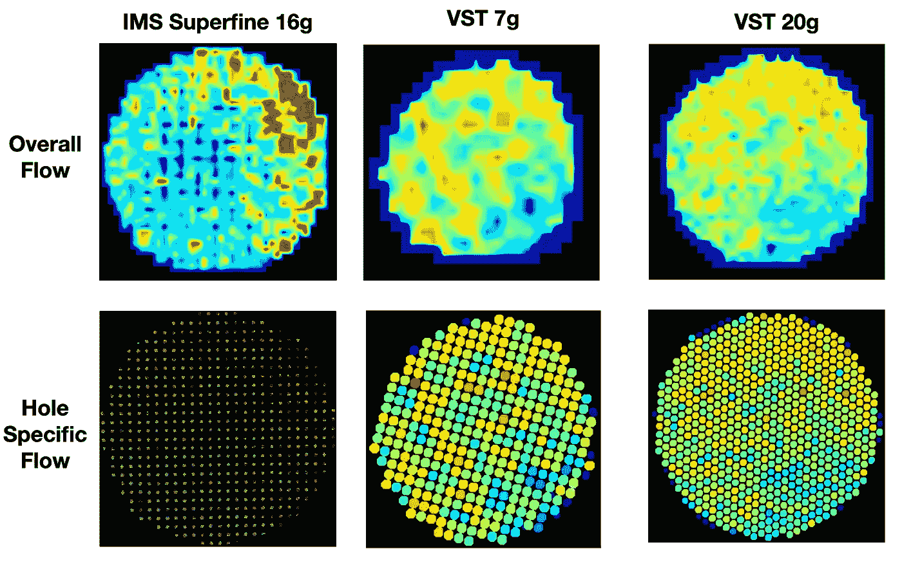

# IMS 超细与 VST:一个小样本浓缩咖啡过滤器的比较

> 原文：<https://towardsdatascience.com/ims-superfine-vs-vst-a-small-sample-espresso-filter-comparison-4c9233e194?source=collection_archive---------7----------------------->

## 利用数据找到一种比较和对比的方法

当我第一次得到 VST 过滤篮时，它极大地改变了我的浓缩咖啡。一旦我开始制作[不连续浓缩咖啡](https://medium.com/overthinking-life/staccato-espresso-leveling-up-espresso-70b68144f94)，过滤的想法就更加强烈了。我对我的 VST 过滤器和其他过滤篮进行了[分析，在某个时候，我偶然发现了 IMS 超细过滤器。有人在网上询问过滤器，当我提到我使用过它们时，我想到了数据。](/espresso-filters-an-analysis-7672899ce4c0)

我有足够的数据来更好地比较 IMS Superfine 和 VST 吗？我有足够的数据来比较我的 VST 7g 过滤器和 VST 20g 过滤器吗？所以我挖掘了 6 个月的数据，看看我是否能控制足够的变量来发现一些有趣的东西。

请记住，就使用的过滤器数量而言，这是一个**超小型采样**。这种分析应该从“这些特定过滤器中哪一个更好”的角度来看，而不是 IMS 或 VST 总体上更好。对于这项测试，需要进行更大规模的研究。

顶部图片:7g VST，20g VST，IMS 超细。左下:VST 20g，IMS 超细。右下:IMS 超细

# 极其简短的历史

[VST 过滤器](https://store.vstapps.com/products/vst-precision-filter-baskets)是经过大量研究后制成的，这些研究确定了改善浓缩咖啡所需的孔公差。他们提供了一份购买规格表，我已经独立核实了他们的说法。

[IMS 超细过滤器](https://www.eb-lab.coffee/new-products-1/filters-b702th24sf)使用筛网过滤掉 170 微米以上的颗粒，而不是典型的 250 微米及以上。该过滤器也被视为精密过滤器。

之前，[我已经使用图像处理来分析过滤器上的孔尺寸变化](/espresso-filters-an-analysis-7672899ce4c0)。我将对这些过滤器进行分析，以便进行比较。每一个都有一些热点，那里的孔比较大，会影响流动。我注意到这些整体流动模式，而拉镜头。很难看出特定的孔值有很大的影响，但这是需要注意的。他们都有一些偏见，但没有一个主要的偏见会表明他们的表现会很糟糕。对于超细过滤器，分析包括顶部的金属筛网，使每个孔具有 4 至 10 个更小的孔。然而，我不确定这是否是过滤器的实际作用，因为金属网只是附着在边缘，而不是焊接在过滤器上。

# 绩效指标

我使用了两个指标来评估过滤器之间的差异:最终得分和咖啡萃取。

最终得分是 7 个指标(强烈、浓郁、糖浆、甜味、酸味、苦味和余味)记分卡的平均值。当然，这些分数是主观的，但它们符合我的口味，帮助我提高了我的拍摄水平。分数有一些变化。我的目标是保持每个指标的一致性，但有时粒度很难确定。

使用折射仪测量总溶解固体量(TDS ),该数值与咖啡的输出重量和输入重量相结合，用于确定提取到杯中的咖啡的百分比。

# 浓缩咖啡数据随着时间的推移慢慢收集

我用六个月的时间拍摄了我的 VST 单曲(7g)、VST 双曲(20g)和 IMS superficial(18g)，我开始寻找模式。最终，我没有一个公平的比较，因为我没有一个相同的重量，但我有很多数据，也许我们可以看到一个故事。

首先，将所有跨最终得分和提取的数据与产出投入比进行比较。除了看起来他们有相似的表现之外，在这些数据中没有出现一个模式。

然后，让我们比较一下在过滤(PFF)篮中有无纸质过滤器的情况。尽管如此，除了超细提取似乎与味道不太相关(最终得分)之外，模式还不太清楚。

为了改进这种比较，我们来做一些配对数据。我们将为每种烤肉搭配最佳口味，并将 VST 的最佳口味与 IMS 进行比较。同样，也缺乏数据，但即使是这么少的数据，也没有明确的令人信服的模式。

因此，让我们为每一次烧烤拍摄所有照片，按口味排序，并对 VST 和 IMS 拍摄进行配对，以比较 VST 的最佳照片和 IMS 的最佳照片，第二好的照片和第二好的照片，等等。这就给出了更多的数据，从口味上来说，它们似乎没有太大的区别。从提取方面来说，VST 要么与 IMS 相同，要么比 IMS 好得多。

# VST 7 克对 VST 20 克

因为我们在比较数据，所以让我们用同样的方法来比较 VST 7g 和 VST 20g。让我们开始直接把每一次烘烤的最佳镜头配对在一起。一般来说，问题是一次烘烤有 20 次左右，我没有刻意对每次烘烤使用所有三种过滤器。所以在数据上有点欠缺。

让我们扩展数据，包括过去一年的数据，即使我没有提取测量。有些镜头是实验性的，有些是用来拨入研磨。总的来说，我在性能方面没有看到太多的偏好。当我有时间的时候，我喜欢更频繁的投篮，所以一个更小的篮子，但是这些天我在原地躲避的时间更少了。

这两个 VST 过滤器有差异，但最终在过去的一年里，他们最好的镜头对彼此几乎相等。

# 末端的精密过滤器

关于哪一个更好还存在一些争论。最终，在这篇文章中，我只有 2 个 VST 滤波器和 1 个 IMS 滤波器。为了获得更好的过滤器性能总体样本，需要大约 30 个过滤器，每个过滤器上有多个镜头。如果我有时间和钱，我会尝试这个实验。

我很失望，因为我以为 IMS 超细将是下一个增量改进，但它是相同的另一个 VST 过滤器。然而，令人欣慰的是，IMS 滤波器比 VST 滤波器差。

如果你愿意，可以在 Twitter 和 YouTube 上关注我，我会在那里发布不同机器上的浓缩咖啡视频和浓缩咖啡相关的东西。你也可以在 [LinkedIn](https://www.linkedin.com/in/robert-mckeon-aloe-01581595?source=post_page---------------------------) 上找到我。

# 我的进一步阅读:

[断续浓缩咖啡:提升浓缩咖啡](https://medium.com/overthinking-life/staccato-espresso-leveling-up-espresso-70b68144f94)

[浓缩咖啡中咖啡溶解度的初步研究](/coffee-solubility-in-espresso-an-initial-study-88f78a432e2c)

[浓缩咖啡模拟:计算机模型的第一步](https://medium.com/@rmckeon/espresso-simulation-first-steps-in-computer-models-56e06fc9a13c)

[更好的浓缩咖啡压力脉动](/pressure-pulsing-for-better-espresso-62f09362211d)

[咖啡数据表](https://towardsdatascience.com/@rmckeon/coffee-data-sheet-d95fd241e7f6)

[工匠咖啡价格过高](https://medium.com/overthinking-life/artisan-coffee-is-overpriced-81410a429aaa)

[被盗浓缩咖啡机的故事](https://medium.com/overthinking-life/the-tale-of-a-stolen-espresso-machine-6cc24d2d21a3)

买得起的咖啡研磨机:比较

[浓缩咖啡:群头温度分析](https://medium.com/@rmckeon/espresso-grouphead-water-temperature-analysis-25cc00556d5c)

[浓缩咖啡过滤器分析](/espresso-filters-an-analysis-7672899ce4c0)

[便携式浓缩咖啡:指南](https://medium.com/overthinking-life/portable-espresso-a-guide-5fb32185621)

克鲁夫筛:一项分析