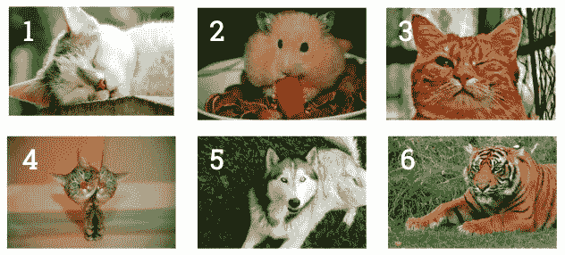

# AI 中的“地面真实”是什么？(一个警告。)

> 原文：<https://towardsdatascience.com/in-ai-the-objective-is-subjective-4614795d179b?source=collection_archive---------5----------------------->

## 一个演示，展示了为什么你不应该把人工智能当成一个神奇的魔法盒

注意:下面所有的链接都会带你去同一作者的其他文章。

随着所有的[无端拟人化](http://bit.ly/quaesita_ethics)感染机器学习( [ML](http://bit.ly/quaesita_simplest) )和人工智能( [AI](http://bit.ly/quaesita_ai) )空间，许多商人被骗去认为 AI 是一个客观、公正的同事，知道所有正确的答案。这里有一个快速演示，告诉你为什么这是一个可怕的误解。

图片:[来源](https://www.zdnet.com/article/the-advance-of-collaborative-robotics/)。

几乎每个人工智能学生都必须经历的一项任务是[建立一个系统](http://bit.ly/quaesita_sc17demo)，将图像分类为“*猫*”(照片包含一只猫)或“*非猫*”(看不到猫)。这是一项经典人工智能任务的原因是，识别物体对人类来说是一项相对容易完成的任务，但我们真的很难说出我们是如何做到的(所以很难编写描述“猫性”的明确规则(T21)。这些任务对人工智能来说是完美的。

# 演示

我听到你们中那些已经和 AI 相处了一段时间的人的抱怨——你们已经厌倦了猫/非猫的任务。很公平，但就这一次。对于这个练习，*你*将是我的 AI 系统。你的任务是将下面的六幅图片分类。您只能从两个允许的标签/输出中选择:

*   猫
*   非猫

我们开始吧！给 6 幅图像中的每一幅分配一个允许的标签，就像人工智能系统会做的那样:

花点时间将每张图片标记为“*猫*”或“非猫”。

啊哈！图片 1-5 很简单，但是我听到你对图片 6 喃喃自语。*《大猫》*？*《猫的种类》*？*《也许猫》*？这些是不允许的选项！你是一个被编程为只输出*【猫】*或*【非猫】*的系统。那到底是哪一个？

转到此视频的 0:20，与现场观众一起观看本文的演示。

因此，我们开始看到[项目的决策者](http://bit.ly/quaesita_first)是多么重要。正确的答案不是柏拉图式的，当然也不是来自人工智能系统……事实上，没有*【正确】*的答案。*【正确】*答案取决于系统的所有者希望系统做什么。

> 人工智能不能为你设定目标——那是人类的工作。

如果我试图建立一个宠物推荐系统，它只推荐那些在典型的成年形态下可以安全拥抱的动物，那么答案就很明显了。我对该系统的预期目的是指您的正确行动是将图像 6 标记为“*非猫”*。如果在这一点上你仍然把它贴上“*猫*”的标签，那么…我建议你购买更多的人寿保险。

> 机器学习的“正确”答案通常是在旁观者的眼中，因此为一个目的而设计的系统可能不会为不同的目的而工作。

如果你打算出于其他目的给猫分类，那么也许*【正确】*答案会有所不同。目的或目标来自人类决策者！靠边站柏拉图；不同的答案将适用于不同的项目。在人工智能中，客观总是主观的。由项目的所有者来决定那些主观的提议。(其他每个人都应该明白，人工智能系统有很多主观性。)

> 在人工智能中，客观总是主观的！人工智能系统有很多主观性。

[决策者](http://bit.ly/quaesita_di)必须充当[负责任的家长](http://bit.ly/quaesita_genie)挑选他们希望他们的系统复制的行为……几乎从来没有一个“正确的”方法来定义类别并设定每个决策者都会同意的目标。那些事情取决于个人。不同的人会发现不同的行为适合复制。

如果你继承了我的系统，并且你的意图与我的不同，或者如果你计划将它用于不同于我设计它的目的——例如，如果你在什么应该被称为猫的问题上与我的观点不同——你可能会发现我的系统不适合你。它甚至可能伤害你，尽管它让我非常开心。

如果发生这种情况，那就是你的错，而不是我的。你太蠢了，以为只有一种方法来定义事物。你认为一个有数学成分的系统不可能有歧义和人类的弱点，所以你最终找到了一个解决错误问题的好方法，因为这不是你的问题(是我的问题)，而是 T2 的问题。

> 你应该总是测试别人开发的人工智能系统，尤其是当你不知道他们是如何定义他们的目标的时候。

我是不是在说，你不能使用其他 AI 工程团队开发的系统，每次都必须从头开始构建自己的系统？一点也不。然而，你确实需要对正确执行你的任务意味着什么形成你自己的清晰想法(例如，如果有一只老虎该怎么做)，你需要[仔细测试你正在考虑继承的一系列你自己的例子的系统](http://bit.ly/quaesita_donttrust)(例如你手工标记的照片)。

# 什么是地面真相？

你可能听说过术语“*地面真相*”在 ML/AI 领域流传，但是它是什么意思呢？新闻快讯:地面真相不是真的。这是一个理想的预期结果(据负责人说)。换句话说，这是一种通过创建一组带有[输出标签](http://bit.ly/quaesita_supervised)的例子来总结项目所有者意见的方法，这些标签是那些所有者觉得合意的。它可能涉及手工标记示例数据点或将传感器“放在地上”(在一个精心策划的真实世界位置)，以收集所需的答案数据，用于[训练](http://bit.ly/quaesita_mrbean)您的系统。

> 新闻快讯:地面真相不是真的。

例如，根据项目负责人的意见，一组图像可能被煞费苦心地手工标记为*猫*或*非猫*，这些猫/非猫标签将被称为该项目的“*真相*”。

这到底是什么？！猫还是不猫？看电影[猫](https://film.avclub.com/yes-cats-is-as-bad-as-it-looks-1840497715)的预告片诱惑我漂白眼睛。

当这样一个数据集被用来[训练](http://bit.ly/quaesita_mrbean) ML/AI 系统时，基于它的系统将继承并放大那些决定理想系统行为对他们来说是什么样子的人的[隐含值](http://bit.ly/quaesita_aibias)。

> 当我们创造基于数据的机器系统时，我们教给他们我们的价值观。

当我们谈到这个话题时，请注意，通过让可信任的人执行您的任务来创建“地面真相”会出现各种错误，包括人为错误。尝试通过基于共识的数据收集工作流、反应时间监控和减少数据输入错误可能性的巧妙用户体验(UX)技巧等方法来最小化这种错误的可能性是一个好主意。(在以后的文章中会有更多的介绍。)

> 让你的项目决策者审查一个随机的[样本](http://bit.ly/quaesita_vocab)来检查质量是否足够高总是一个好主意。

如果你在网上找到一个[数据集](http://bit.ly/quaesita_datasearch)并使用它而不是收集你自己的呢？那么你的项目就继承了创建你的数据集的人的隐含价值和[偏见](http://bit.ly/quaesita_biasdef)。在这个过程中总会有主观的判断，无论是谁做出这些判断，都会为你的项目确定“对”和“错”*。小心你信任的人！决策者花时间亲自执行任务，以更好地理解他们试图解决的问题，以及数据、目标和边缘案例，这有很多值得说的。*

**

# *警告(如何做一个好公民)*

*我写了很多赞扬仔细测试 ML/AI 系统的文章，但是要小心！由于整个过程从根本上邀请定义和目标的主观性，所有的测试将根据你的团队的决策者喜欢的答案来完成。不幸的是，首先没有测试这些主观想法的愚蠢程度。除了其他决策者审查他们在项目第阶段[所做选择的理由之外，对决策者没有制衡。](http://bit.ly/quaesita_realitycheck)*

> *没有测试来检查主观定义和目标的愚蠢，所以明智地选择你的项目负责人。*

*现在你知道了所有人工智能/人工智能项目的第一部分是多么主观，你可以在一个日益人工智能泛滥的社会中成为一个更好的公民。不要轻信人工智能解决方案，而要经常问自己:*

*   **这个系统是谁建的？**
*   *他们的(主观)目标是什么？*
*   *他们是如何定义正确答案的？*
*   *大多数人会有相似的定义吗？*
*   *地面真实数据集是如何创建的？*
*   *这个系统打算让哪些人受益？*
*   *犯错会有多痛苦？*
*   **是否有合适的* [*安全网*](http://bit.ly/quaesita_policy) *内置？(系统的创建者是否谦逊地预见到他们的选择可能是不明智的，并据此制定计划？)**

*在许多情况下，你对这些问题的回答不会暴露任何可怕的东西。人工智能已经围绕在你的周围，在很大程度上，它设计得很好，很有营养。唉，偶尔你会发现自己身处困境。例如，你不会想成为短视的欺诈检测系统的受害者，该系统对金融欺诈的定义很草率，特别是如果这样的系统被允许错误地指控人们，而不给他们一个简单的方法来证明自己的清白。那种事情是自找麻烦的火药桶。作为一个负责任的公民，你应该注意到易燃的情况，并大声说出来。一旦你开始看到人工智能游戏中固有的主观性，你将更好地武装自己，召唤出丑陋的人类元素，如果没有人观看，这些元素可能会被放大。*

*关于如何明智地处理这些模糊的主观想法，请看我的《终极决策者 AI 入门指南》。*

# *感谢阅读！人工智能课程怎么样？*

*如果你在这里玩得开心，并且你正在寻找一个为初学者和专家设计的有趣的应用人工智能课程，这里有一个我为你制作的娱乐课程:*

*在这里欣赏整个课程播放列表:[bit.ly/machinefriend](http://bit.ly/machinefriend)*

# *喜欢作者？与凯西·科兹尔科夫联系*

*让我们做朋友吧！你可以在 [Twitter](https://twitter.com/quaesita) 、 [YouTube](https://www.youtube.com/channel/UCbOX--VOebPe-MMRkatFRxw) 、 [Substack](http://decision.substack.com) 和 [LinkedIn](https://www.linkedin.com/in/kozyrkov/) 上找到我。有兴趣让我在你的活动上发言吗？用[这个表格](http://bit.ly/makecassietalk)联系。*