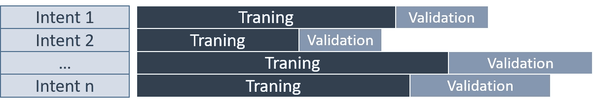
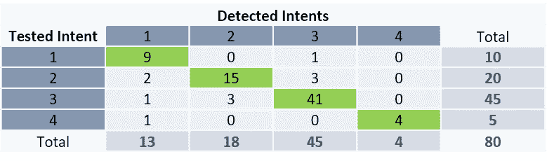

# 在对话式人工智能中，精确和回忆(嗯)不是你最好的朋友

> 原文：<https://towardsdatascience.com/in-conversational-ai-precision-and-recall-are-well-not-your-best-friends-c42e2feb9aee?source=collection_archive---------33----------------------->

## 这些指标实际上是不相关的对话情况下，导致误解和过度自信

为了让对话助手自动响应用户的请求，有必要训练用户正确识别问题，从而触发正确的场景。为此，工业解决方案(即聊天机器人解决方案)大多使用机器学习来执行这种检测，方法是创建一个模型(学习过程的结果)来按意图对请求进行分类。学习方面的文献建议我们通过精度*和召回指标来检查模型的性能。从经验来看，我发现这些指标实际上在对话情况下是不相关的，会导致误解、过度自信，并最终成为分析师的诱饵。我建议使用关键成功指数(CSI ),但由于它仍然不够，通过分析我们的老朋友和新朋友的无偏变异系数来完成这一指标。*

插图照片。照片由 gratisograph-Pexels 提供

# 介绍

在对话式人工智能中，系统必须“理解”用户的请求，然后才能执行所请求的操作(例如，“开灯”、“给我点一份披萨”、“我如何才能关掉电视”等)。).为了做到这一点，这些系统使用了一种机器学习技术，其中包括从具有相同含义的句子分组中自动创建分类模型，这些句子隐含着相同的意思。为此，对话人(即编写对话助手的对话的人)必须监督检测器(分类器)的训练，向其提供一组例句，并按意图(按请求类型)对其进行分组。

天气预报助手的例句

在学习之后，必须对系统进行测试，以确保它足够“聪明”来理解所有的请求。尤其是因为这些系统被用于检测需求的能力，即使需求与预期不同。关于用户请求处理的描述，你可以参考我以前的文章《对话人的对话式人工智能:4 个复杂等级》。

为了测试他的助手，对话人必须问一些不在训练中的问题，并检查系统是否检测到意图，尽管他会引入一些变化，以验证系统能够提取不同的句子。例如由于训练不足而导致的训练缺陷会给用户带来负面影响，因为系统会触发与其初始请求不对应的动作。

不良检测示例

# 该理论

在自动分类中，精度(也称为正面预测值)是所有建议项目中相关信息的比例。召回率(敏感度)是所有相关项目中建议的相关项目的比例[1]。

当对话助手正确回答了 20 次(也称为真肯定或 TP)，执行了 10 次不是请求的动作(称为假肯定或 FP)，没有执行预期动作 40 次(称为假否定或 FN)，则其精度则为 20/(20+10) = 0.667 (66.7%)，其召回率等于 20/(20+40) = 0.334 (33.4%)。能够无错误检测的系统具有等于 1 (100%)的精确度和等于 1 (100%)的召回率。

在训练阶段之后，用一个意图的不同测试短语来测试分类器(然后是下一个)。每个测试的结果根据识别的意图进行排序。

计算二进制系统的精度和召回值(检测到或未检测到)

在多类系统中(在我们的例子中，是多意图系统，因此它涉及所有会话助手)，整体系统精度是所有意图精度的平均值，召回率是所有意图召回率的平均值。这些值被称为精度的宏观平均值和召回的宏观平均值。

多类系统中查准率和查全率的计算

计算每个意向的精确度和召回率，并对总体结果进行平均。真正的肯定结果对应于对意图的正确检测。假阴性对应于我们的意图测试句子给出另一个意图作为结果(其他意图之一)的情况。假阳性对应于给出那个意图的其他意图的句子。真正的否定对应于所有其他没有给出我们想要的结果的测试。

还有另一个指标是精度的微平均值，它对应于不同类别的 TPs 之和除以 TPs 和 FPs 之和。该计算包括对分母中的所有值求和，这导致最终成功率的计算。

为了测试该系统，对话方准备一组测试短语(称为验证数据集)，该组测试短语由不属于训练(称为训练数据集)的短语组成。每个句子都与其中一个意图相关联。

还可以使用自动测试技术，根据取决于所选交叉验证类型的规则，将可用数据分成训练数据和测试数据。在非交叉分离中，选择一个比率将数据分成两组。通常使用 50/50、66/33 或 80/20 的比率。然而，如果数据数量较少，将可用数据分成两个不相交的子集会产生检测偏差。这些偏差可能是拟合不足或误差过大。

将数据分为训练和验证数据的示例

这个问题的一个解决方案是使用交叉验证技术，通过称为 k 折叠的折叠来分离集合。k 折叠建议将数据分离成 k 个折叠。保留一个折叠用于测试，剩余的折叠(k-1)用于训练[2]。在对话人可以直接干预模型的系统中，该测试模式允许调整模型的超参数并在适当的时间(即在过度拟合之前)停止训练。

将数据分成多个文件夹的示例(k = 4)

在具有不平衡意图的系统中(即，每个意图具有不同数量的句子，这在对话解决方案中也是常见的情况)，保持意图中的块比率是很重要的。这种技术被称为分层交叉验证。

在“现成的”对话式人工智能解决方案(即几乎所有的商业聊天机器人解决方案)中，不可能选择这些超参数，系统“自行”设置自己。这种黑盒侧使得很难知道系统是否是工厂预设的，或者它是否使用内部交叉验证和早期关闭功能自动适应。

# 实践

让我们以一个四意图系统为例，它由一个专门为验证而创建的测试集构成。假设它在第一次业务迭代之后被训练，即主题专家已经给出了一组句子，根据他们，这些句子对应于需要自动化的领域的最常见的用户请求。让我们假设测试的第一阶段给出了以下结果:

TEST_1:第一次测试活动的结果

使用测试句子(每个意图 20 个句子)来测试分类器，并且在称为混淆矩阵的表格中记录检测的结果，该表格被分成用于要被测试的意图的行和用于被检测的意图的列。交叉点处的数字对应于测试意图的检测出现次数。

在示例 TEST_1 中，第一意图的 20 个测试短语被正确分类了 16 次，并且发现了 4 个错误。在 80 个测试短语中，59 个短语被全局正确地检测到，21 个导致分类错误。该分类器的平均准确率为 74%，召回率也为 74%。成功率(正确识别的句子/句子总数)给出了 74% (59/80)的结果，这对于第一次迭代来说是相对正确的。

在完成整体训练的第二次迭代之后，用初始测试句子再次测试系统。这一新测试给出了以下结果:

TEST_2:第二次测试活动的结果

新的成功率与之前的培训相同，即 59/80 = 74%。Intent 3 测试的准确率是 100%，召回率是 5%。这组平均值意味着该训练的总体精度为 80%,召回率为 74%,即精度提高了 6%,召回率相同，而结果在 intent 3 测试中急剧恶化，实际上不再被识别。因此，对整体精度的分析给出了肯定的结果，然而由于系统实际上将不再能够回答一类问题，因此用户体验严重下降。只有对每个意图的精细分析才允许在新的训练之后检查系统的发展。

假设分析师在意图 3 上执行了额外的工作来纠正已识别的问题，增加了对这个意图的了解，并执行了一组新的测试。

TEST_3:第三次测试活动的结果

新的成功率为 74%，与其他 2 次试验相同。准确率为 87%，与之前的测试相比提高了 7%，召回率为 74%，这个值在所有测试中都保持不变。对于分析师来说，系统显示了精度的整体进展，这表明系统的改进！通过更详细地分析结果，我们可以看到，意图 3 现在被过度检测，该意图的精度几乎为 20/41 = 49%，低于之前的测试。从用户的角度来看，这最终是最重要的，系统给人的印象是系统地触发相同的动作(50%的请求和 25%的请求是合理的)。

因此，对精确度总体变化的分析不会发现任何分类错误。在这些病例中，对召回的分析也是不确定的，因为它在 3 次测试中没有变化。从测试者的角度来看，未检测或错误检测之间的区别对于分析结果和确定要对培训执行的操作(创建新的意图、将它们组合在一起、向意图添加句子……)非常重要。

然而，从最终用户的角度来看，重要的是系统在大多数情况下都能正确响应，并且对这些值的整体分析会遗漏那些会影响用户体验的错误。当然，分类器的性能必须是全局平衡的。然而，对于不太频繁的请求，可以设想不太好的检测。然后有必要将结果与请求的频率相关联，但这是另一个主题。

# 关注不平衡的系统

测试分类器的性能时，考虑测试集的平衡并尽可能在每个意图中使用相同数量的测试值是很重要的。

为了突出这一点，让我们尝试另一个例子。我们正在执行检测测试，但我们没有一个平衡的系统，因为测试句子的数量根据意图而变化:意图 1 只有 10 个测试句子，意图 2 有 20 个，意图 3 最完整，有 45 个句子，而意图 4 只有 5 个句子。

该测试给出了以下结果:

第一次测试的结果

我们有以下指标:准确率= 86%，召回率= 84%，成功率= 86%。为了平衡结果，有必要引入加权指标的概念。不同类别的各个指标的值必须乘以用于测试的句子的比率。意向 1 的比例是 10/80 = 0.125。加权后的指标是加权精度= 87%，加权召回率= 86%。

我们修改培训，试图改善我们的系统。

第二次测试的结果

这些指标具有以下值:对于 90%的成功率，精确度= 80%，召回率= 89%。加权准确率为 93%，加权召回率为 90%。在没有加权的计算中，我们会看到精度下降了 6%,而系统总体上有所改善，这由加权值显示，因为我们看到精度提高了 7%。这个非常重要的区别来自于实例 4 的权重与其他类相同，而这个实例的测试数量很少。实例 4 的测试数量少意味着一个坏结果的影响给了这个实例的测试结果很大的权重，这里突出显示了这一点。

# 那么选择哪个(些)指标呢？

我们已经看到，精度和召回指标没有突出局部分类错误，这可能会对整个系统不利。在 TEST_3 的情况下，系统在四分之一的请求中检测到不良意图，这将最有可能导致对话助手的拒绝。此外，精确度和召回率集中在 2 个不同的轴上:第一个轴强调假阳性问题，而第二个轴强调假阴性问题。对于用户来说，这仍然是一个错误的答案，因此我们需要一个新的指标来将这两个轴组合在一起。

这个指标是存在的(尽管它不太明显),而且它是关键成功指数(CSI ),在其他地方的天气预报中被广泛使用。它也被称为威胁分值 TS。CSI 是用于分类检测的性能验证措施。它等于正确事件预测的总数(TP)除以错误检测的总数(FN + FP ),再加上 TP 就得到一个性能比。

为了在上线前完成我们的测试，我们正在进行一项新的培训，在全球范围内改进我们的模型，将其置于完全可操作的水平，准确率为 90%，召回率为 89%，成功率为 89%。

TEST_4:第四次测试活动的结果

然后我们计算几个指标，你会发现这些指标列在这个维基百科页面上。

不同测试的性能指标值

对该表的研究表明，没有指标真正突出了 TEST_2 和 TEST_3 分类器的问题。只有指标 CSI、F1-score、Matthews 相关系数(MCC)和 Fowlkes-Mallows 指数突出了 TEST_2 分类器的质量下降。没有检测 TEST_3 问题的指标。CSI 指标最接近整体系统性能的预期，这使得它比精确度、召回率甚至准确度更相关。

由于指标没有给出任何指示，我们不得不查看每个意图的价值测试的细节，以确定哪些意图是有问题的。

按意图的分类器得分

由于这项工作在大量的测试和许多目的上是单调乏味的，我建议使用一个叫做变异系数(或相对标准偏差)的离差指标。该指标定义为标准偏差与平均值的比率[3]。这个没有单位的数字允许在几个系列之间进行比较，这对于自动化测试来说很有趣。然而，考虑到样本数量较少，必须调整该值。这一指标的公式如下:

无偏变异系数

在我们的 4 次测试中，该指标的计算给出了精度、召回率和 CSI 的以下结果:

精确度、召回率和 CSI 指标的调整变异系数的计算结果，并突出显示最大值

因此，超过这 3 个值之一的阈值(例如 20%)可以用于通知分析师培训质量问题。这一指标补充了业绩指标的经典分析，例如整体精确度低。当达到阈值时，建议更仔细地分析结果，以便确定有问题的意图，从而了解如何修改训练，或者甚至拒绝新的训练。

# 结论

在会话助手领域，系统拒绝的原因之一是它们不能正确识别请求。因此，在发布助手并提供给用户之前，测试助手的性能非常重要。我们已经看到了如何计算多类系统的精度和召回值，以及当测试句子的数量不平衡时，对这些值进行加权是多么重要。然而，机器学习中最常用的精度和召回指标不允许我们得出一个系统是否在一个或多个意图上不包含错误的结论，因为我们只是在研究一个全局值。

因此，我邀请您通过添加 CSI 指标来完成您的计算，CSI 指标与用户期望更相关，即尽可能经常正确响应的助手(无论 I 型或 II 型错误)。通过计算精确度、召回率和顾客满意度指数的调整变异系数(无偏)来完成本指标。将警报阈值设置为这三个值中的最大值，可以让您突出显示学习问题，而不必逐个检查指标，从而节省分析训练迭代的时间。

# 参考

[1].精确和召回—维基百科—[https://en.wikipedia.org/wiki/Precision_and_recall](https://en.wikipedia.org/wiki/Precision_and_recall)
【2】。交叉验证—维基百科—[https://en . Wikipedia . org/wiki/Cross-validation _(统计)](https://en.wikipedia.org/wiki/Cross-validation_(statistics))
【3】。变异系数—维基百科—[https://en.wikipedia.org/wiki/Coefficient_of_variation](https://en.wikipedia.org/wiki/Coefficient_of_variation)