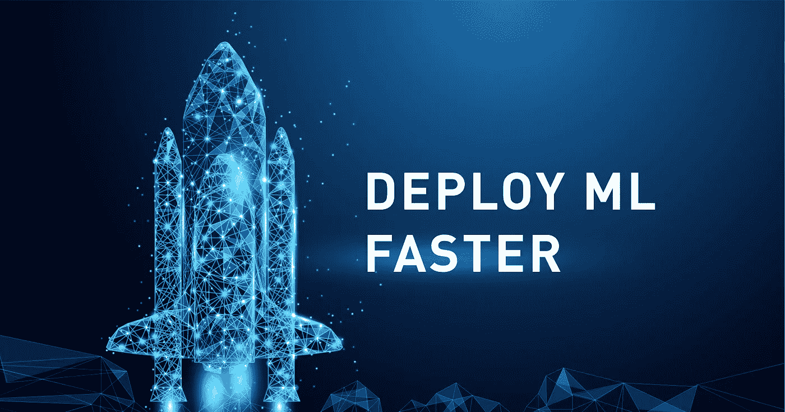
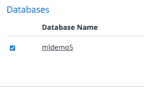
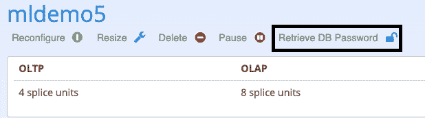
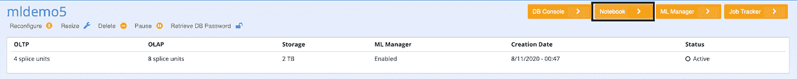
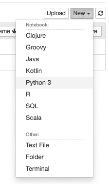
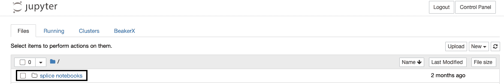
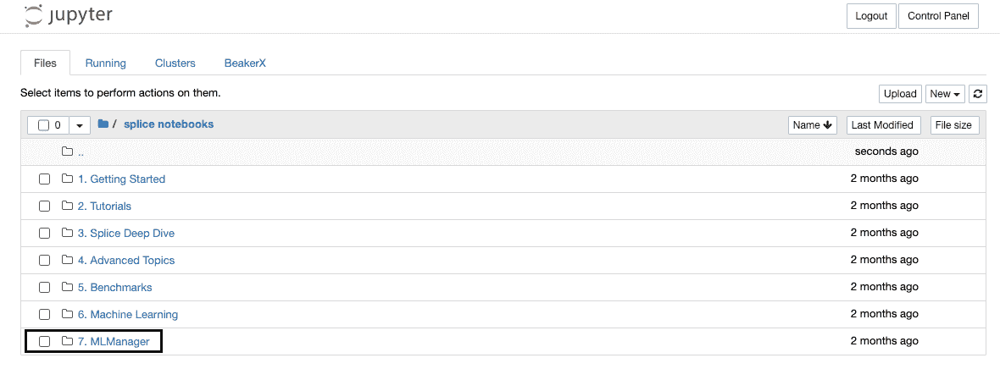

# 数据库机器学习—变得简单

> 原文：<https://towardsdatascience.com/in-database-machine-learning-made-simple-6b3284fa77ed?source=collection_archive---------18----------------------->

## 包含代码的端到端指南

照片由[皮卡](https://stock.adobe.com/contributor/206257799/pickup?load_type=author&prev_url=detail)在[土坯库存](https://stock.adobe.com/)上根据许可从 Zer0 到 5ive 拍摄

**免责声明:我是拼接机*的机器学习负责人

如果你点击了这篇文章，我不需要说服你，机器学习是一个改变游戏规则的工具。构建 ML 模型现在是可访问的、容易的、初学者友好的(大部分时间)。然而，部署这些模型是另一回事。简单性、可伸缩性和推理速度只是您必须克服的一些障碍。

创建 ML 模型的最大问题之一是，模型是在对部署无用的环境中构建的。也许你已经用 Python 启动了单实例 Jupyter 笔记本。您可以集成 Spark 进行大数据处理，这很好，但由此产生的推理速度非常慢。也许您已经用 Flask 创建了一个将您的单个模型投入生产的管道，这是可行的，但是它缺少可再现性(和潜在的可伸缩性)。也许 Python 对于您的实时用例来说太慢了。

根本的问题是，机器学习部署是一个年轻和不成熟的领域，它还没有开发出数据库或软件开发所拥有的工具包。例如，数据库广泛可用，稳定，(有时)可扩展，速度极快。正因为如此，我们将借鉴数据库工程师已经完成的工作，并利用他们的工具为我们服务。这里，我们将重点关注使用横向扩展 RDBMS 进行模型部署。

在本文中，我将带您使用熟悉的工具构建一个机器学习模型，并将其部署到数据库中。为了获得完整的体验，你可以在这里创建一个免费的沙盒环境[，和我一起浏览这些例子。](https://cloud.splicemachine.io/register?redirect=%2F_%2Fdashboard%2Factivity)

**TL；**博士笔记本位于[这里](https://github.com/Ben-Epstein/Medium-Aritcles/tree/master/in_db_ml)，有输出的笔记本的要点是[这里](https://nbviewer.jupyter.org/gist/Ben-Epstein/66a7a15c86d8d83fd8f64f2b75a283e7)。要直接跳到本文的模型部署部分，请单击这里的[按钮](#1b95)

# 获取环境

首先，在这里创建一个免费的沙盒环境[。准备好数据库后，单击数据库名称进入仪表板。](https://cloud.splicemachine.io/register?redirect=%2F_%2Fdashboard%2Factivity)

数据库名称

在那里，您可以单击“检索数据库密码”来获得您的登录。

获取数据库用户名和口令

一旦你有了，点击“笔记本”来启动你的 Jupyter 笔记本实例。

启动您的 Jupyter 笔记本

您将被提示输入您的用户名和密码，这是您刚刚在仪表板上看到的。这需要一分钟左右的时间。

现在您已经进入了笔记本环境，您将创建一个新的笔记本，选择 Python 3 作为您的内核。使用的整个笔记本将在[这里](https://github.com/Ben-Epstein/Medium-Aritcles/tree/master/in_db_ml)可用

您将构建一个 Spark 模型来预测[虹膜数据集](https://scikit-learn.org/stable/auto_examples/datasets/plot_iris_dataset.html)，以保持演示简短，但这可以扩展到任何数据集(任何大小)。

选择你的环境

首先，您将创建您的 Spark 会话。配置设置是在幕后为您处理的，所以只需运行下面几行就可以开始了。

创建 Spark 会话

在任何时候，您都可以通过运行以下代码来检查您的 Spark 控制台

获取 Spark UI

这将返回一个交互式窗口，您可以在其中观察您的 Spark 作业，并在它们运行时深入研究它们。

既然已经有了 Spark 会话，就可以获得 MLFlow 会话和本机数据库连接了。你可以在这里了解更多关于 MLflow [的信息，在这里](https://www.mlflow.org/docs/1.8.0/tracking.html)了解更多关于原生 Spark 数据源[的信息。](https://pysplice.readthedocs.io/en/latest/splicemachine.spark.html)

MLFlow 和 NSDS 的设置

这些行将自动配置您的 MLflow 会话并将其连接到数据库。

最后，您将开始您的 MLflow 实验，并运行以表明您即将构建您的第一个模型。就像使用 Spark 一样，您可以使用类似的命令查看 MLflow UI。

MLFlow 开始实验并运行

# 建立模型

现在您已经连接了，您将加载数据并构建您的第一个模型。这一部分将会更短，因为它侧重于部署，但是您可以通过单击“拼接笔记本”文件夹，然后单击“7”来访问您的试用集群的 Jupyter 笔记本中更长、更深入的示例。MLManager "

访问拼接笔记本文件夹

访问更多 MLManager 示例

现在，您将加载 iris 数据集，并将其转换为用于训练的 Spark 数据帧。

您将在这里为分类构建一个简单的决策树模型。

建立火花模型

如果你愿意，你可以在 MLflow 中记录一些信息来跟踪你做了什么。至关重要的是，您将把您的模型记录到 MLflow 中，以便您可以部署它。

将参数、度量和模型记录到 MLFlow

# 部署您的模型

就是这样！您已经创建了一个简单的 Spark 模型。现在是时候将它部署到数据库中，并利用 SQL 与它进行交互。您将使用 deploy_db 函数来实现这一点。这个函数有许多可选参数，您可以在这里深入研究[，但是现在，简单地说:](https://pysplice.readthedocs.io/en/latest/splicemachine.mlflow_support.html#splicemachine.mlflow_support.mlflow_support._deploy_db)

*   方案名:要部署到的表的方案
*   表名:要部署到的表
*   运行 ID:存储模型的运行 ID
*   创建模型表:是否为我们创建表
*   Df:作为表格基础的数据帧
*   主键:表的唯一标识符列
*   类别:类别标签名称(鸢尾属、弗吉尼亚属、刚毛属)

部署 ML 模型

就这么简单。幕后发生的事情是，作业被提交给代表您处理请求的服务器。最后一行调用 watch_job 获取从服务器自动传入的日志，这样您就可以实时看到发生了什么，并在出现问题时进行调试。

现在您已经部署了您的模型，您将进行一些预测。通过用%%sql 启动单元格，您可以在笔记本中运行 SQL。这是一个定制的[魔术](https://www.tutorialspoint.com/jupyter/ipython_magic_commands.htm)，允许你直接对你正在工作的拼接机器数据库运行 SQL。

使用 SQL 调用模型

最后，你可以停止你的火花会议，结束你的跑步。这不会影响 SQL，并且您可以通过插入新行来继续与部署的模型进行交互。

结束我们的会话

# 包扎

就是这样！您已经创建了您的机器学习模型，对其进行了跟踪，并将其部署到数据库中，以提高可扩展性、可用性和速度。这个简单的例子可以扩展到 Scikit-learn(可以在文件夹“7。MLManager”)或大规模数据集和复杂管道的困难问题。您甚至可以用触发器将模型(表)链接在一起。要查看其他一些示例，请参见 **7 中的[笔记本实例](http://cloud.splicemachine.io)附带的 **splice_notebooks** 文件夹。MLManager** 文件夹。

感谢您坚持使用我的例子！如果你有任何问题，请在文章中发表，我一定会回复。