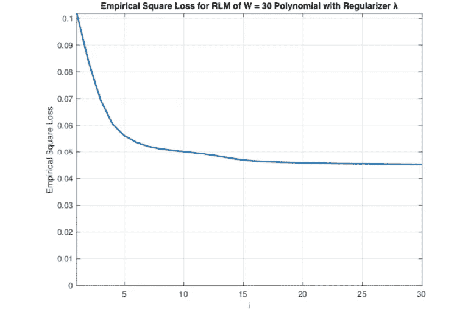
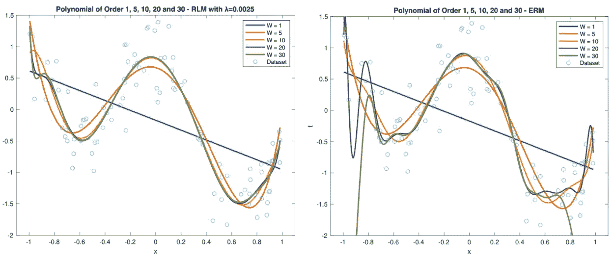

# 基于经验风险最小化的正则化最小二乘算法的深入分析

> 原文：<https://towardsdatascience.com/in-depth-analysis-of-the-regularized-least-squares-algorithm-over-the-empirical-risk-minimization-729a1433447f?source=collection_archive---------32----------------------->

作者图片—加拿大桑德湾

本文将介绍正则化损失最小化(RLM)和经验风险最小化(ERM)的关键概念，并通过 MATLAB 实现最小二乘算法。然后将使用 RLM 和机构风险管理获得的模型进行相互比较和讨论。

我们将使用多项式曲线拟合问题来预测该数据的最佳多项式。最小二乘算法将使用 MATLAB 逐步实现。

在这篇文章结束时，你会理解最小二乘算法，并意识到 RLM 和 ERM 的优点和缺点。此外，我们将讨论一些关于过拟合和欠拟合的重要概念。

# 资料组

我们将使用一个简单的具有 N = 100 个数据点的输入数据集。这个数据集最初是由 Ruth Urner 博士在她的一次机器学习课程作业中提出的。在下面的存储库中，你会发现两个 TXT 文件: [dataset1_inputs.txt](https://github.com/jaimedantas/least-squares-regresion/blob/main/dataset/dataset1_inputs.txt) 和 [dataset1_outputs.txt](https://github.com/jaimedantas/least-squares-regresion/blob/main/dataset/dataset1_outputs.txt) 。

 [## jaimedantas/最小二乘回归

### 正则化最小二乘算法用于回归以寻找机器学习模型。这个实现…

github.com](https://github.com/jaimedantas/least-squares-regression) 

这些文件包含输入和输出向量。使用 MATLAB，我们将这些数据点绘制成图表。在 MATLAB 上，我在主页>导入数据中导入它们。然后，我创建了绘制数据点的流程脚本。

您应该会看到如下所示的图表。

资料组

# 最小平方

最小二乘法用于解决使用平方损失法的线性回归中的 ERM 问题。在继续讨论实现本身之前，我推荐[这篇](https://en.wikipedia.org/wiki/Least_squares)快速文章。

# 经验风险最小化(ERM)

ERM 是机器学习中一个广为人知的概念，我建议在开始实际实施之前，先看一下关于 ERM 的解释。ERM 用于对学习算法的性能进行分类，我们可以通过找到一个向量 **w** 来解决 ERM 优化问题，该向量最小化下面的公式【1】。

上式中， **X** 为设计矩阵， **t** 为输出向量。我们想找到多项式拟合问题的最佳拟合。为此，我们将计算 W = 1、2、…、30 阶多项式，并分析经验平方损耗，以了解哪种多项式阶最适合我们的数据。我们问题的设计矩阵 **X** 由下式给出:

我们可以通过求解下面的线性方程来找到多项式 **w** 。

如果我们认为**X’X**是可逆的【1】，上面的方程总是有解的。同样，如果你想知道为什么会这样，你可以阅读[这篇关于最小二乘法的解释](https://en.wikipedia.org/wiki/Least_squares)。解决方案由下面的等式给出。

这就是 MATLAB 派上用场的地方。我们需要求解上面的线性方程来找到并测试我们的模型。

为了在 MATLAB 上求解这个方程，我们将通过矩阵相乘和求逆来手动实现运算，而不是使用有效的算法来求解线性方程。需要指出的是，这可能不是理想的方法，因为效率较低。为了计算解决方案，我首先计算 W = 1 的设计矩阵，并计算第一个多项式。

然后，我创建了一个循环来计算剩余的 **Wᵢ** ，并将它们存储在名为*多项式 _wi* 的单元数组中。30 个设计矩阵也存储在单元阵列*设计矩阵*中。

现在，我们需要计算*多项式 _wi* 上所有 **wᵢ** 多项式的经验平方损耗。我们的问题的数据点数是 N= 100。按照这个脚本，我创建了一个循环来计算每个多项式 **wᵢ** 的 ERM。我还打印了使我们的经验平方损失最小的多项式的阶。

我们算法的输出如下图所示。

[ERM.m](https://github.com/jaimedantas/least-squares-regresion/blob/main/code/ERM.m) 脚本的输出

因此，21 阶多项式的经验平方损失最小。现在，让我们分析下图中所有多项式的经验平方损耗图。对于这个分析，我绘制了从 W = 1 到 W = 30 的经验平方损失向量 **E** 。

缩小比例下的经验平方损失

查看 ERM 的经验平方损失，我们可以看到,**多项式 W= 21 确实是数据集**的最佳拟合。我们还可以看到，在 W = 6 之后，经验损失几乎变得稳定，直到 W = 21 时略有下降，而在 W = 23 之后，我们的模型开始过度拟合，以至于经验损失飙升。当我们在如下图所示的 MATLAB 命令窗口中执行命令**【ERM，W】= max(E)**时，我们看到对于订单 27，平方损失超过 395。

最大经验平方损失

下图显示了 W = 21 阶多项式相对于数据集的曲线。

21 阶多项式与数据集

分析上图中的曲线本身后，我们可以看到，尽管 W= 21 阶的多项式的经验损失最小，但它过度拟合了数据。因此，仅将经验损失作为选择最佳拟合的唯一指标可能不是最佳方法，因为它会导致我们选择过度拟合模型。

# 正则化损失最小化(RLM)

现在，让我们使用正则化最小二乘多项式回归重复上一步。我建议在阅读这部分之前先看一下[关于 RLM 的解释](https://en.wikipedia.org/wiki/Regularization_(mathematics))。对于 RLM，我们使用正则化子λ来计算向量 **w** 。对于正则化最小二乘回归，我们可以使用下面的等式[1]来计算 **w** 。

注意，我们使用正则化子λ乘以 **X.** 阶的单位矩阵

如果我们将 **w** 分离出来，我们可以得到下面的线性方程:

同样，我将在 MATLAB 上手动实现这些操作来求解这个线性方程。这种情况下的设计矩阵与为 ERM 定义的相同。

## 正则化子λ的重要性

让我们首先分析在我们的机器学习模型的计算中有一个正则化子的后果。为了做到这一点，让我们分析 W = 30 阶的多项式，看看它在使用不同的λ值时的表现。

我们将对区间λ进行这种分析，其中 ln(λ) = -1，-2，…,-30。因此，λ的值将由下式给出

首先，我计算了 30 阶多项式的设计矩阵的值。

与我在 ERM 上所做的类似，我创建了一个循环来计算λ的所有值的 **wᵢ** 。我还计算了 RLM 的经验平方损失，这与 ERM 相同。

对于每次迭代，λ的值被更新。

带正则项的 30 阶多项式

我们算法的输出如下图所示。

[RLM.m](https://github.com/jaimedantas/least-squares-regresion/blob/main/code/RLM.m) 脚本的输出

因此，30 阶多项式(其中 ln(λ)= 30，即 i = 30)最适合此数据。下图显示了带有 **i** **= 30** 的 **W = 30** 阶多项式对数据集的绘图。

i = 30 的 30 阶多项式和数据集

正如在 ERM 上看到的，我们的 30 阶 RLM 模型和 i = 30 也过度拟合了数据。

# ERM vs RLM

现在，让我们比较一下 ERM 和 RLM 的结果。当我们分析 RLM 的等式时，我们可以得出结论，对于λ的大值，即 *i* 的小值，我们具有较大的经验平方损耗。这意味着对于小值的 *i* ，我们得到一个**欠拟合**模型。另一方面，对于λ的小值，即 *i* 的大值，我们得到较小的经验平方损耗。然而，这种行为会导致**过度拟合**模型。我们可以在下图的右图中注意到这一点。此外，λ的大值也有助于减少高阶多项式的过拟合问题。这可以从下图的右图中看出。

左边是 W = 2(欠拟合)和 W = 27(过拟合)阶多项式的 ERM，以及 i = 2 和 i = 26 的 30 阶 RLM 多项式。(剧情来自 [RLM_ERM.m](https://github.com/jaimedantas/least-squares-regresion/blob/main/code/RLM_ERM.m) 剧本)

谈到 EMR 曲线(在经验平方损失图中用橙色表示)，我们也有类似的结果。然而，在这种情况下，我们改变多项式的阶数，直到 W = 30。对于阶数较小的多项式，我们得到一个具有较大经验平方损失的**欠拟合**模型，而对于阶数较大的多项式(本例中为 W > 23 ),我们可以**过拟合**我们的数据，即使我们得到一个较小的经验平方损失。这可以在上图的左图中看到。注意，RLM 中的正则化有助于减少较高阶多项式的过度拟合。因此，分析两种解决方案的经验平方损失图对于选择最适合我们数据集的模型至关重要。

此外，如果我们分析极限λ→0 的正则化最小二乘，即极限 i→∞，我们看到 RLM 方程的正则化项消失，使得 RLM 与 erm 相同。当我们分析 i= 12 的 10 阶 RLM 多项式时，这一点得到了证明。由于这种情况下λ值非常小(0.000006144)，我们可以注意到，该多项式的曲线与 10 阶 ERM 多项式大致相同。

10 阶 ERM 多项式和 10 阶 RLM 多项式，i = 12。请注意，这些曲线相互重叠。(剧情来自 [RLM_ERM.m](https://github.com/jaimedantas/least-squares-regresion/blob/main/code/RLM_ERM.m) 脚本)

最后，与 W = 30 阶的 ERM 相比，RLM 的 W = 30 阶和 i = 30 阶的模型具有明显更小的经验平方损失(分别为 0.0453 和 4.7873)。这支持了**正则化有助于减少过拟合**的结论。此外，RLM 的 W = 30 次和 i = 30 次多项式对于 ERM 具有大约相同的 W = 21 次经验平方损失。

> 毕竟哪种模式最好？

现在我们有了所有这些数据，我们可以为我们的问题选择最好的模型。目标总是找到一个小阶多项式，这样我们就不会过度拟合我们的数据。此外，订单必须足够大，这样我们就不会吃不饱。

让我们绘制并查看订单 W= 1、5、10、20、30 时的 ERM 和 RLM 曲线。这一次，我们将固定正则化因子λ = 0.0025。脚本 [Visualization.m](https://github.com/jaimedantas/least-squares-regresion/blob/main/code/Visualization.m) 用于绘制两条曲线。

左边是 RLM 和数据集的 1、5、10、20 和 30 阶多项式，右边是 RLM 和数据集的 1、5、10、20 和 30 阶多项式

当我们分析 EMR 和 RLM 的图表时，我们肯定能注意到它们之间的差异。较大订单的 ERM 模型具有很大的变化，并且使它们自己过多地适应训练数据。这意味着，随着模型阶数的增加，过度拟合的风险也会增加。当我们研究 W = 10 阶的多项式时，尤其如此。虽然 RLM 多项式没有很大的变化和差异，但 ERM 多项式以一种导致过度拟合的方式适应数据。因此，与 RLM 相比，欧洲汇率机制的实际损失看起来较小。当我们比较这两个经验损失时，很容易观察到这一点。

为了更好地形象化这种行为，我们可以分析下面的条形图，其中显示了 W= 1、5、10、20 和 30 阶多项式的 ERM 和 RLM 的经验损耗。当我们查看它时，我们可以证明，除了 W= 30 多项式，ERM 的经验平方损失小于 RLM。

正则项λ = 0.0025 的 RLM 的经验平方损失和 W = 1、5、10、20 和 30 的 ERM

在表示数据时，RML 模型中的正则化因子起着重要的作用。**正则化模型对数据集更精确，因为它们不会像 ERM** 那样过度拟合数据。当我们看到下图时尤其如此。在左侧，我们有不同λ值的 RLM 的经验平方损耗。注意，当我们降低λ的值时，我们也降低了 W > 6 的经验损耗。

在缩小的比例中，左边是具有不同正则化子的 RLM 的经验平方损失，右边是具有不同正则化子的 RLM 的 10 阶多项式。(剧情来自与 [RML_For_W_Risk.m](https://github.com/jaimedantas/least-squares-regresion/blob/main/code/RML_For_W_Risk.m) 和 [RML_For_W_Poly.m](https://github.com/jaimedantas/least-squares-regresion/blob/main/code/RML_For_W_Poly.m) 剧本)

在上图的右侧，我们可以看到不同λ值的 W= 10 阶多项式。随着λ值的减小，我们增加了模型的适应性。因此，非常小的λ值可能导致过拟合，而大的λ值可能导致欠拟合。

**鉴于这些事实，最适合该数据集的模型是 W= 5 阶的 RML 多项式**。多项式如下所示。

**0.6721-0.5555 x-6.5428 x-0.9711 x+6.5883x⁴+0.7647x⁵**

这是因为这个多项式阶次小，经验损失小。此外，当我们分析 ERM 和 EML 的曲线图时，我们可以看到这个模型没有过度拟合数据。此外，W= 5 阶的 ERM 多项式似乎也符合数据而没有过度拟合。

λ = 0.0025 的 W = 5 阶多项式

# 结论

我们看到，使用 RML 可以降低我们的模型的整体复杂性，并避免过度拟合。然而，由于我们现在有一个新的参数λ要确定，RML 模型计算起来更加复杂。

在选择模型时，我们应该在分析中使用的另一个重要特征是经验平方损失曲线。我们还可以得出结论，经验平方损失最小的模型并不总是我们数据的最佳解决方案。此外，在参数λ和我们预测的多项式的阶数之间找到一个平衡在这个分析中是至关重要的。

数据欠拟合和过拟合是当今数据科学家面临的一个极其常见的问题，为给定问题找到理想的解决方案需要对可能的模型进行详细分析。

感谢阅读！

# 关于我

我是约克大学的一名硕士研究生，骨子里是一名软件工程师。在过去的十年里，我一直在软件开发、云计算和系统工程等领域的几个行业工作。目前，我正在研究云计算和分布式系统。

如果你愿意，你可以在我的网站上查看我的作品。

# 参考

[1] Shai Shalev-Shwartz 和 Ben-David。理解机器学习:从理论到算法。剑桥大学出版社，2014 年。DOI:10.1017/CBO9781107298019。网址:[https://www . cs . huji . AC . il/~ shais/understanding machine learning/understanding-machine-learning-theory-algorithms . pdf](https://www.cs.huji.ac.il/~shais/UnderstandingMachineLearning/understanding-machine-learning-theory-algorithms.pdf)