# 利用数据科学深入分析联合国可持续发展目标的进展

> 原文：<https://towardsdatascience.com/in-depth-analysis-of-un-sustainable-development-goals-progress-using-data-science-c39a208899e6?source=collection_archive---------36----------------------->

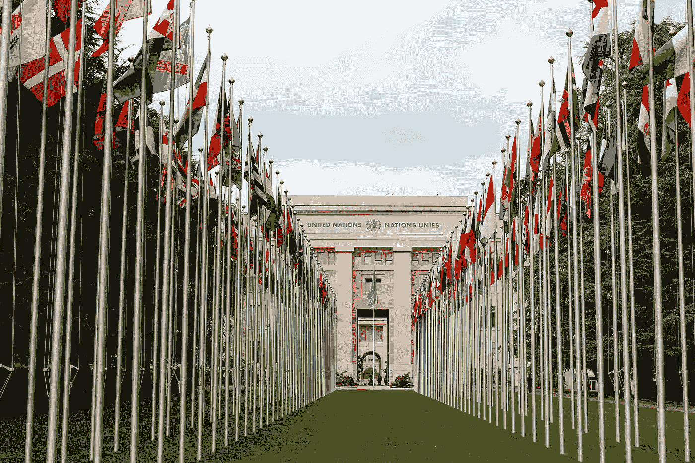

照片由 [Unsplash](https://unsplash.com/s/photos/united-nations?utm_source=unsplash&utm_medium=referral&utm_content=creditCopyText) 上的 [Mat Reding](https://unsplash.com/@matreding?utm_source=unsplash&utm_medium=referral&utm_content=creditCopyText) 拍摄

## 数据新闻

## 使用网络搜集、探索性数据分析、时间序列分析和自然语言处理/软余弦矩阵深入探究 17 个可持续发展目标的合作关系。

2030 年议程主张通过加强全球伙伴关系，重新致力于人类、繁荣、地球与和平。可持续发展目标是 2015 年在该议程中设定的，此前十年的千年目标以发展中国家为目标。这一宣布已经过去五年了，所以我认为这是对合作关系(这是这一变化的最大驱动力)做一些初步分析的好时机。对于那些不熟悉这些目标的人，你可以在这里找到他们的陈述、目标和指标的摘要[。](https://sdgs.un.org/goals)

虽然有 17 个目标，但每个目标都可以分为三大类(引自[来源](https://unsdg.un.org/sites/default/files/2019-11/UNSDG-SDG-Primer-Report.pdf)):

> 1)它应支持各国投资于附加值更高的产品和部门、技术、多元化经济和更高的生产率，所有这些都应创造高质量的就业和生计(**可持续发展目标 7 至 15 强调了与这种转型相关的关键问题**)。
> 
> 2)只有这样，各国才能满足其社会最紧迫的需求，包括消除极端贫困(**可持续发展目标 1 至 6 反映了这一社会议程和以人为本的发展方式，是巩固和加快可持续经济增长所必需的**)。
> 
> 3)最后，2030 年议程首次承认，要实现这一转变，在能力、合作和资源方面需要实现巨大飞跃(**可持续发展目标 16 和 17 谈到了在国家内部和国家之间加强社会契约的手段**)。

基于以上所述，我认为应该有跨越类似目标的合作伙伴，以及在援助类型/这些目标的地理覆盖范围方面的相似性。我收集的数据可以在[联合国可持续发展目标伙伴关系平台](https://sustainabledevelopment.un.org/partnerships/)上找到。它显示了 4585 个独特的合作伙伴，总共约有 14249 个合作伙伴。我使用的栏目如下所示(合作关系示例[此处](https://sustainabledevelopment.un.org/partnership/?p=36763)):

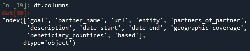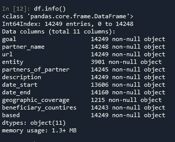

所有数据、交互式图表和脚本都可以在我的 [GitHub repo](https://github.com/andrewhong5297/SDG-Analysis) 中找到。

## **本文将探讨以下问题:**

1.  提供者/受益者的地理覆盖和交叉覆盖是什么？
2.  谁是顶级实体和次级合作伙伴？
3.  这些年来，伙伴关系的势头发生了怎样的变化？
4.  每个目标的伙伴关系之间的关系是什么？重叠是我们所期望的吗？
5.  每个目标的资源援助有多不同？

# **地理覆盖:**

让我们先来看看哪些国家是每个目标的最大受益者。受益者的数据有以下几种形式:

```
ChinaItalyMexicoMoroccoSouth AfricaSpainUruguay
```

我在大写字母上使用了`re.findall`，然后创建了一组扩展列表来查找唯一的国家。由于一些国家有多个单词(如“南非”)，它们将显示为两个不同的国家，考虑到这一点，有 234 个不同的受益人。大约 7000 个伙伴关系没有在他们的网页上列出受益人，所以这个数据可能略有偏差。

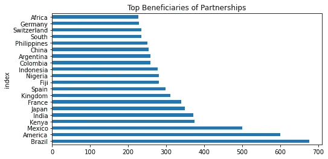

为了获得跨国报道，我使用了`based`栏。只有 2000 个伙伴关系列出了它们的所在地，所以这只是整个数据集的一小部分。

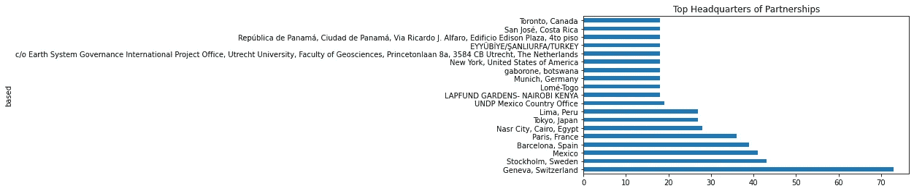

*我真希望我能为所有 14249 合作伙伴完成[总部，受益人]配对，因为这将让我们非常清楚地了解谁在帮助谁。*

# 目标、实体和合作伙伴之间的关系:

大多数合伙企业列出了主要实体关系，大多数列出了额外的次级合伙人。合伙企业中有 607 个独立实体和 13165 个独立子合伙人。

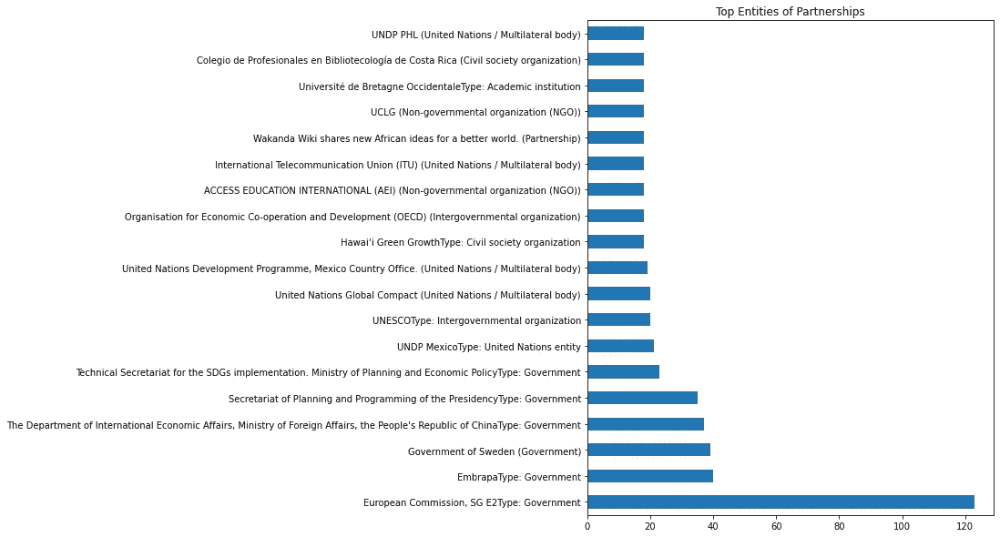

你可以从上面看到欧盟委员会的推动，尽管 120 是 14249 的一小部分。大多数实体都与联合国有某种联系。

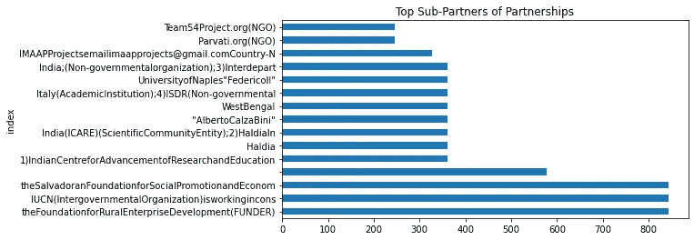

有些名字只是为了更好看而缩短了

IUCN 是国际自然保护联盟(T2)，这是有道理的。我找不到资助者，我能找到的最接近这个名字的组织[来自印度](https://www.frendfoundation.org/)，专注于印度女性创业。上图中有不少来自印度的子合作伙伴，**这让我相信印度是推动组织合作的领导者。**

# **过去五年的目标发展势头:**

在进入时间序列分析之前，我在清理时发现，大约 400 个合作伙伴有某种日期输入错误，我无法轻易修复，但是，它们平均分布在每个目标的 30-50 个左右。总共有 712 个正在进行的项目，我用结束日期`12–31–2030`来代替，作为这个分析的占位符。

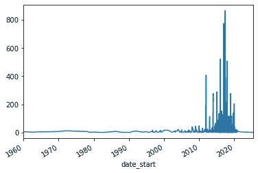

每年都开始合作

从这张图表中我们可以看出，一些伙伴关系早在 2030 年议程制定之前就已经存在。我的猜测是，一些合作伙伴是在该计划宣布后加入的，并且已经存在/持续了很长时间。

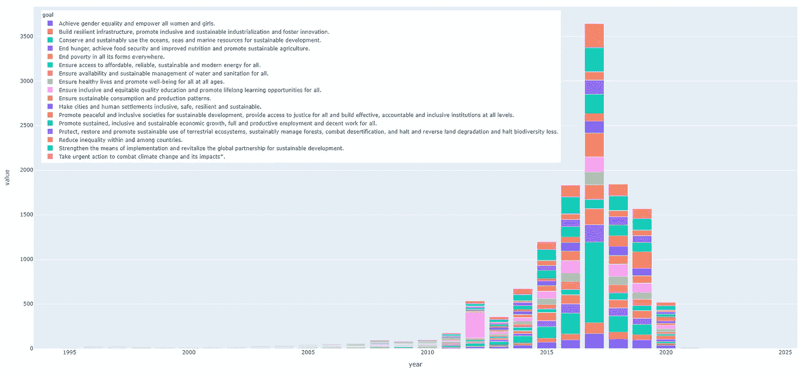

合作伙伴关系每年都以目标开始。颜色重复，但在图例中是从下到上绘制的。

伙伴关系的势头显然有点停滞，大多数都是在 2017 年开始的。这是概念上的，如果我们把它看做总合伙企业的百分比:

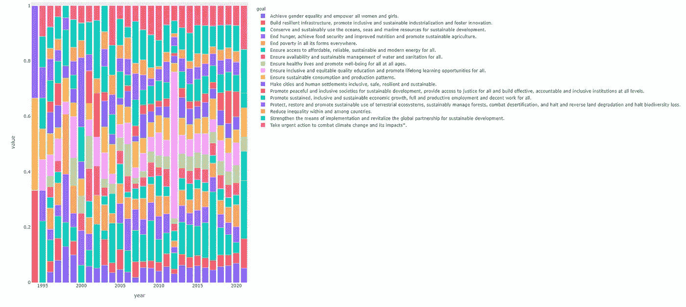

每年开始的项目占目标的百分比。颜色重复，但在图例中是从下到上绘制的。

在试图断定势头已经下降之前，我们还应该研究一下合作关系的结束日期。一些伙伴关系可能会比其他伙伴关系产生更大的影响，我会把钱投在那些持续时间最长的伙伴关系上。

按类别分列的每年结束的项目:

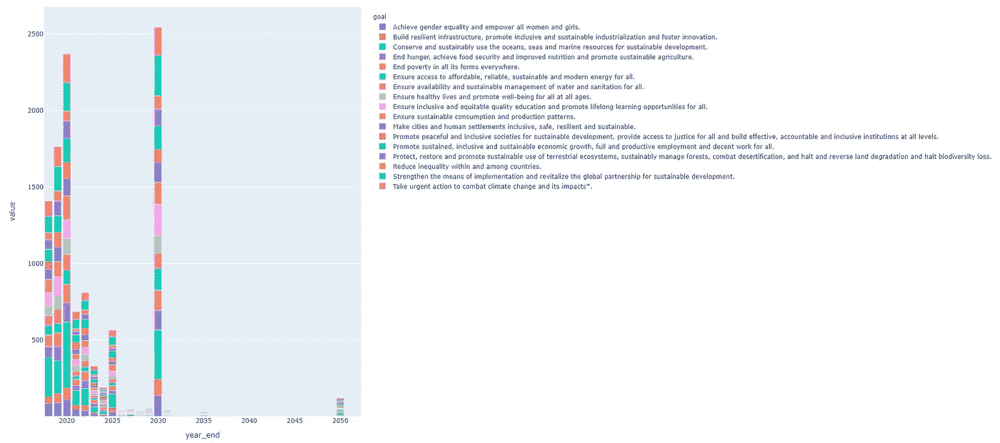

712 个正在进行的项目被归类为 2030 年底，其中一些可能会延长更长时间。尽管如此，仍有超过 1500 个项目将在 2030 年结束。

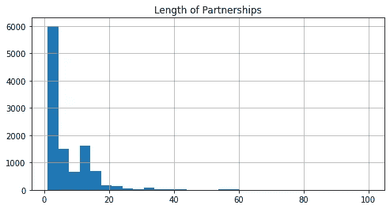

大多数项目持续时间在 1-5 年之间，从条形图中我们可以看到，到 2021 年，几乎三分之一的现有项目将会结束，到 2025 年将会增加到一半。为了保持目前的势头，我们需要每年看到至少 1000 个新的合作伙伴。我确信新冠肺炎对 2020 年的注册产生了影响，事实上，*今年大多数合作伙伴在描述中都提到了新冠肺炎。*

# **研究各目标之间的关系:**

首先，让我们看看哪些目标通常由合作伙伴关系共同涵盖:

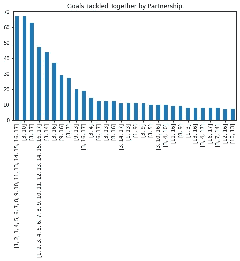

此处显示的前 30 名

许多伙伴关系试图同时解决所有的可持续发展目标(尽管出于某种原因，可持续发展目标 12:“可持续消费。”被跳过很多次)。除此之外，可持续发展目标 3:“良好的健康和福祉”和可持续发展目标 16/17(机构力量和全球伙伴关系)似乎最常与其他目标配对。可持续发展目标 13/14(气候行动和海洋保护)也经常与其他目标一起出现。**这种模式似乎是要解决前面列出的三个类别的目标，而不仅仅是其中的目标。**这告诉我，也许有一种方法可以在不同的目标之间划分等级和联系。

**为了更深入地了解为什么某些目标可能会包含在一起，让我们分析一下它们描述中的文字。**这些描述涵盖了合作伙伴的概要，以及合作关系结束时的预期影响。为了找到伙伴关系之间的关系，我在描述中使用了自然语言处理(NLP)。

*包括四个主要步骤:*

1.  使用`googletrans`将所有描述翻译成英语，其中大约 5000 个是西班牙语、法语和其他语言。
2.  对描述进行单词标记，删除停用词，然后使用`nltk`进行词汇化。
3.  使用来自`scikit-learn`的计数矢量器和 TF-IDF 转换器为描述中使用的所有单词创建一个一次性编码的备用矩阵。
4.  最后，运行主成分分析(PCA)来寻找描述之间的关系。

*(如果这些听起来都很拗口，* [*查看本文*](/using-data-science-to-study-economic-inequality-in-the-united-states-1101e9350c3d) *我在另一个示例中详细介绍了这个代码过程。但是，理解它并不一定要继续跟着读下去)。*

在密度图中绘制 PCA 的前两个组成部分给出:

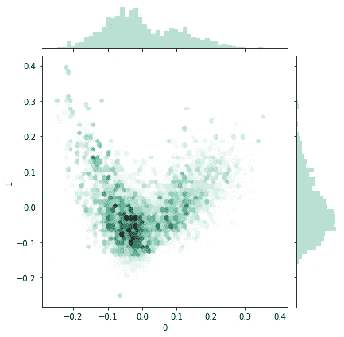

使用目标散点图显示 PCA:

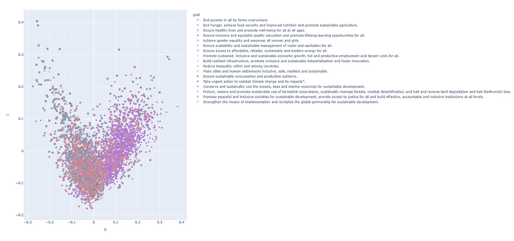

如果你仔细观察，你会发现有相当多的点是完全重叠的。请记住，许多伙伴关系同时处理多个目标——所以我删除了那些重复的，只绘制了独特的伙伴关系。作为参考，4585 个唯一合作伙伴中的 *2232 个只处理一个 SDG* 。

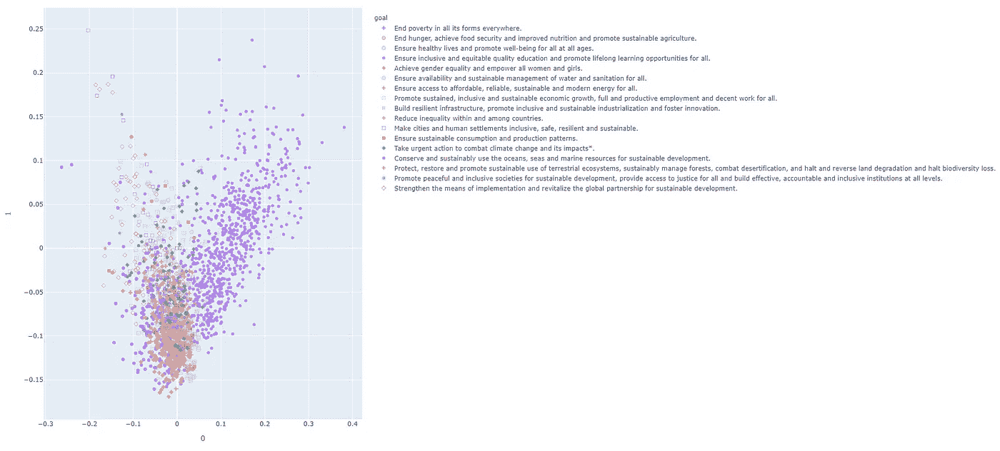

过滤主成分分析

虽然这确实开始揭示一些清晰的目标群，但在不同目标的描述中仍有许多相似之处。大多数目标要么聚集在 y 轴上 0 的左边，少数在 0 的右边。**我注意到，在整个范围内，这些目标都是以气候和环境为重点的**。这并不令人惊讶，因为我预计气候将处理最多样化的问题、资源和伙伴关系。

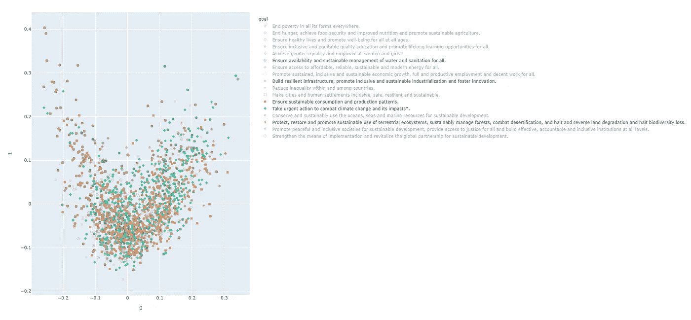

选自原始 PCA

**这更好地从时间的角度来看**，所以我用 plotly Dash 应用程序创建了一个 GIF，展示了在未经过滤的 PCA 中，合作关系是如何随着时间的推移而出现的。我们可以看到不同的目标在不同的时间获得了动力，集群确实是在 2017 年和 2018 年形成的。“包容性和公平的优质教育”和“保护……海洋”分别在 2012 年和 2016 年获得强劲势头。

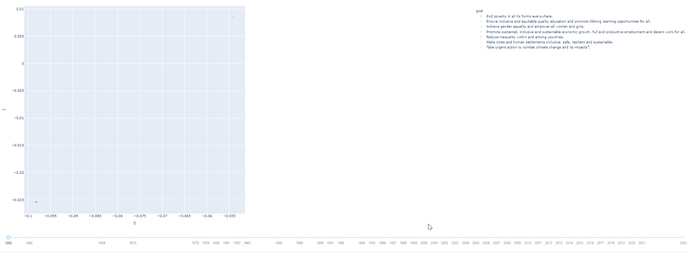

虽然这些图表给了我一些关于每个目标特有的集群的信息，但并没有告诉我我想要的那么多。**这些目标似乎都在某种程度上重叠，而不是独特的成对/三对**。为了扩展这一分析，我们将看看如何使用**余弦相似度**，而不仅仅是**欧几里德距离**比较。有两种方法可以做到这一点，要么在应用 TF-IDF 后对单词向量使用余弦相似性，要么更进一步，在先前的单词嵌入模型相似性矩阵和文档相似性矩阵之间进行额外的内点积(具有 L2 范数)，以获得**软余弦矩阵**(本质上更好地捕捉描述中单词的语义)。我们可以使用 gensim `word2vec` 或`FastTex`预训练的单词嵌入模型轻松做到这一点。

矩阵看起来像这样:

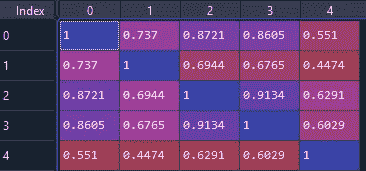

越接近 1，文档之间的相似度越接近。从概念上讲，你可以把它想象成 Seaborn 的 pairplot 或者 correlogram。

创建余弦矩阵后，我们可以再次进行主成分分析，看看我们的聚类是否发生了变化:

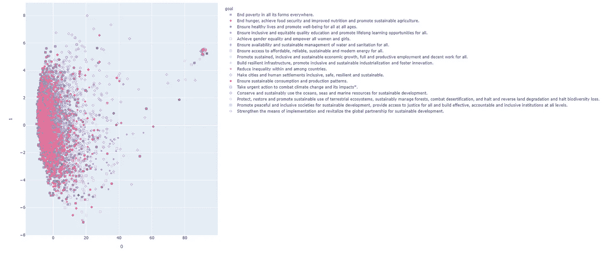

分布发生了很大的变化，尽管集群并没有真正发生很大的变化。平均软余弦相似性是 0.779，这是相当高的，所以没有明确的独立聚类是有道理的(即使我们运行 t-SNE)。**我尝试查看某个领域的关键词(即 x(-10，10)和 y(-2，2))，并获取某个领域的 gensim 摘要，但这些都返回了目标中广泛涉及的问题**。下一节将帮助解释一个可能的原因。

# 每个目标的资源覆盖范围:

每个合作伙伴提供的资源可以不同，从财政援助到农业或技术。大多数描述实际上是关于为什么某个资源是必要的，它将如何实现，以及最终的影响。困难的任务是弄清楚如何根据描述识别提供了什么资源。

在通读了一千个合作伙伴之后，*我决定使用以下资源/搜索词:*

1.  技术(科技、IT、数字、数据)
2.  培训(教学、培训、技能、课程、班级)
3.  粮食(种子、农业、灌溉)
4.  财政/经济(补贴、资金、贸易、金融、投资)
5.  研究(研究、框架、评估、监测)
6.  保护(保护、土木工程、生物多样性)
7.  法律/政治(民主、权利、政策、法律)
8.  其他(不属于上述类别的所有伙伴关系)

这是一种简单的方法，目的是给我们一个大概的了解，并不意味着面面俱到。产出如下，其中每个伙伴关系可被视为提供了一种以上的资源。

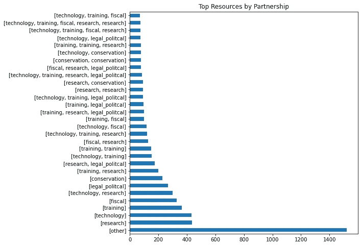

14249 个合伙企业中有 1500 个不符合我的分类

研究、技术、培训和财政看起来像是伙伴关系提供的共同资源。将它分解成每个目标看起来像这样:

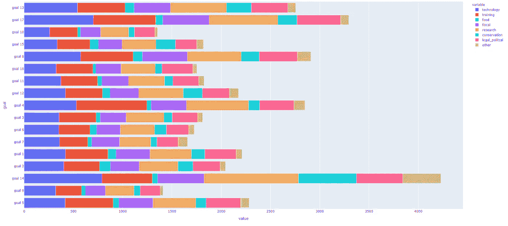

概念视图

这比我预期的要均匀得多，尤其是当您将视图转换成百分比形式时:

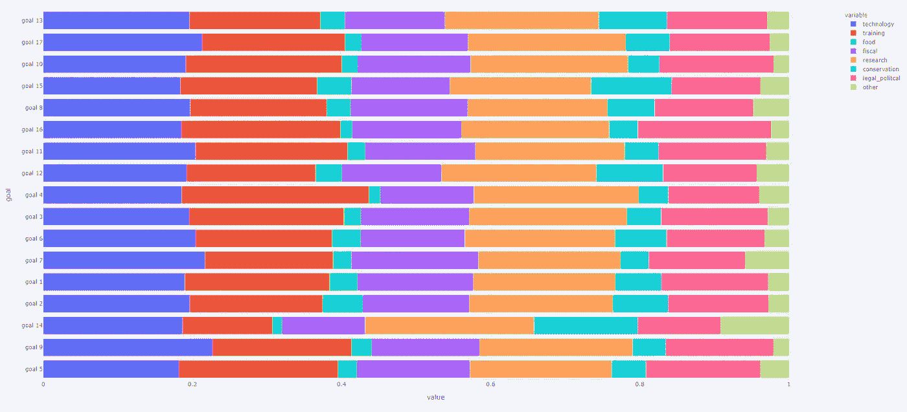

百分比视图

唯一让我印象深刻的一点是 SDG 14，与其他目标相比，它对训练的依赖要少得多。**这也与我们的主成分分析结果相符，该结果显示所有目标的分布存在一致的重叠。**很高兴看到资源在各个目标之间的平均分配，**因为这意味着每个部门/行业都有能力为每一个可持续发展目标做出贡献。**

# 后续步骤

这篇文章是理解可持续发展目标如何在许多方面取得进展的良好开端，也揭示了伙伴关系和 17 个可持续发展目标之间的许多关系。 ***我想重申，这是一篇关于前进的文章，不是进步。*** 如果您想了解不同目标的实际进展，请深入研究列出的目标和指标，以及每个国家如何报告这些目标和指标。

我认为下一步可能是使用所有这些数据，并生成一个分类机器学习模型。该模型将接受任何组织的名称、居住国和描述，并建议哪些目标、资源和合作伙伴是合适的。如果这听起来像是你想要合作的事情，请随时通过 LinkedIn 联系我。

*(我仍然在清理、重构和注释掉代码——清理、清理和分析超过 1000 行代码——但如果你现在想自己破译它，请查看*[*GitHub Repo*](https://github.com/andrewhong5297/SDG-Analysis)*。所有的绘图文件和数据都在那里)*