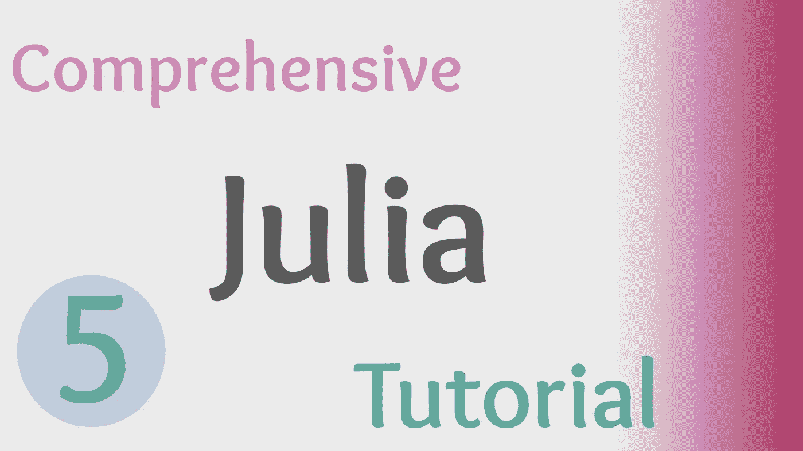

# 深入了解 Julia 中的数据结构

> 原文：<https://towardsdatascience.com/in-depth-look-at-data-structures-in-julia-d22171a8f5ed?source=collection_archive---------34----------------------->

## 朱莉娅综合教程

## Julia 编程语言中数据结构的快速介绍。

> 本文视频:



(图片由作者提供)

> [Github 库](https://github.com/emmettgb/JuliaLessons)
> 
> [笔记本](https://github.com/emmettgb/JuliaLessons/blob/master/5/Comprehensive%20Julia%20Tutorials%205.ipynb)

# 介绍

在之前的 Julia 教程中，我们讨论了如何对类型和函数使用 Julia 的多重分派。多重分派是一个简单的系统，用于在相同的方法参数下对不同的函数调用应用不同的类型。该结构中的关键组件是类型，更具体地说，是数据类型。

数据类型是计算机编程的基础。任何编程工作都将涉及操纵、移动和使用基本数据类型。在语言中创建的类型本身只是其他类型(通常是数据类型)的容器。

# 基本数据类型

我们可以在 Julia 编程语言中存储的第一种数据是基本数据类型。基本数据类型包括数字、文本、字符和布尔值等数据。

## 布尔代数学体系的

布尔类型是一种指示条件是否为真的类型。布尔值可以用最终压缩为 1 或 0 的真/假值来表示，也可以用表示类型条件的整数(1 或 0)来表示。

```
typeof(true)Bool
```

同样，在 Julia 语言中，我们也可以将布尔值断言为表示真或假的整数:

```
Bool(1)true
```

## 整数

编程中的整数数据类型类似于数学中的整数数据类型。整数是没有小数值的整数。通常，每当我们在 Julia 中处理整数时，我们都会处理 Int64 数据类型。这意味着该整数有 64 位。或者，也有 Int32s 和 BigInts。

```
typeof(5)Int64
```

## 漂浮物

浮点数是小数点后有第二个数字的整数，或者是一个小数值。浮点可以被认为是两个独立的数据片段，小数值之前的整数和整数之后的小数值。

```
typeof(5.5)
Float64
```

## 复杂而庞大

复杂的浮点数在 Julia 语言中经常出现。复浮点数就是既有虚值又有实值的浮点数。需要注意的是，这意味着这些类型不是真正的**。通常科学计算需要一个真实的数据类型，因此你可能需要断言一些复杂的浮点数。**

```
typeof(5.5 + 5.5im)Complex(Float64)
```

**该数据类型第二部分中的“im”表示前面的数字是虚数。**

**另一方面，大数据类型是实数，但超出了大多数 64 位整数和浮点数应用程序的能力，并且是精确的。这是 Julia 语言的一个显著特点，因为它允许巨大的整数和浮点数据类型毫无问题地通过多个函数传递——这是很少有语言能够做到的。**

```
# Big Int
big(51515235151351335)# Big Float
big(5.4172473471347374147)
```

## **标志**

**符号数据类型是 Julia 语言从函数范式中获得的另一个伟大的东西。符号可以用来表示从参数到字典键的任何东西——它们在这方面做得相当好。一般来说，符号数据类型在编程语言中是一个很好的东西，因为它可以用来表示基本上任何东西，因此得名:符号。在 Julia 中，只需在关键字前加一个冒号就可以写出符号，例如:**

```
typeof(:Symbol)Symbol
```

## **字符串和字符**

**字符串是一个非常简单的概念，它是由一组连续的 unicode/ascii 字符组成的字符组合。正如第 3 部分——循环中所演示的，字符串可以循环显示下一个数据类型，chars。如果您还没有阅读第 3 部分，您可以在这里查看:**

**[](/getting-familiar-with-loops-in-julia-cfbcc344728c) [## 熟悉 Julia 中的循环

### Julia 编程语言中循环和条件一起使用的介绍。

towardsdatascience.com](/getting-familiar-with-loops-in-julia-cfbcc344728c) 

字符串用引号分隔。另一方面，字符用撇号分隔。

```
typeof("Hello")Stringtypeof('h')char
```

浮点数用于表示 ASCII 中的字符。因此，我们总是可以将 asset chars 转换成 floats:

```
float('5')
```

> 有趣的事实:这就是标签编码的工作原理

# 数据结构

所有的分类数据、向量数据和矩阵数据都将充当其他类型数据的容器。考虑由多种数据类型组成的数组的例子，如整数、浮点、布尔或字符串。

## 数组

```
element_wise = [5, 10, 15, 15]
```

这个新数组是包含 4 个 Int64s 的数组。我们可以根据它们在数组中的位置用数字对它们进行索引:

```
element_wise[1] == 5trueelement_wise[2] == 10true
```

我们还可以在类型中看到这一点:

```
typeof(element_wise)
Array{Int64, 1}
```

> 为什么括号很重要:

您可能已经注意到，无论何时创建数组，它通常都在方括号的范围内。如果没有这些括号，这个数据集合的类型将是一个元组。虽然我没有深入研究元组，但它们是一种非常有效的数据类型——但如果您需要数组，这肯定不是您想要的。

```
h = 5,10,15,20
typeof(h)NTuple{4, Int64}
```

此外，不使用括号会使函数无法理解哪个参数对应于哪个变量。考虑追加！()方法。追加！方法有两个参数，第一个是您想要追加的数据，第二个是您想要追加的数据。如果我们使用括号，这是可行的，因为数组被视为一个参数。但是，使用逗号会出现 ArgumentError。

```
 parameters
           v    v
append!([5,10], 15) parameters
       v  v  vappend!(5,10,15)
```

## 字典

在 Julia 中，字典需要被明确定义，否则它将返回一个元组。这是一种非常有价值的动态类型，在处理数据集或 JSON 数据时会进一步体现这一点。

```
data = Dict(:A => [5,10,15], :B => [11, 12, 13)
```

使用字典，我们可以通过调用相应的符号键来调用数据，在本例中:

```
data[:A][5, 10, 15]
```

## 双；对；副

对实际上是元组类型，但重要的是要认识到对是元组，但元组不是对。pair 与我们一秒钟前用来访问字典的部分内容完全相同，并且可以用相同的方式创建:

```
key = :A => [5,10,15]
```

## 一组

集合只是从一个类型中提取的唯一值。例如，如果我们断言一个数组的集合类型，我们将获得该数组中的每个唯一值:

```
arr = [5, 5, 7, 7, 6, 4, 5]set = Set(arr)println(set)[5, 7, 6, 4]
```

## 元组

元组是数据类型的一般化结构，不一定具有已定义的结构。元组可以被认为是一个组织性较差的数组。

```
h = 5, 10, 15
```

# 创建类型

有时，处理原始数据类型可能是乏味和令人疲惫的，尤其是当一个函数需要处理许多参数时。这就是结构的用武之地。创建一个结构将产生一个新的类型，它可以保存任意的和预定义的数据结构。我们可以通过使用 struct 关键字，后跟定义和数据来创建结构。

```
struct typer
    h
    v
end
```

有了这个类型，我们现在可以给它分配一个新变量，提供必要的数据作为构造函数的参数:

```
w = typer(5, 10)
```

在这个实例中，struct typer 是我们保存数据 h 和 v 的新类型，我们可以通过调用 struct.data 来访问这些数据:

```
typer.h5typer.v10
```

我们还可以通过函数传递这个新类型，例如从我们的 typer 结构中添加我们的 h 和 v 数据:

```
function addtyper(typer)
    return(typer.h + typer.v)
end
```

值得注意的是，在 Julia 语言中，构造类型中的数据是不可变的。这可以通过在类型前放置关键字 mutable 来改变:

```
mutable struct typer
    h
    v
end
```

# 结论

数据类型一直是编程中非常重要的事情，这个问题在数据科学的世界中更为明显。大多数编程只是简单地使用数据结构和构造类型来处理数据类型。也就是说，理解数据类型对程序员来说非常重要。在 Julia 中有许多类型，有些你可以自己构造，但是学习如何利用和操作这些类型将是成为一个伟大的程序员的关键。**