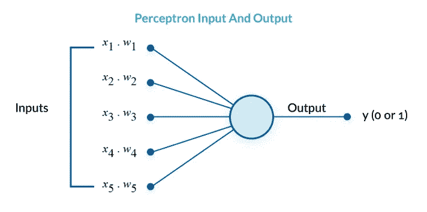
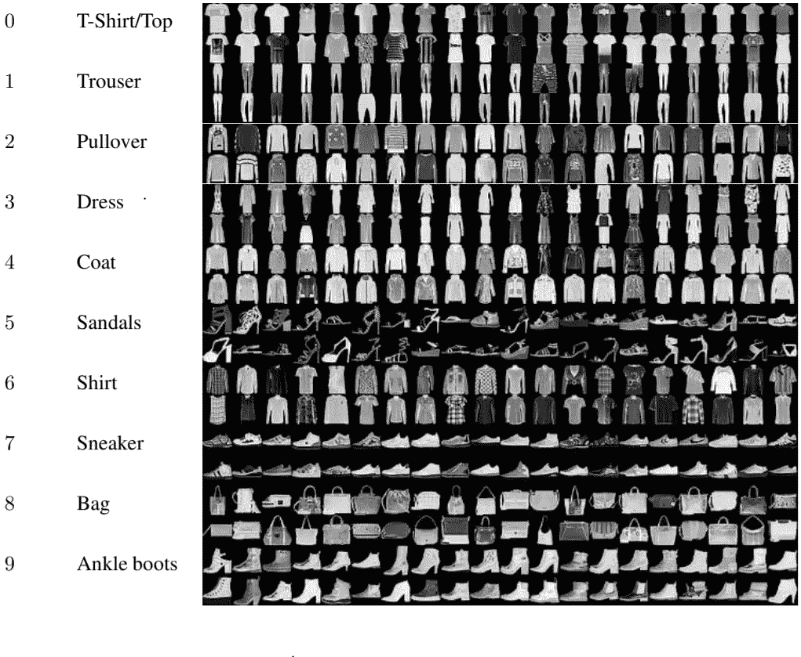
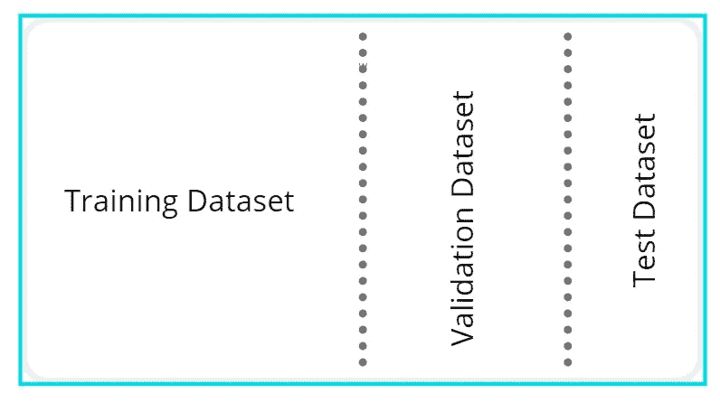
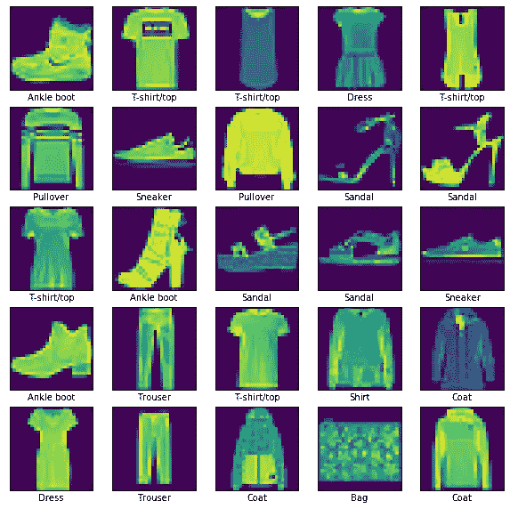
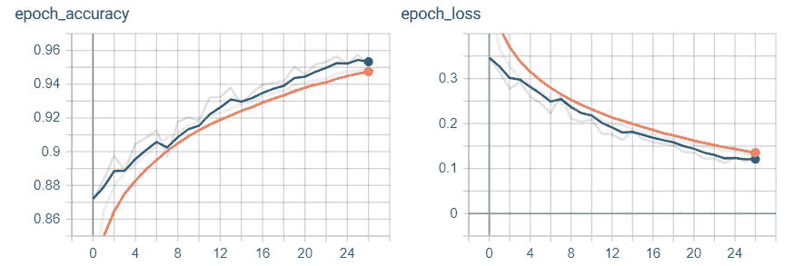
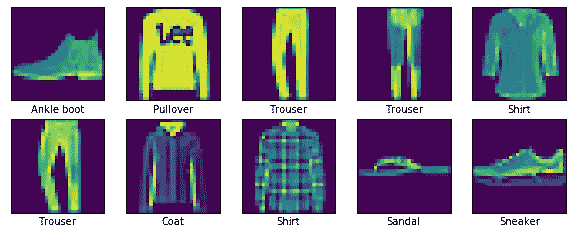
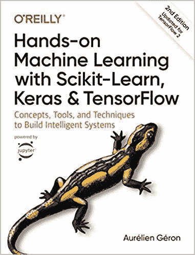

# 使用张量流的(深入)机器学习图像分类

> 原文：<https://towardsdatascience.com/in-depth-machine-learning-image-classification-with-tensorflow-2-0-a76526b32af8?source=collection_archive---------7----------------------->

## 理解实现用于图像分类的神经网络的过程。


Arif Riyanto 在 [Unsplash](https://unsplash.com/s/photos/machine-learning?utm_source=unsplash&utm_medium=referral&utm_content=creditCopyText) 上拍摄的照片

# 介绍

T 这将是一篇很长的文章，因为我将详细讨论实现图像分类神经网络所必需的组件和过程。

随意休息一下，甚至直接跳到有代码的部分。

本文旨在介绍实际的实现技巧，并解释机器学习开发中涉及的术语和术语。

本文内容面向初学者和中级机器学习从业者。

## 在页面底部有一个链接，指向本文中介绍的代码的笔记本。

享受吧。

# 目标

神经网络解决各种各样的任务，例如分类、回归等等。

本文研究了开发一个简单的用于图像分类的神经网络的过程。

将对以下内容进行探讨:

1.  **图像分类和其他术语的定义**
2.  **机器学习中的理论和概念(多层感知器)**
3.  **如何利用 TensorFlow、Keras 等工具和库**
4.  **如何建立、训练和评估神经网络**

# 图像分类

图像分类是与多标签分配相关联的任务。

它包括从图像中提取信息，然后将提取的信息与一个或多个类别标签相关联。机器学习领域中的图像分类可以作为监督学习任务来处理。

*但在我们进一步深入之前，需要理解一些基本术语以及所使用的工具和库，以正确理解实施细节*

# 感知器

感知器是人工神经网络的基本组成部分，由弗兰克·罗森布拉特于 1958 年发明。感知器利用基于阈值逻辑单元的操作。

感知器可以以单层格式堆叠，这能够解决线性函数。多层感知器能够解决更复杂的功能，并具有更大的处理能力。



[感知器图片来自 missinglink.ai](https://missinglink.ai/)

# MLP

多层感知器(MLP)是几层感知器一个接一个地连续堆叠。MLP 由一个输入层、一个或多个称为隐藏层的 TLU 层以及一个称为输出层的最终层组成。

# 工具和库

*   [**TensorFlow**](https://www.tensorflow.org/) :机器学习模型实现、训练、部署的开源平台。
*   [**Keras**](https://keras.io/) :一个开源库，用于实现运行在 CPU 和 GPU 上的神经网络架构。
*   [**熊猫**](https://pandas.pydata.org/) :数据分析修改库。
*   [**Matplotlib**](https://matplotlib.org/) :用于在 Python 中创建可视化绘图的工具，如图表、图形等
*   [**Numpy**](https://numpy.org/) :实现数组数据结构的多种数学计算和运算。

```
import tensorflow as tf
from tensorflow import keras
import matplotlib.pyplot as plt
import pandas as pd
import numpy as np
import os
import time
```

# 资料组

时尚-MNIST 数据集由源自 Zalando 图像目录的服装图像(t 恤、裤子、连衣裙等)组成。Zalando 是一家成立于 2008 年的欧洲电子商务公司。



时尚-MNIST 类和相关图像的例子

Zalando 的研究人员创建了包含 70，000 幅服装图像的时尚 MNIST 数据集。更具体地说，它包含 60，000 个训练样本和 10，000 个测试样本，这些样本都是尺寸为 28×28 的灰度图像，分为 10 类。

这些类别对应于图像中出现的服装项目。例如，一个踝靴的图像对应于数字标签“9”。


时尚 MNIST 数据集分布的可视化

# 数据集分区

对于这个特定的分类任务，使用了 55，000 幅训练图像、10，000 幅测试图像和 5，000 幅验证图像。

*   训练数据集:这是我们用来直接训练神经网络的数据集组。训练数据是指在训练期间暴露给神经网络的数据集分区。
*   验证数据集:这组数据集在训练期间被用来评估网络在各种迭代中的性能。
*   测试数据集:数据集的这一部分在训练阶段完成后评估我们网络的性能。



数据集分区的图示

Keras 图书馆有一套易于使用的数据集。

```
fashion_mnist = keras.datasets.fashion_mnist
(train_images, train_labels), (test_images, test_labels) = fashion_mnist.load_data()
```

60，000 张 28x28 尺寸的训练图像

```
train_images.shape
>> (60000, 28, 28)
```

60，000 个训练标签，每个标签对应于一件衣服，例如，标签 9 对应于踝靴

```
train_labels.shape
>> (60000,)train_labels[0]
>> 9
```

# 可视化和预处理数据

在我们继续之前，我们必须将训练图像像素值标准化为范围 0 和 1 内的值。这是通过将训练和测试图像中的每个像素值除以 255 来实现的。

```
train_images = train_images / 255.0
test_images = test_images / 255.0
```

以下是 fashionMNIST 数据集中的图像对应的类名。

```
class_names = ["T-shirt/top", "Trouser", "Pullover", "Dress", "Coat", "Sandal", "Shirt", "Sneaker", "Bag", "Ankle boot"]
```


时尚-MNIST 类和相关图像的例子

可视化数据集

```
plt.figure(figsize=(10,10))
for i in range(20):
    plt.subplot(5,4, i+1)
    plt.xticks([])
    plt.imshow(train_images[i])
    plt.xlabel(class_names[train_labels[i]])
plt.show()
```



数据集的验证分区是从训练数据集导出的。5000 张图像和标签将用于验证目的。

```
validation_images = train_images[:5000]
validation_labels = train_labels[:5000]
```

以下是用特定索引位置标识的相应服装名称的示例。

```
class_names[train_labels[2]]
>> 'T-shirt/top'
```

# 构建模型

Keras 提供了实现分类模型所需的工具。Keras 提出了一种顺序 API，用于将神经网络的层堆叠在彼此之上。

分类网络是一个浅网络，具有 3 个隐藏层、一个输入层和一个输出层。使用“Flatten”构造函数构建输入层，该构造函数将输入形状作为其参数，在本例中为[28，28]。

每个图像输入数据被转换或展平成 1D 阵列。密集层有确定数量的神经元/单元，单元的数量作为第一个参数传入。每个密集层还具有第二个自变量，该自变量接受要在每个层中使用的激活函数。

前三层使用 ReLU 激活功能，而最后一层使用 softmax 激活。

## 定义

*   **激活函数**:将神经元的结果或信号转化为归一化输出的数学运算。激活函数是在网络中引入非线性的神经网络的组成部分。激活函数的引入使得神经网络具有更强的表达能力和解决复杂的函数。
*   **ReLU 激活**:代表‘整流线性单元’*(y = max(0，x))* 。这是一种激活函数，可以转换神经元的值结果。ReLU 对来自神经元的值施加的变换由公式 y=max(0，x)表示。ReLU 激活函数将来自神经元的任何负值钳制为 0，而正值保持不变。这种数学变换的结果被用作当前层的输出，并作为下一层的输入。
*   **Softmax** :激活函数，用于导出输入向量中一组数字的概率分布。softmax 激活函数的输出是一个向量，其中它的一组值表示一个类/事件发生的概率。向量中的值加起来都是 1。

```
# Classification MLP(Multilayer perceptron) with two hidden layers
model = keras.models.Sequential([
    keras.layers.Flatten(input_shape=[28,28]),
    keras.layers.Dense(500, activation=keras.activations.relu),
    keras.layers.Dense(250, activation=keras.activations.relu),
    keras.layers.Dense(100, activation=keras.activations.relu),
    keras.layers.Dense(10, activation=keras.activations.softmax)
])
```

通过调用我们的模型上可用的' *summary* '方法，可以获得上面实现的模型的可视化统计摘要。通过调用 summary 方法，我们获得了关于模型属性的信息，例如层、层类型、形状、模型中的权重数以及层。

```
model.summary()
```

提供了以下输出

```
Model: "sequential"
_________________________________________________________________
Layer (type)                 Output Shape              Param #   
=================================================================
flatten (Flatten)            (None, 784)               0         
_________________________________________________________________
dense (Dense)                (None, 500)               392500    
_________________________________________________________________
dense_1 (Dense)              (None, 250)               125250    
_________________________________________________________________
dense_2 (Dense)              (None, 100)               25100     
_________________________________________________________________
dense_3 (Dense)              (None, 10)                1010      
=================================================================
Total params: 543,860
Trainable params: 543,860
Non-trainable params: 0
```

模型中的每一层都是一些感知器，每一层都有一组属性权重和偏差。

模型的权重随机初始化。使用 glorot 统一初始化器初始化网络中的权重值，该初始化器被证明是 Keras 中密集层的默认初始化器。

*   **Glorot uniform initializer** :一种神经网络的权重初始化方法，用作解决神经网络内不稳定梯度的解决方案。网络中的权重由某个范围内的值分布初始化，这些值的平均值等于零且方差恒定。分布的最大值是范围的正值，最小值是范围的负值。范围=[值，-值]

用于确定分布范围的值来自以下公式:

*值= sqrt(6 /扇入+扇出)*

‘fan _ in’是输入到层的数字。

“扇出”是层内神经元的数量。

官方研究[论文](http://proceedings.mlr.press/v9/glorot10a/glorot10a.pdf)中提供了更多信息。

```
first_hidden_layer = model.layers[1]
weights, biases = first_hidden_layer.weights
print(weights)
print('_____________')
print('_____________')
print(biases)
```

# 训练模型

## 汇编

Keras 通过我们之前实例化的模型对象提供了' *compile'* 方法。compile 函数支持我们在幕后实现的模型的实际构建，该模型具有一些额外的特征，如损失函数、优化器和指标。

为了训练网络，我们利用损失函数来计算网络提供的预测值和训练数据的实际值之间的差异。

伴随着优化算法的损失值促进了对网络内的权重进行的改变的数量。支持因素，如动量和学习率时间表，通过使损失值尽可能接近零，提供了使网络训练收敛的理想环境。

## 定义

*   **学习率**是神经网络不可或缺的组成部分，因为它是一个因子值，决定了网络权重值的更新水平。

在可视化练习中，要求解的函数可以描述为 n 维参数空间中的双曲线。

学习率是影响当前参数值朝向局部/全局最小值的步长的分量；因此，学习速率直接影响训练期间网络的收敛速率。如果学习率太小，网络可能需要几次迭代和历元才能收敛。另一方面，如果学习率太高，就有超过最小值的风险，因此我们的训练不会收敛。选择合适的学习速度可能是一项耗时的工作。

*   **学习率时间表**:在神经网络的训练过程中可以使用恒定的学习率，但这会增加达到最佳神经网络性能所需的训练量。通过利用学习速率表，我们在训练期间引入学习速率的适时减少或增加，以达到神经网络的最佳训练结果。
*   **学习率衰减:**学习率衰减减少了梯度下降过程中向局部最小值移动的步长的振荡。通过将学习率降低到与训练开始时使用的学习率值相比更小的值，我们可以将网络导向在最小值附近的更小范围内振荡的解。
*   **损失函数**:这是一种量化机器学习模型表现“有多好”的方法。量化是基于一组输入的输出(成本)，这些输入被称为参数值。参数值用于估计预测，而“损失”是预测值和实际值之间的差异。
*   **优化器**:神经网络中的优化器是一种算法实现，它通过最小化损失函数提供的损失值来促进神经网络中的梯度下降过程。为了最小化损耗，适当地选择网络内的权重值是至关重要的。

**优化算法示例:**

*   随机梯度下降
*   小批量梯度下降
*   内斯特罗夫加速梯度

有关梯度下降的详情，请参阅以下文章:

[](/understanding-gradient-descent-and-its-variants-cf0df5c45478) [## 理解梯度下降及其变体

### 简要了解机器学习模型中的学习过程是如何得到优化支持的…

towardsdatascience.com](/understanding-gradient-descent-and-its-variants-cf0df5c45478) 

```
sgd = keras.optimizers.SGD(lr=0.01, decay=1e-6, momentum=0.9, nesterov=True)
model.compile(loss="sparse_categorical_crossentropy", optimizer=sgd, metrics=["accuracy"])
```

**TensorBoard** 提供对每个时期训练中发生的事件的可视化洞察。

TensorBoard 提供的训练可视化存储在“runs”文件夹目录中。我们创建一个函数来生成一个文件夹目录，并通过时间戳来标识每个日志。

```
root_logdir = os.path.join(os.curdir, "runs")def get_run_logdir():
    run_id = time.strftime("run_%Y_%m_%d-%H_%M_%S")
    return os.path.join(root_logdir, run_id)run_logdir = get_run_logdir()
tensorboard_cb = keras.callbacks.TensorBoard(run_logdir)
```

模型的功能 API ' *fit* '方法提供了训练实现的网络的工具。

将特定参数传递给 fit 函数:

*   我们可以指定用于训练的训练数据
*   我们要训练网络的纪元数
*   以及用于在对看不见的数据进行训练期间验证网络性能的验证数据集。

我们还将利用“回调”参数，在本例中，它调用创建的 TensorBoard 回调。

训练类神经网路时，Keras 中的预设批次大小是 32。该网络总共被训练 60 个时期。利用[提前停止](https://en.wikipedia.org/wiki/Early_stopping)，一旦在 3 个时期后记录到验证损失没有改善，则停止训练。尽早停止可以节省您的时间，尤其是在您的网络开始超载并停止收敛的情况下。

总之，我们最多训练 60 个时期的模型，其中我们在每个时期通过网络以 32(批次大小)的批次前馈我们的所有训练数据。

在看到 32 个训练图像和标签后，我们的网络的权重参数进行了更新。

“fit”方法采用官方 [Keras 文档](https://keras.io/models/model/#fit)中的附加参数。

```
early_stopping_cb = keras.callbacks.EarlyStopping(monitor='val_loss', min_delta=0, patience=3, verbose=0, mode='auto')
model.fit(train_images, train_labels, epochs=60, validation_data=(validation_images, validation_labels), callbacks=[tensorboard_cb, early_stopping_cb])
```

要运行 TensorBoard，请在您的终端中输入下面的命令，然后导航到 localhost:6006。

```
tensorboard --logdir=runs
```



来自 TensorBoard 的训练快照

# 估价

评估一个模型需要通过网络数据进行前馈，这些数据在训练期间还没有暴露给网络。

在实际使用之前对模型进行评估是一个很好的指标，可以观察模型对未知数据的概括能力。

有了评估结果，您可以决定微调网络超参数，或者在观察测试数据集评估的准确性后进入生产阶段。

```
model.evaluate(test_images, test_labels)
>> 10000/10000 [==============================] - 1s 74us/sample - loss: 0.3942 - accuracy: 0.8934
[0.3942159619651735, 0.8934]
```

# 预言

为了用训练好的模型进行预测，来自我们的测试数据集的 5 幅图像被用来模拟基于真实生活场景的测试。

通过使用通过我们的训练模型可用的“预测”方法，我们可以将一批实际测试图像传递给我们的模型，并提取每个图像的概率向量。

概率向量包含 10 个元素，并且向量中的每个元素对应于来自先前定义的 10 件服装类别的类别出现的可能性。

```
practical_test_images =  test_images[:10]
prediction_probabilites = model.predict(practical_test_images)
prediction_probabilites
```

我们可以创建一个函数来循环遍历每个向量，并获得最高的置信度得分，这对应于我们的模型预测图像所属的类别。

```
def derive_predicted_classes(prediction_probabilites):
    batch_prediction = []
    for vector in prediction_probabilites:
        batch_prediction.append(np.argmax(vector))
    return batch_predictionmodel_prediction = derive_predicted_classes(prediction_probabilites)
model_prediction
>> [9, 2, 1, 1, 6, 1, 4, 6, 5, 7]
```

我们可以利用的另一种方法是利用' *predit_classes* '方法来获得每个图像对应的类。

```
model_prediction = model.predict_classes(practical_test_images)
model_prediction
```

' *predict_classes* '方法提供了一个一维向量或一个包含每个图像对应的类的数组。

```
np.array(class_names)[model_prediction]
>>array(['Ankle boot', 'Pullover', 'Trouser', 'Trouser', 'Shirt', 'Trouser',
       'Coat', 'Shirt', 'Sandal', 'Sneaker'], dtype='<U11')
```

让我们将 practical_test_images 中的图像和模型中的预测类可视化。

```
# Visualise the prediction result
plt.figure(figsize=(10,10))
for i in range(len(practical_test_images)):
    plt.subplot(5,5, i+1)
    plt.xticks([])
    plt.yticks([])
    plt.grid(False)
    plt.imshow(practical_test_images[i])
    plt.xlabel(class_names[model_prediction[i]])
plt.show()
```



# 保存模型

最后一步是保存我们的模型以备将来使用。
保存一个经过训练的张量流模型包括调用模型本身的“保存”功能。

```
model.save("image_classification_model.h5")
```

通过调用 Keras.models API 提供的“load_model”函数，可以使用保存的模型。

```
loaded_model = keras.models.load_model("image_classification_model.h5")
predictions = loaded_model.predict_classes(practical_test_images)
print(predictions)
print(np.array(class_names)[predictions])>>[9 2 1 1 6 1 4 6 5 7]
['Ankle boot' 'Pullover' 'Trouser' 'Trouser' 'Shirt' 'Trouser' 'Coat'
 'Shirt' 'Sandal' 'Sneaker']
```

# 结论

*本部分包含会员链接。*

**通过这篇文章，我们做到了以下几点:**

*   **实现了一个模型**
*   **训练了一个模特**
*   **评估模型**
*   **保存了一个模型**

从这里开始，您可以探索更多可以实现的神经网络架构，或者深入 TensorFlow 和 Keras 库。

**下面是一个 GitHub 知识库的链接，其中包含了本文中的所有代码。**

[](https://github.com/RichmondAlake/tensorflow_2_tutorials/blob/master/02_image_classification_fashionmnist.ipynb) [## Richmond alake/tensor flow _ 2 _ 教程

### permalink dissolve GitHub 是 4000 多万开发人员的家园，他们一起工作来托管和审查代码，管理…

github.com](https://github.com/RichmondAlake/tensorflow_2_tutorials/blob/master/02_image_classification_fashionmnist.ipynb) 

为了更好地理解实用的机器学习，下面还有一本我极力推荐的书。许多读者可能会熟悉这本书或它以前的版本

[**用 Scikit-Learn、Keras & TensorFlow**](https://amzn.to/2wvuowj) 进行动手机器学习



动手机器学习

# 希望这篇文章对你有用。

要联系我或找到更多类似本文的内容，请执行以下操作:

1.  订阅我的 [**YouTube 频道**](https://www.youtube.com/channel/UCNNYpuGCrihz_YsEpZjo8TA) 即将发布的视频内容 [**这里**](https://www.youtube.com/channel/UCNNYpuGCrihz_YsEpZjo8TA)
2.  跟我上 [**中**](https://medium.com/@richmond.alake)
3.  通过 [**LinkedIn**](https://www.linkedin.com/in/richmondalake/) 联系我