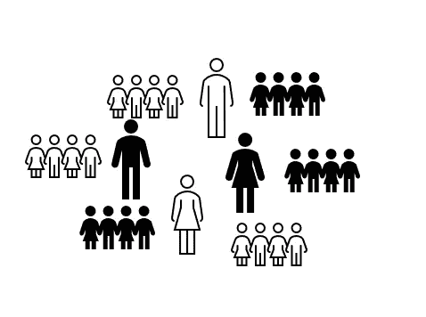

# 谁认为你的测试和测试本身一样重要

> 原文：<https://towardsdatascience.com/in-depth-on-testing-who-1c583efd6163?source=collection_archive---------49----------------------->

## A/B 测试需要对测试组和对照组进行深思熟虑的设计，而不仅仅是简单的随机分组

当尼克·卡拉斯和我写了《测试是不确定性的疫苗》一书，解释为什么测试对现代商业战略至关重要时，我们意识到这个话题会引起商业领袖、数据科学家和分析师的共鸣。我在那篇文章中提到，选择正确的测试和控制组是成功的关键。鉴于它的重要性，这个主题值得更详细地研究一下最佳实践和缺陷，这将帮助您实现最佳的测试设计。

所以，你已经为你的公司想出了下一个好主意，你有常识不只是把谨慎抛到九霄云外，而是，你想测试和学习。**谁将成为测试的一部分？这是你需要回答的关键问题。如果你在测试中有错误的个体样本，这充其量是不确定的，最糟糕的是误导。值得庆幸的是，这并不是一个未知的领域，你可以遵循一些原则，并考虑一些方面来确保你的成功！**

选择测试对象和测试本身的想法和假设一样重要

# 瞄准正确类型的测试对象

当然，第一部分是确定要测试的个人类型。这是一个你会对所有顾客进行的测试吗(例如，登陆你的网站或访问你的商店的每个人？)，还是只针对变革最相关或被认为最有效的特定群体？例如，测试一个新的移动应用的横幅广告对于那些从电脑上访问你的网站的用户来说意义不大。你可以考虑通过*人口统计*(年龄、地点、收入、*等)来细分你的客户群。*)或通过*行为*(频繁访问者、高级用户、移动用户)。

还要考虑到你想要测试的想法可能会影响到**多方**，你会想要对所有参与方进行控制。例如，市场上的[测试](https://tech.ebayinc.com/research/the-design-of-a-b-tests-in-an-online-marketplace/)可能会影响生产者和消费者、销售者和购买者、[司机和乘客](https://medium.com/blablacar-tech/a-b-testing-in-a-long-distance-carpooling-marketplace-35a67737f4b)，广告生产者和观众，他们的互动最终可能会掩盖测试的真正影响。例如，考虑测试一个新的推荐系统，这个系统将会从你的测试组中为赞助内容带来更多的流量。受影响的内容制作者注意到了这一点，并开始制作更好的内容。现在控制组看到了测试的溢出效应，他们的参与度也提高了。选择[正确的随机化单位](https://eng.lyft.com/experimentation-in-a-ridesharing-marketplace-b39db027a66e)(买家？卖家？会话？)在这种情况下尤其棘手。

> 你永远也不想结束这样一种情况:你从测试*中取出不干净的个体。帮自己一个忙:要么从一开始就计划一个干净的测试，要么计划需要度量的交互。*

另一个重要的考虑是**重叠测试**。这就是为什么建议保持*干净的测试池*的原因，并且应该努力维护和更新。如果您最终用重叠的测试对个体进行抽样，这将会产生一种危险的诱惑，即挑出表现差的测试组成员并合理化一个理由。是通往 [*p* 的阶梯——黑客](https://www.nimh.nih.gov/about/directors/thomas-insel/blog/2014/p-hacking.shtml)、[厨房水槽统计测试](https://www.stat.berkeley.edu/~mgoldman/Section0402.pdf)等数据科学地狱的圈子。然而，你可以[在一个多因素分析](http://blog.analytics-toolkit.com/2017/running-multiple-concurrent-ab-tests/)中考虑多个测试，并预先设计你的分析来研究测试的相互作用。

现在你知道了运行测试的客户类型，但是你如何选择特定的个人作为测试和控制组的一部分呢？A/B 测试的黄金方法一直是随机抽样。然而，在某些情况下，随机抽样是不够的。以社交网络上的[测试为例，测试组中的个体与控制组中的个体互动，从而影响控制组的行为。在这里，您会希望将测试和控制划分到比个体更粗糙的分组中，例如地理或社会集群。这里](https://tech.okcupid.com/the-pitfalls-of-a-b-testing-in-social-networks/)[图划分方法](https://en.wikipedia.org/wiki/Graph_partition)，例如通过使用交互频率的阈值，可能会有所帮助。此外，如果您的样本量很小，您可能还需要根据一些关键标准对样本进行分层，以确保您在细分时没有偏见。

# 瞄准正确数量的测试对象

现在你知道你需要什么样的考试科目了，但是**需要多少呢？这里既有战略上的考虑，也有统计上的考虑。**

> 从战略的角度来看，你不应该把测试做得太大。您希望为其他测试维护干净的测试主题的共享池，所以使用比需要更多的主题会更快地耗尽这个资源，然后需要等待它补充。当然，第二个因素也是成本:许多想法都失败了，在更大的样本上运行昂贵的测试增加了对业务的负面影响。

统计学的观点是，你要确保你的测试不会太小。任何称职的数据科学家都知道[功效分析](https://www.statisticshowto.com/statistical-power/)，以及可靠地测量 *x* 的效应大小的基本规则，你将需要至少 *N* 个人，并且 *N* 随着 *x* 变小而变大。如果你的测试有望使销售额翻倍，你可能不需要那么多人。但是统计能力只会告诉你所需的最少*和*，而你想要的往往不止这些。例如，如果您计划在之后的分析中进行细分，尤其是如果您希望通过回归和机器学习模型将数据用于目标定位，您将需要更多数据。有[好工具](https://www.danielsoper.com/statcalc/calculator.aspx?id=1)和[好文章](https://www.ncss.com/software/pass/regression-in-pass/)更详细地涵盖了这个主题。

# 这取决于人们

在统计计算时代，一台计算机可以在几个小时内运行数百个测试和模型，将批判性思维从测试过程中剔除，让机器清理人们造成的混乱已经成为一种时尚。这是导致灾难的一个因素:这实际上是垃圾进垃圾出。

> 一台机器无法单独从结果中判断测试是否有偏差，它无法判断市场中的多方之间是否存在交互影响，它也无法判断一个无关紧要的结果是因为样本量少还是因为这种影响不存在。

当运行统计测试是 Python 或 R 中的一个帮助命令，并且模型交叉验证被简化为一个函数时，数据科学家的关键知识将不是技术细节，而是概念思维。高影响力数据科学家甚至在数据进入之前就开始为业务增加价值。因此，通过*选择正确的测试对象*来设计正确的测试，对于成为一名高效的数据科学家至关重要。