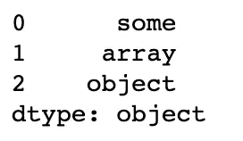
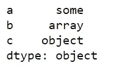
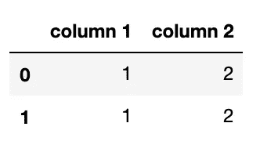
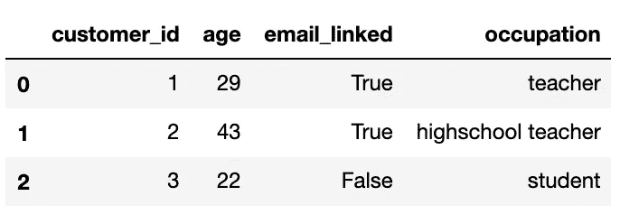
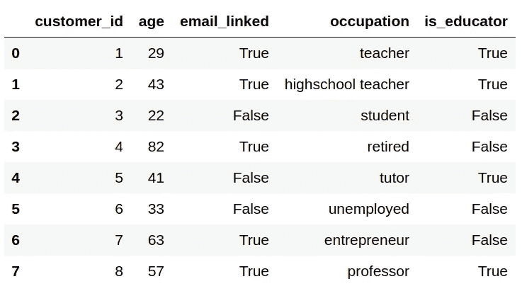
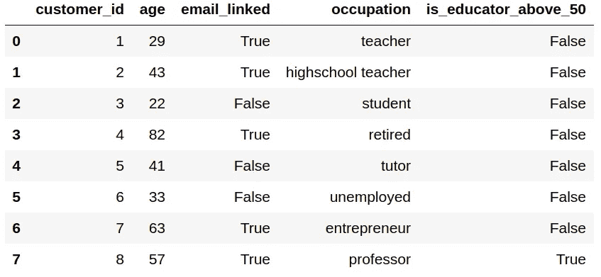
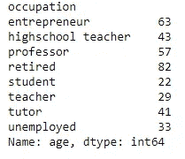
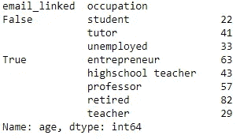

# 深入的熊猫教程

> 原文：<https://towardsdatascience.com/in-depth-pandas-tutorial-5d896483ba8a?source=collection_archive---------27----------------------->

## 数据科学速成班

## 处理关系数据的终极 Python 库


由[帕斯卡·米勒](https://unsplash.com/@millerthachiller?utm_source=unsplash&utm_medium=referral&utm_content=creditCopyText)在 [Unsplash](https://unsplash.com/s/photos/panda?utm_source=unsplash&utm_medium=referral&utm_content=creditCopyText) 上拍摄的照片

本月早些时候， [Edward Qian](https://medium.com/u/9ab35c11801?source=post_page-----49cfc5ed9136----------------------) 和我开始为有抱负的数据科学家编写一套综合课程，这些课程可以在我们的网站[www.dscrashcourse.com](http://www.dscrashcourse.com/)上找到

我将把稍加修改的课程交叉发布到 Medium 上，让更多的观众可以看到。如果你觉得这些文章很有帮助，请到网站上查看更多的课程和练习题！

`pandas`是一个 Python 库，可以轻松读取、导出和处理关系数据。本课将详细介绍其功能和用法。我们通常使用缩写形式来引用库。下面分享的所有代码都是用 Python 3 和`pandas==0.24.2`编写的。

# 熊猫系列

从官方文档来看，Series 是带有轴标签的一维 ndarray。`ndarray` 是在`numpy` 库中找到的一种特殊数据类型，它定义了一个固定大小元素的数组。简单来说，系列是表格或电子表格中具有相同数据类型的列。每个系列都有一个用于指示轴标签的索引。

我们可以使用`pd.Series(['some', 'array', 'object'])`创建一个系列



## 索引系列

我们可以使用轴标签或它们的位置标签来查找系列值。如果未指定，系列轴标签(也称为系列索引)将默认为整数。我们也可以将索引设置为字符串。

```
sample_series = pd.Series(['some', 'array', 'object'], index=list('abc'))

# positional indexing: this returns the first value, which is 'some'
sample_series[0]

# label indexing: this also returns the first value 'some'
sample_series['a']
```

这就是`sample_series`的样子。



我们可以对一个系列进行切片以获取一系列值。使用轴标签时切片行为是不同的——与通常的 Python 切片相反，起点和终点都包括在内！

```
# positional slicing: this returns the first two values sample_series[:2] # label slicing: this also returns the first two values
sample_series[:'b']
```

# 熊猫数据框

数据帧用于定义二维数据。使用索引标记行，使用列标题标记列。每一列都可以解释为一个系列。我们可以使用`pd.DataFrame({'column 1': [1, 1], 'column 2': [2, 2]}).`创建一个数据帧



或者，我们也可以将表格数据读入数据帧。

```
# Read in a CSV file
csv_dataframe = pd.read_csv('my_csv_file.csv')

# Read in an Excel file
xls_dataframe = pd.read_excel('my_xls_file.xls')
```

## 索引数据帧

我们可以使用方括号来索引数据帧列。让我们以我们创建的非常简单的数据帧为例。

```
sample_dataframe = pd.DataFrame({'column 1': [1, 1], 'column 2': [2, 2]})

# get the column 'column 1'
sample_dataframe['column 1']
```

对于更复杂的索引，我们可以使用。iloc 或. loc。

*   loc 是一种基于标签的索引方法，它需要行和列的名称
*   *iloc* 是一种基于位置的索引方法，它需要值的位置

因为我们没有为行指定轴标签，所以它们采用了默认的整数值。因此，该数据帧的位置标签和轴标签是相同的。

我们可以使用以下两种方法之一检索第一行:

```
sample_dataframe.iloc[0, :]

sample_dataframe.loc[0, :]
```

# 探索熊猫的合成数据集

让我们创建另一个数据框架来说明一些功能。我们可以假装这些数据是从一家发行教育资料的公司获得的。

```
data = pd.DataFrame({'customer_id': [1,2,3,4,5,6,7,8], 
                     'age': [29,43,22,82,41,33,63,57], 
                     'email_linked': [True,True,False,True,False,False,True,True],
                     'occupation': ['teacher','highschool teacher','student','retired',
                                    'tutor','unemployed','entrepreneur','professor']})
```

对于更大的数据帧，我们可以使用`.head(n)`来查看前 *n* 行。要查看最后几行，我们可以使用`.tail(n).`执行类似的操作，这对我们的小数据集来说都不是必需的，但是我们仍然可以使用`data.head(3)`进行演示。



## 过滤和索引数据帧

假设我们想要运行一个电子邮件活动。我们首先提取相关的专栏来开展我们的活动。

```
# use double brackets to index multiple columns, single brackets for one column
email_data = data[['customer_id', 'email_linked']]
```

并非所有的客户都有电子邮件链接，所以我们肯定要排除那些没有。

```
# the condition goes inside the square brackets email_data = email_data[email_data['email_linked']]
```

## 应用列式函数

让我们写一个非常简单的函数来判断一个客户是否是教育者。这就是我们如何定义一个教育家。

```
def is_educator(occupation):
    return 'teacher' in occupation.lower() or occupation.lower() in ['tutor', 'professor', 'lecturer']
```

我们可以将这个函数应用到*职业*列来创建一个新列。

```
data['is_educator'] = data['occupation'].apply(is_educator)
```



我们还可以转换数据帧中每一列的所有行。这就需要我们设置`axis=0`(也是默认设置)。我们可以编写一个列式函数来删除任何包含缺失值的列。这只是为了演示——有更好的方法来处理缺失值(参见[官方熊猫文档](https://pandas.pydata.org/pandas-docs/stable/user_guide/missing_data.html))。

```
def remove_missing_columns(col):
    if col.isnull().values.any():
        return col

data.apply(remove_missing_columns, axis=0)
```

## 应用逐行函数

我们还可以应用一个函数来转换一行中的每一列。这就要求我们设定`axis=1.`

```
def is_educator_above_50(row):
    return row['age'] > 50 and is_educator(row['occupation'])

data['is_educator_above_50'] = data.apply(is_educator_above_50, axis=1)
```



## Groupby 操作

Groupby 操作对于分析 Pandas 对象和从大量数据中设计新功能非常有用。所有 groupby 操作都可以分解为以下步骤:

*   **将对象分成组**
*   **对每组应用**一个函数
*   **结合**结果

通常，对象会根据某些标准进行拆分，为每个组计算一个汇总统计数据，并组合成一个更大的对象。我们可以使用 groupby 运算来计算每种职业的平均年龄。

*   按*职业*分割数据帧
*   将一个*均值*函数应用于每个职业
*   把平均年龄结合成它自己的对象

这个操作的代码非常简单:`data.groupby(by=['occupation']).mean()['age']`

*by* 参数表示如何确定组， *mean()* 是兴趣的统计量，按*年龄索引*获取年龄的组统计量。输出是一个系列，其中*职业*是轴标签。



我们可以使用多个参数来划分群组，例如，职业和他们的电子邮件是否链接的组合:`data.groupby(by=['email_linked', 'occupation']).mean()['age']`



除了*意味着*，还有其他内置函数可以应用于每个组: *min，max，count，sum* 等等。我们也可以使用`agg()` 来应用任何自定义功能。聚合方法对于返回多个汇总统计信息也很有用。

例如，`data.groupby(by=['occupation']).agg(['mean', 'sum'])['age']`将返回每个组的平均年龄以及年龄总和。

## 数据帧属性

这些属性帮助我们探索和熟悉新的数据框架。

*   `data.columns` 返回所有列的列表
*   `data.shape` 以(行数，列数)的形式返回维度
*   `data.dtypes` 返回每列的数据类型
*   `data.index` 返回索引值的范围

## 以下是一些可能有帮助的额外阅读材料:

*   参考[熊猫官方文档](https://pandas.pydata.org/docs/)了解语法、用法和更多例子。
*   书籍:[用于数据分析的 Python:与 Pandas、NumPy 和 IPython 的数据角力](https://amzn.to/3feHPSY)

# 感谢您的阅读！

如果你喜欢这篇文章，你可能想看看我关于数据科学、数学和编程的其他文章。请在 Medium 上关注我的最新更新！