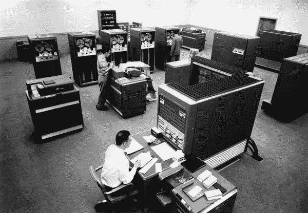
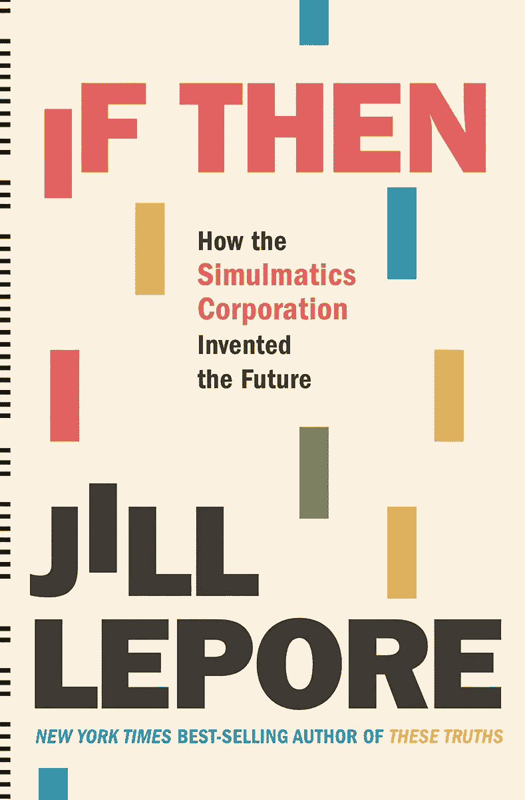

# 一开始，有模拟

> 原文：<https://towardsdatascience.com/in-the-beginning-there-was-simulmatics-6297ab84125f?source=collection_archive---------30----------------------->

## 一本新书调查了数据科学的起源

数据科学早期的主力 IBM 704(来源:计算机历史博物馆)

还记得第一次听到“数据科学”这个名词的时候。它被我的雇主非常喜欢的一家昂贵的 It 咨询公司的客户经理抛弃了。“数据科学？”我的老板说，他是一位身经百战的 IT 老兵。"那听起来像是一群刚刚加薪的统计学家."

在她的新书[“If Then:the simulatics Corporation How Invented the Future”](https://www.amazon.com/If-Then-Simulmatics-Corporation-Invented-ebook/dp/B085T8DHXD/ref=sr_1_1?crid=M3D0F107S8HD&dchild=1&keywords=simulmatics&qid=1601643990&sprefix=simulmatics%2Caps%2C134&sr=8-1)中，吉尔·莱波雷(Jill Lepore)为数据科学提供了一个起源故事，或者如当时所知的那样:“海量数据”。

生命周期很短的小公司 Simulmatics 是否真的发明了数据科学的未来，这是一个疑问。《纽约时报》在评论 Lepore 的书时，用了一个更加怀疑的标题:[“笨手笨脚的 20 世纪 60 年代数据科学家，他们预见了脸书和谷歌。”](https://www.nytimes.com/2020/09/15/books/review/if-then-jill-lepore.html?searchResultPosition=1)

我更倾向于时代的解释；仿真预测了未来，但实际上它创造的很少。

这并没有从 Lepore 的书中带走任何东西，这是该国最着名的历史学家之一对数据科学早期的深入研究和精心撰写的旅程。Lepore 是哈佛大学的历史学教授，也是《纽约客》的作者，他的上一本书[【这些真相】](https://www.amazon.com/These-Truths-History-United-States-ebook/dp/B07BLKWBYT/ref=tmm_kin_swatch_0?_encoding=UTF8&qid=1601644098&sr=8-1):是一部美国历史。

《如果那么》作者吉尔·莱波雷(来源:Liveright/W.W .诺顿)

这是 Simulink 故事中的三位明星，Lepore 将其描述为“马克·扎克伯格、谢尔盖·布林、杰夫·贝索斯、彼得·泰尔、马克·安德森和埃隆·马斯克的去世已久的白胡子祖父。”：

埃德·格林菲尔德(Ed Greenfield)，一个麦迪逊大街的广告人，谎称自己曾就读于耶鲁大学法学院和芝加哥大学(事实上，他在印第安纳州的沃巴什学院(Wabash College)就读一年后就辍学了)。

比尔·麦克菲，一个才华横溢但显然相当疯狂的 FORTRAN 程序员，有一次被他的妻子不由自主地送进了精神病院。

伊希尔·德·索拉·普尔是定量社会科学的专家，被怀疑是共产主义者，在一位名叫理查德·尼克松的年轻加州众议员的干预下，他才获得了从事政府工作所需的安全许可。

格林菲尔德的伟大想法是将定量社会科学和计算的力量带入他的广告公司，在那里它将被用来兜售消费品和让政治家当选。人类行为，无论是投票还是决定购买哪个品牌的肥皂，都将被建模、模拟，并最终被应用于海量数据的复杂算法所操纵。

听起来熟悉吗？这一切实际上开始于 1952 年。

格林菲尔德是一位热情的自由主义者和民权活动家。他希望利用分析和技术来帮助 20 世纪 50 年代和 60 年代的民主党人消除共和党人当时享有的技术优势。

他的公司爱德华·l·格林菲尔德公司建立了自己的“社会科学部门”。这成为了 1959 年由格林菲尔德和普尔创建的 Simulmatics 的前身。“他们很自信，也很自大，”Lepore 写道。"但他们有时怀疑这一切是否都是胡说八道."

最终，格林菲尔德以及他的同伴普尔和麦克菲的雄心，远远超出了当时的技术支持。当时最先进的是 IBM 704 大型机。为了在大型机上运行程序，IBM 开发了 FORTRAN(代表“公式翻译”)。

这就是问题所在。Lepore 引用了 IBM 的 FORTRAN 文档:

*“FORTRAN 语言旨在能够表达任何数值计算问题……然而，对于机器语言具有逻辑意义而非数值意义的问题，它就不那么令人满意了，* ***它可能完全无法表达某些问题*** *。”*(重点后加)。

你可能已经注意到，人类通常不会根据数字计算来做决定。就此而言，许多都不太符合逻辑。Simulink 用不太理想的工具集解决了一个大问题。

另一个问题是数据很难获得。营销和研究公司倾向于将其视为专有资产。开始开放联邦数据存储的第一版《信息自由法案》直到 1967 年才颁布。当数据可用时，通常必须从穿孔卡片和磁带盘等媒介输入。

在 1960 年的总统选举中，Simulmatics 一跃成为知名企业，并将其服务卖给了约翰·肯尼迪竞选团队。它是基于麦克菲的 FORTRAN 编程，麦克菲在他的哥伦比亚大学博士论文中将其描述为“完全可观察的选民”。

Lepore 指出，“在初级水平上，它与剑桥分析公司(Cambridge Analytica)在 2015 年和 2016 年向川普和英国退出欧盟“脱欧”运动出售的服务没有任何不同。”

大多数创新都有很多发源地。在 Simulmatics 的例子中，一个诞生地是纽约市贝尔维尤医院的精神病病房。在妻子把他送进病房后，麦克菲继续在病房里进行新的项目。

对于肯尼迪的竞选活动，Simulmatics 基于 460 个不同选民群体的历史投票模式进行了分析。一个示例组:“中西部，农村，新教徒，低收入，女性。”

关键建议是:肯尼迪不要试图回避他的天主教问题(这在 1960 年是一个很大的问题),而是作为反对偏见的整体立场的一部分，直面这个问题。这将吸引肯尼迪弱势的两个群体:黑人和犹太人。这也有助于进一步激励天主教徒。

仿真技术在肯尼迪的选举中发挥了多大的作用还有待商榷。但毫无疑问的是，北方的黑人选民是他险胜的主要因素。Simulmatics 立即开始了自己的活动，宣传其在肯尼迪竞选中的作用。这引发了一场关于肯尼迪实际上在多大程度上是一位电脑控制的总统的争论。

这也是这本书最精彩的部分之一。今天，这样的发现不会引起任何反响。大多数选民会简单地认为，所有的政治家都使用技术来分割选民，并为不同的群体量身定制信息。

然而，在 1960 年，这是一桩丑闻。它有效地结束了政治运动的模拟工作。

但是其他的机会出现了。1962 年，Simulmatics 受雇为《纽约时报》对选举结果进行实时分析。但事实证明，实时意味着尽快通过电话和电传接收到反馈，然后编码到穿孔卡上，通过调制解调器提交到 IBM 数据中心。《泰晤士报》很快失去了兴趣。

政治运动的合理后续是帮助五角大楼发动心理战。越南提供了机会。“越南，”Pool 在 1966 年说道，“是我们有过的最伟大的社会科学实验室。”

许多社会科学家已经在越南问题上与五角大楼分道扬镳，并停止争夺五角大楼的合同和拨款。对于不隶属于大学的 Simulmatics 来说，这不是问题。它有自己的团队，包括一些当地人，在南越的土地上对全国各地的村庄进行调查。

资助南越仿真工作的五角大楼高级研究计划局(ARPA)很快对结果感到不满，认为它们“不是负责任的研究人员的工作”。当 ARPA 终止合同时，它甚至更为关键:“仿真不仅反映了作为一个组织自身的信誉——它看起来更像是一个骗局——而且反映了一般行为研究的信誉。”

随着五角大楼的工作被关闭，Simulmatics 转移到了 20 世纪 60 年代末困扰美国的城市动荡，当时越南和民权运动正在酝酿。它被雇来协助肯纳委员会，该委员会是政府为研究暴乱的原因和影响而成立的。它模拟了市中心贫困的原因和解决方案。不出所料，报告得出的结论是，解决办法是摆脱贫困。

然后生意开始枯竭。到 1969 年，Simulmatics 已经是一家名存实亡的公司。1970 年，它申请破产。到 1974 年，随着 simulation 成为模糊的记忆，计算机模拟人类行为的整个概念受到质疑。水门事件和越南事件增加了人们对政府数据收集的怀疑。1974 年的隐私法使得政府收集和汇总个人数据更加困难。

格林菲尔德于 1983 年去世，一年后去世。仿真故事最后悲伤的一章写于 1998 年。比尔·麦克菲(Bill McPhee)是一名程序员，他在精神病病房里编写了最初的 Simulink 代码，坐在电脑前开枪自杀。他 77 岁了。

每一波创新都是从一长串行不通的事情开始的。

Simulmatics 是一家失败的公司，它建立在冷战思想的基础上，即人类行为可以被操纵以达到政府、政治家和公司的目的。但是这个想法仍然存在，即使 20 世纪 50 年代和 60 年代的技术不支持它。毕竟，在今天的社交媒体平台上运行的算法比 21 世纪版本的仿真思想更好吗？