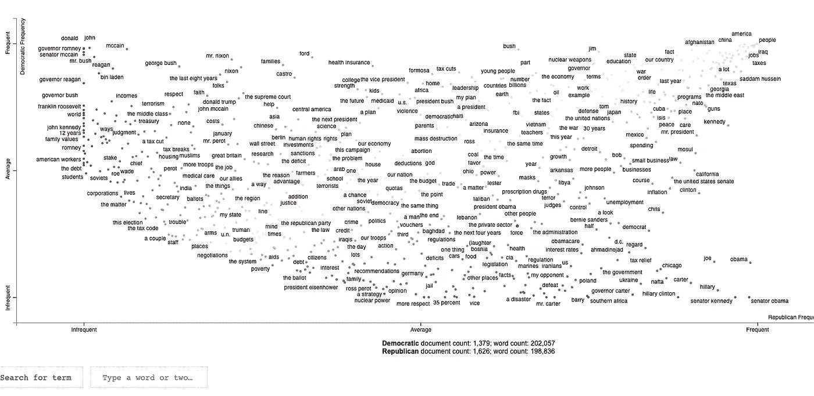
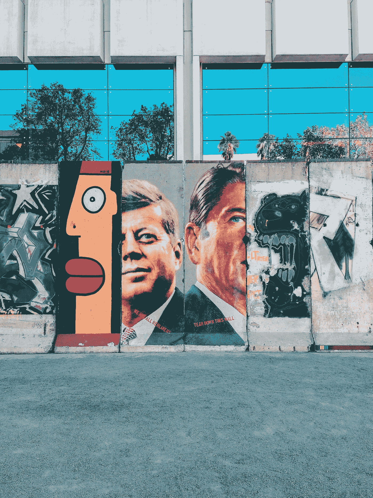
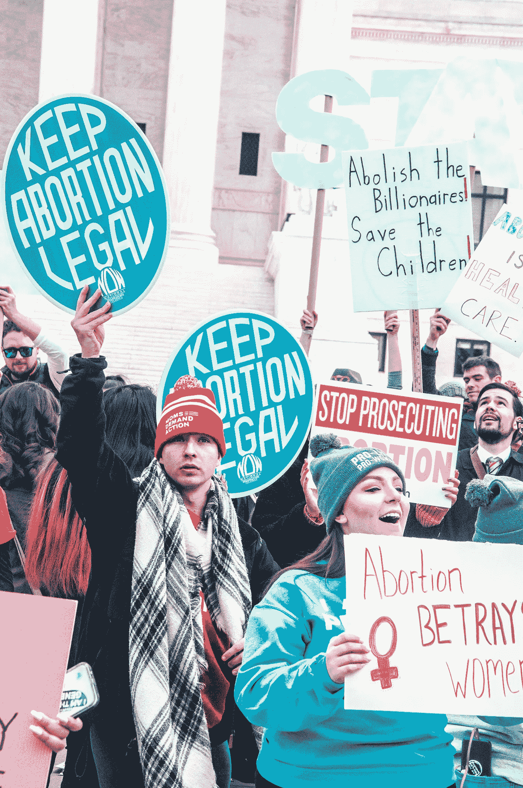
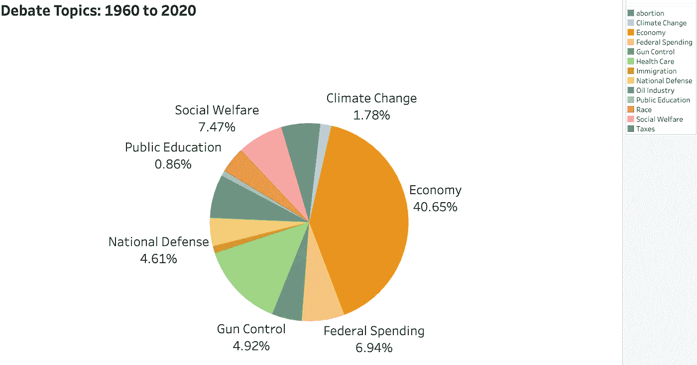
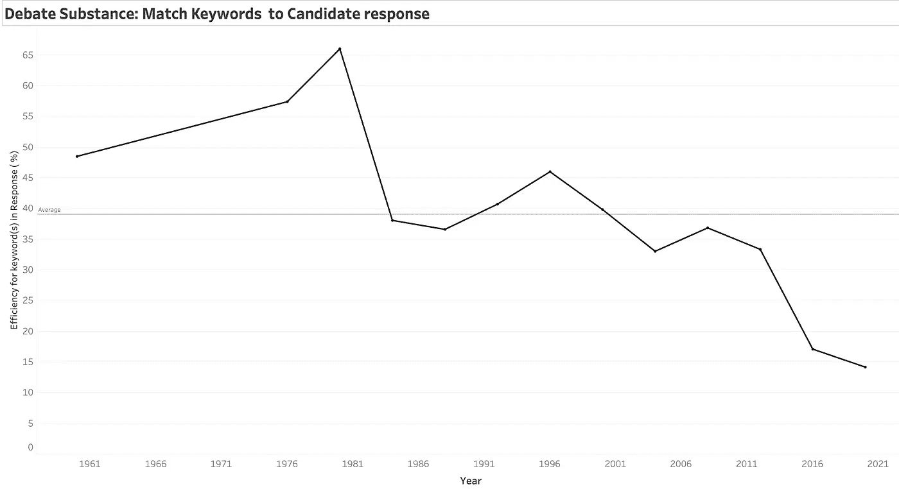
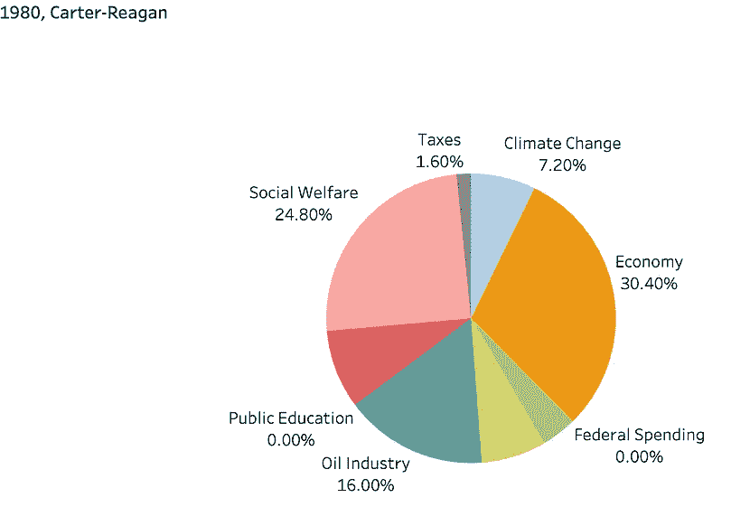
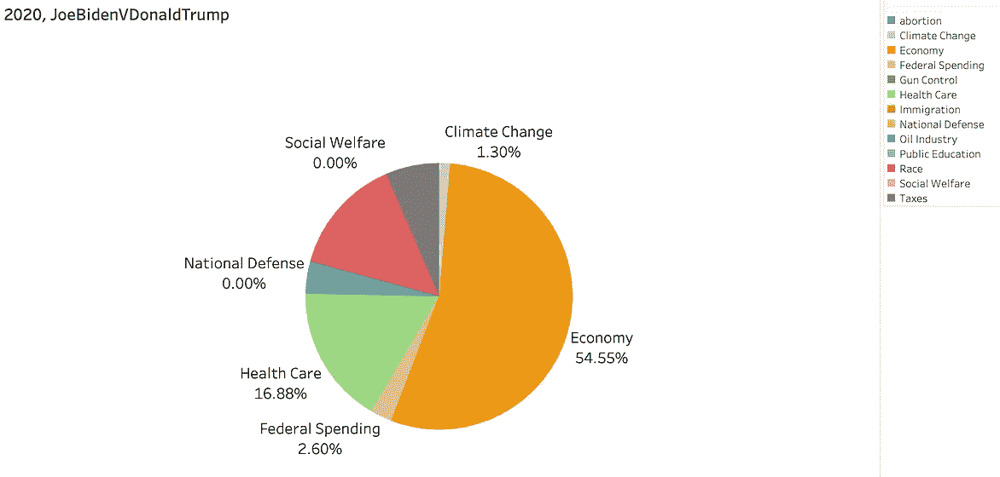
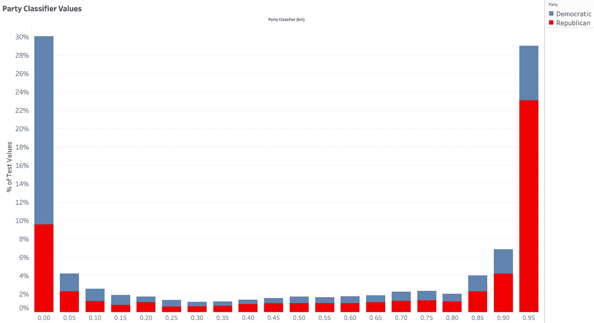
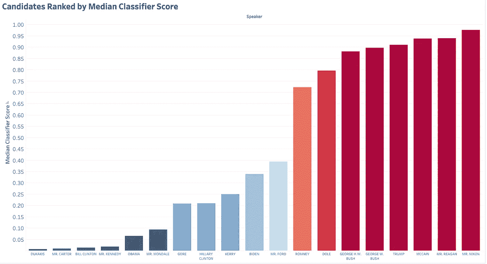

# 用他们自己的话说:60 年的总统辩论

> 原文：<https://towardsdatascience.com/in-their-own-words-60-years-of-presidential-debates-7cb4cc40e92c?source=collection_archive---------44----------------------->

## 从肯尼迪-尼克松到拜登-特朗普总统辩论的 NLP 分析


希拉·墨菲在 [Unsplash](https://unsplash.com?utm_source=medium&utm_medium=referral) 上拍摄的照片

由于我们中的许多人(希望)已经通过邮件或提前投票的方式投了票，可能仍有一些人在 11 月 3 日之前没有做出决定。本着民主的精神，我希望这篇文章能在你投票之前送到你手中。受到即将到来的选举日的鼓舞，我决定翻阅一些旧的总统辩论。怀旧可能是 2020 年的一个关键话题，因为人们开始意识到所有在前疫情时代不受重视的事情。选举日是一个重要的十字路口，在选择道路之前，回顾一下我们在不断发展的民主中所处的位置可能是有益的。

这个项目最初的灵感来自于 NLP 的一篇关于[散点文本可视化](https://medium.com/analytics-vidhya/visualizing-phrase-prominence-and-category-association-with-scattertext-and-pytextrank-f7a5f036d4d2)的帖子。《华盛顿邮报》分析了 2012 年总统大会的演讲(奥巴马诉罗姆尼),并按政党进行了分类。这是一个伟大的阴谋，看到一个用文字说明的党派分歧的快照。词频和排名还显示了党纲中关键主题的快照(在上对角线和下对角线)以及对角线上的常见问题。大会演讲中充满了关键的政党纲领短语。

*   共和党:失业、商业、自由
*   民主党:女性，中产阶级，医疗保险

下面，我用散文本来探索 1960-2020 年总统辩论的主题特征。辩论也是一个有趣的案例，原因有很多。主持人或小组成员选择当前问题或更多关于领导力的自由话题。候选人并不为自己的支持者感到舒服，但是经常会面临犹豫不决的选民提出的棘手问题。此外，时间限制要求他们简明扼要，候选人必须衡量他们选择的词来解决这个问题。通过每个候选人，人们可以看到一个选举周期中政党意识形态的快照。

下面是一个用 PyTextRank 给突出短语打分的散点图截图。这些短语然后通过它们的密集等级频率和两个当事人类别之间的密集等级频率的差异关联到一个点([这里是一个很好的例子！](https://github.com/JasonKessler/scattertext/blob/master/demo_pytextrank.py))。在标题中，有一个互动情节的链接，你可以点击一个点，看看谁说了什么！



散点图快照，显示民主党人(垂直)和共和党人(水平)在坐标轴上的排名频率。民主党人经常使用的短语更靠近左上角，共和党人在左下角。黄色对角线代表双方共有的更中性的词语或问题(如贸易、民主、政治、犯罪)。情节是互动的，允许点击单词，并看到所有发言者包含该词的辩论响应。互动图可以在这里访问:([散点图总统辩论](https://rpatelcern.github.io/PresidentialDebates/pytextrank_rankdiff_feature_exploration.html)带有搜索栏)

# 窥探图中的特征:

基于一个词，我们可以使用散点文本可视化的直观特性来深入研究思想分歧。沿着关键短语的对角线看，得分接近零，代表双方需要解决的关键问题或挑战。就像站在一个山谷里，仰望两座大山。：

*   摇摆州俄亥俄州被列在对角线上，而密歇根州的得分更低，因为它被共和党人更频繁地提到。
*   像“预算”和“贸易”这样的关键问题被双方以平均频率提及，因此这些点显示在图表的中心。
*   在黄点的右上方区域，最常讨论的话题是“税收”和“就业”，两党得分几乎相等。

表示意识形态的词离这个山谷最远。例如，“美国工人”这个短语是民主党候选人专用的。乔治·w·布什在描述他的社会保障计划时经常使用类似的短语“年轻工人”。具有相等和相反符号分数的单词对于比较政党纲领的焦点是有趣的。例如，共和党人对北美自由贸易协定的得分与民主党人对“收入”的得分一样多，这表明共和党人对北美自由贸易协定的讨论和批评与民主党候选人对家庭收入的关注一样多。更多实例表明了各方的关键谈话要点:

*   d:“人权”，R:“我们的部队”
*   d:“减税”，R:“失业”
*   d:“住房”，R:“债务”



[伊赛·拉莫斯](https://unsplash.com/@isai21)在 [Unsplash](https://unsplash.com/photos/Sp70YIWtuM8) 上的照片

看看左上角和右下角，你可以看到每个候选人对他或她的对手说了什么。一个有趣的特点是在让步协议中，例如巴拉克·奥巴马几次承认参议员麦凯恩(或“约翰”)是“绝对正确的”，约翰·麦凯恩也至少承认过一次这一点(当提到在阿富汗的战术和战略时)。从图的底部看，辩论变得更加个人化，因为对手主要被称为他们的名字(左下角)，共和党人而不是民主党人经常使用的许多术语被唐纳德·特朗普的关键短语所主导:

*   “是的，是的，我们听说过——我们以前听说过，希拉里。”
*   “因为你知道什么，你一点也不聪明，**乔。47 年了，你什么都没做。**
*   “打扰了。因为作为参议员，她在 T4 遭遇了一场灾难。**灾难。**”
*   “她的判断力很差，老实说，差到她永远都不应该成为美国总统。这我可以告诉你。”
*   “我不认识宝儿。我知道**猎人。亨特被军队开除了。他被开除了，因为吸食可卡因而被开除军籍。”**



由 [Maria Oswalt](https://unsplash.com/@mcoswalt) 在 [Unsplash](https://unsplash.com/photos/JaYhsnOQeY0) 上拍摄的照片

随着候选人的立场随着时间的推移而演变，关注更实质性的话题会更有意思。堕胎一直是共和党和民主党之间党派分歧的一个关键问题，特别是在最近确认艾米·科尼·巴雷特的情况下。在卡特-福特辩论和蒙代尔-里根辩论中都有提及。里根和卡特给出了截然相反的声明，尽管他们当时并没有展开辩论:

> “我认为堕胎是不对的。我认为政府不应该做任何事情来鼓励堕胎。但是我不赞成在这个问题上的宪法修正案……我个人不认为联邦政府应该资助堕胎，但是我——我划清界限，不支持宪法修正案。”- **吉米·卡特**
> 
> “但是关于堕胎问题，我有一种感觉，在蒙代尔先生的言论中，有一些地方提到了将宗教注入政府，但没有提到。跟我，堕胎不是宗教的问题，是宪法的问题。”- **罗纳德·里根**

里根表示，这个问题是关于宪法，而不是宗教。卡特的回应有点混乱。他明确指出不应该有禁止堕胎的修正案，但是政府不应该有资助堕胎的项目。乔治·w·布什的回应暗示这个问题是一个社会建设的问题，这与里根关于宪法的回应是矛盾的。希拉里和迈克尔·杜卡基斯明确表示，这是一个关于女性选择权的问题。戈尔和麦凯恩在最高法院大法官的试金石背景下谈论罗伊诉韦德案，并一致认为支持罗伊诉韦德案是任命甚至提名的关键指标。

> “我认为推广生活文化很重要。我认为一个好客的社会是一个每个人都很重要的社会。我相信理想的世界是这样的:每个孩子都受到法律的保护，都受到生活的欢迎。”**——小布什**
> 
> “当使用严格的构造论者这个短语时，当斯卡利亚和托马斯的名字被用作谁将被任命的基准时，这些都是暗语，任何人都不应该误认为州长会任命推翻罗伊诉韦德**案的人。我很清楚。我会任命持有我认为很可能会支持罗伊诉韦德案的理念的人。”——阿尔·戈尔**
> 
> “我会考虑任何人的资格。我不认为支持罗伊诉韦德案的人会被列入这些资格。”约翰·麦凯恩

巴拉克·奥巴马承认存在分歧，双方在防止意外怀孕方面可能有共同点:

> “这是一个让我们产生分歧的问题。在某些方面，可能很难调和这两种观点……“我们应该努力防止意外怀孕，为我们的年轻人提供适当的教育，宣传性是神圣的，他们不应该参与无拘无束的活动，提供收养的选择，并帮助那些希望选择留下孩子的单身母亲。”这些都是我们今年第一次在民主党政纲中提出的，我认为这是我们可以找到一些共同点的地方，...”**——巴拉克·奥巴马**

透过零散文本的镜头来研究总统辩论，突显了永恒的政治话题，这些话题会随着时间的推移而改变和演变政党纲领。上述情节启发我观察总统辩论中的主题特征，分析辩论主题如何随时间变化，并使用为文本分类训练的 BERT 模型，根据候选人的回答，按意识形态排列候选人。

# 分析工具包

1.  获取数据的第一步是抓取一个包含辩论记录的网页。我使用了总统辩论委员会，它有一个非常简单的格式。这个网站错过了唐纳德·特朗普和乔·拜登之间的最新一轮辩论，我是从《今日美国》上看到的。我使用 **Beautiful Soup 4** 从这些网页中获取文本(链接见下面的参考资料)。我在这里链接[我的代码](https://github.com/rpatelCERN/PresidentialDebates/blob/main/WebScrapeDebates.py)。
2.  **来自 **Scikit learn** 的非负矩阵**因子分解用于从主持人/小组成员文本中提取关键词。 **PyTextRank** 用于给最突出的主题短语打分。
3.  我使用 **SpaCy** 为给定的主题分配关键字，并匹配候选人的回答。我在这里确定了关键字和主题
4.  **BERT 文本分类模型**是在 **Google CoLab GPU** 上用**张量流分类层**训练的，下面链接了我的一个笔记本。
5.  可视化和输出图表由**表格**制作。

# 提取永恒的话题

小组成员和主持人的角色使得每次辩论都很容易找到辩论提示。分析提示的困难在于术语会随着时间而变化。例如，“气候变化”现在是一个常见的术语，但在 2000 年的辩论中，它被阿尔·戈尔称为“全球变暖”，所以我依赖于在每次辩论中挑选出主题词，然后将它们分组到主题中。在辩论中，有几十年来反复出现的主题:税收、环境和气候变化、经济、联邦支出、医疗保健、枪支管制、移民、国防、石油和石油工业、公共教育、种族和歧视以及社会福利。

我通过为每场辩论的主持人和小组成员文本建立一个主题模型，并将关键词分组到主题中，找到了这些主题。下面是奥巴马和罗姆尼辩论中主题词的一个例子:

```
**gas prices**, specific examples, **financial problems**, the difference, **american jobs**, **productive members**, vast array, clear choice, quick response, red lines, other things, everyday living, **your energy secretary**, your energy, tax revenue, the biggest, the biggest misperception, own plan, his own plan, **lower gas prices**
```

使用 PyTextRank 并仅保留得分大于 0.1 的短语来缩减全文。题目建模很乱，因为文字很稀疏，辩论题目设计的面很广。下面这个话题的内聚力较低，但突出显示的文字显示了经济和油价的广泛主题。我使用空间匹配模式将这些单词编码为主题。对于话题“社会福利”，下面根据版主使用的词语列出了匹配模式。

```
matcher.add(“Social Welfare”,None,[{“LOWER”:”social”},{“LOWER”:”security”}])
 matcher.add(“Social Welfare”,None,[{“LOWER”:”housing”},{“LOWER”:”subsidies”}])
 matcher.add(“Social Welfare”,None,[{“LOWER”:”minimum”},{“LOWER”:”wage”}])
 matcher.add(“Social Welfare”,None,[{“LOWER”:”prevailing”},{“LOWER”:”wages”}])
 matcher.add(“Social Welfare”,None,[{“LOWER”:”abnormal”},{“LOWER”:”poverty”}])
```



所有总统辩论中的话题按匹配的候选人回答总数的百分比划分

给定主题关键词，我浏览所有候选人在辩论中的回答，并计算每个主题中匹配的频率。从上面的图表可以清楚地看出，经济、税收和联邦支出等广泛的国内话题在这些年来几乎占了候选人回答的 50%。这些话题引发了很多关于国内政策的辩论。第二大主题是绿色显示的医疗保健，占 13.8%。公共教育是讨论最少的话题，不到 1%(0.86%)。

为了衡量每场辩论与其他文本(如人身攻击或相声)相比的实质内容，我查看了候选人回应文本的主题匹配频率。我不期望有 100%的匹配效率，因为所选择的关键词没有涵盖所有可能的辩论问题和提示。然而，观察比赛效率有多平坦对于衡量一段时间内辩论的质量是有用的。



主题关键字匹配候选人回答的效率，用作查看辩论中有多少实质性讨论的指标

早期的总统辩论比后来的辩论包含更多的话题词。1980 年卡特和里根之间的辩论有最大比例的匹配回答(66%)。1980 年到 2012 年之后的辩论，接近平均值 40%的有 33%到 46%不等。匹配度最低的是 2016 年克林顿-特朗普和 2020 年特朗普-拜登的辩论。



1980 年卡特-里根辩论和 2020 年拜登-特朗普辩论的辩论主题细分

比较最高和最低匹配效率辩论指出了辩论的焦点有多宽或多窄。1980 年的辩论在对石油工业、整体经济、社会福利、气候变化和种族/歧视的讨论之间很好地划分开来。医疗保健(4%)和国防(7.2%)的覆盖范围较小。在最近的辩论中，经济和医疗保健(可能是新冠肺炎强调的)是讨论的主要部分。1980 年，在匹配的关键词:种族歧视和黑人失业的匹配候选人回答中，种族只占 8%。而 2020 年是 14%(所有辩论中最大的比例)，匹配的关键词列表是:白人至上主义者、民权、黑人社区、西班牙裔和种族主义者。

# 意识形态的伯特文本分类

BERT(来自变压器的双向编码器表示)是一种用于自然语言处理的预训练机器学习技术。BERT 预训练模型可以与用于文本分类的分类层相结合。BERT 模型的关键创新是它们能够通过双向编码器识别上下文，而不仅仅是左-右/右-左符号序列。这使得训练能够根据单词的环境来识别单词的上下文，而不是仅仅根据单词串在一起的顺序。

BERT 是对几百个标记的短句进行文本分类的强大工具。句子的标记大小越大，用于训练模型的资源就越多。我将总统候选人的回答解析成 192 个令牌长度的片段。下面列出了预训练的 BERT 模型，可从 TensorFlowHub 下载:

```
# More details here: [https://tfhub.dev/tensorflow/bert_en_uncased_L-12_H-768_A-12/2](https://tfhub.dev/tensorflow/bert_en_uncased_L-12_H-768_A-12/2)bert_layer=hub.KerasLayer(‘https://tfhub.dev/tensorflow/bert_en_uncased_L-12_H-768_A-12/2',trainable=True)vocab_file=bert_layer.resolved_object.vocab_file.asset_path.numpy()do_lower_case=bert_layer.resolved_object.do_lower_case.numpy()#### is the Bert layer case sensitive?tokenizer=tokenization.FullTokenizer(vocab_file,do_lower_case)
```

TensorFlow 输入管道将输入文本转换为一批输入，用于多线程训练和测试。最后一个阶段是在 BERT 层之后添加分类器模型:

```
def create_model():input_word_ids = tf.keras.layers.Input(shape=(max_tok_sequence,), dtype=tf.int32,name=”input_word_ids”)input_mask = tf.keras.layers.Input(shape=(max_tok_sequence,), dtype=tf.int32,name=”input_mask”)input_type_ids = tf.keras.layers.Input(shape=(max_tok_sequence,), dtype=tf.int32,name=”input_type_ids”)pooled_output, sequence_output = bert_layer([input_word_ids, input_mask, input_type_ids])#### Hard code initialization seeds for reproducibilitydrop=tf.keras.layers.Dropout(0.2,seed=9)(pooled_output)#### tuned the hyperparameter for regularization termoutput=tf.keras.layers.Dense(1,activation=’sigmoid’,name=’output’,kernel_initializer=tf.keras.initializers.glorot_uniform(seed=9))(drop)#### classifier values between 0,1model=tf.keras.Model(inputs={‘input_word_ids’:input_word_ids,’input_masks’:input_mask,’input_type_ids’:input_type_ids},outputs=output)#### keras modelformattedreturn model
model=create_model()model.compile(optimizer=tf.keras.optimizers.Adam(learning_rate=2e-5),loss=tf.keras.losses.BinaryCrossentropy(),metrics=tf.keras.metrics.BinaryAccuracy())
```

给定 19 名候选人，我把他们分别标为共和党(1)和民主党(0)。该模型被训练为给每个辩论响应一个分类器分数。只有与关键字匹配的数据用于训练/验证。我会查看与关键词不匹配的回复，并对其意识形态进行评分:



分类分数范围从 0 到 1，将文本分类为民主党或共和党的意识形态

每个候选人的每个辩论回答都有一个分类器得分(被解析为 192 个标记段)。中值分数显示了他们对自己党派的支持程度。



中值分数可以根据每位候选人的辩论回答，对他们与其政党的关系进行排名(色标)

得分显示，迈克尔·杜卡基斯、吉米·卡特、比尔·柯林顿和约翰·f·甘乃迪是最民主的，平均得分接近于零。尼克松、里根和麦凯恩的平均得分都在 0.95 分以上，与共和党最接近。杰拉尔德·福特有点反常，因为根据他的辩论回答，他比共和党人更接近民主党的平台，所以我看了归类为大多数民主党支持者的回答。这些对杰拉尔德·福特的回应包括对逃避兵役者和逃兵的大赦，解决世界饥饿问题，以及几次提到适用于中东和平努力的“道德原则”和“道德标准”。

最党派一致声明的获胜者是巴拉克·奥巴马，他在与约翰·麦凯恩的第三次辩论中对公共教育和大学入学问题的回应。共和党一致声明的最高分来自唐纳德·特朗普在与希拉里·克林顿的第三场辩论中。他谈到他计划如何重新谈判贸易协议，北约如何“付钱”，以及他将如何终止北美自由贸易协定。一般来说，与团体一致的响应往往出现在长响应中，因此很可能包含大量的团体关键短语。巴拉克·奥巴马的回答包括“地方学区”、“公立学校”和“大学的可及性和可负担性”。这与之前在散点剧情中看到的特征相吻合，“教育”是给民主党打了高分的一个词。在唐纳德·特朗普的声明中，几个得分很高的共和党词汇得到了强调:“北美自由贸易协定”、“北约”、“国债”、“贸易协议”和减税。

# 当然…讽刺和预示:

你可以把这一部分看作是总统辩论的一盘闹剧。但仔细想想，这并不轻松。我发现向杰拉尔德·福特提出的这个问题非常尖锐:

> 梅纳德先生，“总统先生，你已经两次成为使用手枪的潜在刺客的目标受害者。然而，你仍然是实质性手枪控制的坚定反对者。这个国家现在大约有 4000 万支手枪，并以每年 250 万支的速度增长。可悲的是，这些手枪经常是为了自我保护而购买的，最后却被用来对付亲戚或朋友。有鉴于此，你为什么如此坚决地反对在这个国家实施实质性的枪支管制？”

乔·拜登(Joe Biden)和唐纳德·特朗普(Donald Trump)最近一场辩论中的一句极具挑衅性的评论让许多人震惊不已。特朗普会接受选举结果(如果他可能会输)并鼓励和平过渡吗？在与希拉里·克林顿的第一场总统辩论中，他的回答很简单:

> “答案是，如果她赢了，我绝对支持她。”唐纳德·特朗普

在与希拉里·克林顿的第三场总统辩论中，克里斯·华莱士再次提出了这个问题，并引用了他的竞选伙伴和他的女儿仍然同意的话:

> “你最近在集会上警告说，这次选举受到操纵，希拉里·克林顿正在试图从你那里偷走它。你的竞选搭档、州长彭斯(Pence)周日承诺，他和你——用他的话说——“将绝对接受这次选举的结果。”今天你的女儿伊万卡也说了同样的话。我想在今晚的舞台上问你:你是否承诺你将绝对——先生，你将绝对接受这次选举的结果？“主持人克里斯·华莱士

特朗普回答道，这几乎是 2020 年的可怕预兆

> “我说的是，我会在那时告诉你。我会吊你胃口的。好吗？”唐纳德·特朗普

这看起来更像是一个“万圣节快乐”的结尾，而不是一个“选举快乐”日的结尾，所以我将以这段代码的一些未来方向来结束:

*   二元文本分类可以扩展到多分类，以将辩论响应映射到一组主题上。
*   类似的方法可以应用到最高法院的确认听证会上吗？
*   如果他们说到做到，他们会说到做到吗？将辩论和演讲中确定的主题与选举后的投票和政策记录进行比较。

# 密码

[Github 链接到网页抓取和分析代码](https://github.com/rpatelCERN/PresidentialDebates)

[链接到交互式散点图](https://rpatelcern.github.io/PresidentialDebates/pytextrank_rankdiff_feature_exploration.html)

[伯特文本分类模型](https://colab.research.google.com/drive/1p63jfnXagqBKx_X9hD0_PFsYlWeYWAsG?usp=sharing)

总统辩论委员会的辩论记录

链接到[图表](https://public.tableau.com/shared/R2HZ37CSS?:display_count=y&:origin=viz_share_link)

# 参考

Jason s . Kessler“Scattertext:一个基于浏览器的工具，用于可视化语料库如何不同” [arXiv:1703.00565](https://arxiv.org/abs/1703.00565)

Jason S. Kessler“使用 Scattertext、PyTextRank 和 Phrasemachine 可视化数千个短语”[中型文章](https://medium.com/analytics-vidhya/visualizing-phrase-prominence-and-category-association-with-scattertext-and-pytextrank-f7a5f036d4d2)

Jacob Devlin，Chang Ming-Wei，Kenton Lee，Kristina Toutanova“BERT:用于语言理解的深度双向转换器的预训练” [arXiv:1810.04805](https://arxiv.org/abs/1810.04805)