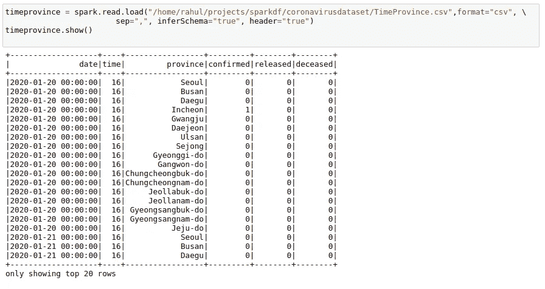
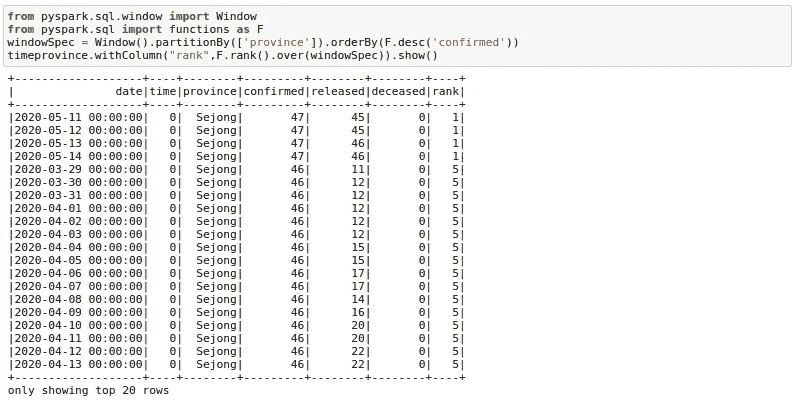
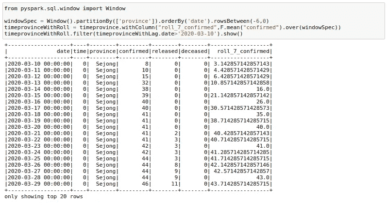
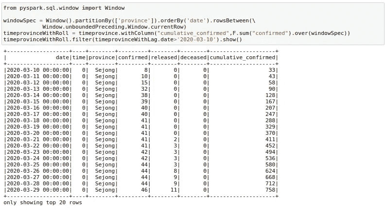

# 在您的数据科学工作流中包含这些 Spark 窗口函数

> 原文：<https://towardsdatascience.com/include-these-spark-window-functions-in-your-data-science-workflow-c6bac5824475?source=collection_archive---------20----------------------->


来源: [Pixabay](https://pixabay.com/photos/window-woman-morning-girl-1148929/)

## 使用 pySpark 创建等级、滞后和滚动特征

在我关于 Spark 的最后几篇文章中，我解释了如何使用 PySpark RDDs 和 Dataframes。

虽然这些帖子解释了很多关于如何使用 rdd 和数据帧操作的内容，如果读者想学习 Spark 基础知识，我会要求他们通读这些帖子，但我仍然没有提到很多关于使用 PySpark 数据帧的内容。

其中一个就是火花窗函数。

最近，当我在做我的一个项目时，我意识到了它们的力量，所以这篇**文章将是关于 Spark 中一些最重要的窗口功能。**

# 数据

我将与南韩的[新冠肺炎数据科学](https://www.kaggle.com/kimjihoo/coronavirusdataset)合作，这是 COVID 在互联网上最详细的数据集之一。

请注意，我将使用这个数据集来展示窗口函数，但这不应该以任何方式被视为对这个奇妙数据集的数据探索练习。

对于本文，我将使用 TimeProvince 数据框架，它包含每个省的每日病例信息。



# 等级

使用此功能，您可以在一个组上获得`rank`和`dense_rank`。例如，您可能希望 timeprovince 表中有一列提供某个省中每天的排名。我们可以通过以下方式做到这一点:

```
from pyspark.sql.window import Window
from pyspark.sql import functions as FwindowSpec = Window().partitionBy(['province']).orderBy(F.desc('confirmed'))
timeprovince.withColumn("rank",F.rank().over(windowSpec)).show()
```



这里，我们首先创建一个由`province`划分的`window`，并按照`confirmed`案例的降序排列。人们可以把`window`看作是按照用户提供的顺序排列的一组特定省份的行。然后，我们可以通过在这个窗口上使用 rank 函数轻松地添加等级，如上所示。

# 滞后变量

有时，我们的数据科学模型可能需要基于滞后的功能。例如，一个模型可能有像`price_last_week`或`sales_ quantity_previous_day`这样的变量。我们可以使用窗口函数的滞后函数来创建这样的特征。在这里，我试图得到 7 天前确诊的病例。我正在过滤以显示结果，因为头几天的电晕案例为零。您可以在这里看到 lag_7 day 特性移动了 7 天。

```
from pyspark.sql.window import Window
windowSpec = Window().partitionBy(['province']).orderBy('date')
timeprovinceWithLag = timeprovince.withColumn("lag_7",F.lag("confirmed", 7).over(windowSpec))timeprovinceWithLag.filter(timeprovinceWithLag.date>'2020-03-10').show()
```


# 滚动聚合

有时，为我们的模型提供滚动平均值会有所帮助。例如，我们可能希望将连续 7 天的销售额总和/平均值作为销售回归模型的一个特性。让我们计算一下过去 7 天确诊病例的移动平均数。这是很多人已经在用这个数据集做的事情，来看真实的趋势。

```
from pyspark.sql.window import WindowwindowSpec = Window().partitionBy(['province']).orderBy('date')**.rowsBetween(-6,0)**timeprovinceWithRoll = timeprovince.withColumn("roll_7_confirmed",F.mean("confirmed").over(windowSpec))timeprovinceWithRoll.filter(timeprovinceWithLag.date>'2020-03-10').show()
```



这里有几件事需要了解。首先是我们在这里使用的 `**rowsBetween(-6,0)**` 函数。该函数有一个包含开始和结束的`rowsBetween(start,end)`形式。使用此功能，我们只查看特定窗口中过去七天的情况，包括当前日期。这里 0 指定当前行，而-6 指定当前行之前的第七行。记住，我们从 0 开始计数。

因此，为了得到日期为`2020–03–22`的`roll_7_confirmed`，我们查看日期为`2020–03–22 to 2020–03–16`的确诊病例，并取其平均值。

如果我们使用了`**rowsBetween(-7,-1)**` ，我们将只查看过去七天的数据，而不是当前日期。

我们还可以找到`rowsBetween(Window.unboundedPreceding, Window.currentRow)`的一种用法，我们从窗口的第一行和 current_row 之间的行中获取运行总数。我在这里计算累计 _ 确认。

```
from pyspark.sql.window import WindowwindowSpec = Window().partitionBy(['province']).orderBy('date').rowsBetween(Window.unboundedPreceding,Window.currentRow)
timeprovinceWithRoll = timeprovince.withColumn("cumulative_confirmed",F.sum("confirmed").over(windowSpec))
timeprovinceWithRoll.filter(timeprovinceWithLag.date>'2020-03-10').show()
```



# 结论

在这里，我尝试总结了一些我在使用 Spark 时使用的窗口函数。你可能会想到使用这些窗口函数的许多其他方式，但是我希望这篇文章能让你清楚地知道如何使用它们而不会太混乱。

***你可以在*** [***GitHub 库找到这篇文章的所有代码。***](https://github.com/MLWhiz/data_science_blogs/tree/master/sparkwindowfunc)

此外，如果您需要学习 Spark 基础知识，可以看看我之前的帖子:

[](/the-hitchhikers-guide-to-handle-big-data-using-spark-90b9be0fe89a) [## 使用 Spark 处理大数据的指南

### 不仅仅是介绍

towardsdatascience.com](/the-hitchhikers-guide-to-handle-big-data-using-spark-90b9be0fe89a) 

还有，如果你想了解更多关于 Spark 和 Spark DataFrames 的知识，我想调出这些关于 [**大数据基础知识的优秀课程:HDFS、MapReduce 和 Spark RDD**](https://click.linksynergy.com/link?id=lVarvwc5BD0&offerid=467035.11468293556&type=2&murl=https%3A%2F%2Fwww.coursera.org%2Flearn%2Fbig-data-essentials) 和 [**大数据分析:Hive、Spark SQL、DataFrames 和 GraphFrames**](https://click.linksynergy.com/link?id=lVarvwc5BD0&offerid=467035.11468293488&type=2&murl=https%3A%2F%2Fwww.coursera.org%2Flearn%2Fbig-data-analysis) 由 Yandex 在 Coursera 上提供。

谢谢你的阅读。将来我也会写更多初学者友好的帖子。在 [**媒体**](https://medium.com/@rahul_agarwal?source=post_page---------------------------) 关注我，或者订阅我的 [**博客**](http://eepurl.com/dbQnuX?source=post_page---------------------------) 了解他们。一如既往，我欢迎反馈和建设性的批评，可以通过 Twitter[**@ mlwhiz**](https://twitter.com/MLWhiz?source=post_page---------------------------)联系

此外，一个小小的免责声明——这篇文章中可能会有一些相关资源的附属链接，因为分享知识从来都不是一个坏主意。