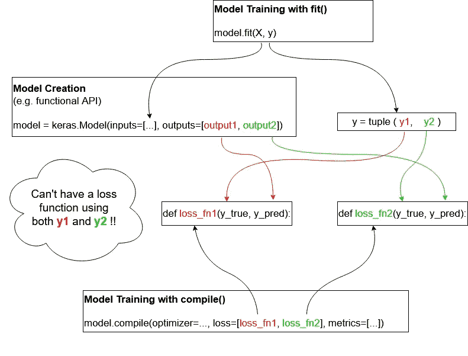
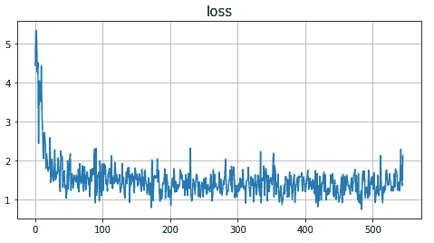
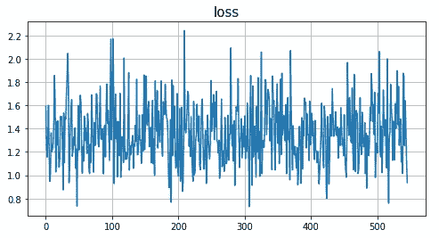
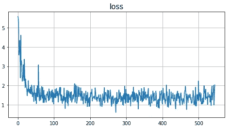
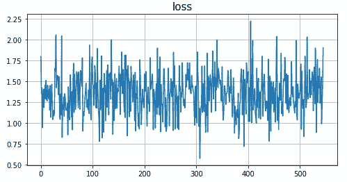

# 使用 Tensorflow 2 在保存的模型中包含训练操作

> 原文：<https://towardsdatascience.com/include-training-operations-in-saved-models-with-tensorflow-2-6494d304036d?source=collection_archive---------35----------------------->

## 向以 SavedModel 格式导出的模型中的推理操作添加训练操作，以及如何用低级操作调用它们。


照片由[马特·王](https://unsplash.com/@iseeworld?utm_source=unsplash&utm_medium=referral&utm_content=creditCopyText)在 [Unsplash](https://unsplash.com/s/photos/data-science?utm_source=unsplash&utm_medium=referral&utm_content=creditCopyText) 上拍摄

大多数 Tensorflow 文档和教程都展示了如何用 python 训练一个模型，并将其保存为 SavedModel 格式，以便在另一个环境中进行预测。但是为**培训**保存一个模型需要更多的工作。本文介绍了一种方法。所有的代码都在这个 [jupyter 笔记本](https://colab.research.google.com/drive/1VM0uolTFFxosakT5ox1Y9TUTjVVKLKzP?usp=sharing)里(用 tensorflow 2.3 测试)

## 高级 API 的一些限制

通常的场景是构建一个 Keras 模型并用`model.save()`导出它。然而，这仅保存了预测图，并且以后不可能在另一个环境中加载该模型。

此外，虽然简单的`model.compile()` + `model.fit()`场景可以涵盖许多场景，但它不允许设计复杂的损失函数，这些函数组合了对应于几个输出的标签，如下所示:



不能让一个函数使用多个标签来计算损失

复杂的情况通常用定制的训练循环来解决。节选自[优秀 Keras 教程](https://keras.io/guides/writing_a_training_loop_from_scratch/):

在这里，损失函数`loss_fn`可以做任何事情，并且在多输出模型的情况下可以访问所有标签。但问题是，我们仍然只剩下一个只能导出服务图的模型。所有的训练循环都不会被导出。

解决方案是在`tf.Module`中使用`tf.function`来导出几乎任何可以用张量流图运算表达的代码。

# tf.function 中的自定义训练步骤

在下面的代码中，我们用函数式 API 定义了一个 Keras 模型。它包括一个定制层，不是完全无关紧要，但它可以是任何复杂性。我们还在包含在自定义`tf.Module`中的`tf.function`中定义了一个自定义训练步骤。

tf.function 中的自定义训练步骤。组件

```
sample prediction:  [[0.20642705]]
```

让我们反复调用`my_train`函数来训练模型

```
Mean squared error: step 100: 1.3914144039154053
Mean squared error: step 200: 1.3325191736221313
Mean squared error: step 300: 1.321561574935913
Mean squared error: step 400: 1.3107181787490845
Mean squared error: step 500: 1.3031591176986694
```



让我们检查一下我们使用的`ADAM`优化器的状态。亚当学习与每个重量相关的两个变量`m`和`v`。

`m`和`v`分别是梯度的一阶矩(均值)和二阶矩(无中心方差)的估计。
了解更多信息:[https://ruder . io/optimizing-gradient-descent/index . html # Adam](https://ruder.io/optimizing-gradient-descent/index.html#adam)

在张量流术语中，它们被称为`slots`。有关如何跟踪它们的更多信息，请参见[https://www . tensor flow . org/guide/check point # loading _ mechanics](https://www.tensorflow.org/guide/checkpoint#loading_mechanics)

让我们检查 ADAM 的`m`槽的内容，看第一个密集层的偏差。

让我们再训练一会儿。正如预期的那样，损失仍然很低(注意该图的比例)



然后，我们可以检查 ADAM 优化器的变量是否也发生了变化:

# 坚持模型，继续训练

以上都是在记忆中完成的。同样，当我们保存一个模型时，不仅保存了层的权重，还保存了优化器的状态，这很好。然后，当我们继续训练一个重新加载的模型时，优化器不需要重新学习它的变量(ADAM 的`m`和`v`时刻)。

让我们以 SavedModel 格式保存模块。SavedModel 格式包含描述导出函数及其输入和输出的签名，这些签名在我们加载模型时可用。更多信息见[https://www.tensorflow.org/guide/saved_model](https://www.tensorflow.org/guide/saved_model)

然后我们将检查与模型一起保存的检查点的内容。

我们不仅可以看到层的权重，还可以看到前面讨论过的亚当槽变量(`m`和`v`)。

节选自[https://www . tensor flow . org/guide/saved _ model # saving _ a _ custom _ model](https://www.tensorflow.org/guide/saved_model#saving_a_custom_model)

> *保存一个* `*tf.Module*` *时，任何* `*tf.Variable*` *属性、*`*tf.function*`*-修饰方法，以及通过递归遍历找到的* `*tf.Modules*` *都被保存。(参见* [*检查点教程*](https://www.tensorflow.org/guide/checkpoint) *了解更多关于递归遍历的信息。)*

这在[https://www . tensor flow . org/guide/check point # loading _ mechanics](https://www.tensorflow.org/guide/checkpoint#loading_mechanics)中有详细介绍

让我们检查一下亚当的`m`槽的内容，看看第一个密集层的偏差

我们可以看到，这正是上面用`module.opt.weights[2]`检查的那个槽的内存内容

这表明 ADAM 的状态确实保存在检查点中。让我们用 Tensorflow 捆绑的`saved_model_cli`工具来看看导出的签名。

```
!saved_model_cli show --all --dir $model_dir
```

我们看到预测(`my_serve`)和训练(`my_training`)输出函数的预期签名。稍后将详细介绍。
让我们创建一个模块的新实例，不经训练保存它并重新加载它。

这里值得注意的是，加载的`new_module`对象不是一个`tf.Module`实例，而是另一种仍然提供我们导出的`my_train`和`__call__`函数的对象。让我们调用`__call__()`方法来看看它是否工作(将产生任何东西，因为模型还没有被训练)

因此，我们仍然可以将`my_train`函数与`train_module`函数一起使用。让我们训练重新加载的模块，然后保存它



上面显示了我们可以加载一个模块并训练它，就像我们用`CustomModule()`实例化它一样。让我们像上面一样检查一些优化器状态。

重新加载模块，继续培训并保存



就像我们在内存中所做的一样——只是前面显示了重量已经被正确地重新加载，并且我们没有从头开始训练。亚当的变量呢？

亚当的变量也发生了变化。随着训练的继续，它们的变化越来越小，这可以通过取训练前后那些槽的差的范数来显示，并且看到该范数随着时间而减小。

这表明优化器状态也在保存的模型中被捕获，并且我们可以停止和恢复训练而不会丢失任何东西。

# 低级操作

以上所有工作都是在重载模块时使用 python 对象和方法完成的。但是在只有图形和操作的情况下，我们如何用另一种语言来做呢？

我们先来看看用 python 怎么做。这是`my_train`签名的`saved_model_cli`输出:

```
signature_def['my_train']:
  The given SavedModel SignatureDef contains the following input(s):
    inputs['X'] tensor_info:
        dtype: DT_FLOAT
        shape: (-1, 8)
        name: my_train_X:0
    inputs['y'] tensor_info:
        dtype: DT_FLOAT
        shape: (-1)
        name: my_train_y:0
  The given SavedModel SignatureDef contains the following output(s):
    outputs['output_0'] tensor_info:
        dtype: DT_FLOAT
        shape: ()
        name: StatefulPartitionedCall_1:0
  Method name is: tensorflow/serving/predict
```

事实证明，我们可以通过这里显示的名字来访问输入和输出张量。例如:

*   `inputs['X']`有名字`my_train_x:0`
*   `output['output_0']`(损失)有名称`StatefulPartitionedCall_1:0`

隐藏的是用于保存模型的操作和张量

*   检查点名称:`saver_filename:0`:必须指向`model_dir + '/variables/variables'`
*   保存操作:`StatefulPartitionedCall_2:0`:本模块导出后的下一个`StatefulPartitionedCall`

关于保存操作的信息当然没有被记录，这可能是有意的，因此这可能在未来的 tensorflow 版本中不起作用。

用低级操作训练和预测加载模型

```
loss: 1.2404047
prediction: [[1.9881454]]
checkpoint saved
```

如果你不止一次执行`train_predict_serve()`，你会得到不同的结果，因为模型的权重会随着训练和预测的变化而变化。

以上表明，我们可以仅通过低级操作来训练、保存模块并进行预测。
这允许**导出空白模型**及其训练和服务图表，并让第三方组织对其进行训练和预测。导出的操作足以让该组织训练和监控损失减少，报告验证数据集的准确性并做出推断。

*边注*:如果模块函数返回两个输出，`saved_model_cli`会这样报告它们:

```
The given SavedModel SignatureDef contains the following output(s):
    outputs['output_0'] tensor_info:
        dtype: DT_FLOAT
        shape: ()
        name: StatefulPartitionedCall_1:0
    outputs['output_1'] tensor_info:
        dtype: DT_FLOAT
        shape: ()
        name: StatefulPartitionedCall_1:1
```

他们可以这样理解:

相同的导出模型可用于 java 中的训练和预测，代码如下:

打印这个:

```
loss after training: 1.2554951
prediction: 2.1101139
```

这个 java 代码是用 tensorflow 2.3.0 测试的。更多信息:
[https://github.com/tensorflow/java](https://github.com/tensorflow/java)
https://www . tensor flow . org/API _ docs/Java/reference/org/tensor flow/package-summary

为了完整性，请注意，也可以通过使用[experimental _ export _ all _ saved _ models](https://www.tensorflow.org/api_docs/python/tf/estimator/Estimator#experimental_export_all_saved_models)方法，将预测图和训练图导出到带有`tf.Estimator`的单个 SavedModel 中。我们也可以用低级图形操作来调用它。这是一种不同的方法，需要函数来构建模型，并以明确定义的格式返回数据集。欲了解更多信息，请参见[估算师指南](https://www.tensorflow.org/guide/estimator)。

# 结论

在本文中，我们展示了一种将训练步骤导出为 SavedModel 格式的方法，以及如何在 python 中的重载模型上调用它，以及在 python 或另一种语言(如 java)中使用低级操作调用它。

关于 SavedModel 操作的其他有用链接(感谢 Drew Hodun！)
[https://towards data science . com/how-to-extend-a-keras-model-5 effc 083265 c](/how-to-extend-a-keras-model-5effc083265c)