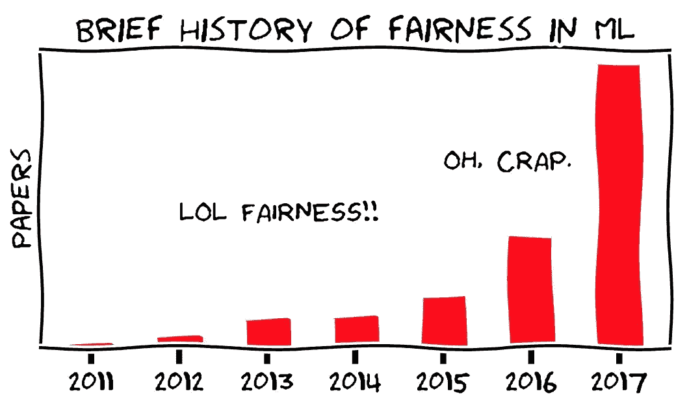
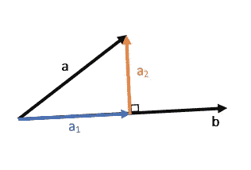
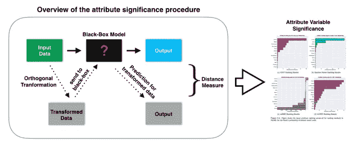

# 包容性机器学习:解决模型公平性问题

> 原文：<https://towardsdatascience.com/inclusive-machine-learning-addressing-model-fairness-532884ecd859?source=collection_archive---------40----------------------->

## AI 中的公平是什么？我们如何解决这个问题？实现模型公平性用例。

人工智能(AI)和机器学习(ML)系统正越来越多地用于所有部门和社会。

伴随着这种增长，**模型公平性**在过去几年里已经获得了关注。该领域旨在评估该模型在处理数据中预先存在的偏见时的公平性: ***职位匹配系统因为与历史数据相匹配而倾向于男性候选人参加 CEO 面试，这公平吗？***



图 1:2011 年至 2017 年发表的论文数量(图片由 [Moritz Hardt](https://fairmlbook.org/) 提供)

在我之前的文章中，我提到了 ML 模型的可解释性。这一次，我们将更进一步，评估我们训练的模型如何处理潜在的敏感(有偏见)特征。

***审计一个模型并不总是黑白分明的***——在一个上下文中可能敏感的特性在另一个上下文中可能不那么敏感。很少有人会认为性别不应该决定一个人是否能找到工作。但是，某保险公司定价模型因为历史数据显示男性比女性理赔多而向男性收取更多费用，这是否不公平？或者这是他们更鲁莽驾驶的正确原因吗？当然，这至少是有争议的。

在许多用例中，公平性的定义并不是绝对清晰的。为系统确定适当的公平标准需要考虑用户体验、文化、社会、历史、政治、法律和伦理因素，其中一些因素可能需要权衡。

在本文中，我们将使用由 Julius Adebayo 开发的 FairML 库来解决模型公平性问题。使用的完整代码可以在我的 [**GitHub**](https://github.com/fpretto/interpretable_and_fair_ml) 中找到

# 内容

1.  数据集和模型培训
2.  公平的直觉
3.  评估模型公平性
4.  推荐做法

# 1.数据集和模型培训

本文使用的数据集是来自 UCI 机器学习知识库的 [*成人人口普查收入*](https://www.kaggle.com/uciml/adult-census-income) 。预测任务是确定一个人的年收入是否超过 5 万美元。

由于本文的重点不在 ML 管道的建模阶段，所以执行了最小特征工程，以便用 XGBoost 对数据进行建模。

为该模型获得的性能指标如下:


图 2:训练和测试集的接收操作特性(ROC)曲线。


图 3: XGBoost 性能指标

这个模型的性能似乎还可以接受。

在我之前的文章中，我们讨论了几种解决模型可解释性的技术。在其他库中，我们使用 SHAP 来获得模型输出中的特性重要性:


图 4: SHAP 特征重要性

数据集中有几个特征可以被认为是包含在模型中的**【敏感性】**，其中一些比另一些更有争议。例如，像**国籍**、**种族**和**性别**这样的特征可能是决定一个人收入的最敏感的特征。

此外，尽管像**年龄**和**婚姻状况**这样的特征可能通过掩盖个人的某些方面(如工作经验或教育程度)而具有良好的预测能力，但它们也可能被视为敏感信息。

那么，我们如何评估模型在多大程度上依赖这些敏感特征来进行预测呢？

# 2.公平的直觉

像大多数解释算法一样，FairML 背后的基本思想是测量模型的预测如何随着输入的扰动而变化。如果一个特征的微小变化显著地修改了输出，那么模型对该特征是敏感的。

然而，如果特征是相关的，它们之间的间接影响可能仍然没有在解释模型中被考虑。 **FairML 使用正交投影解决了多重共线性问题**。

## **正交投影**



图 5:矢量 a 在矢量 b 上的正交投影

正交投影是一种矢量投影，它将一个矢量映射到另一个矢量的正交方向上。如果将一个矢量 ***a*** 投影到一个矢量 ***b*** (在欧氏空间)上，则得到 ***a*** 位于 ***b*** 方向的分量。

这个概念在 FairML 中非常重要，因为它允许完全消除特征之间的线性依赖。如果两个向量相互正交，那么没有一个向量可以产生另一个向量的线性组合。 ***a*** 正交于**b**的分量，可计算为***【a2】*=*a-a1***

**正交投影保证不会有隐藏的共线性效应**。值得注意的是，这是一个线性变换，因此它不考虑特征之间的非线性依赖关系。为了解决这个问题，FairML 使用了基展开和对这种展开的贪婪搜索。

## FairML 过程



图 6:解决模型公平性的 FairML 方法(图片由 [Julius Adebayo](https://github.com/adebayoj/fairml) 提供)

如果 ***F*** 是训练有两个特征*和 ***x2*** 的模型，为了计算 ***F*** 对 ***x1*** 的依赖性，首先使 ***x2*** 与 ***x1*** 正交其次，使用 ***x2*** 的正交分量并在***×1***中进行扰动来分析模型输出的变化。扰动输入和原始输入之间的输出变化表明模型对 ***x1*** 的依赖性。 ***F*** 对 ***x2*** 的依赖关系可以用同样的方法估算。*

# *3.评估模型公平性*

*现在我们知道了 FairML 是如何工作的，让我们用它来评估我们的模型。首先，我们将安装 Python 包并导入所需的模块。*

```
*# FairML install
pip install [https://github.com/adebayoj/fairml/archive/master.zip](https://github.com/adebayoj/fairml/archive/master.zip)# Import modules
from fairml import audit_model
from fairml import plot_dependencies*
```

*其次，我们将对模型进行审计。 ***audit_model*** 方法接收 2 个必需输入和 5 个可选输入:*

***必需的***

*   ****predict _ function***:有预测方法的黑盒模型函数。*
*   ****输入 _ 数据帧*** :带形状的数据帧(n _ 样本，n _ 特征)*

***可选***

*   ****distance _ metric***:[*‘MSE’*，*‘accuracy’*](*default =‘MSE’*)之一*
*   ****直接 _ 输入 _ 扰动 _ 策略*** :指如何将单个变量归零。选项= [' *常数-零'*(替换为随机常数值)，'*常数-中值'*(替换为中值常数值)，'*全局-排列'*(替换为列的随机排列的所有值)]。*
*   ****运行次数*** :要执行的运行次数(*默认=10* )。*
*   ****include _ interactions***:启用检查模型对交互依赖的标志( *default=False* )。*
*   ****external _ data _ set***:没有用于训练模型的数据，但是您想要查看该数据对黑盒模型有什么影响( *default=None* )。*

```
*# Model Audit
importances, _ = audit_model(clf_xgb_array.predict, X_train)*
```

****audit_model*** 方法返回一个字典，其中键是输入数据帧 *(X_train)* 的列名，值是包含特定特性的模型依赖关系的列表。这些列表的大小为 ***运行次数*** 。*

*针对每个功能执行的过程如前一节所述。 ***这种方法的一个缺点是，当特征数量很大时，运行起来计算量很大。****

*FairML 允许绘制输出对每个特征的依赖性(排除与其他预测器的相关性的影响):*

```
*# Plot Feature Dependencies
plot_dependencies(importances.median(),
                  reverse_values=False,
                  title="FairML Feature Dependence",
                  fig_size=(6,12))*
```

**

*图 7: FairML 特征依赖*

*红色条表示该特征有助于输出 1(收入> 50K)，而浅蓝色条表示它有助于输出 0(收入<= 50k).*

*It is observed that this algorithm, by removing the dependence between features through orthogonal projection, identifies that the model has a high dependence on sensitive features such as *种族 _ 白人*、*NAC _ 美国*和*性别 _ 男性*)。换句话说，根据训练好的模型，一个出生在美国的白人将有更高的概率拥有大于 50k 美元的收入，这构成了一个非常强的偏见。*

***注意算法**中正交投影的相关性非常重要，因为像*种族 _ 白人*和*NAC _ 美国*这样的特征在 SHAP 的特征重要性或[其他解释算法](/uncovering-the-magic-interpreting-machine-learning-black-box-models-3154fb8ed01a)中似乎不那么相关。这可能是因为这些的效果隐藏在其他功能中。通过移除多重共线性并评估每个特征的个体依赖性，可以识别每个特征的内在影响。*

# *4.推荐做法*

*人工智能和人工智能中的公平性是一个开放的研究领域。作为该领域的主要贡献者， [GoogleAI](https://ai.google/responsibilities/responsible-ai-practices/?category=fairness) 推荐了一些最佳实践来解决这个问题:*

*   ****使用公平和包容的具体目标来设计你的模型*** :与社会科学家、人文主义者和其他与你的产品相关的专家合作，理解和考虑各种观点。*
*   ****使用代表性数据集来训练和测试你的模型*** :识别特征、标签和群组之间的偏见或歧视性关联。*
*   ****检查系统中不公平的偏见*** :在设计度量标准来训练和评估你的系统时，也包括度量标准来检查不同小组的表现*(使用不同的测试人员，并在困难的情况下对系统进行压力测试)*。*
*   ****分析性能*** :即使系统中的一切都经过精心制作以解决公平性问题，基于 ML 的模型在应用于真实的实时数据时也很少能达到 100%的完美。当一个问题出现在一个活的产品中时，考虑它是否与任何现存的社会弊端一致，以及它将如何受到短期和长期解决方案的影响。*

# *结论*

*这篇文章旨在帮助数据科学家更好地了解他们的机器学习模型如何处理数据中预先存在的偏见。*

*我们介绍了 FairML 如何解决这个问题的直觉，并对在 [*成人人口普查收入*](https://www.kaggle.com/uciml/adult-census-income) 数据集中训练的 XGBoost 模型进行了公平性评估。最后，我们总结了 GoogleAI 在这个不断发展的领域推荐的一些最佳实践。*

*作为结束语，我想引用谷歌负责任的人工智能实践中的一句话:*

> *人工智能系统正在为全球各地的人们带来新的体验和能力。除了推荐书籍和电视节目，人工智能系统还可以用于更重要的任务，例如预测医疗状况的存在和严重程度，将人与工作和伴侣进行匹配，或者识别一个人是否正在过马路。与基于特别规则或人类判断的决策过程相比，这种计算机化的辅助或决策系统有可能在更大范围内更加公平和包容。风险在于，这种体系中的任何不公平也会产生大范围的影响。因此，随着人工智能对各个部门和社会的影响越来越大，努力建立对所有人都公平和包容的系统至关重要。*

*我希望这篇文章能够作为解决黑盒模型中的公平性的一般指南，并为人工智能的更公平和更包容的使用提供一粒沙子。完整代码可以在我的 [**GitHub**](https://github.com/fpretto/interpretable_and_fair_ml) 中找到*