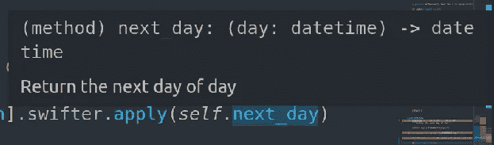
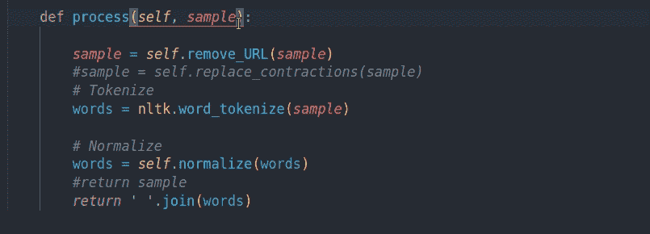
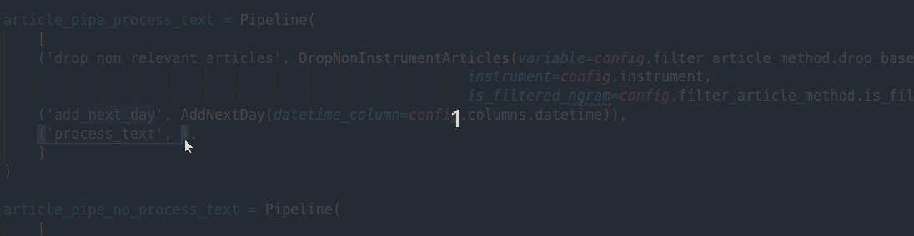
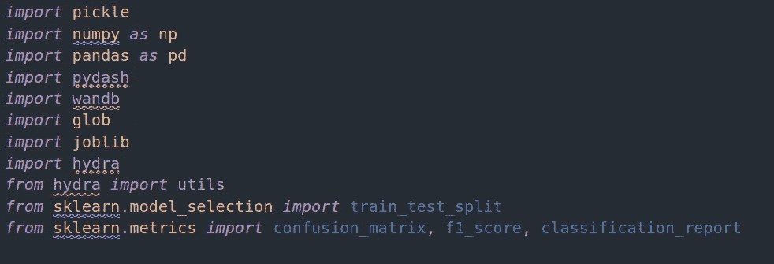
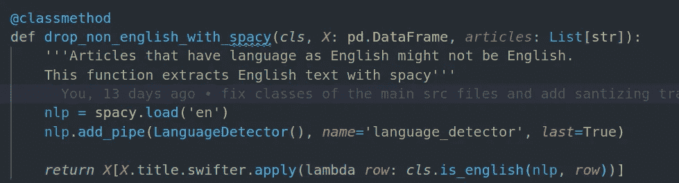
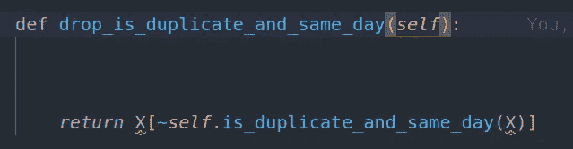
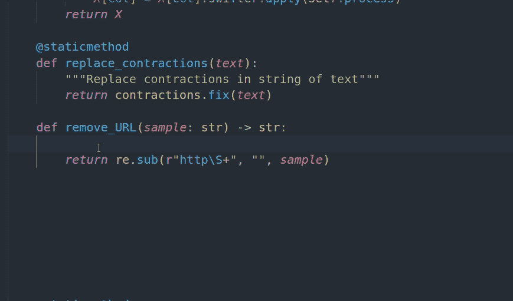
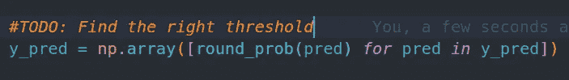
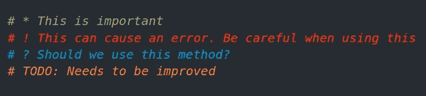

# 将 Python 的最佳实践与这 4 个顶级 VSCode 扩展相结合

> 原文：<https://towardsdatascience.com/incorporate-the-best-practices-for-python-with-these-top-4-vscode-extensions-3101177c23a9?source=collection_archive---------9----------------------->

## 为什么不让 Python 的最佳实践更容易被采用呢？

照片由[在](https://unsplash.com/@thisisengineering?utm_source=medium&utm_medium=referral) [Unsplash](https://unsplash.com?utm_source=medium&utm_medium=referral) 上拍摄

# 动机

作为一名数据科学家，拥有良好的编码实践是至关重要的，因为同事更容易查看您的代码，并且您在将来重新访问您的代码时也可以避免混淆。你希望你的代码既干净又容易理解。

因此，必须:

*   包含类型提示
*   编写好的文档
*   保留相关变量和函数，并导入相关包
*   突出显示需要注意或改进的代码
*   避免其他琐碎的错误，比如忘记声明变量

与其试图一次注意代码中的几个小细节，为什么不使用扩展来帮助和提醒你呢？这将有助于培养良好的编码实践。

VSCode 是我最喜欢的 IDE，因为它有用的键盘快捷键和扩展。我写了关于[我最喜欢的键盘快捷键](/how-to-leverage-visual-studio-code-for-your-data-science-projects-7078b70a72f0)和[vs code 中的这 4 个顶级代码查看器如何让我更容易地查看我的数据](/top-4-code-viewers-for-data-scientist-in-vscode-e275e492350d)。在本文中，我将介绍 4 个我最喜欢的 VSCode 扩展，以便进行良好的编码实践。

# Python 类型提示

**类型提示**表示 Python 代码中值的类型，让使用函数或类的人更容易知道在函数或类中为特定参数插入哪种数据类型。

例如，通过向函数添加类型信息，它会提醒那些使用您的代码的人插入 datetime 类型的参数。

类型提示是有帮助的，但是对于初学者来说，记住类型提示的所有语法可能是困难的。这时 [Python 类型提示](https://marketplace.visualstudio.com/items?itemName=njqdev.vscode-python-typehint)就派上用场了。

如果您没有使用 Python 3.9，请确保从`typing`导入`List, Set, Dict`，以指定 Python 列表、集合或字典中的数据类型

# 挂架

如果你用 Python 编码并使用 VSCode，你肯定应该安装 Pylance。 [Pylance](https://marketplace.visualstudio.com/items?itemName=ms-python.vscode-pylance) 为 Python 3 提供了许多令人敬畏的特性。这些功能包括:

## 显示文档字符串并建议参数

你是否曾经使用过你的类或函数，却忘记了输入哪些参数？Pylance 通过显示正在使用的类或函数的文档字符串，使您更容易输入正确的参数和数据类型。

## 显示未使用的库、变量或函数

导入大量的库或者声明一个在脚本中的其余代码中不会用到的变量或函数是很常见的。拥有不必要的代码会使你的代码变得混乱，让其他人阅读你的代码时更加困惑。

但是，查看每一行代码以确保只导入库或声明将要使用的变量或函数是非常耗时的。幸运的是，Pylance 通过不突出显示不使用的库、变量或函数使它变得更容易！

导入不必要的库

在函数中包含未使用参数

现在你可以删除那些没有高亮显示的！现在看起来应该没那么乱了。

## 报告代码中的错误

使用尚未在函数中声明或尚未包含在函数参数中的变量也很常见。Pylance 会检测到这一点，并给未定义的变量加下划线。

而且还有更多功能我这里不提！我鼓励您自己使用 Pylance 来发现这个扩展还能做些什么来帮助您更快地编码。

# Python 文档字符串生成器

对于您编写的函数或类，有一个好的 docstring 是很重要的，这样其他人就更容易理解和使用您的代码。但是您可能懒得编写合适的 docstring，因为这可能会花费您相当多的时间。

如果 docstring 是自动为您创建的呢？您可以使用 [Python Docstring Generator](https://marketplace.visualstudio.com/items?itemName=njpwerner.autodocstring) 扩展，通过简单地使用`Ctrl + Shift + 2`为您的函数或类创建一个 Docstring。

现在你需要做的就是用你的描述替换括号里面的文字！将来你的同事和你自己都会很高兴看到写得很好的 docstrings。

如果您喜欢其他 docstring 格式，可以切换到这些格式中的一种

*   谷歌(默认)
*   docBlockr
*   Numpy
*   狮身人面像

查看[文档](https://marketplace.visualstudio.com/items?itemName=njpwerner.autodocstring)了解如何切换格式。

# 更好的评论

不错！现在，您已经有了一个好的 docstring、类型提示，并组织了您杂乱的代码。但是你遗漏了一些东西。如果你想强调代码中重要的或者需要改进的部分怎么办？

例如，您使用 0.5 作为阈值将概率列表转换为二进制值，但您认为如果更改阈值，结果会有所改善。

但是，您希望在返回这段代码之前完成剩余的代码。如果你有不止一行，而是十行代码需要改进，你如何记住它们？

这时，带有单词 TODO 的代码注释就派上了用场。但是即使注释 TODO 在数百行代码中也是不可见的。幸运的是，[更好的注释](https://marketplace.visualstudio.com/items?itemName=aaron-bond.better-comments)扩展让你更容易注意到这些重要的注释。

有了这个扩展，您将能够将您的注释分类为:

*   突出
*   警报
*   问题
*   托多斯

现在您可以突出显示重要的注释，而不必担心您可能会忘记需要改进或需要小心处理的代码。

# 结论

恭喜你！您刚刚学习了 4 种不同的 VSCode 扩展，以便更快、更容易地采用良好的编码实践。编写好的文档，包括类型提示，突出重要的注释，并拥有干净的代码，将节省您调试的时间。良好的编码实践也将为你的同事节省几个小时甚至几天去解释和使用你的代码。结果，大家都很开心！

我喜欢写一些基本的数据科学概念，并尝试不同的算法和数据科学工具。你可以通过 [LinkedIn](https://www.linkedin.com/in/khuyen-tran-1ab926151/) 和 [Twitter](https://twitter.com/KhuyenTran16) 与我联系。

如果你想查看我写的所有文章的代码，请点击这里。在 Medium 上关注我，了解我的最新数据科学文章，例如:

 [## DVC 介绍:机器学习项目的数据版本控制工具

### 就像 Git 一样，但是有数据！

towardsdatascience.com](/introduction-to-dvc-data-version-control-tool-for-machine-learning-projects-7cb49c229fe0)  [## 数据科学家 Pytest

### 适用于您的数据科学项目的 Pytest 综合指南

towardsdatascience.com](/pytest-for-data-scientists-2990319e55e6)  [## 使用 Python 和情感分析探索和可视化您的 LinkedIn 网络

### 希望优化您的 LinkedIn 个人资料？为什么不让数据为你服务呢？

towardsdatascience.com](/sentiment-analysis-of-linkedin-messages-3bb152307f84)  [## 超调 ML 模型时提高效率的 3 个步骤

### 毫不费力地在不同型号之间切换，不会弄乱代码

towardsdatascience.com](/3-steps-to-improve-your-efficiency-when-hypertuning-ml-models-5a579d57065e)  [## Datapane 简介:构建交互式报表的 Python 库

### 创建精美报告并与您的团队分享分析结果的简单框架

towardsdatascience.com](/introduction-to-datapane-a-python-library-to-build-interactive-reports-4593fd3cb9c8)