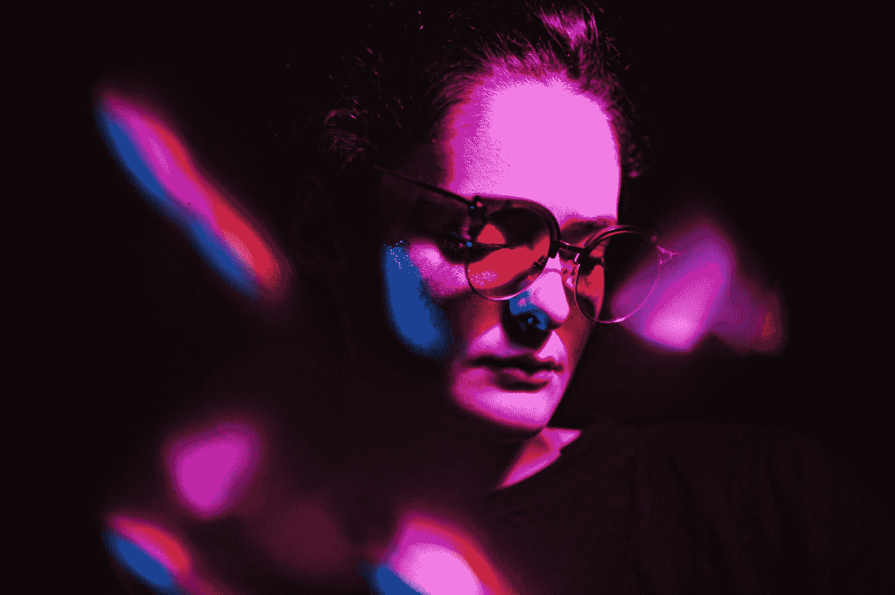

# 通过提高面部对比度来提高面部识别模型的准确性

> 原文：<https://towardsdatascience.com/increase-your-face-recognition-models-accuracy-by-improving-face-contrast-a3e71bb6b9fb?source=collection_archive---------16----------------------->

## 预处理图像以获得更好的结果

在 [Unsplash](https://unsplash.com?utm_source=medium&utm_medium=referral) 上由[Tiko giorgaze](https://unsplash.com/@domenika?utm_source=medium&utm_medium=referral)拍摄的照片

# 对比度提高图像预处理步骤

我给你介绍一下我前阵子遇到的一个问题。我正在试验面部检测和 [OpenCV](https://opencv.org/) ，以探索最新的机器和深度学习模型。

我注意到，对于有明显对比的人脸，检测和识别率明显更高。这让我开始思考，如何自动提高图像的对比度？

我给你看看什么是*直方图均衡* 。在这篇博文的最后，你将学会一个可以提高识别率的预处理步骤。首先，我将解释对比度在图像处理中的意义，然后我们将从这里开始。

最后，我将向您展示如何在彩色图像上应用一种非常先进的直方图均衡化方法，即所谓的*对比度受限的自适应直方图均衡化*算法(CLAHE)。

# 什么是图像中的对比度？

> “颜色或亮度的差异使一个物体与同一视野内的其他物体区分开来。”— [维基百科](https://en.wikipedia.org/wiki/Contrast_(vision))

这个定义对每个熟悉摄影的人都有意义。它直接告诉我们需要什么来将物体从背景中分离出来。

我们不需要低对比度或高对比度，而是介于两者之间。它需要是最优的。

高对比度和低对比度图像之间的差异(来源:[filmschoolonline.com](http://filmschoolonline.com/sample_lessons/sample_lesson_cinematography.htm))。

左边的图像比右边的图像对比度低。更难看清左脸的轮廓。

虽然后者具有更好的轮廓，但对比度太大的图像会丢失微妙的信息。这最后一部分可能是我内心的数据科学家会担心的事情。

当你在对一个对象进行分类之前提高对比度时，你就去除了一点噪声，这有助于改善模型。大轮廓是最重要的。

因此，当你应用对比度提高算法时，你必须记住一件事——不要过度。

# 直方图均衡

直方图均衡化是一种用于调整图像强度的图像处理技术。这增强了图像的对比度。

在幕后，可以用一个直方图来解释。均衡直方图意味着图像以相等的比例使用所有灰度级。然后，强度更好地分布在直方图上。

下图直观地展示了这一点，其中 T 是转换函数。我认为这对任何有统计学背景的人来说都是有意义的，你同意吗？

直方图均衡化(OpenCV [文档](https://opencv-python-tutroals.readthedocs.io/en/latest/py_tutorials/py_imgproc/py_histograms/py_histogram_equalization/py_histogram_equalization.html)

OpenCV 有一个`cv2.equalizeHist()`方法，在灰度输入图像上执行直方图。它具有作为输出的直方图均衡图像。这种方法对于具有亮/暗背景和前景的图像都很有用。

但是，直方图均衡化有一个重要的限制，它只有在整个图像中像素值的分布相似时才能正常工作。

当某些区域与图像的其他部分明显不同时(例如，更亮或更暗)，某些区域的对比度可能无法正确增强。

这种图像的一个例子是，从窗口进入的光使图像的一些区域明显变亮。

# 自适应直方图均衡

要解决直方图均衡算法的缺点，您可以为一幅图像计算多个直方图。

然后，每个直方图对应于图像的一个特定区域。这使得图像的每个区域被单独增强，从而解决了原来的问题。

然而，自适应直方图均衡算法产生了新的问题。AHE 会过度放大图像中接近恒定区域的对比度。

由于这种过度放大导致噪声在图像的特定区域被放大，我们需要一种替代方法。我在下一节提出了一个替代方案，所以坚持住。

照片由[马克西姆·梅德维杰夫](https://unsplash.com/@medvedevmax?utm_source=medium&utm_medium=referral)在 [Unsplash](https://unsplash.com?utm_source=medium&utm_medium=referral) 上拍摄

# 对比度有限的 AHE

如前所述，自适应直方图均衡会导致噪声在近常数区域被放大。

对比度受限 AHE 限制对比度放大，以降低放大噪声。这是通过在所有直方图中平均分布超出限幅的直方图部分来实现的。

但是你现在想看到一些结果，不是吗？我准备了一些东西，所以不要让你再等了。

适用 CLAHE 前后的美国现任总统。

请注意，脸部轮廓更加直观。这个预处理步骤你不用跟着我做，但是我觉得这是一个视觉上的提升。最重要的区域被稍微放大了。但是你是怎么做到的呢？

# 用 OpenCV 实现

我发现大多数实现只适用于灰度图像。所以，我认为，如果我能在这里做出改变，提供一个彩色图像的例子，将会非常有用。实现如下:

BRG 图像的 CLAHE 方法。

我只粘贴了最重要的部分，我认为每个经验丰富的数据科学家/工程师都应该能够解决剩下的部分。然而，我将详细解释这个方法。

首先，我将 BGR 图像(蓝色、绿色和红色通道)转换为 HSV 格式(色调、饱和度和值通道)。这允许我们只在价值通道上执行 CLAHE 算法。我们不想弄乱图像的色调或饱和度。

在我继续之前，让我解释一下 HSV:

*   色相:纯光谱颜色的术语，通常被称为“颜色名称”——红色、橙色、黄色、蓝色、绿色和紫色——出现在[色相圈](http://char.txa.cornell.edu/language/ELEMENT/COLOR/color.htm)中。
*   饱和度:指图像中颜色的强度。原色——红色、蓝色和黄色被认为是最纯净的，因为它们完全饱和。当饱和度增加时，颜色会感觉更纯。
*   值:指颜色的明度或暗度。没有色调或饱和度的图像是灰度图像。

接下来，我在图像的价值通道上应用 CLAHE。我也将解释我使用的参数。我发现默认的 40 的限制过于激进，当使用 2 时，结果通常会有所改善。

第二个参数——瓦片栅格*大小*——将一幅图像分割成 8 列 8 行的 64 个瓦片。假设您的输入图像是 160x160 像素宽。在这种情况下，我将图像分割成 20x20 像素的区域。

这两个参数经常被用作缺省值，所以我没有费事去改变它们。请记住，如果你想要一致的行为，每张图片都应该使用相同的比例。

在最后的步骤中，在我将图像恢复为原始的 BGR 格式之前，我简单地将改变后的色值通道与色调和饱和度通道合并。

# 什么时候用？

由[马特·阿特兹](https://unsplash.com/@mattartz?utm_source=medium&utm_medium=referral)在 [Unsplash](https://unsplash.com?utm_source=medium&utm_medium=referral) 上拍摄

我把这留给读者去发现。对我来说，这在两个阶段是有用的。在检测阶段或识别阶段。我会解释这两者，如果可能的话，我会讨论替代方案。

## 探测阶段

在这个阶段，它当然可以帮助找到更多的对象。我做了测试，使用 CLAHE 后，该模型可以检测更多的对象。例如，它还可以应用于 MRI 扫描。

然而，对于对象检测，有时对图像进行上采样会更有用。这比在整个图像上使用 CLAHE 效果更好。

## 识别期

正如我所展示的，在识别阶段使用 CLAHE 肯定是有帮助的。例如，当人们需要对图像进行分类来训练模型时，它可以在视觉上帮助他们更好地完成任务。

作为预处理步骤，对于特定的机器学习模型也可能是有益的。在我的一个项目中，我能够在 50 次运行中增加 1.5%的平均准确率(CLAHE 0.9534%，没有 0.9384%)。这是一个显著的增加，这也让我相信这是一个非常好的预处理步骤。

我还不确定它是否会改变物体识别的生活，因为很难找到关于这个主题的好研究。如果你有一些好的研究成果，比如在人脸识别领域，请随意评论这个故事。

# 结论

我希望找到一些答案，也希望作为读者的你能为我寻找改进的物体检测和识别做出贡献。

我总是乐于讨论我感兴趣的话题，所以欢迎在下面发表评论。我打算继续学习这门学科。