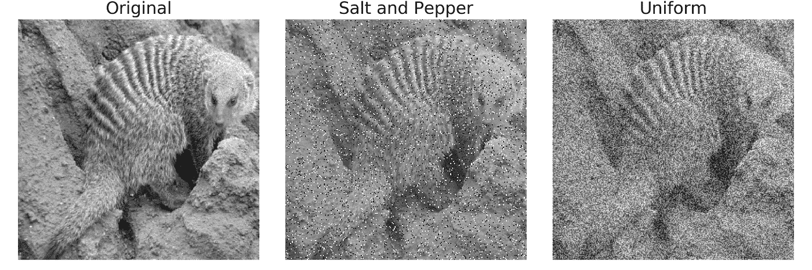
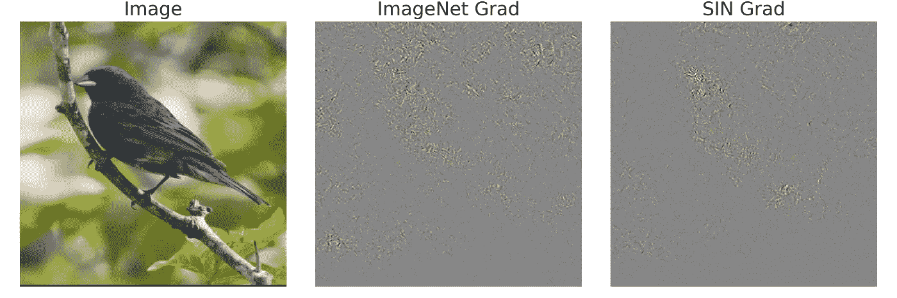

# 增加可解释性以提高模型的稳健性

> 原文：<https://towardsdatascience.com/increasing-interpretability-to-improve-model-robustness-56b68e43ed9a?source=collection_archive---------45----------------------->

对抗性训练鼓励使用更相关的特征。

最近一项提高卷积神经网络(CNN)在图像分类任务中的鲁棒性的尝试揭示了鲁棒性和可解释性之间的有趣联系。使用对抗训练训练的模型，一种用对抗例子增加训练数据的训练过程，具有输入梯度，与没有对抗训练训练的模型相比，该输入梯度在质量上看起来使用输入的更相关的区域。这篇文章的封面照片显示了这一点(中间一排没有对抗训练，底部一排有对抗训练)。这是正则化技术的一个意想不到且受欢迎的好处，迄今为止，正则化技术已被证明是对抗对抗性例子的最有效的防御。因此，在某些情况下，提高模型的稳健性可以提高模型的可解释性。你可以在齐普拉斯等人的[原文](https://arxiv.org/abs/1805.12152)中看到更多关于 ImageNet 和 CIFAR10 的例子，然而这只是硬币的一面。虽然在一些任务/数据集上，CNN 可以胜过人类，但是它们远非完美，因为它们对诸如均匀噪声之类的图像破坏的鲁棒性较低，并且不能从一种破坏推广到另一种破坏。使 CNN 对一组讹误具有鲁棒性的一个天真的解决方案是使用这些讹误来增加训练数据，但是 Geirhos 等人已经[证明这将导致欠拟合](https://arxiv.org/abs/1808.08750)。考虑下面的三个图像，并尝试区分中间和右边的图像。

噪声可视化

椒盐噪声图像看起来类似于均匀噪声图像，然而仅用椒盐噪声增加训练数据对正确分类被均匀噪声破坏的图像几乎没有影响。对此的一种可能解释是，神经网络不像人类那样学会忽略噪声，而是适应特定的噪声分布，并且只对那些被训练过的噪声保持不变。盖尔霍斯等人的这项非常重要的[工作](https://arxiv.org/abs/1808.08750)在研究界引发了极大的兴趣，以进一步了解人类和计算机视觉之间的差异。也许通过弥合这一差距可以提高模型的可解释性和稳健性。我们稍后会看到这是否确实是这样，但我们首先描述人类视觉用于核心对象识别的特征和计算机视觉用于图像分类的特征中最基本的差异之一。

盖尔斯等人的[后续工作](https://arxiv.org/abs/1811.12231)以及[贝克等人的](https://journals.plos.org/ploscompbiol/article?id=10.1371/journal.pcbi.1006613)已经观察到，CNN 在进行分类时存在纹理偏差。这意味着填充有高尔夫球纹理的茶壶轮廓将被归类为高尔夫球。如果目标是识别图像中的各种织物或材料，例如当总结服装图像的属性时，这种行为实际上是所期望的。然而，对于分类来说，这可能会导致将一幅具有不寻常喷漆作业的汽车图像分类为草地。人类在进行分类时偏向于使用形状，这一事实不仅仅是一种直觉的推测，而是彻底的受控实验的结果。参与者被呈现所谓的线索冲突图像，这些图像是通过在 ImageNet 图像上应用风格转移来创建的，以便它们具有期望的纹理。但是，形状信息会被保留。这些图像看起来类似于下面这些来自贝克等人的作品。

贝克等人的提示冲突图片。点击[此处](https://journals.plos.org/ploscompbiol/article?id=10.1371/journal.pcbi.1006613)链接到许可证

然后，他们被要求从每张图片的 16 个类别中挑选。大多数情况下，参与者选择的是与图像中主要对象的形状相对应的类别，而不是叠加的纹理。作者随后提出，也许鼓励模型具有与人类相似的行为偏差会给人类视觉带来其他额外的好处，如腐败鲁棒性。为了实现这种偏好的形状偏差，他们创建了一个新的数据集，称为风格化图像网络(SIN)，这是通过将绘画数据集的 AdaIn 风格转换应用到图像网络而获得的。这导致纹理对于分类来说是不可靠的特征，因为根据所使用的风格化，同一类别的图像将具有随机纹理。SIN 是一个更难分类的数据集，事实表明，在 ImageNet 上训练和评估的模型达到 92.9%的准确性，但在 SIN 上评估时，它仅达到 16.4%的准确性。相反，在 SIN 上训练和评估的模型达到 79%的准确度，而在 ImageNet 上评估时具有 82.6%的准确度。经过 SIN 训练的模型具有与人类更相似的形状偏好，这表明对风格化图像进行分类的能力不是通过记住每种风格来实现的，而是通过使用形状来实现的。更重要的是，通过对 SIN 的训练，提高了对讹误的鲁棒性。除了两种特定的讹误类型之外，由于形状偏差的增加，对所有其他被认为是讹误的鲁棒性都得到了提高。

当对抗训练被用于显式地使模型对对抗的例子鲁棒时，可视化的梯度使用更符合人类视觉的特征。罪恶训练过的模特也是这样吗？渐变可视化反映了前面提到的形状偏差吗？幸运的是，这些模型可以在网上获得，所以繁重的工作已经完成，只剩下梯度可视化。正如你在下面看到的，在 ImageNet 上训练的 ResNet 的梯度和在 SIN 上训练的 ResNet 的梯度之间有非常微小的差别，但是与通过对抗性训练获得的梯度完全不同。这一发现表明，可解释性、腐败鲁棒性和行为偏差之间的联系尚不清楚。此外，SIN 训练的模型的对抗性鲁棒性还没有被彻底表征，尽管简单的 FGS 攻击揭示了 ImageNet 和 SIN 训练的模型之间没有显著差异，在 1000 个 ImageNet 验证图像的子集上，前者具有 12.1%的准确性，而后者具有 14.3%的准确性。

因此，如果梯度可视化不能揭示训练 SIN 的明显好处，那么还有什么可以弥补人类和计算机视觉之间的差距呢？也许模仿人类的行为偏见是不够的。另外，人类视觉是多任务的，且可以执行对象跟踪、分割、分类等。这揭示了一个可能的问题，即视觉模型目前如何被训练为仅用于一个感兴趣的任务的筒仓。如果 CNN 或其他架构要展现出我们人类认为理所当然的相同属性，如果以多任务的方式利用几个监督来源进行训练，它们可能会更快地实现这个目标。事实上，在语言理解等领域，深度学习的极限几乎已经达到，因为研究人员意识到，当只从文本中学习时，对物体的大小和形状进行推理是非常困难的。将多项任务结合在一起是解决人类和计算机视觉之间最明显差异的一小步，但可能是必要的一步。然而，即使在这一步之后，考虑到对抗性例子是多么普遍，即使研究人员在过去 6 年中一直试图防御它们，也可能还有很长的路要走。