# 使用 Python 中的 scikit-image 增加数据的数量和多样性

> 原文：<https://towardsdatascience.com/increasing-the-amount-and-diversity-of-data-part-1-2025caf9d53c?source=collection_archive---------33----------------------->

## [理解大数据](https://towardsdatascience.com/tagged/making-sense-of-big-data)

## Python 中的图像数据扩充库系列


图片由[拉尔夫·昆泽](https://pixabay.com/users/realworkhard-23566/?utm_source=link-attribution&utm_medium=referral&utm_campaign=image&utm_content=110850)从[皮克斯拜](https://pixabay.com/?utm_source=link-attribution&utm_medium=referral&utm_campaign=image&utm_content=110850)拍摄

深度学习技术在计算机视觉任务中取得了巨大成功，即图像识别、图像分割、对象检测等。这种深度学习技术严重依赖大数据来避免过度拟合。那么在数据有限的情况下，你会怎么做呢？你去做数据扩充。[数据增强技术增强了训练数据集的规模和质量，因此可以使用它们建立更好的深度学习模型](https://link.springer.com/content/pdf/10.1186%2Fs40537-019-0197-0.pdf)。在本文中，我们将研究一些标准的图像增强技术和一些帮助实现这些增强的流行库。

# 增强技术的类型

基于何时在流水线中执行，扩充可以被宽泛地分类为离线扩充和在线扩充。

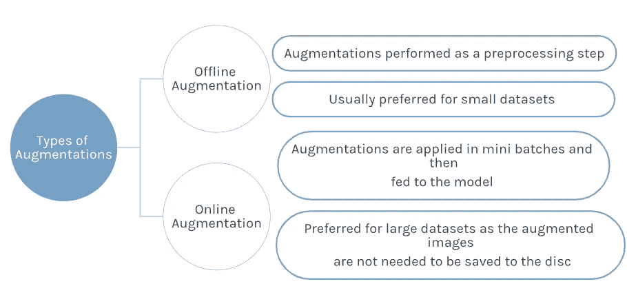

增强类型|按作者分类的图片

## 常用的增强技术。

在进入增强库之前，让我们先看看一些图像增强技术:

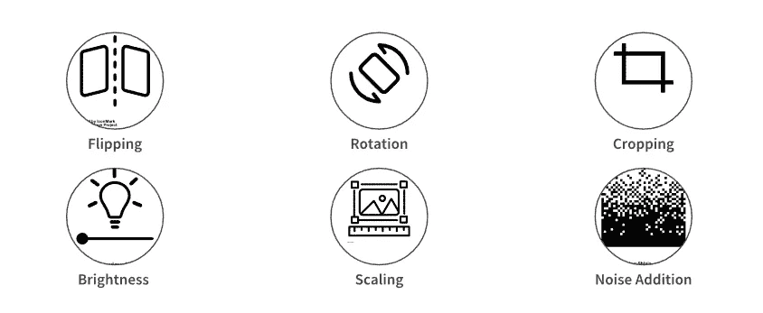

常用的增强技术|作者图片

*   **翻转**表示水平或垂直翻转图像。
*   **旋转**是将图像顺时针或逆时针旋转给定角度。
*   **裁剪**涉及随机采样一段图像。
*   **改变亮度**包括增加或降低图像的亮度。
*   **缩放—** 图像可以向外或向内缩放。向外缩放时，图像尺寸会增大，而向内缩放时，图像尺寸会减小。
*   **添加噪声**是指在现有图像上添加[高斯噪声](https://en.wikipedia.org/wiki/Gaussian_noise#:~:text=Gaussian%20noise%2C%20named%20after%20Carl,take%20on%20are%20Gaussian%2Ddistributed.)。

# 探索数据集:作为数组的图像

与人类不同，计算机将图像视为数据点。图像只不过是包含数据点像素的标准 Numpy 数组。图像的像素越多，分辨率就越高。

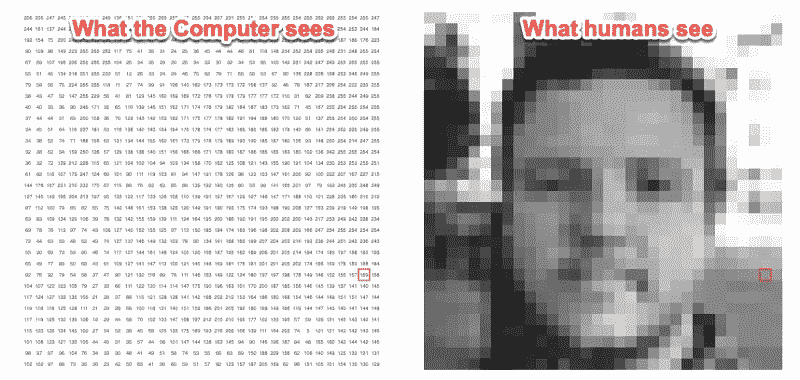

图片来源:[https://setosa.io/ev/image-kernels/](https://setosa.io/ev/image-kernels/)

记住这一事实，让我们来探索一下本文中我们将要处理的数据集。该数据集属于 2020 年 3 月由 Kaggle 主办的[植物病理学 2020 — FGVC7](https://www.kaggle.com/c/plant-pathology-2020-fgvc7) ，由人工捕捉的 3651 张高质量的[多种苹果叶部病害](https://arxiv.org/abs/2004.11958)的真实症状图像组成。

> 给定一张苹果叶子的照片，你能准确评估它的健康状况吗？这场比赛将挑战你区分健康的叶子，感染了苹果锈病的叶子，有苹果黑星病的叶子，以及有不止一种疾病的叶子。

在本文中，我们将只使用来自训练数据集的图像。

## 导入必要的库和数据集

```
import numpy as np
import pandas as pd
from skimage.io import imshow, imread, imsave
import matplotlib.pyplot as plt
%matplotlib inline # Defining data path
Image_Data_Path = "./plant-pathology-2020-fgvc7/images/"train_data = pd.read_csv("./plant-pathology-2020-fgvc7/train.csv") # Loading the training images 
def load_image(image_id):
    file_path = image_id + ".jpg"
    image = imread(Image_Data_Path + file_path)
    return imagetrain_images = train_data["image_id"][:50].apply(load_image)
```

上传数据集后，让我们看看训练集中的一些图像

# 看看训练集中的一些图像

```
# plotting multiple images using subplots
fig,ax = plt.subplots(nrows=2,ncols=3,figsize=(30,16))
for col in range(3):
    for row in range(2):
        ax[row,col].imshow(train_images.loc[train_images.index[row*3+col]])
        #ax[row,col].set_title(image_titles[i])    
        ax[row,col].set_xticks([])
        ax[row,col].set_yticks([])
```

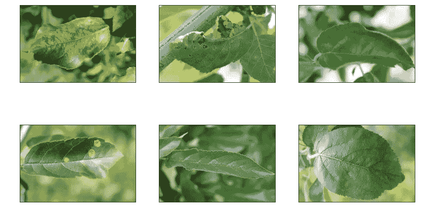

看看训练集中的一些图片|作者图片

你可以认为像素是以二维网格形式排列的微小信息块，像素的深度是指其中存在的颜色信息。让我们看看数据集中的任意图像。

```
image = train_images[15]
imshow(image)
print(image.shape)
```

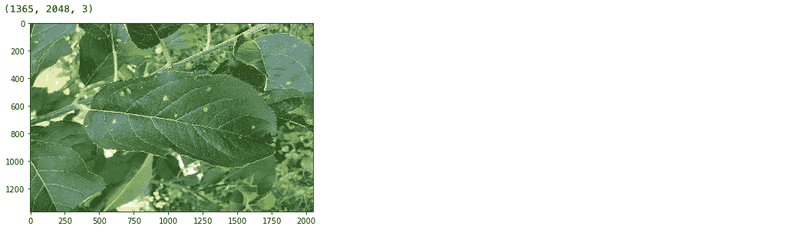

树叶图片|作者图片

**彩色图像**表现为红色、蓝色和绿色的组合，所有其他颜色可以通过将这些原色以正确的比例混合来实现。

```
*# red filter [R,G,B]*
red_filter = [1,0,0]
*# blue filter*
blue_filter = [0,0,1]
*# green filter*
green_filter = [0,1,0]

*# matplotlib code to display*
fig,ax = plt.subplots(nrows=1,ncols=3,figsize=(30,16))
ax[0].imshow(image*red_filter)
ax[0].set_title("Red Filter",fontweight="bold", size=30)
ax[1].imshow(image*blue_filter)
ax[1].set_title("BLue Filter",fontweight="bold", size=30)
ax[2].imshow(image*green_filter)
ax[2].set_title("Green Filter",fontweight="bold", size=30);
```

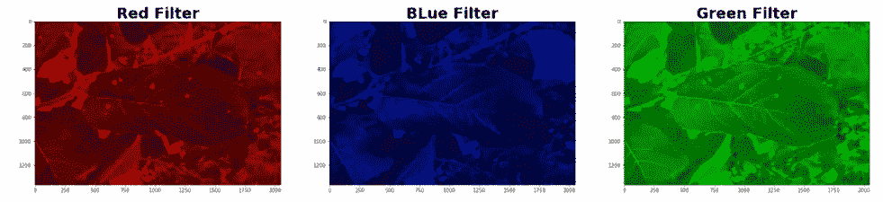

彩色图片|作者图片

一幅**灰度图像**由每像素 8 位组成。这意味着它可以有 256 种不同的色调，其中 0 像素代表黑色，而 255 代表白色。例如，下图显示了以数组形式表示的灰度图像。灰度图像只有一个通道，其中通道代表一个维度。

```
*# import color sub-module*
from skimage import color

*# converting image to grayscale*
grayscale_image = color.rgb2gray(image)
grayscale_image.shape
imshow(grayscale_image)
```

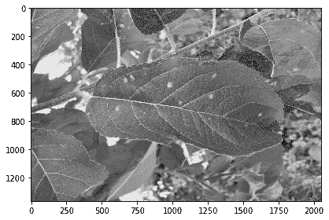

灰度图像|作者图片

# 流行的图像增强包

有很多图像增强包。然而，在这个系列中，我们将涉及一些流行的，如:

*   **撇帐**
*   OpenCV
*   伊姆高格
*   白蛋白
*   Keras(ImageDataGenerator 类)

我们将使用上述五个库，通过代码示例来演示基本的增强技术。每个图书馆都相当庞大，值得拥有自己的一篇文章。因此，我将从众所周知的 scikit-image 库开始，为每个库写一篇文章。

# 使用 scikit 图像的数据增强

[**Scikit-Image**](https://scikit-image.org/) 或 skimage 是一个开源的 Python 包，可以处理 numpy 数组。它是图像处理算法的集合。代码由合作者团队维护，完全由社区驱动，同时保持代码的质量并促进基于研究的教育。

## 装置

scikit-image 可以按如下方式安装:

```
pip install scikit-imageor conda install -c conda-forge scikit-image
```

## 导入库和必要的模块

让我们加载我们将用于各种图像处理操作的必要模块。skimage 库由各种模块组成，包含旋转、缩放、调整大小等功能，用于图像操作。

```
from skimage.io import imshow, imread, imsave
from skimage.transform import rotate,rescale, resize, 
from skimage import color,data
from skimage.exposure import adjust_gamma
from skimage.util import random_noise
```

## 图像翻转

翻转可以是水平的，也可以是垂直的。用于翻转图像的函数是`[numpy.flip()](https://numpy.org/doc/stable/reference/generated/numpy.flip.html)`。这个函数有两种变体。当`fliplr()`函数用于向左或向右翻转任何数组时，`flipud()`函数用于向上/向下翻转数组。这意味着`fliplr()`反转矩阵中像素列的顺序，而`flipu()`反转矩阵中像素行的顺序。

```
*#Horizontally flipped*
hflipped_image= np.fliplr(image) *#fliplr reverses the order of columns of pixels in matrix*

*#Vertically flipped*
vflipped_image= np.flipud(image) *#flipud reverses the order of rows of pixels in matrix*

fig,ax = plt.subplots(nrows=1,ncols=3,figsize=(30,16))
ax[0].imshow(image)
ax[0].set_title("Original Image", size=30)
ax[1].imshow(hflipped_image)
ax[1].set_title("Horizontally flipped", size=30)
ax[2].imshow(vflipped_image)
ax[2].set_title("Vertically flipped", size=30);
```

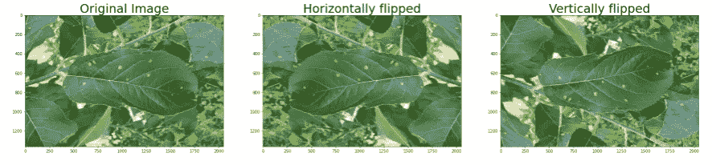

翻转图片|作者图片

## 图像旋转

同样，我们可以顺时针方向或逆时针方向旋转图像。旋转是通过`transform.rotate();`功能实现的，该功能可将图像围绕其中心旋转一定角度。用户可以指定任何旋转角度的选择。

```
# clockwise rotation
rot_clockwise_image = rotate(image, angle=45) # Anticlockwise rotation
rot_anticlockwise_image = rotate(image, angle=-45)fig,ax = plt.subplots(nrows=1,ncols=3,figsize=(30,16))
ax[0].imshow(image)
ax[0].set_title("Original Image", size=30)
ax[1].imshow(rot_clockwise_image)
ax[1].set_title("+45 degree Rotation", size=30)
ax[2].imshow(rot_anticlockwise_image)
ax[2].set_title("-45 degree rotation", size=30);
```

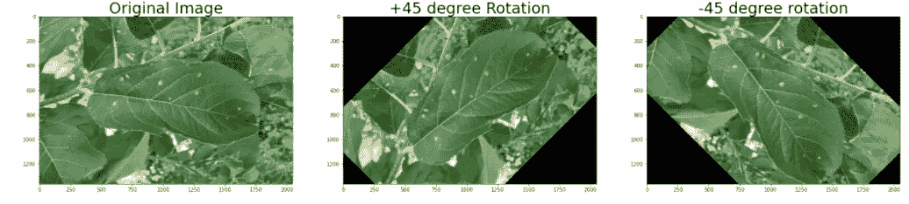

旋转图像|作者图像

## 图像裁剪

对于裁剪图像，可以定义一个效用函数-`randRange()`；以生成期望范围内的随机浮点值。然后，您可以将这些生成的范围值传递到另一个名为`randomCrop(),` 的函数中，该函数将图像作为输入，并根据所需的边界边距在中心进行裁剪

*P.S:以下代码改编自* [*本*](https://www.kaggle.com/safavieh/image-augmentation-using-skimage) *Kaggle 内核。*

```
# source: [https://www.kaggle.com/safavieh/image-augmentation-using-skimage](https://www.kaggle.com/safavieh/image-augmentation-using-skimage)
import random
import pylab as pl 
def randRange(a, b):
    '''
    a utility function to generate random float values in desired    range
    '''
    return pl.rand() * (b - a) + adef randomCrop(im):
    '''
    croping the image in the center from a random margin from the borders
    '''
    margin = 1/3.5
    start = [int(randRange(0, im.shape[0] * margin)),
             int(randRange(0, im.shape[1] * margin))]
    end = [int(randRange(im.shape[0] * (1-margin), im.shape[0])), 
           int(randRange(im.shape[1] * (1-margin), im.shape[1]))]
    cropped_image = (im[start[0]:end[0], start[1]:end[1]])
    return cropped_image fig,ax = plt.subplots(nrows=1,ncols=2,figsize=(20,12))
ax[0].imshow(image)
ax[0].set_title("Original Image", size=20)
ax[1].imshow(randomCrop(image))
ax[1].set_title("Cropped", size=20)
```

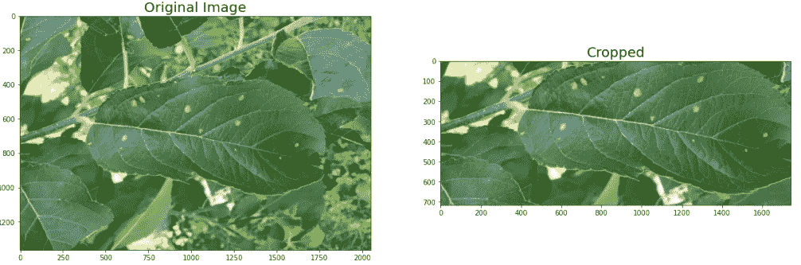

裁剪图像|作者提供的图像

## 亮度操作

`exposure`模块用于亮度操作。函数`adjust_gamma`对输入图像执行**伽马校正**。gamma 值越高，生成的图像越暗。

```
image_bright = adjust_gamma(image, gamma=0.5,gain=1)
image_dark = adjust_gamma(image, gamma=2,gain=1)fig,ax = plt.subplots(nrows=1,ncols=3,figsize=(20,12))
ax[0].imshow(image)
ax[0].set_title("Original Image", size=20)
ax[1].imshow(image_bright)
ax[1].set_title("Brightened Image", size=20)
ax[2].imshow(image_dark)
ax[2].set_title("Darkened Image", size=20)
```

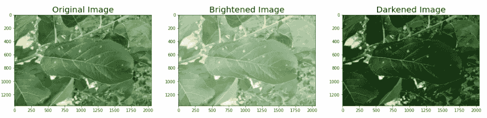

图像中的亮度处理|作者提供的图像

## 图像大小调整和缩放

`transform.resize()`函数转换给定的图像以匹配特定的尺寸。这个函数可以插值放大或缩小图像。请确保在缩小图像时启用抗锯齿功能，以避免出现锯齿现象。 [**反** - **走样**](https://helpx.adobe.com/photoshop/key-concepts/aliasing-anti-aliasing.html#:~:text=Anti%2Daliasing%20is%20the%20smoothing,make%20the%20edges%20appear%20smoother.) 是数字图像中锯齿状边缘的平滑。

```
image_resized = resize(image, (image.shape[0] // 2, image.shape[1] // 2),anti_aliasing=True) fig, ax = plt.subplots(nrows=1, ncols=2,figsize=(30,16))
ax[0].imshow(image)
ax[0].set_title("Original Image", size=20)
ax[1].imshow(image_resized)
ax[1].set_title("Resized image",size=20)
```


已调整大小的图片|作者图片

除了允许指定输出图像形状而不是比例因子外，`resize()`功能也用于相同的目的。

## 添加噪声

`random_noise()`是来自 [skimage 的 util 模块](https://scikit-image.org/docs/dev/api/skimage.util.html#random-noise)的一个函数。它用于将各种类型的随机噪声添加到图像中。噪声是一种缺陷，它被添加到图像中以引入某种可变性。

```
noisy_image= random_noise(image)fig, ax = plt.subplots(nrows=1, ncols=2,figsize=(30,16))
ax[0].imshow(image)
ax[0].set_title("Original Image", size=20)
ax[1].imshow(noisy_image)
ax[1].set_title("Image after adding noise",size=20)
```

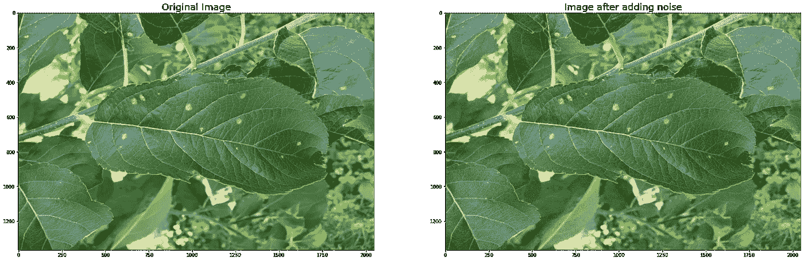

图像中的噪声添加|作者提供的图像

# 结论和后续步骤

数据扩充已被证明是提高分类任务准确性的有前途的方法。这在数据可用性有限的情况下尤其重要。Python 以 scikit-image 的形式提供了一个健壮的库，其中包含许多图像增强算法。它是免费的，不受限制的，背后有一个活跃的社区。查看文档以了解关于该库及其用例的更多信息。在接下来的几篇文章中，我们将讨论其他常用的增强库。敬请期待！

# 感谢

*   图标的名词项目:翻转图标标记；塞巴斯蒂安·贝拉卡扎尔·拉雷奥轮替；Setyo Ari Wibowo 的作物；视觉世界的亮度控制；图像由 ibrandify 阿瑟·史林的《噪声抖动》。
*   数据集参考:[植物病理学 2020 挑战数据集对苹果叶部疾病进行分类](https://arxiv.org/abs/2004.11958)
*   [数据扩充|如何在数据有限的情况下使用深度学习—第二部分](https://nanonets.com/blog/data-augmentation-how-to-use-deep-learning-when-you-have-limited-data-part-2/)
*   [深度学习的数据增强](/data-augmentation-for-deep-learning-4fe21d1a4eb9)