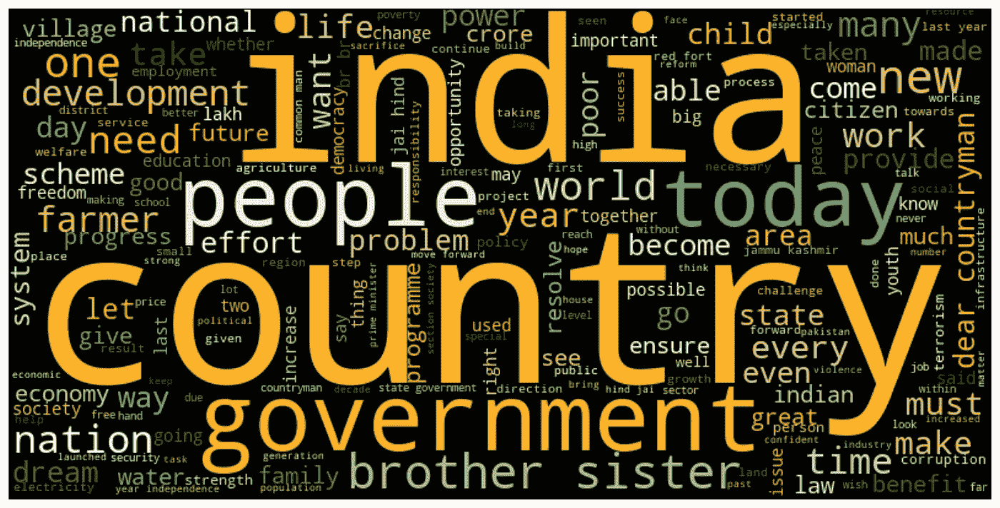
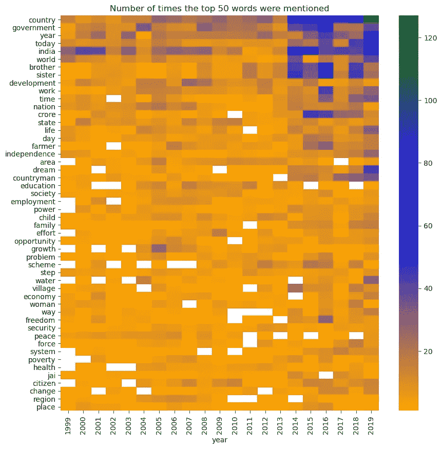
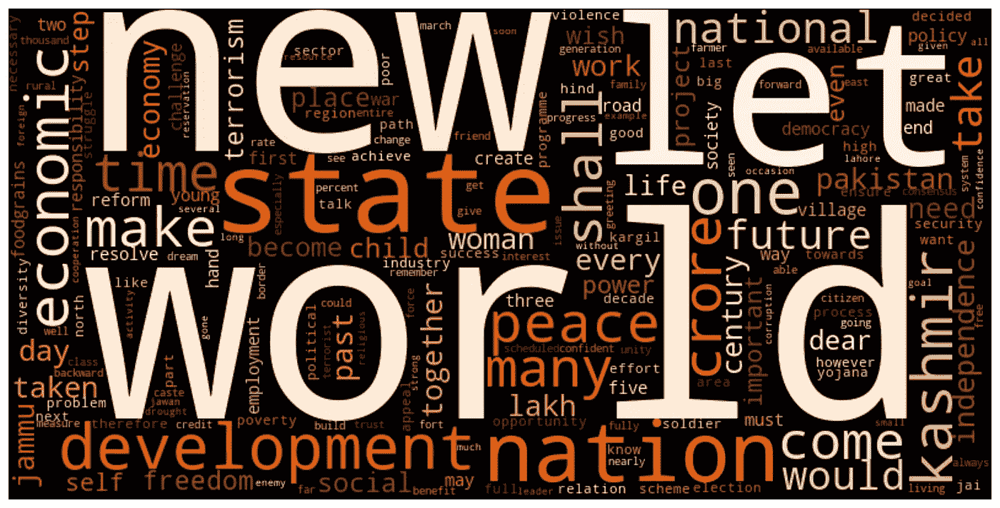
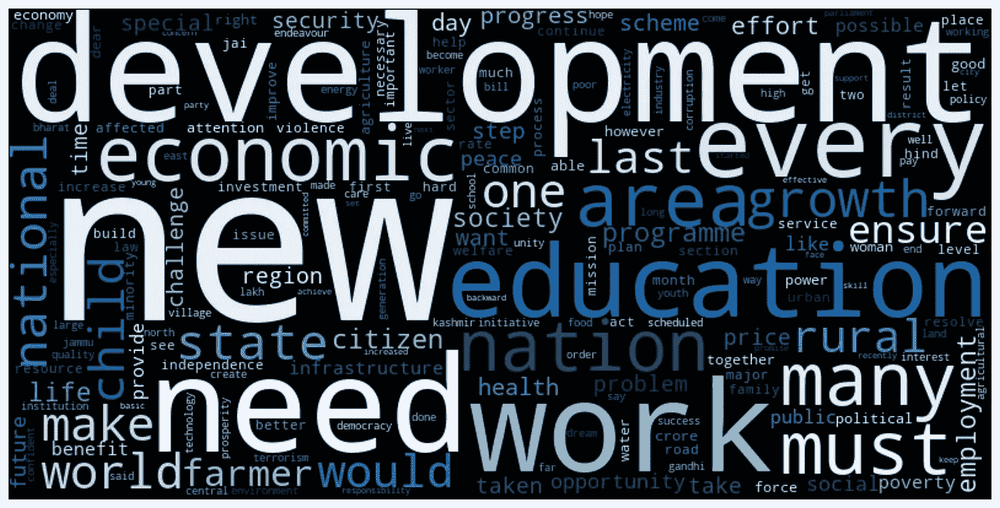
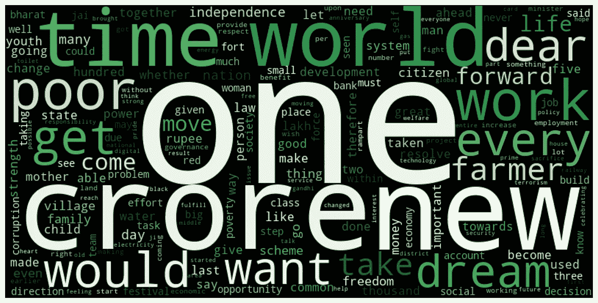
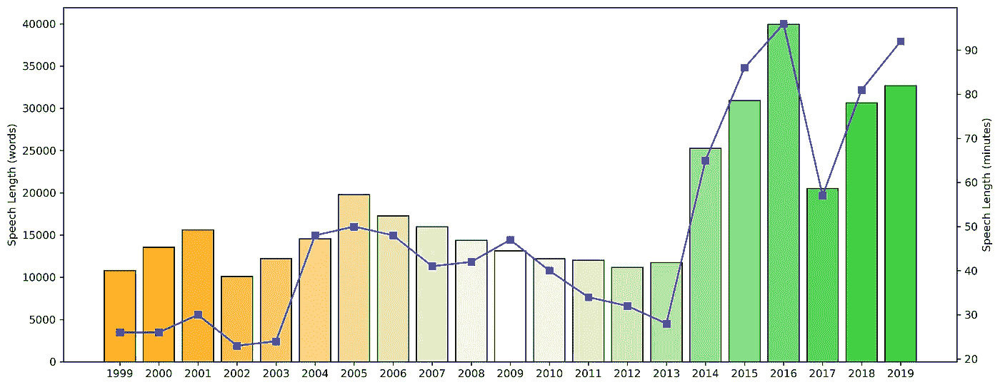
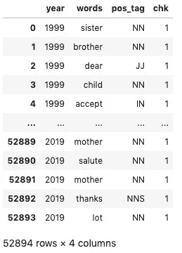

# 独立日演讲:这次会持续多久？

> 原文：<https://towardsdatascience.com/independence-day-speeches-how-long-will-it-be-this-time-6dee2f542e0e?source=collection_archive---------42----------------------->



过去 21 年印度独立日演讲中的前 200 个单词

## 21 年印度独立日演讲的 EDA 和对 2020 年 8 月 15 日演讲长度的预测

# 前言

几天前，我坐在自己的公寓里，思考着这个问题——“今年的独立日会和以往有什么不同吗？

当然会。原因很明显。

这个问题让我想到了另一个问题——“*知道这次会有所不同，首相这次会说什么？*

这是全国近 10 亿人渴望听到的一件事。

因为今年我们遇到了困难，目睹了近年来前所未有的悲剧。因此，首相的话应该反映一个正在慢慢恢复元气的国家的情绪。

# 动机

但是我有另一个问题—

> 这次他会说多长时间？

换句话说，这次传统的独立日演讲会持续多久？

从历史上看，在独立日，过去的总理们会详细谈论他们的政府发起的各种计划、成就、困难和未来的道路。

我认为这将是一个很好的机会，重温过去，窥视昔日的演讲，也许，预测今年的演讲会有多长。

> 我把代码片段放在这篇文章的最后，因为(惊喜，惊喜)数据可视化第一！！
> 
> 你可以在我的 [GitHub](https://github.com/ani-rudra-chan/Independence-Day-Speeches.git) 库上找到整个项目。

# 数据采集

我浏览了 PMO 档案馆[](https://archivepmo.nic.in/)*的公开网页，下载了现任和上两届总理的独立日演讲，一直追溯到 1999 年。最近几年，印度有过以下几任总理—*

1.  *施里。阿塔尔·比哈里·瓦杰帕伊(1999-2003 年)*
2.  *曼莫汉·辛格博士(2004-2013 年)*
3.  *施里。纳伦德拉·莫迪(2014 年至今)*

> *提醒一下——这些下载的文本是当时用印地语演讲的英文翻译。*

# *数据预处理*

*我使用自然语言处理库， **NLTK，**来-*

*   *删除不必要的停用词；*
*   *去掉标点符号；*
*   *将单词标记化和词条化；*
*   *用词性标签(词类)标注每个单词；*

*最后，我只剩下一套 21 篇演讲稿，其中只包含了基本内容。*

# *想象过去的话语*

## *过去演讲中的热门词汇*

**

*历年演讲中使用最多的 50 个词(鸣谢:作者)*

*在过去的 21 年里，独立日演讲中出现频率最高的词显然是:**国家**、**政府**、**年**、**今日**、**印度**、**世界**、**兄弟**、**姐妹**。*

*有趣的是，现任总理什里在过去几年中非常频繁地使用这些词。纳伦德拉·莫迪与其前任相比。另一方面，‘**印度**’几乎被所有总理平等提及(这是意料之中的)。*

## *谁说了什么？*

*   **Shri。阿塔尔·比哈里·瓦杰帕伊**

*在他担任总理的 5 年里，什里。阿塔尔·比哈里·瓦杰帕伊被普遍称为现代印度真正的政治家，他在演讲中反映了这一绰号。可以看出，像'**世界**'、**新**'、**国家**'、**民族**'这样的词汇在他的独立日演讲中被频繁使用。*

**

*Shri 排名前 200 的单词。阿塔尔·比哈里·瓦杰帕伊的独立日演讲(鸣谢:作者)*

*   *曼莫汉·辛格博士*

*这位从 2004 年到 2013 年领导印度的学者和经济学家总理详细谈论了'**发展'**'**教育**'、**工作**等等。在他的独立日演讲中。*

**

*曼莫汉·辛格博士独立日演讲中的 200 个单词*

*   **Shri。纳伦德拉·莫迪**

*最近连任的现任总理在过去独立日的演讲中强调了穷人、农民、T42 人和印度人的利益。*

**

*Shri 排名前 200 的单词。纳伦德拉·莫迪的独立日演讲(鸣谢:作者)*

## *历年的演讲长度*

*看看演讲的持续时间和文本长度，令人惊讶的是瓦杰帕伊的演讲是持续时间和长度最短的，而莫迪的演讲是迄今为止最长的。*

*在过去的 21 年里，演讲的篇幅稳步增长，莫迪当选后出现了大幅增长。2017 年演讲时长有明显下降。根据这篇[文章](https://www.livemint.com/Politics/QrQaiQItcApTG2gOlSd72O/Narendra-Modi-keeps-promise-delivers-his-shortest-Independe.html)，首相收到了抱怨他前一年(2016 年)长篇演讲的信件，这促使他保持简洁。*

*但这只是那一年的情况，因为接下来的两年，演讲又变得更长了。*

**

*过去 21 年的演讲长度(以分钟和单词为单位)*

# *预测今年的演讲长度*

## *自回归模型*

*看过以往的演讲时长，想到用一个简单的**自回归(AR)** 模型来预测今年的演讲时长。*

*在我看来，这些独立日演讲似乎是精心撰写和控制的，也着眼于历史，以确保事情忠于传统(至少在 2013 年之前是这样)。*

*最多，今年的演讲长度可能取决于去年的演讲长度(正如我之前写的轶事所证明的)，因此 1 的**滞后对于 ar 模型来说应该足够好了。此外，由于这是一个非平稳的时间序列，我差分一次，使它在拟合模型之前平稳。***

*为了测试这个简单的模型，我对它从 2010 年开始连续几年的演讲长度进行了训练，并进行了滚动预测。2011 年至 2019 年的产量如下所示。*

```
*2011
predicted=41.497464, expected=34.000000
2012
predicted=34.293300, expected=32.000000
2013
predicted=32.275443, expected=28.000000
2014
predicted=27.779659, expected=65.000000
2015
predicted=64.317813, expected=86.000000
2016
predicted=94.102461, expected=96.000000
2017
predicted=101.639437, expected=57.000000
2018
predicted=52.350426, expected=81.000000
2019
predicted=81.350816, expected=92.000000
Test RMSE: 23.252*
```

*所以这个模型在 2014 年显示了很大的误差，当时新总理当选了，他的讲话比他的前任还长！从那以后，这个简单的模型在 2017 年和 2018 年出现了错误，因为——看在上帝的份上，这只是一个自回归模型！！它只是依靠它前一年的价值来预测下一年的价值。*

*无论如何，这个模型似乎有一个+- 23 分钟的误差，对今年，2020 年的预测是*

```
*>>> 94.7 +- 23 minutes*
```

> ***因此，看起来首相可能会在独立日发表最长约 120 分钟、最短约 70 分钟的讲话！***

****免责声明****

1.  **请对这一预测持怀疑态度，因为——它只是一个 AR 模型，并没有学到任何东西(除了更新它的回归系数)，因为除了它以前的值，没有任何可供学习的特征。**
2.  **这个预测是在独立日前夕做的，所以我在等着验证！**
3.  **所有演讲都可以在项目管理办公室的档案中免费下载。**

> ****更新——首相今年发言 86 分钟，完全在预测误差之内！****

# *代码片段*

*在这里，我展示了我编写的代码片段，以生成数据可视化和文本清理。*

## *文本清洗和预处理*

*清理和预处理文本的功能—*

```
*def speech_cleaner(text):   
    # Lower Case conversion
    text = text.lower()
    # Tokenize sentences to words
    text = nltk.word_tokenize(text)
    # Remove empty tokens
    text = [w for w in text if len(w) > 0]
    # Remove punctuations
    punct = string.punctuation
    text = [w for w in text if w not in punct]
    # Remove stopwords
    stopword = stopwords.words('english')
    text = [w for w in text if w not in stopword] 
    # POST Tagging the text
    pos_tags = pos_tag(text)
    # Lemmatize the text
    text = [WordNetLemmatizer().lemmatize(w[0]) for w in pos_tags]
    # Removing one letter words
    text = [w for w in text if len(w) > 1]
    # Rejoin all words to get back speech
    speech = " ".join(text)
    return speech*
```

*一个从本地目录读入文本并用前面的函数清理它的函数—*

```
*def text_reader_cleaner(file):

    text = []

    with open(file, 'r') as f:
        text = f.readlines()
    clean_speech = ""

    for i in text:
        clean_speech = clean_speech + " " + speech_cleaner(i)
    return clean_speech*
```

*进一步预处理—*

```
*all_speech = ""
all_words = pd.DataFrame([], columns=['year','words'])
for y, s in speech.items():
    all_speech = all_speech + s
    w = pd.Series(re.split("\W+",s))
    w = w.drop(index=w.loc[w.values==''].index)
    all_words = pd.concat([all_words, 
                       pd.DataFrame({'year':len(w)*[y],
                                     'words':w}),
                       ], axis=0)
    all_words = all_words.reset_index(drop=True)all_words['pos_tag'] = pd.DataFrame(pos_tag(all_words.words))[1]
all_words['chk'] = 1*
```

**

*这是预处理后的语音输出*

## *前 50 个词的热图*

*下面是分隔名词的代码片段—*

```
*nouns = all_words.loc[all_words.pos_tag=='NN'].words.value_counts()/10
names = nouns.loc[nouns.values>5].index
names = names.drop('br')
word_year = pd.pivot_table(all_words, values='chk', index='words', columns='year', aggfunc=np.sum)*
```

*这是你绘制热图的方法—*

```
*fig,ax = plt.subplots(figsize=[10,10])
colors = ["orange", "blue", "limegreen"]
cmap0 = LinearSegmentedColormap.from_list("india_tricolor", colors)
sns.heatmap(word_year.loc[names[:50]], cmap=cmap0)
plt.title('Number of times the top 50 words were mentioned')*
```

## *词云生成器*

*这里有一个使用漂亮的 **wordcloud** 库生成 wordcloud 的函数*

```
*def wc_generator(clean_speech, cmap=None):    
    if cmap is None:
        cmap = LinearSegmentedColormap.from_list('india_tricolor', ['orange', 'white', 'green'])
    wordcloud = WordCloud(
                          width=800, height=400,
                          background_color='black',
                          colormap=cmap, 
                          max_words=200,
                          random_state=42
                            ).generate(clean_speech)fig, ax = plt.subplots(dpi=400, figsize=[15,10])
    plt.imshow(wordcloud, interpolation='bilinear')
    plt.axis("off")
    plt.figure()*
```

## *语音长度时间序列*

*为了绘制时间序列，你可以写这段代码—*

```
*colors = ["orange", "white", "limegreen"]
cmap0 = LinearSegmentedColormap.from_list("india_tricolor", colors)
india_tricolor = cmap0(np.linspace(0,1,21))y = []
l = []
for year, text in speech.items():
    y.append(year)
    l.append(len(text))fig, ax1 = plt.subplots(dpi=300,figsize=[15,6])
ax2 = ax1.twinx()spt = pd.Series(speech_time).values
for y1, l1, c in zip(y,l, india_tricolor):
    ax1.bar(y1, l1, color=c, edgecolor='k')
    ax1.set_ylabel('Speech Length (words)')

ax2.plot(y,spt, marker='s',color='b')
ax2.set_ylabel('Speech Length (minutes)')plt.xticks(np.arange(1999,2020), np.arange(1999,2020).tolist())
plt.show()*
```

## *语音长度预测的自回归模型*

*为了进行滚动预测并检查预测误差，您编写了这个简单的代码片段(感谢 www.machinelearningmastery.com[的杰森·布朗利](http://www.machinelearningmastery.com)！)—*

```
*from statsmodels.tsa.arima_model import ARIMA
from sklearn.metrics import mean_squared_errorX = df.sp_len.values
size = int(len(X) * 0.6)
train, test = X[0:size], X[size:len(X)]
history = [x for x in train]
predictions = list()
for t in range(len(test)):
 model = ARIMA(history, order=(1,1,0))
 model_fit = model.fit(disp=0)
 output = model_fit.forecast()
 yhat = output[0]
 predictions.append(yhat)
 obs = test[t]
 history.append(obs)
    print()
 print('predicted=%f, expected=%f' % (yhat, obs))
error = np.sqrt(mean_squared_error(test, predictions))
print('Test RMSE: %.3f' % error)*
```

**那都是乡亲们！**

**再见！**