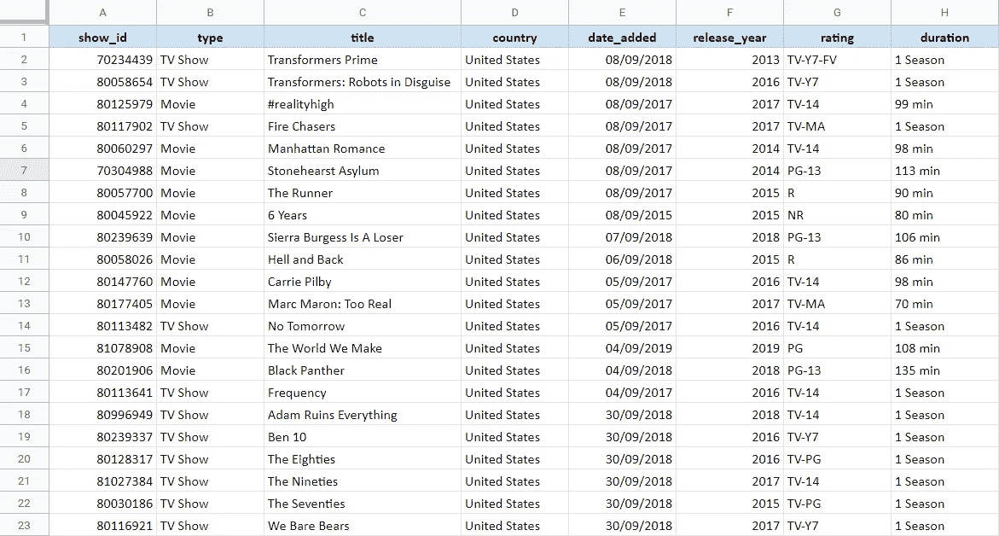
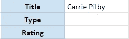
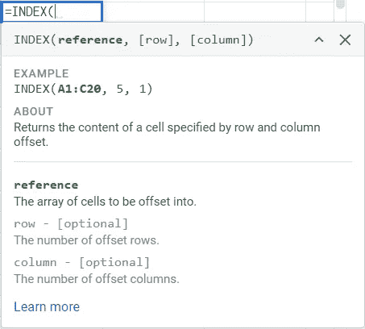
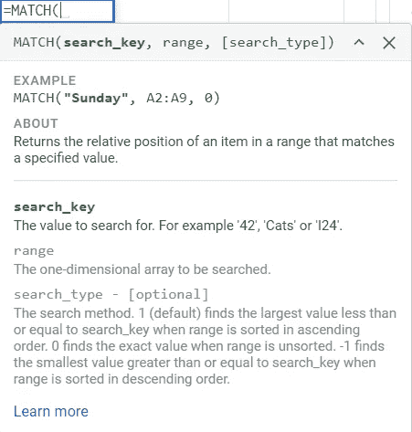
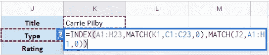
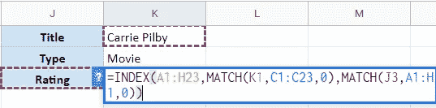

# 索引匹配 VLOOKUP 功能的升级

> 原文：<https://towardsdatascience.com/index-match-an-upgrade-on-vlookup-functions-320e43253d15?source=collection_archive---------62----------------------->

## 电子表格/索引匹配

## 掌握电子表格最通用的功能之一


[克里斯·利维拉尼](https://unsplash.com/@chrisliverani?utm_source=medium&utm_medium=referral)在 [Unsplash](https://unsplash.com?utm_source=medium&utm_medium=referral) 上拍摄的照片

[在上一篇文章](https://medium.com/@iamanmolbansal/how-to-use-the-notorious-vlookup-function-in-google-sheets-3dd6f825d4fe?source=friends_link&sk=2f91fdd980fccd225d88bcdc968c8852)中，我们讨论了如何以及何时使用 VLOOKUP 函数，以及在使用它们时我们可能会面临哪些问题。另一方面，本文将带您了解 VLOOKUP 的升级版本。此次升级结合了电子表格中的两个功能— **索引和匹配**。让我们通过下面的例子来理解索引匹配的工作原理。

## 理解数据

像往常一样，让我们从我们最喜欢的数据源——ka ggle 中取一个例子。下面的截图是[网飞数据](https://www.kaggle.com/shivamb/netflix-shows)的一个子集，其中包括截至 2019 年网飞上可用的电视节目和电影。



用于指数匹配演示的网飞数据

这个数据集由不同的节目和电影以及它们独特的`show_id`、我们正在考虑的`country`、节目添加时的`date`和实体发布时的`year`组成。它还包含节目/电影的`rating`、内容片段的`duration`和`title`。

现在考虑我们想要创建一个搜索方法，用户可以选择一个`title`并向用户显示关于该标题的信息。这种搜索方法看起来像这样:



搜索方法的外观示例

用户可以在上面的例子中输入任何`title`，我们将尝试从数据库中找到标题的`type`和`rating`。一个更简单的解决方案是通过 VLOOKUP。通过它我们可以很容易的找到题目的评分。虽然，我们需要**改变表格的结构**来获得标题的类型，因为 VLOOKUP 只能**查看搜索值的右边**。让我们看看索引和匹配公式如何帮助我们解决这个问题。

## 什么是索引？

电子表格中的索引公式如下所示:



Google 电子表格中的索引公式

`INDEX`帮助我们找到细胞的内容。它需要 3 个输入。

*   **引用**:我们要在其中查找值的表格。
*   **Row** :从值所在的引用表开始算起的行数。这是一个可选值。如果没有提供值，它将把第一行作为值。
*   **Column** :从值所在的引用表开始算起的列数。这是一个可选值。如果没有提供值，它将把第一列作为值。

为了在我们的表格中找到标题“Carrie Pilby”的类型，我们应用以下公式:

```
=INDEX(A1:H23,12,2)
```

我们选择**完整表作为引用**，我们发现该电影标题在第 12 行，并且我们知道标题的类型存储在引用表的第 2 列。这将给出“电影”的结果，这是绝对正确的！

但是你注意到这个有什么问题吗？我们实际上不得不**计算行号和列号**以获得 12 和 2 作为公式中的参数。这不容易，是吗？让我们找出世界上是否有其他方法可以帮助我们缓解这个过程。

## 什么是匹配？

电子表格中匹配公式如下所示:



匹配 Google 电子表格中的公式

`MATCH` 帮助我们找到表格中内容的相对位置。它需要 3 个输入。

*   **搜索关键字**:我们要查找的值。
*   **范围**:数值所在的行/列。请注意，range 只能接受一行或一列，不能同时接受两者。
*   **搜索类型**:出于所有实际目的，**我们将该值设置为零**。这表明我们正在寻找精确的值。这是一个可选项，默认情况下取值为 1。

MATCH 本质上给了我们搜索项所在的行号或列号。这不就是我们之前遇到的索引拼图的**缺失部分吗？我们需要一种更简单的方法来找到搜索项的行号和列号，而不是手动计数。而 MATCH 恰恰给了你这些！**

## 神圣的索引-匹配婚姻

上面的解释现在允许我们将索引和匹配公式连接在一起，以最少的麻烦获得我们需要的信息。下面是一个通用的指数匹配公式:

```
=INDEX(reference, MATCH(search_key, row, 0), MATCH(search_key, column, 0))
```

在上面的公式中，我们为索引提供了一个**引用表，基本上就是所有信息所在的数据表。接下来，**第一个匹配**公式提供搜索词**的**行索引，而**第二个匹配**提供搜索词**的**列索引。最后，这两者的结合将为索引公式提供行和列索引，我们将得到我们想要的结果！让我们在网飞的例子中尝试一下。**



用于查找内容类型的索引匹配

上面的公式在 INDEX 的第一个参数中选择整个表。然后通过匹配公式在整行内容标题中搜索 K1 中提到的电影标题，即 C1:C23。这将返回标题“Carrie Pilby”所在的行号。在第二个匹配中，它搜索 J2，这是我们想要查找的参数，在本例中为 Type。这将返回列名“Type”所在的列。并且一起将提供正确的结果，即电影。

类似地，下面是如何匹配表格中给定内容标题的评级的公式。



用于查找内容分级的索引匹配

## 与 VLOOKUP 比较

通常会比较使用哪个公式来查找给定内容的值。虽然 **VLOOKUP 更容易理解**并提供了一个简单的应用程序，但索引-匹配组合是一个强大的匹配，具有以下优点:

1.  您可以使用 INDEX-MATCH 来**查找符合多个标准的值**。在上面的例子中，我们找到了带有内容名称标准和参数标准的`Type` 和`Rating` 。这在 VLOOKUP 中并不容易实现。
2.  VLOOKUP 在左侧查找匹配项，并返回搜索项右侧的任何值。另一方面，**索引匹配可以双向查看**。在上面的例子中，type 在 title 的左边，rating 在右边，但是它仍然能够正确地找到两个结果。

了解索引匹配为您的电子表格军械库添加了一个极其通用的工具。索引匹配和数据透视表的知识可以真正帮助你提高你的分析技能。如果这是一个有用的内容，请在评论中告诉我！