# 使用投资组合优化方法的指数复制

> 原文：<https://towardsdatascience.com/index-tracking-portfolio-optimization-8250d27449e6?source=collection_archive---------12----------------------->

## 市场指数的量化金融

距离我上次发帖已经整整一年了，我想写一写我最近在家期间做的一个项目。很难在网上找到实用的资源。有许多数学和理论性的学术论文，但我想支持那些寻找代码和门外汉理解的人，因为我已经花了 4 天时间研究和处理这个项目。

我将在这篇文章中省略大部分代码，但你可以在这里访问所有内容:

👉🏻[链接到代码/笔记本](https://htmlpreview.github.io/?https://github.com/jasonyip184/Index-Tracking-Portfolio-Optimization/blob/master/Index-Tracking-Portfolio-Optimization.html)

👉🏻[回购链接](https://github.com/jasonyip184/Index-Tracking-Portfolio-Optimization)

# 指数跟踪投资

是一种被动的投资策略，试图重新创建一个投资组合，产生类似于大盘指数的回报。这可以通过以下方式实现:

**完全复制**

指数的完全复制要求基金持有指数中所有资产的份额，并尽可能复制指数中每种资产的权重。交易指数中的非流动性资产可能会增加基金的交易成本，导致更高的费用率和更差的基金业绩。

**投资组合优化**

该项目的目的是通过减少跟踪误差，使用指数中最大资产的最优投资组合选择来复制指数。最终，我们将为投资组合中每个最大的资产生成一个权重，以仅用几个资产复制指数的表现。

**跟踪误差**

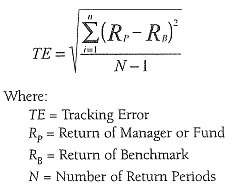

在这种情况下，基准是指数

**信息比率**

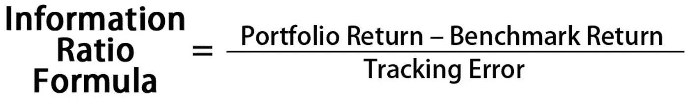

类似夏普比率的衡量标准，量化投资组合的主动回报/主动风险

**Russell 1000** 是富时罗素(FTSE Russell)维护的股票市场指数，跟踪整个美国股票市场排名最高的 1000 只股票，我们的目标是复制以下股票。**测试期:**2019–04–01 至 2019–04–30。

# 数据收集

市场指数会定期进行再平衡，以确保与当前市场保持同步。当富时罗素在 1984 年创立该指数时，印第安纳标准石油公司是美国市值最大的公司之一。今天，该公司已经解散，不存在了。

根据[年度重组时间表](https://www.ftserussell.com/press/ftse-russell-announces-schedule-annual-russell-us-index-reconstitution https://www.ftserussell.com/press/ftse-russell-announces-2018-russell-us-indexes-reconstitution-schedule)，有一个“排名日”，在收盘时计算市值前 1000 家公司的排名。随后是在“生效日”进行重组之前的过渡期，在该日，市场以新重组的指数开盘。在用顶级公司来近似指数时，我们应该小心考虑这一点，因为它们(或它们的权重)可能会随着时间的推移而变化。我在 [2018](https://content.ftserussell.com/sites/default/files/support_document/2018-russell-us-index-reconstitution-recap_0.pdf) 和 [2017](https://content.ftserussell.com/sites/default/files/support_document/2017_russell_reconstitution_recap_final.pdf) 使用了富时重组摘要报告公布的指数前 10 名成分。训练数据取自 2018 年 6 月 25 日至 2019 年 2 月 28 日。

```
Market Cap of Top 10 in 2018 {'AAPL': 5016475823, 'AMZN': 483381822, 'GOOG': 694989876, 'MSFT': 7898764549, 'FB': 2917587472, 'BRK-B': 2444334034, 'JPM': 3601578394, 'XOM': 4614039868, 'JNJ': 2875386042, 'BAC': 10598321272}
```

# 基于罗素方法论的基准指数重构

我们将使用 Russell (第 4 页)的[价格回报指数来重建包含前 10 个成分的指数。](https://research.ftserussell.com/products/downloads/Russell_Index_Calculation_Methodology.pdf?_ga=2.110735813.1991880057.1587129456-1914712361.1587129456)[指数值](https://research.ftserussell.com/products/downloads/Russell-US-equity-indexes-IOSCO.pdf?_ga=2.110735813.1991880057.1587129456-1914712361.1587129456)(第 34 页)然后通过复合价格回报指数的每日回报百分比获得。索引的起始值等于基数，在 1978 年 12 月 31 日设置为 100。因此，在我们的基准日:2017 年 6 月 27 日，我们将使用^RUI's 收盘价= 1341.03(来自雅虎财经)作为我们的基准价。仅使用前 10 名，结果看起来一点也不接近。

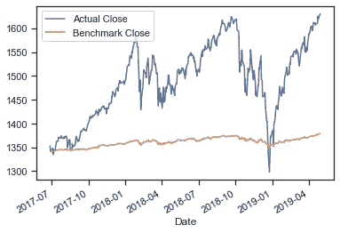

根据实际指数对重新创建的基准进行总体评估

# 使用非负最小二乘(NNLS)优化的分配

其想法是在训练期间，在一个受约束的线性最小二乘模型中，根据指数价格拟合当前前 10 种成分的线性组合。所获得的系数将是非负的，因为这是一个只做多的投资组合。

每个系数取系数之和，作为测试期内每个组件的权重。权重的总和将是投资组合复制指数价格所需的杠杆数量。

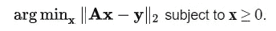

目标是优化它，其中 x & A 是前 10 名的系数和历史价格，y 是指数价格

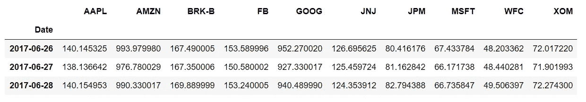

样本 x =前 10 名的历史价格

从库中调用的优化本质上是:

```
**from** **scipy.optimize** **import** nnls
result = nnls(trainX, trainY)
```

系数然后被用作该线性组合中的权重，其中杠杆系数是系数之和:

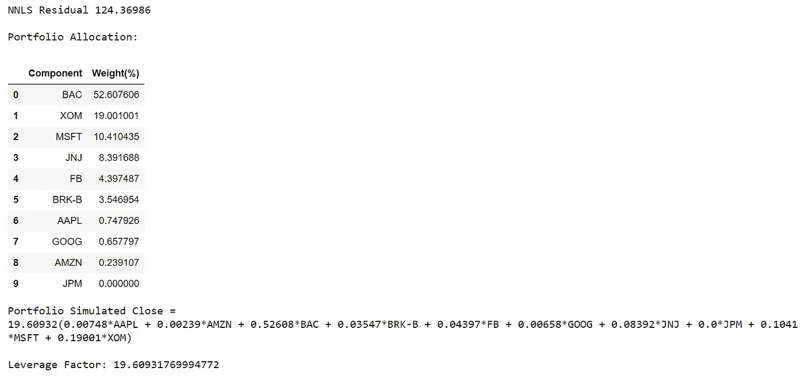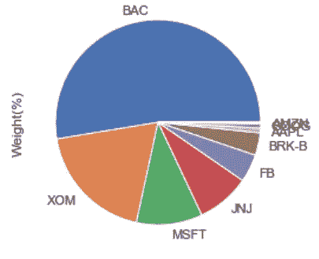

## 结果

虽然我也在测试期之前的 1 个月的维持期内验证了模型，但我将只展示测试集上的结果。

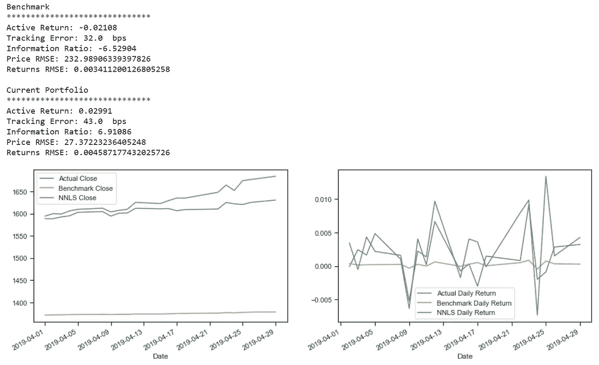

就价格和每日回报而言，复制的指数似乎在视觉上与实际指数匹配得很好。跟踪误差为 43 个基点(0.43%)，RMSE(实际值)似乎相当低。

# 使用相对偏相关的分配

这种想法是，如果某个成分与指数的实际收盘点位相关性更高，就给它分配更多的权重。偏相关使来自 1)其他 IV 上指数的最小二乘回归和 2)其他 IV 上个体 IV 的最小二乘回归的残差相关。这说明了混淆和第三方的影响。我还忽略了负相关的成分，将其设置为 0。类似地，我们将对每个相关性求和以获得权重

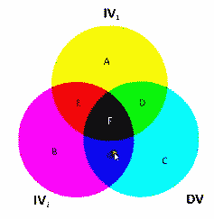

相当于为 IV1 & DV 捕捉 D，为 IV2 & DV 捕捉 G

从库中调用的优化本质上是(其中 train 包括历史成分和实际指数价格:

```
**import** **pandas** **as** **pd**
train.pcorr()
```

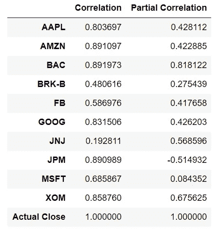

使用相对部分相关值作为权重

如上所述，类似的线性组合方法将用于模拟实际。

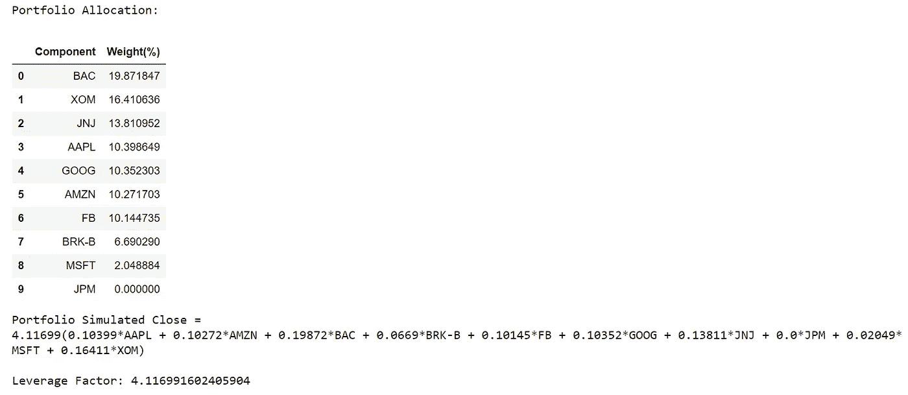

## 结果

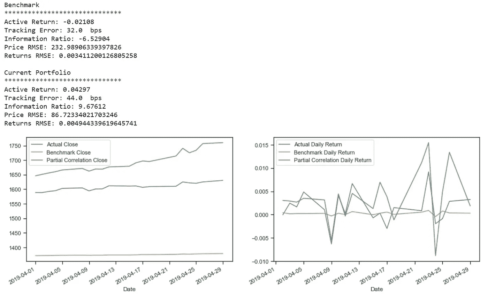

跟踪误差和回报 RMSE 高于基准。但是，RMSE 的价格要低很多。这可能是由于该模型在单独考虑每个组件的影响时过于简化。

# 使用动态时间弯曲(DTW)优化的分配

Pearson correlation 无法捕捉形状相似性，并将确定一对时间序列彼此不相关，即使它们可能非常相似并且只是不同相。这在领先/滞后变量及其对应变量之间可能很明显。这个想法是，如果一个组件与索引的 DTW 距离相对较短，从而具有更相似的形状，则向该组件分配更多的权重。

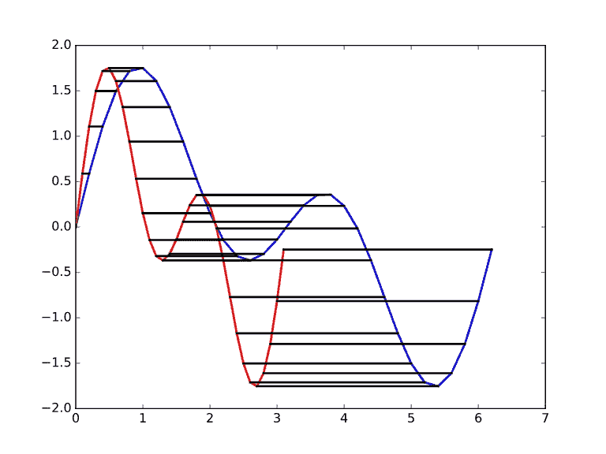

DTW 距离说明了形状的相似性。

目标是针对每个组件(x)和实际指数(y)进行优化:

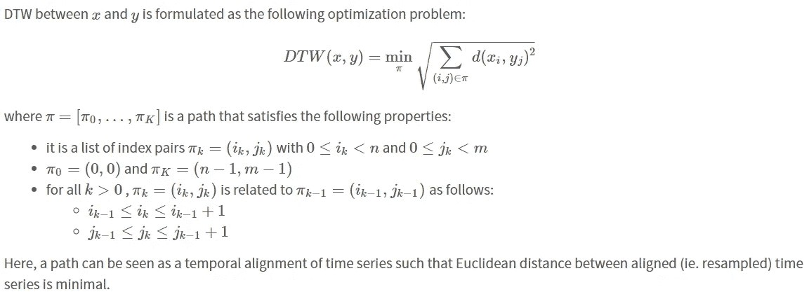

从库中调用的优化本质上是:

```
**from** **tslearn.metrics** **import** dtw
trainX.apply(**lambda** x: dtw(x, trainY))
```

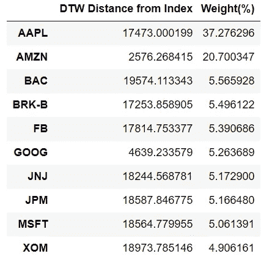

每个距离的倒数作为相似性的度量，相似性作为相似性总和的一部分，用作线性组合中的权重，以复制索引。

## 结果

跟踪误差，价格 RMSE &回报 RMSE 表现差于部分相关模型。这可能意味着形状相似性可能不是区分每个组件的重要因素。

# 使用非负矩阵分解的分配(NMF)

虽然 NNLS 是一种监督学习方法，但无监督 NMF 方法能够通过单个主成分来学习数据的表示。主成分将是资产的线性组合，使得由于该算法中的约束，系数将是非负的。我们的想法是找出每项资产对数据总体变化的相对重要性，并再次将其作为线性组合中的权重。

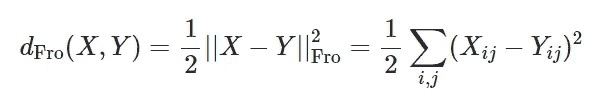

该算法通过优化 X 和 Y=WH 之间的距离，将数据分解为两个非负元素矩阵。x 由 W 中的线性组合表示，使用 h 中的系数。

从库中调用的优化本质上是:

```
**from** **sklearn.decomposition** **import** NMF
nmf = NMF(n_components=1)
nmf.fit(trainX)
coeffs = nmf.components_.tolist()[0]
```

## 结果

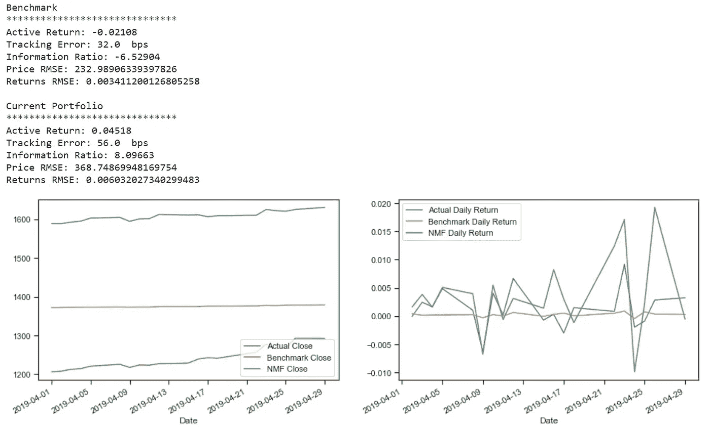

这种方法的问题是价格不能被正确地复制，因为我们不知道无监督学习方法中的杠杆因子，因此价格 RMSE 非常高。

# 使用粒子群优化算法的分配

PSO 模拟分散在搜索空间中的“社会生物”,并移动以找到最优解。这里的优化函数是最小化跟踪误差。

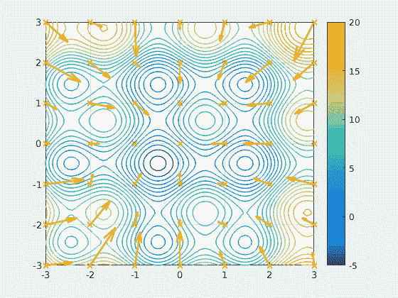

每个粒子代表一组随机初始化的投资组合权重。他们的行动受到(1)他们个人寻找的欲望和(2)群体或其邻居的集体行动的影响。

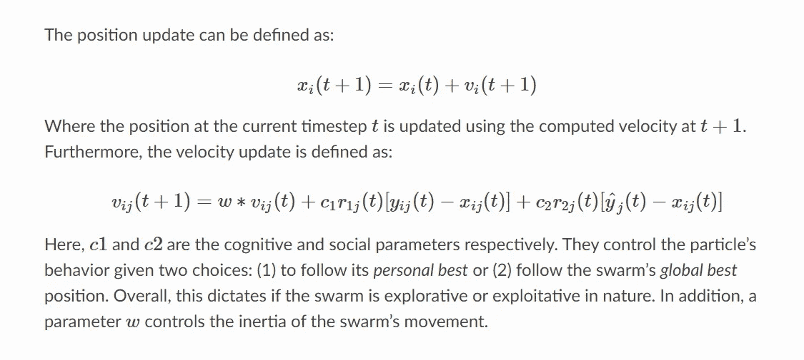

Bounds = [0，1]，因为系数是非负的，并且组件的值不能大于索引。

网格搜索在 c1，c2，w 上执行。网格搜索的代码几乎与下面的块相同，它将为您提供在下面的块中使用的 best_pos，以进行最终优化。

```
**from** **pyswarms.utils.search.grid_search** **import** GridSearch
**from** **pyswarms.utils.search.random_search** **import** RandomSearch
**from** **pyswarms.single.global_best** **import** GlobalBestPSO
**from** **pyswarms.utils.plotters** **import** (plot_cost_history, plot_contour, plot_surface)**def** find_particle_loss(coeffs):
    trainX_returns = trainX.pct_change().dropna()
    trainY_returns = trainY.pct_change().dropna()
    benchmark_tracking_error = np.std(trainX.dot(coeffs) - trainY)
    **return** benchmark_tracking_error

**def** swarm(x):
    n_particles = x.shape[0]
    particle_loss = [find_particle_loss(x[i]) **for** i **in** range(n_particles)]
    **return** particle_lossfeature_count = len(trainX.columns)
min_bound = feature_count*[0]
max_bound = feature_count*[1]optimizer = GlobalBestPSO(n_particles=1000,
               dimensions=len(trainX.columns),
               options=best_pos,
               bounds=(min_bound,max_bound))
*# Perform optimization, cost=lowest particle_loss among all iterations*
cost, pos = optimizer.optimize(swarm,iters=100)
```

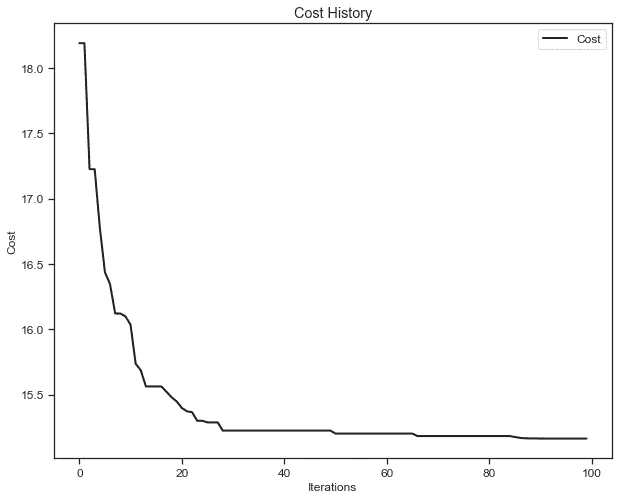

到目前为止，最低成本是从每一轮的所有粒子(系数集)中获得的。

## 结果

具有最低成本(跟踪误差)的粒子(系数组)将被用作系数，取系数之和作为权重，并在线性组合中用于重建索引。

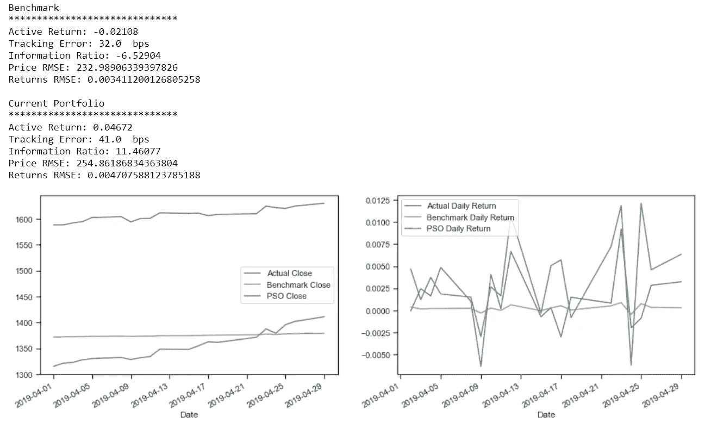

NMF(跟踪误差:56 个基点，RMSE 价格:368.7，RMSE 回报率:0.006032)

NNLS(跟踪误差:43 个基点，RMSE 价格:27.37，RMSE 回报率:0.004587)

PSO 模型的跟踪误差最小。

# 结论

在训练期间，对前 10 种成分的价格和实际指数价格使用了以下定量方法:

1.  非负最小二乘(NNLS)优化
2.  相对偏相关
3.  动态时间弯曲(DTW)优化
4.  非负矩阵分解(NMF)
5.  粒子群优化算法

然后，获得的权重用于分配投资组合，以模拟测试期间的指数价格和每日回报。然后通过跟踪误差和实际指数的 RMSE 价格/日收益率来衡量业绩。

在如此短的时间内，我从这个项目中学到了很多，它真的让我看到了定量方法在金融领域的更多应用。希望你喜欢阅读这篇文章，就像我喜欢创作它一样。