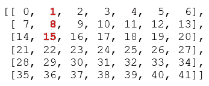
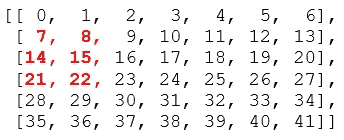
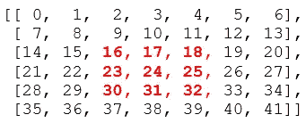
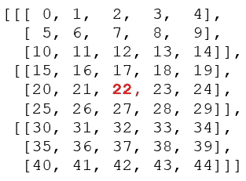
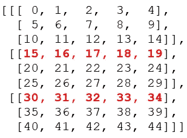
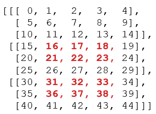

# Numpy 中 1D、2D 和 3D 阵列的索引和切片

> 原文：<https://towardsdatascience.com/indexing-and-slicing-of-1d-2d-and-3d-arrays-in-numpy-e731afff0bbe?source=collection_archive---------11----------------------->

## 本文展示了 Numpy 数组从基本到高级的索引和切片。

来源:作者

数组索引和切片是数据分析和许多不同类型的数学运算的重要部分。我们并不总是使用整个数组、矩阵或数据帧。当我们处理数组的子集时，数组索引和切片是最重要的。本文将从基础知识开始，最终将解释 1D、2D 和 3D 阵列的切片和索引的一些先进技术。即使您以前已经使用过数组切片和索引，您也可以在本文中找到一些可以学习的东西。

**1D 阵列切片标引**

在笔记本中导入 Numpy，并生成一维数组。在这里，我使用的是 Jupyter 笔记本。您可以使用您选择的任何其他笔记本电脑。

```
import numpy as npx = np.array([2,5,1,9,0,3,8,11,-4,-3,-8,6,10])
```

**基础标引**

让我们做一些简单的切片。提醒一下，数组是零索引的，所以计数从零开始。x[0]将返回数组的第一个元素，x[1]将返回数组的第二个元素。

```
x[0]#output: 2x[3]#output: 9x[4]#output: 0
```

**基础切片**

现在转到一维数组的切片操作，

```
x[1:7]#output: array([5, 1, 9, 0, 3, 8])
```

这里 1 是下限，7 是上限。输出数组从索引 1 的元素开始，到索引 7 之前结束。换句话说，它包括索引 1 中的元素，但不包括索引 7 中的元素。

**间隔切片**

```
x[2::3]#output: array([ 1, 3, -4, 6])
```

在这种情况下，2 是起始索引，3 是间隔。所以返回的数组从索引二处的元素开始。之后，它会占据数组的每三个元素，直到结束。

说吧，我们不需要等到最后。我们只想输出到-4。在这种情况下，我们可以进一步对其进行切片。

```
x[2::3][0:3]
#output: array([ 1, 3, -4])
```

**默认开始和结束**

接下来，我将展示一个最常用的语法。x[0:4]用于返回前四个元素，对吗？相反，x[:4]可以用来做同样的事情。因为如果我们不定义任何下限，默认情况下它会从头开始。同样，如果我们不提到任何上限，它会一直输出到最后。当我们没有提到上限和下限时，我们得到整个数组作为输出。

```
x[:4]#output: array([2, 5, 1, 9])x[3:]#output: array([ 9, 0, 3, 8, 11, -4, -3, -8, 6, 10])x[:]
#output: array([2,5,1,9,0,3,8,11,-4,-3,-8,6,10])
```

**带区间及上下限值切片**

```
x[1:7:2]#output: array([5, 9, 3])
```

在 x[1:7:2]中，1 是下限，7 是上限，间隔中为 2。输出从索引 1 处的元素开始，到索引 7 处结束，但不是输出中间的每个元素，而是每隔一个元素输出一次。因为间隔是 2。

**从有间隔的结束开始**

```
x[-7::2]#output: array([ 8, -4, -8, 10])
```

这里，-7 表示从末尾开始的第七个元素，2 表示间隔。输出从底部的第七个元素开始，向上移动直到结束。

```
x[-7::-2]#output: array([8, 0, 1, 2])
```

**2D 阵列切片标引**

现在我们将使用一个二维数组进行同样的练习。我为这个视频做了一个 6×7 的矩阵。因为它足够大，可以显示一些有意义的操作。

```
y = np.arange(42).reshape(6,7)#array y comes out to be:
array([[ 0,  1,  2,  3,  4,  5,  6],        
       [ 7,  8,  9, 10, 11, 12, 13],        
       [14, 15, 16, 17, 18, 19, 20],        
       [21, 22, 23, 24, 25, 26, 27],        
       [28, 29, 30, 31, 32, 33, 34],        
       [35, 36, 37, 38, 39, 40, 41]])
```

**输出行**

最简单的方法是从二维数组中返回行。只需通过行数进行索引。

```
y[0]
#output: array([0, 1, 2, 3, 4, 5, 6])y[3]
#output: array([ 7,  8,  9, 10, 11, 12, 13])
```

**输出列**

返回列可能有点棘手。

```
y[:, 0]
#output: array([ 0,  7, 14, 21, 28, 35])y[:, 3]
#output: array([ 3, 10, 17, 24, 31, 38])
```

**只输出一个元素**

让我们看看如何从矩阵中返回一个数字。从这个矩阵中返回数字 17。从查找行开始。这是在第三行，这意味着该行的索引是 2，因为计数从 0 开始。接下来看看列索引。17 号在第四列。所以，列索引是 3。

```
y[2, 3]
#output: 17
```

**返回第二列的前三个元素，作为图中的粗体数字**



所有元素都在第 1、2 和 3 行。行索引是 0:3。下一步是计算列索引。所有三个元素都在第二列。也就是列索引 1。

```
y[0:3, 1]
#output: array([ 1,  8, 15])
```

**将下面矩阵中前两列的部分元素输出为下面的粗体数字**



所有元素都在第 1、2 和 3 行。行索引是 1:4。相应的列索引是 0 和 1。因此，列索引可以表示为 0:2

```
y[1:4, 0:2]#output:
array([[ 7,  8],
       [14, 15],
       [21, 22]])
```

**从矩阵**中输出这个三乘三子阵列(矩阵中的红色粗体元素)



解决这个问题的方法和之前的理论是一样的。数字的行索引是 2、3 和 4。所以我们可以把它切成 2:5。列索引也是 2、3 和 4。一片列也可以被 2:5 所占据。

```
y[2:5, 2:5]#output
array([[16, 17, 18],
       [23, 24, 25],
       [30, 31, 32]])
```

**从第一行开始每隔一行打印一次**


```
y[0::2]#output:
array([[ 0,  1,  2,  3,  4,  5,  6],
       [14, 15, 16, 17, 18, 19, 20],
       [28, 29, 30, 31, 32, 33, 34]])
```

这里，0 是下限，2 是区间。输出数组将从索引 0 开始，以 2 为间隔一直持续到结尾。

**从第一列开始每隔一列打印。**

在下面的代码中，':'意味着选择所有的索引。这里':'是选择所有的行。作为列输入，我们把 0::2。我已经在上面提到了它的功能。

```
y[:, 0::2]#output:
array([[ 0,  2,  4,  6],
       [ 7,  9, 11, 13],
       [14, 16, 18, 20],
       [21, 23, 25, 27],
       [28, 30, 32, 34],
       [35, 37, 39, 41]])
```

这是做同样事情的另一种方法。在下面的代码中，0 是下限，7 是上限，2 是区间。下面的代码片段将输出与上面相同的矩阵。

```
y[:, 0:7:2]
```

## 3D 数组切片和索引

用下面这段代码做一个三维数组。在这里，它将从 0 到 44 的数字排列成三个形状为 3×5 的二维数组。输出将如下所示。

```
x = np.arange(45).reshape(3,3,5)#output:
array([[[ 0,  1,  2,  3,  4],
        [ 5,  6,  7,  8,  9],
        [10, 11, 12, 13, 14]],[[15, 16, 17, 18, 19],
        [20, 21, 22, 23, 24],
        [25, 26, 27, 28, 29]],[[30, 31, 32, 33, 34],
        [35, 36, 37, 38, 39],
        [40, 41, 42, 43, 44]]])
```

**选择二维数组**

我们可以通过简单的索引来访问其中的每个二维数组，如下所示:

```
x[0]#output:
array([[ 0,  1,  2,  3,  4],
       [ 5,  6,  7,  8,  9],
       [10, 11, 12, 13, 14]])x[1]#output:
array([[15, 16, 17, 18, 19],
       [20, 21, 22, 23, 24],
       [25, 26, 27, 28, 29]])
```

**打印第一个二维数组的第二行**

选择第一个二维数组，就像我们之前用代码 x[0]展示的那样。然后加上这个来选择第二行:x[0][1]

```
x[0][1]#output:
array([5, 6, 7, 8, 9])
```

从数组中获取 22 号元素



我将分几步解决这个问题。

选择元素 22 所在的二维数组。这是第二个二维数组。所以用 x[1]来选择。

接下来，看看行索引在哪里。我们的目标元素位于所选二维数组的第二行。行索引为 1。我们可以选择代码为 x[1][1]的行。

最后，列索引是 2，因为从上图可以看出它是第三个元素。组合:

```
x[1][1][2]#output: 22
```

**返回最后两个二维数组的第一行**



首先，选择这些行所属的二维数组。一行在第二个二维数组中，另一行在第三个二维数组中。我们可以用 x[1:]选择这两个。因为这两行都是其对应的二维数组的第一行，所以行索引为零。

```
x[1:, 0]#output: 
array([[15, 16, 17, 18, 19],
       [30, 31, 32, 33, 34]])
```

**切割列和行，打印最后两个二维数组的前两行的一部分，如图中红色粗体的数字**



和前面的问题一样，所有的目标元素都在第二个和第三个二维数组中。所以，我们可以像以前一样用 x[1:]选择它们。所有元素都在两个二维数组的第一行和第二行。行索引应该表示为 0:2。列索引是 1:4，因为元素在第一、第二和第三列中。将所有这些结合在一起:

```
x[1:, 0:2, 1:4]#output:
array([[[16, 17, 18],
        [21, 22, 23]],[[31, 32, 33],
        [36, 37, 38]]])
```

我想制作一个视频，记录 1D、2D 和 3D 数组的切片和索引，使矩阵或多维数组索引更容易。我希望这有所帮助。

一些推荐的阅读材料:

[可能导致错误统计推断的因素](/factors-that-can-contribute-to-the-faulty-statistical-inference-a7ebedd5a343)

[熊猫数据透视表数据分析](https://medium.com/swlh/data-analysis-with-pivot-table-in-pandas-ac0b944cd7bc)

[λ、映射、过滤和排序 Python 中的高效编程](/lambda-map-filter-and-sorted-efficient-programming-with-python-15d45bc1912a)

[使用 skiprows、skipfooter、使用 cols、index_col 和 header 选项将 CSV 文件导入为 Pandas data frame](/import-csv-files-as-pandas-dataframe-with-skiprows-skipfooter-usecols-index-col-and-header-fbf67a2f92a)