# 使用 Python 对熊猫数据帧进行索引

> 原文：<https://towardsdatascience.com/indexing-in-pandas-dataframe-using-python-63dcc6242323?source=collection_archive---------10----------------------->

## 索引用于使用“loc”和“iloc”功能访问数据帧中的值


图片来自 [Pixabay](https://pixabay.com/?utm_source=link-attribution&utm_medium=referral&utm_campaign=image&utm_content=1245714) 的[免费照片](https://pixabay.com/photos/?utm_source=link-attribution&utm_medium=referral&utm_campaign=image&utm_content=1245714)

在 Numpy 数组中，我们熟悉索引、切片和屏蔽等概念。类似地，Pandas 也支持数据帧中的索引。如果我们熟悉 Numpy 数组中的索引，那么 Pandas 中的索引将非常容易。

**Python 中什么是索引？**

从数据帧的特定行和列中选择值称为索引。通过使用索引，我们可以选择所有行和一些列或一些行和所有列。

为了更好地理解索引，让我们创建一个序列形式的样本数据。

输出序列看起来像这样，

```
1    a
3    b
5    c
dtype: object
```

现在，Python 提供了两种类型的索引

*   `Explicit`
*   `Implicit`

**显式索引:**

对于上面的数据集，如果我们将命令作为，

`ds[1]`它使用明确的指数

```
# If we pass the above command ds[1], the output will be'a'
```

这是显式索引。然而，如果我们传递命令`ds[1:3]`，它将使用隐式索引样式，

命令`ds[1:3]`的输出将是，

```
3    b
5    c
dtype: object
```

这些切片和索引会导致某种混乱。为了避免这种情况，Python 提供了一些特殊的`indexer`属性:

*   通信线路（LinesofCommunication）

属性允许总是引用显式索引的索引和切片

*   iloc

属性允许总是引用隐式索引样式的索引和切片

Python 代码中每个人都遵循和实践的一个常见表达是“显式比隐式好”

让我们以一个样本数据集为例，看看如何以不同的格式执行索引。

我们用的是来自 [kaggle](https://www.kaggle.com/justinas/nba-players-data) 的 NBA 球员数据。

数据集看起来像这样，

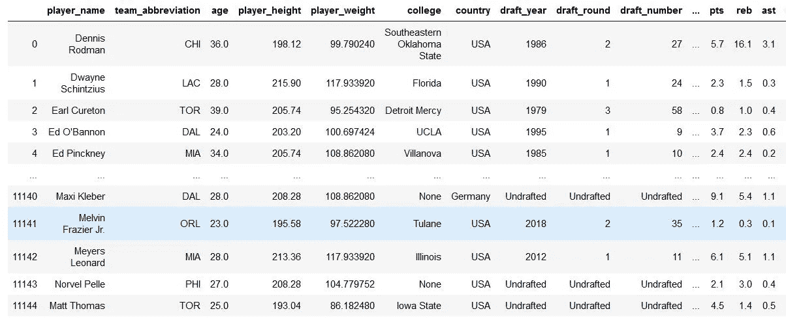

NBA 球员样本数据集

## 单柱的

为了显示数据帧中的单个列，我们将在 print 语句中提到列名。

输出将如下所示，

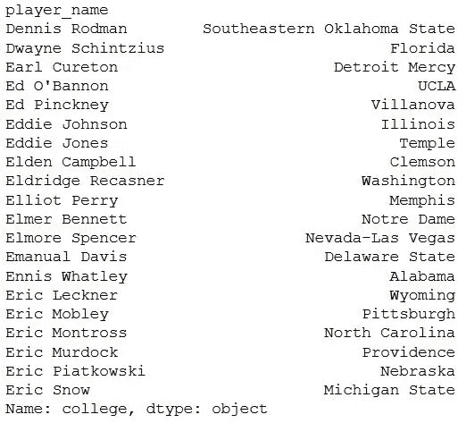

数据集中的单列

## 多列

我们来试着展示一下球员的‘年龄’、‘学院’、‘选秀年份’。我们可以用下面的方式显示多列，

多列将显示如下:

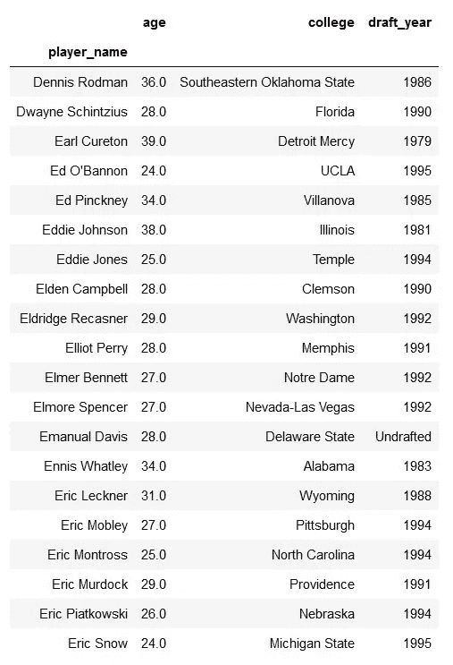

多列

## 。锁定方法

使用`.loc`方法进行索引。如果我们使用`.loc`方法，我们必须使用数据的**标签**名称来传递数据。

## 单行

为了显示数据帧中的一行，我们将在`.loc`方法中提到该行的索引名。

整行信息将显示如下:

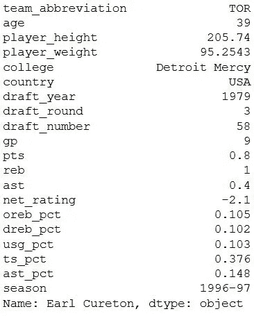

单行信息

## 多行

与单行相同，在打印命令中传递行信息以显示信息。

输出将是，

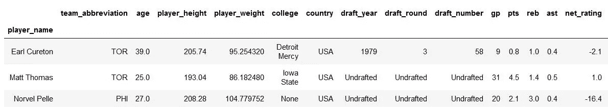

多行

## 选择行和列

我们还可以使用`.loc`方法一次选择多行和多列。

输出将是这样的，

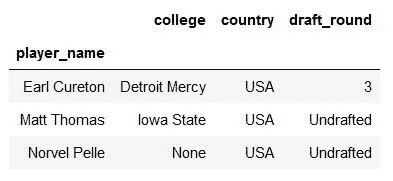

显示行和列

## 所有行和一些列

使用`.loc`方法显示所有包含一些列的行。

上面代码的输出将是这样的，

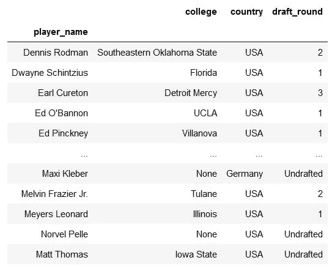

同样的输出可以通过简单地给出列名**来实现，而不需要使用**选择多个列中所示的** `**.loc**` **方法**。**

输出将与上面的输出相同，

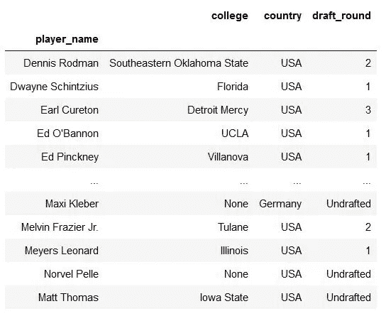

相同的输出没有。通信线路（LinesofCommunication）

## **。iloc 方法**

使用`.iloc`方法步进。如果我们使用`.iloc`方法，我们必须使用其**位置**来传递数据。它非常类似于`.loc`方法，唯一的区别是`.iloc`使用整数来提取信息。

## 单行

我们必须在`.iloc`方法中传递一个整数来获取行信息。

输出将是，

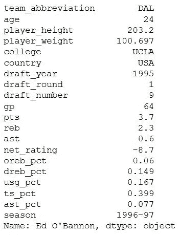

单行使用。iloc 方法

## 多行

要选择多行，我们必须传递所选行的位置。

输出看起来像这样，

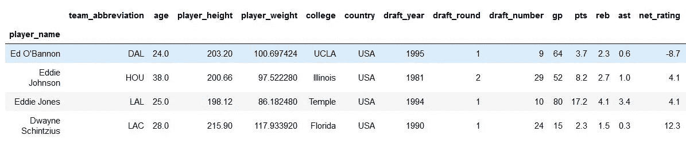

## 选择行和列

为了显示特定数量的行和列，我们为行创建一个整数列表，为列创建一个整数列表，并传递给`iloc`函数。

输出将是，

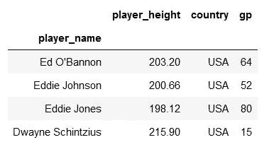

行和列 iloc 方法

## 所有行和一些列

为了显示所有的行，我们必须传递 **":"** 和用于列的整数。

输出看起来会像这样，

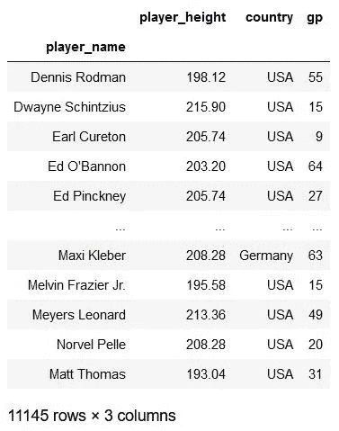

所有行和部分列 iloc

如果数据集中的列是“int”或“float”类型，那么我们可以将所有的数字操作直接应用于该列，并根据我们的要求操作数据。

## 使用`.loc`方法的数值运算

输出将是这样的，

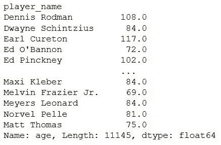

使用 loc 函数的数值运算

## 使用`.iloc`方法的数值运算

使用`.loc`方法，输出将与前一个相同

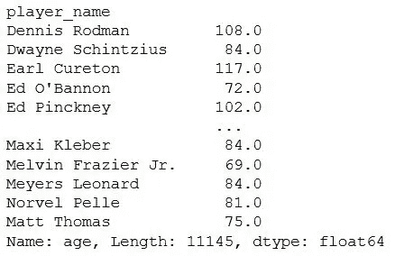

# 结论

我们可以用三句简单的话来总结这篇文章。

*   为了避免混淆显式索引和隐式索引，我们使用了`.loc`和`.iloc`方法。
*   `.loc`方法用于基于标签的索引。
*   `.iloc`方法用于基于位置的索引。

这是我们在 Python 中使用熊猫数据帧的索引方法时需要注意的三个主要语句。

**感谢您阅读**和**快乐编码！！！**

# 在这里查看我以前关于 Python 的文章

*   [**Seaborn: Python**](/seaborn-python-8563c3d0ad41)
*   [**熊猫:蟒蛇**](https://levelup.gitconnected.com/pandas-python-e69f4829fee1)
*   [**Matplotlib:Python**](https://levelup.gitconnected.com/matplotlib-python-ecc7ba303848)
*   [**NumPy: Python**](https://medium.com/coderbyte/numpy-python-f8c8f2bbd13e)
*   [**数据可视化及其重要性:Python**](https://levelup.gitconnected.com/data-visualization-and-its-importance-python-7599c1092a09)
*   [**Python 中的时间复杂度及其重要性**](https://medium.com/swlh/time-complexity-and-its-importance-in-python-2b2ba03c786b)
*   [**Python 中的递归或递归函数**](https://medium.com/python-in-plain-english/python-recursion-or-recursive-function-in-python-5802c74c1844)

# 参考

*   **数据索引与选择:**[https://jakevdp . github . io/python datascience handbook/03.02-Data-Indexing-and-Selection . html](https://jakevdp.github.io/PythonDataScienceHandbook/03.02-data-indexing-and-selection.html)
*   **用 Python 对数据帧进行索引、切片和子集化:**[https://data 木工. org/Python-ecology-lesson/03-index-slice-subset/index . html](https://datacarpentry.org/python-ecology-lesson/03-index-slice-subset/index.html)
*   **loc 和 iloc:**[https://camp . data camp . com/courses/intermediate-python/dictionary-pandas？ex=17](https://campus.datacamp.com/courses/intermediate-python/dictionaries-pandas?ex=17)
*   **使用 iloc，loc，& ix 选择熊猫数据帧中的行和列:**[https://www . shanelynn . ie/select-Pandas-data frame-rows-and-columns-Using-iloc-loc-and-IX/](https://www.shanelynn.ie/select-pandas-dataframe-rows-and-columns-using-iloc-loc-and-ix/)