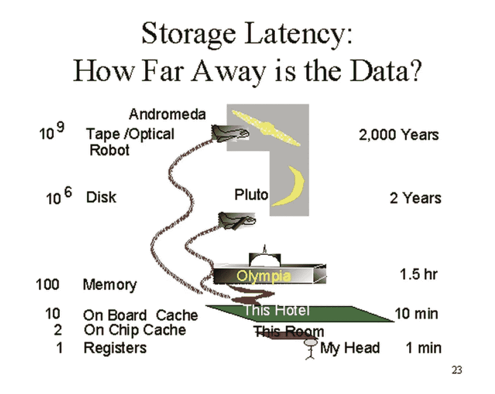

# 索引非常大的表

> 原文：<https://towardsdatascience.com/indexing-very-large-tables-569811421ee0?source=collection_archive---------1----------------------->

照片由 [Pierre Bamin](https://unsplash.com/@bamin?utm_source=unsplash&utm_medium=referral&utm_content=creditCopyText) 在 [Unsplash](https://unsplash.com/s/photos/index?utm_source=unsplash&utm_medium=referral&utm_content=creditCopyText) 上拍摄

## 数据工程

## 关于索引大型表的最佳实践以及如何使用分区来减轻索引负载的简短指南

*本文最后一次更新于 2021 年 8 月 5 日。感谢约翰·特罗洛普指出一些令人尴尬的错别字。*

低查询是任何数据或软件团队的主要问题之一。通常，要加快查询速度，第一反应就是创建所有能想到的索引。虽然索引被认为可以使查询更快，但是它们不能免除你在编写查询时犯下的错误。此外，创建索引是有代价的，如果没有考虑到这一点，可能会降低数据库各方面的性能，而不仅仅是读取数据。

大型表更容易出现查询速度慢的问题。我们可以在两种不同的设置中看到慢速查询——一种不是时间关键的，另一种是时间关键的。让我们先讨论一下*什么是慢速查询*对于关键的查询。如果您正在开发一个应用程序，一个好的经验法则是以这样一种方式编写您经常运行的查询，它们在 500 ms 内返回一个响应。报告和 BI 工具可能很棘手。有人曾经告诉我，运行一个 BI 控制面板需要一天的时间，他们对此并不感到困扰。

在大量使用大型表(> 10 亿条记录)之后，我意识到我们可以在对它们进行索引的同时处理一些事情。

# 1.修改索引；不要创建新的

在大表上创建和维护索引比在小表上成本更高。每当创建索引时，都会在磁盘上创建索引列+主键的副本，并且尽可能将索引保存在内存中。如果一个索引包含了查询所需的所有数据，它就永远不会进入实际的表。例如，如果您在`customer_id` 上过滤了数据并按`year`分组，并且索引在`(customer_id, year)`上，并且您没有在`SELECT`语句中查询任何其他内容，那么查询将不会到磁盘表中提取记录，因为索引满足查询的所有数据要求。

您应该努力为所有查询建立最佳索引，也就是说，索引应该覆盖大多数(如果不是全部)在过滤、分组、排序、选择等操作中应该使用索引的列。这些指数被称为覆盖指数。它们涵盖了您的查询要求。

> 更多的索引意味着更慢的插入；更多的索引意味着更多的磁盘和内存空间被占用。

索引设计很复杂。如果您的系统有各种各样的查询，单个甚至几个索引可能无法满足所有这些查询的要求。那很危险！如前所述，第一反应是创建一个适合您的查询的索引，而不是使用索引。

索引的开销很大。每次添加索引时，它在索引表上的写入速度都会变慢，因为每次有记录进来时，它必须平衡更多的 B 树结构。当 B 树写操作不是连续的时，成本肯定会更高，这就是为什么，通常情况下，最好选择一个现有的索引，并通过添加另一列或更改列顺序或两者兼而有之来修改它。

> 通过修改现有的索引来减少内存占用，而不是盲目地添加更多的索引。

要做到这一点，您必须对您的查询有深入的了解。最好有一个目录，告诉您哪个查询需要哪个索引，这样您对索引所做的修改就不会对其余的查询产生意外的影响。

MySQL 支持索引操作的在线更改——因此，如果您创建或删除一个索引，在索引创建过程中对表的读写不会受到影响。文档上是这么说的，但是我发现了一些问题。为了提高索引操作的性能，请使用 Percona 的 [pt-online-schema-change](http://www.percona.com/doc/percona-toolkit/2.1/pt-online-schema-change.html) 工具。它已经试过&测试过了。

# 2.一起使用索引和分区

平衡较大的 B 树比平衡较小的 B 树消耗更多的资源。分区将您的表分割成更小的子表，但是您无法了解这一点，除非您进入磁盘，看到为您的表创建了不同的表文件，而不是一个表文件。这同样适用于该表上的索引。

索引和分区的主要动机是相同的——为查询丢弃数据。除了使用分区修剪丢弃数据之外，分区还有我刚才提到的积极的副作用——它让我们可以平衡更小的树，重新计算更小的索引。

另一个经验法则是对非常大的表使用分区，例如至少有 1 亿行的表。一旦分区完成，对分区表的所有查询都必须在`WHERE`子句中包含`partition_key`，否则，这将是一次全表扫描——相当于对整个表的线性搜索。

> 分区产生更小的 B 树/索引，因此在插入时重新计算这些索引的工作量更少。

为了使索引工作，您应该有一个所有查询都可以使用的合适字段。您可以对数据使用许多不同类型的分区。点击了解更多信息[。](https://dev.mysql.com/doc/refman/8.0/en/partitioning-types.html)

# 3.不惜一切代价避免磁盘操作

虽然这应该通过创建覆盖索引来覆盖，但我认为它值得单独提及，因为索引只能帮助您隐藏糟糕的查询编写。磁盘操作成本很高。我一直用 Jim Gray 的类比来演示磁盘 I/O，因为在当前环境下理解这一点很重要。

吉姆·格雷著名的存储延迟类比

不使用索引的排序操作在磁盘上执行。磁盘很慢。为了避免磁盘操作，请确保在查询的`EXPLAIN PLAN`中寻找提示和信息。当你看到`filesort`的时候，要明白它会试图把整个表分块放入内存中。如果表太大，内存容纳不下，它将在磁盘上创建一个临时表，并在那里执行。留意有或没有组合`using temporary`的`using filesort`。每当 MySQL 无法使用索引执行排序时，`using filesort`就会出现在计划中。

要深入理解这一点，请仔细阅读 MySQL 优化人员的旧帖子。帖子虽然旧了，但是我觉得还是有相关性的，对这部分改动不多。

 [## Sergey Petrunia 的博客“MySQL 如何执行 ORDER BY

### 在过去的几个星期里，出现了大量与订单/分组相关的优化错误，我是这些错误的修复者

s.petrunia.net](http://s.petrunia.net/blog/?p=24) 

在排序时，有几件事你应该注意——记住你不能跳过索引中的列。您不能编写一个按`x, z`排序的查询，并期望它将索引完全用于一个索引。如果在第一列上有一个`range`过滤器或一个`IN`子句，那么索引也将不起作用。当两列`(x, y)`在查询中以不同的顺序排序时，例如`ORDER BY x ASC, y DESC`，它也不起作用。如果您没有注意到这几点，索引将不会执行查询。

这一点的本质是要让大家明白，也要确保使用索引进行排序，否则，这将是一个非常昂贵的操作。

处理数据库中的大型表很有趣。那是你真正理解数据库系统的复杂性，它的优点和缺点的时候。我建议您创建一个测试数据库，[生成测试数据](/generating-test-data-using-sql-2a1162f5ef16)来填充一个大表，并运行查询来了解它是如何工作的。实践胜过理论。

*感谢 Kai Sassnowski 的这次演讲，它验证并巩固了我多年来对 MySQL 索引的学习。*

Kai Sassnowski 在 Laracon EU 上关于数据库索引的演讲

这是[关于数据库性能的系列文章&的一部分。这是其中的一些—](https://linktr.ee/kovid)

*   [简单修复 SQL 查询](/easy-fixes-for-sql-queries-ff9d8867a617)
*   [防御性查询写作](/defensive-query-writing-1fa07674899b)
*   [多种风格的 SQL](/the-many-flavours-of-sql-7b7da5d56c1e)
*   [完整的数据工程师词汇](/complete-data-engineers-vocabulary-87967e374fad)
*   [如何避免编写草率的 SQL](/how-to-avoid-writing-sloppy-sql-43647a160025)
*   [我们总会有续集](/well-always-have-sequel-55325432174)