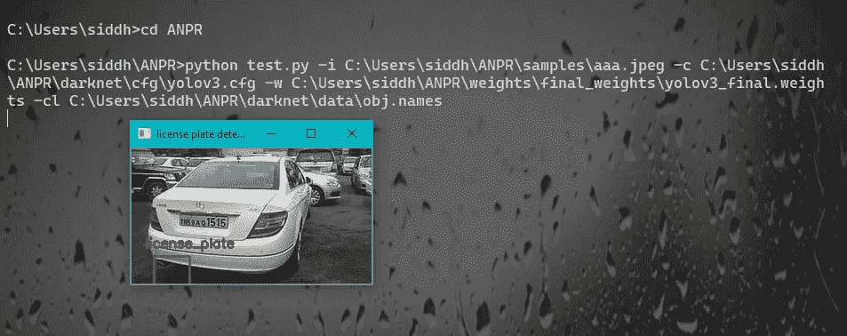
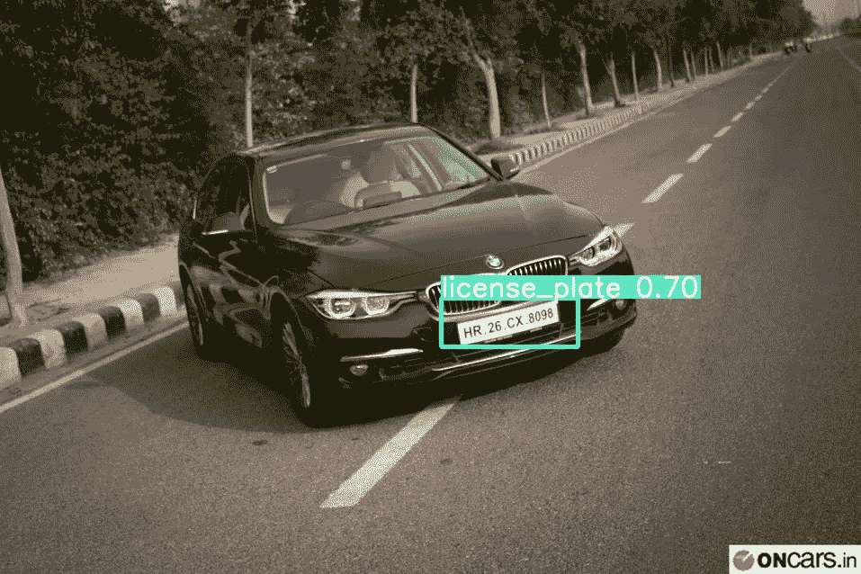
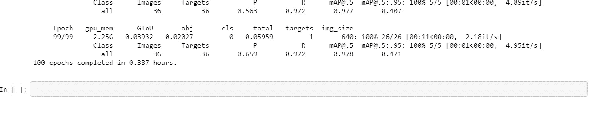

# YOLOv5 如何解决 YOLOv3 遇到的歧义

> 原文：<https://towardsdatascience.com/indian-car-license-plate-detection-using-yolo-v5-ae2574578175?source=collection_archive---------12----------------------->

## [现实世界中的数据科学](https://towardsdatascience.com/data-science-in-the-real-world/home?gi=ea0e55878a54)

## 使用 YOLOv5 实现稳健的印度车牌检测


我对一般交通数据的结果

对那些可能不知道的人来说，一个新版本的 YOLO(你只看一次)在这里，即 YOLO v5。非常感谢 [Ultralytics](https://www.ultralytics.com/) 将这个库放在一起。


来源:‘【https://github.com/ultralytics/yolov5】T4

## YOLOv3 的问题是

你只看一次(YOLO)是一个最先进的，实时对象检测系统。在 Pascal Titan X 上，它以 30 FPS 的速度处理图像，在 COCO test-dev 上有 57.9%的 mAP。

YOLOv3 速度极快，精度极高。在 mAP 中，测得 5 IOU YOLOv3 与焦点损耗相当，但速度快 4 倍左右。此外，你可以简单地通过改变模型的大小在速度和准确性之间进行权衡，不需要重新训练！

YOLOv3 有一个问题，尽管如此精确，但它是有偏见的。偏向于图像中对象的大小。如果在训练时遇到较大的物体，它不能完美地检测到较小尺度的相同物体。



由于该模型是为较大的车牌训练的，所以它不能在这个非常小的图像中正确地检测到小的车牌

YOLOv3 检测图像中的特征，并学习如何利用这些信息识别物体。靠近起点的层检测非常简单的特征，如边缘，而更深的层可以检测更复杂的特征，如眼睛、鼻子或整张脸。然后，它使用所有这些它已经学会的特征，做出最终的预测。这就是该系统的缺陷所在——没有在 CNN 中任何地方使用的空间，并且用于连接层的汇集功能效率低下。

**YOLOv5**

YOLOv5 由三部分组成:

1.  模型主干
2.  模型头
3.  模特脖子

模型头部有助于特征提取过程。模型主干由 CSP 网络组成，有助于从通过模型头部的张量中提取基本特征。CSPNets 也支持更快的推理。来自模型主干的张量通过具有特征金字塔的模型颈部，该特征金字塔试图消除相对于对象大小的偏差。

要了解有关要素金字塔的更多信息，请查看

 [## 用于目标检测的特征金字塔网络

### 特征金字塔是识别系统中的基本组件，用于检测不同尺度的对象。但是最近…

arxiv.org](https://arxiv.org/abs/1612.03144) 

要了解更多关于 YOLOv5 的信息，请查看这个。

[](https://blog.roboflow.ai/yolov5-is-here/) [## YOLOv5 来了

### CDT 月 12 日上午 8:08 更新:为了回应社区反馈，我们写了一篇更详细的帖子，比较…

blog.roboflow.ai](https://blog.roboflow.ai/yolov5-is-here/) 

查看 YOLO 版本 5 库，网址为

[](https://github.com/ultralytics/yolov5) [## ultralytics/yolov5

### 这个资源库代表了 Ultralytics 对未来对象检测方法的开源研究，并结合了我们的…

github.com](https://github.com/ultralytics/yolov5) 

对于我们的用例，我在

[](https://github.com/sid0312/anpr_yolov5) [## sid0312/anpr_yolov5

### 这个项目是一个后续项目，参考我们的数据准备在这个链接的培训，参考这个链接给…

github.com](https://github.com/sid0312/anpr_yolov5) 

## 克隆存储库

```
git clone [https://github.com/sid0312/anpr_yolov5](https://github.com/sid0312/anpr_yolov5)
cd anpr_yolov5
```

## 检测车牌

要检测汽车图像中的车牌，请将其保存在目录的 sample_cars 文件夹中。把它命名为 example.jpg

```
python detect.py --source sample_cars/example.jpg  --weights weights/best.pt --conf 0.4
```

## 结果

获取推理/输出目录中的最终图像。要获得检测过程的直觉，请查看以下笔记本

以下是一些结果


验证图像的批量预测

## 我们注意到 YOLOv5 正确地检测到了车牌，而 YOLOv3 根本没有检测到车牌



对测试样本图像的预测


测试样本图像预测

# 我是怎么做到的？

该存储库包括对原始 utlralytics 存储库的以下更改

**已创建数据/license_plate.yaml**

**数据准备**

*   步骤 1-从以下网址下载 JSON 格式的初学者数据集

[](https://www.kaggle.com/dataturks/vehicle-number-plate-detection) [## 车辆牌照检测

### 标记在车辆牌照上的包围盒

www.kaggle.com](https://www.kaggle.com/dataturks/vehicle-number-plate-detection) 

这是我们的起始数据集。将 JSON 文件上传到您的 Google Drive

*   步骤 2——将 JSON starter 数据集转换成 YOLO 格式

以下存储库是使用 YOLO v3 Darknet 和 Pytesseract 对印度车牌进行的端到端检测和识别。它是我们项目的先驱。这是一个有趣的个人项目本身！

*   创建文件夹结构


存储库的数据文件夹

*   在数据/图像文件夹中，创建两个文件夹，即 train 和 valid
*   训练文件夹由从步骤 2 获得的 201 个图像组成。这些是用来训练的
*   有效文件夹由步骤 2 中获得的 36 幅图像组成，用于验证


我的数据/图像/训练文件夹的内容


我的数据/图像/训练/有效文件夹的内容

只有图像不能用于检测，因为我们需要边界框的标签和每个图像的类。

单个类边界框标注的 YOLO 格式如下:

```
class_number x y width height
```

标签已经从步骤 2 中获得。

标签文件夹由训练和有效文件夹组成，分别由训练和验证图像的标签组成。


训练图像的标签

标签样本


验证图像的标签

接下来，我们创建 data/train.txt 文件

要获取该文件的内容，只需在命令提示符或终端中编写以下内容。确保您位于 anpr_yolov5 目录中

```
D:>git clone [https://github.com/sid0312/anpr_yolov5](https://github.com/sid0312/anpr_yolov5)
cd anpr_yolov5
python
>>import os
>>for image in os.list('data/images/train'):
     path = 'D:/anpr_yolov5/data/images/train'
     print(path+'/'+image)
```

您将获得以下输出


将输出复制到文件 data/train.txt 中

对 valid.txt 进行同样的操作

如果您打算在 Google Colab 上训练 Yolo v5，提交当前状态的存储库，不要复制上面的内容。提交您的存储库的当前状态并将其推送到 GitHub。

```
git add . 
git commit -m"some msg"
git push
```

现在按照下面的笔记本，将打印日志的内容分别复制到 data/train.txt 和 data/val.txt 文件中

*   **将 yolov5s.yaml 中的 nc 参数改为 1**
*   **再次重复 git 添加、提交、推送过程**
*   **查看以下笔记本了解培训流程**

[](https://github.com/sid0312/anpr_yolov5/blob/master/yolov5_license_plate_train.ipynb) [## sid0312/anpr_yolov5

### permalink dissolve GitHub 是超过 5000 万开发人员的家园，他们一起工作来托管和审查代码，管理…

github.com](https://github.com/sid0312/anpr_yolov5/blob/master/yolov5_license_plate_train.ipynb) 

**注意:也可以使用 yolo5s.pt 砝码。我使用了随机初始化的权重，并对模型进行了 100 个时期的训练。**

## 我的一些训练日志如下


## 我们用 mAP@0.5 实现了令人敬畏的性能，达到 0.978 或 97.8%，相当令人敬畏！



**运行 100 个纪元后，我们得到**

**精度为 0.659**

**召回为 0.972**

**将@0.5 映射为 0.978**

**以 95%的置信度将@0.5 映射为 0.471**

# **使用的资源**

*   [https://blog . roboflow . ai](https://blog.roboflow.ai/)
*   [https://github.com/ultralyitcs**/**约洛夫 5](https://github.com/ultralyitcs/yolov5)

# 相关存储库

如果你跳过了培训部分，直接跳到了结论，我有更多的东西给你。找到车牌的感兴趣区域后，我们可以使用 pytesseract 将其用于字符识别

我以前为一个项目做过。您可以查看:

[](https://github.com/sid0312/ANPR) [## sid0312/ANPR

### 这将作为我们的初始数据集 git 克隆 https://github.com/pjreddie/darknet CD 暗网我们添加我们的处理…

github.com](https://github.com/sid0312/ANPR) 

## 作者推荐的博客

如果你想了解更多关于物体检测算法和库的知识，我强烈推荐这个由 neptune.ai 撰写的博客

[](https://neptune.ai/blog/object-detection-algorithms-and-libraries) [## 对象检测算法和库- neptune.ai

### 对象检测在图像中找到并识别事物，这是深度学习的最大成就之一…

海王星. ai](https://neptune.ai/blog/object-detection-algorithms-and-libraries) 

## 作者说明

如果你喜欢我的文章，看看这些！

[](/face-detection-on-the-browser-with-tensorflow-js-27846a5fe954) [## 使用 Tensorflow.js 优化浏览器上的人脸检测

### 基于浏览器的人脸检测器正是你所需要的

towardsdatascience.com](/face-detection-on-the-browser-with-tensorflow-js-27846a5fe954) [](/segmentation-of-optical-coherence-tomography-images-with-diabetic-macular-edema-the-gluon-82093cfd8e24) [## 基于 U-网的 OCT 图像分割

### 使用 OCT 报告诊断糖尿病性黄斑水肿的深度学习方法。使用 Apache Mxnet 和…

towardsdatascience.com](/segmentation-of-optical-coherence-tomography-images-with-diabetic-macular-edema-the-gluon-82093cfd8e24) [](/counting-people-on-your-webcam-using-gluoncv-and-mxnet-d1a9f05c427d) [## 使用 GluonCV 和 MxNet 计算网络摄像头上的人数

### 介绍

towardsdatascience.com](/counting-people-on-your-webcam-using-gluoncv-and-mxnet-d1a9f05c427d) 

**如果你希望在 Linkedin 上与我联系**，**这是我的简介**

[](https://www.linkedin.com/in/siddhant-baldota-051059180/) [## Siddhant Baldota -圣地亚哥超级计算机中心研究实习生| LinkedIn

### 我是一名计算机科学硕士研究生，积极致力于深度学习和计算机的应用

www.linkedin.com](https://www.linkedin.com/in/siddhant-baldota-051059180/) 

快乐的计算机视觉和快乐的深度学习❤.