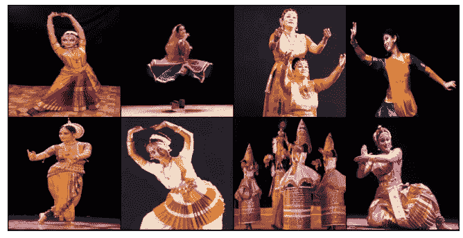

# 利用和尚艾进行印度舞蹈形态分类

> 原文：<https://towardsdatascience.com/indian-dance-form-classification-using-monk-ai-ec688b4236e9?source=collection_archive---------42----------------------->

> 这是由 HackerEarth 组织的深度学习竞赛，我在 5800 多名参与者中排名低于 70，数据增强在其中发挥了重要作用。

## 介绍

有如此多的印度古典舞形式，从图像中提取和理解动态人体姿态是一项具有挑战性的计算机视觉任务。



数据集的图像

在这篇博文中，我将展示我用什么方法对图片进行分类，以及它把我带到了排行榜的哪个位置。

数据从[黑客地球竞赛](https://www.hackerearth.com/challenges/competitive/hackerearth-deep-learning-challenge-identify-dance-form/)页面下载，数据集由 364 幅图像组成，分属于 8 类，即*曼尼普尔、巴拉塔纳蒂扬、奥迪西、卡塔卡里、卡萨克、萨特里亚、库奇普迪、*和*莫希尼亚特坦*，每类约有 45 幅图像。

## 安装和下载数据

让我们从设置 Monk 及其依赖项开始:

```
!git clone [https://github.com/Tessellate-Imaging/monk_v1.git](https://github.com/Tessellate-Imaging/monk_v1.git)
!cd monk_v1/installation/Misc && pip install -r requirements_kaggle.txt
```

因为我在 Kaggle 上运行这个笔记本，所以我使用了边栏中的“+ Add data”选项并上传了数据。数据将在中提供../输入。

## 创造一个实验

我已经创建了一个实验，对于这个任务，我使用了 **mxnet 胶子后端。**

```
import os
import sys
sys.path.append("/kaggle/working/monk_v1/monk/");
from gluon_prototype import prototype
gtf = prototype(verbose=1);
gtf.Prototype("Dance_Form", "Using-resnet152_v1");
```

# 第一种方法

## 模型选择和培训

在第一种方法中，我使用不同的模型进行训练， **resnet152_v1** 给出了很好的结果，因此使用该模型进行训练。

```
gtf.Default(dataset_path="../input/final3/folder/", 
            model_name="resnet152_v1", 
            freeze_base_network=False,
            num_epochs=10);gtf.Train();
```

经过 10 个历元的训练，我得到了 80%的验证准确率。

## 预言；预测；预告

通过这个模型，我预测了测试数据集中的类。

```
list_test=os.listdir("../input/data-test/test/");
from tqdm.notebook import tqdm
combined = [];
for i in tqdm(range(len(list_test))):
    img_name = "../input/data-test/test/" + list_test[i];
    predictions = gtf.Infer(img_name=img_name);
    id_ = list_test[i]
    label = predictions["predicted_class"];    
    combined.append([id_, label]);a = pd.DataFrame(combined, columns = ['Image', 'target']);
a.to_csv("submission.csv", index=False);
```

提交 submission.csv 文件后，我在排行榜上的排名低于 250，而在比赛中，大约有 5800+参与者。

直到现在，我还没有使用任何数据增强技术，结果也不错。

现在，在我的第二种方法中，让我们看看数据扩充对结果的影响。

# 第二种方法

**数据扩充:-** 数据扩充是增加数据数量和多样性的过程。我们不是在收集新数据，而是在转换已经存在的数据。深度学习神经网络的效率也随着可用数据量的增加而增加。

由于可用的数据非常少，所以我使用了数据扩充技术来转换数据。

对于数据扩充，我使用了 imgaug 库。

```
from imgaug import augmenters as iaa
import imgaug as ia
import imageioseq=iaa.Sequential([
        iaa.Scale((224, 224)),
        iaa.Sometimes(0.25, iaa.GaussianBlur(sigma=(0, 3.0))),
        iaa.Fliplr(0.5),
        iaa.Sharpen(alpha=(0, 1.0), lightness=(0.75, 1.5)),
        iaa.Affine(rotate=(-20, 20), mode='symmetric'),
        iaa.Sometimes(0.25,
                      iaa.OneOf([iaa.Dropout(p=(0, 0.1)),
                                 iaa.CoarseDropout(0.1,                                                                 size_percent=0.5)])),
        iaa.AddToHueAndSaturation(value=(-10, 10), per_channel=True)
    ])
```

这是数据集中图像数量的两倍。数据增广后，我用同样的 resnet152_v1 模型进行训练。

```
gtf.Default(dataset_path="../input/final3/folder/", 
            model_name="resnet152_v1", 
            freeze_base_network=False,
            num_epochs=10);gtf.Train();
```

经过 10 个历元的训练，我得到了 94%的验证准确率。

使用这个模型，我预测了测试数据集中的类，并提交了 submission.csv 文件。这次我的排名在 70 以下，比上次好很多。

## 结论

因此，从这场比赛中，我们可以看到数据增强如何有助于提高模型的性能。

本文中的所有代码都位于这个 Github 链接上:

[https://github . com/Shu bham 7169/MonkAI/blob/master/Dance _ Form _ class ification . ipynb](https://github.com/shubham7169/MonkAI/blob/master/Dance_Form_Classification.ipynb)