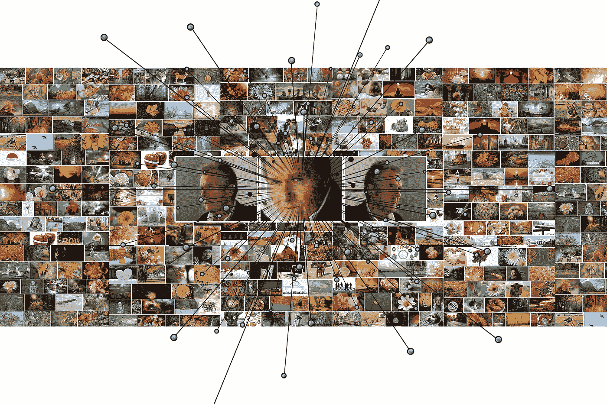
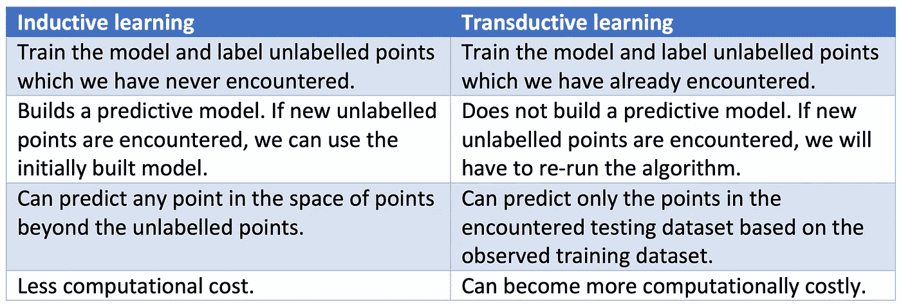
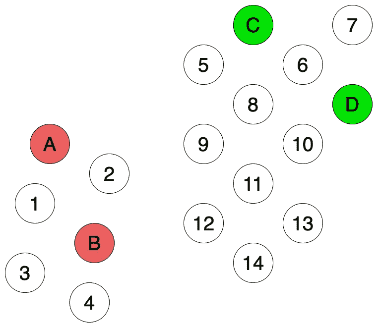
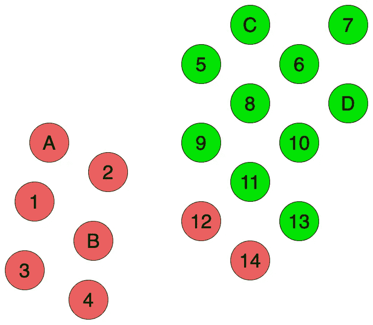
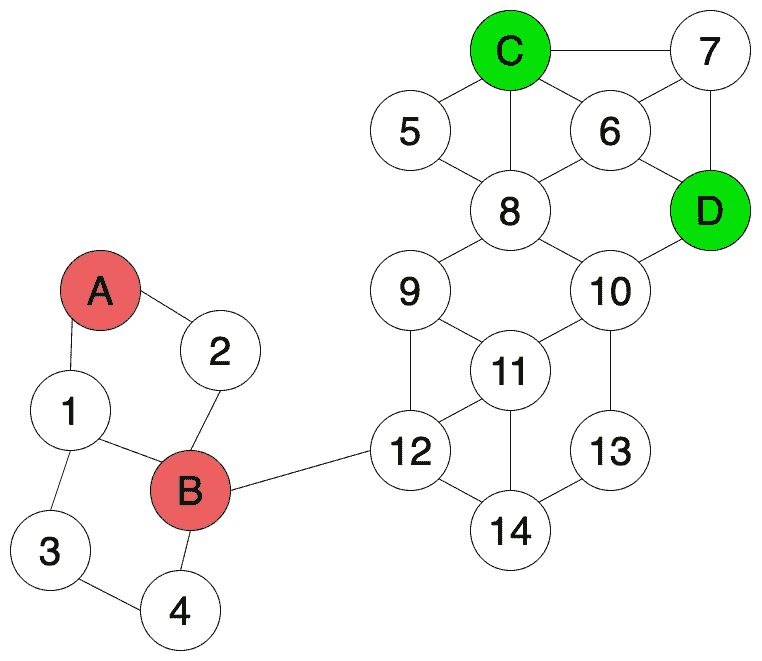
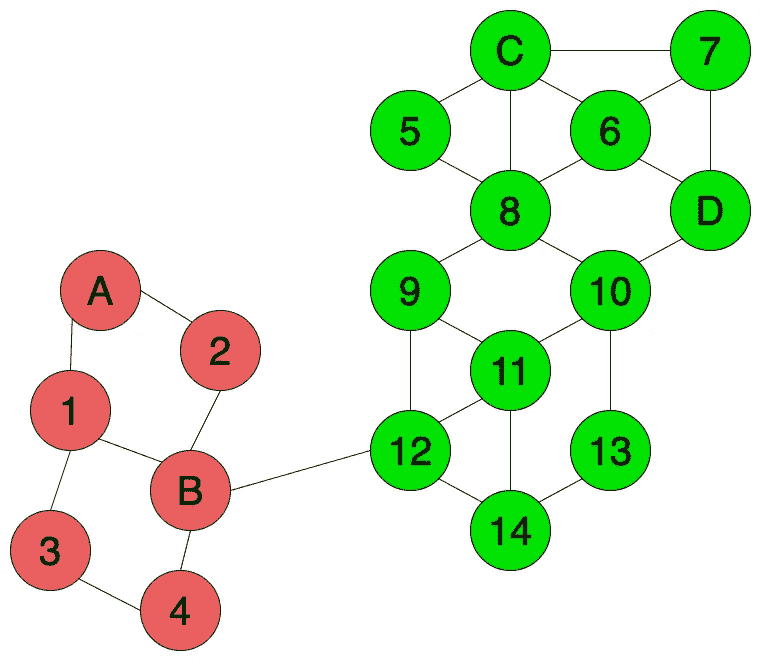

# 归纳学习与传导学习

> 原文：<https://towardsdatascience.com/inductive-vs-transductive-learning-e608e786f7d?source=collection_archive---------3----------------------->

## 浅谈归纳式和直推式学习方法

**归纳**和**转导**……在阅读机器学习的书籍和文章时，你可能会多次碰到这两个词。在本文中，让我们试着理解这两种学习方法的区别，以及如何根据我们的用例来使用它们。

图片由 [Gerd Altmann](https://pixabay.com/users/geralt-9301/?utm_source=link-attribution&utm_medium=referral&utm_campaign=image&utm_content=3859539) 从 [Pixabay](https://pixabay.com/?utm_source=link-attribution&utm_medium=referral&utm_campaign=image&utm_content=3859539) 拍摄

# 理解定义

根据[维基百科](https://en.wikipedia.org/wiki/Transduction_(machine_learning))，

> **转导**是从观察到的特定(训练)案例到特定(测试)案例的推理。相反，**归纳**是从观察到的训练案例中推理出通用规则，然后应用到测试案例中。

我们来分解理解一下这两个定义。

## 感应

> **归纳**是从观察到的训练案例中推理出通用规则，然后应用到测试案例中。

**归纳学习**与我们俗称的 ***传统监督学习*** 相同。我们基于我们已经拥有的带标签的训练数据集来建立和训练机器学习模型。然后，我们使用这个训练好的模型来预测我们以前从未遇到过的测试数据集的标签。

## 转换

> **转导**是从观察到的特定(训练)案例到特定(测试)案例的推理。

与归纳学习相反，**直推学习**技术预先观察所有数据，包括训练和测试数据集。我们从已经观察到的训练数据集学习，然后预测测试数据集的标签。即使我们不知道测试数据集的标签，我们也可以在学习过程中利用这些数据中存在的模式和附加信息。

示例直推式学习方法包括***【TSVM】***和 ***基于图的标签传播算法(LPA)*** 。

# 有什么区别？

既然你对归纳学习和直推学习的定义有了清晰的概念，让我们来看看它们有什么不同。这些定义基本上说明了它们的区别，但是让我们来看一下，这样会更清楚。

主要区别在于，在直推式学习过程中，当训练模型时，您已经遇到了训练和测试数据集。然而，归纳学习在训练模型时只遇到训练数据，并将学习到的模型应用于它从未见过的数据集。

转导不建立预测模型。如果一个新的数据点被添加到测试数据集中，那么我们将不得不从头重新运行该算法，训练该模型，然后使用它来预测标签。另一方面，归纳学习建立了一个预测模型。当遇到新的数据点时，没有必要从头重新运行算法。

更简单地说，归纳学习试图建立一个通用模型，根据一组观察到的训练数据点，预测任何新的数据点。这里你可以预测点空间中的任何一点，除了未标记的点。相反，直推式学习建立了一个模型，该模型符合它已经观察到的训练和测试数据点。这种方法使用标记点的知识和附加信息来预测未标记点的标记。

在通过输入流引入新数据点的情况下，直推式学习可能变得代价高昂。每次新的数据点到达时，您都必须重新运行一切。另一方面，归纳学习最初建立一个预测模型，新的数据点可以在很短的时间内用较少的计算来标记。

# 示例演练

图 1

首先，我将采用图 1 所示的例子。假设您有一组点，如图 1 所示。有四个标记点 A、B、C 和 d。我们的目标是标记(着色)从 1 到 14 的剩余未标记(未着色)点。如果我们对这个任务使用归纳学习，我们将不得不使用这 4 个标记点，并建立一个监督学习模型。

图 2

一眼看去，我们可以看到有两个独立的集群。然而，在归纳学习中，由于我们的训练样本数量非常少，因此很难建立一个捕捉数据完整结构的预测模型。例如，如果使用 ***最近邻*** 方法，则更靠近边界的点(例如 12 和 14)可以被着色为红色而不是绿色，因为它们更靠近红色点 A 和 B 而不是绿色点 C 和 D(如图 2 所示)。

图 3

如果我们有一些关于数据点的附加信息，例如基于相似性等特征的点之间的连通性信息(如图 3 所示)，我们可以在训练模型和标记未标记点时使用这些附加信息。

图 4

例如，我们可以使用直推式学习方法，如基于半监督图的 ***标签传播算法*** 来标记未标记的点，如图 4 所示，使用所有已标记和未标记点的结构信息。沿着边界的点，例如 12 和 14，连接到更多的绿色点而不是红色点，因此它们被标记为绿色，而不是红色。

注意，我们能够应用诸如标签传播的直推式学习方法，因为我们在开始时已经遇到了所有的训练和测试数据点，并且测试数据具有一些可能有用的附加信息。如果一开始没有测试数据点，我们将不得不遵循归纳学习方法。

# 最后的想法

我们已经讨论了归纳学习和直推学习的区别，并通过一个例子。现在你已经对归纳和直推学习方法及其差异有了基本的概念，你可以在开发下一个机器学习模型时利用这些知识。

有兴趣可以看看我之前写的关于[标签传播](/label-propagation-demystified-cd5390f27472)的文章。

 [## 标签传播去神秘化

### 基于图的标签传播的简单介绍

towardsdatascience.com](/label-propagation-demystified-cd5390f27472) 

感谢您的阅读！我也很想听听你的想法、想法和建议。

干杯！

# 参考

[1]转导(机器学习)维基百科—[https://en . Wikipedia . org/wiki/Transduction _(machine _ learning)](https://en.wikipedia.org/wiki/Transduction_(machine_learning))

[2]归纳学习和直推学习的区别是什么—[https://www . quora . com/What-is-the-difference-and-transductive-learning](https://www.quora.com/What-is-the-difference-between-inductive-and-transductive-learning)

[3]直推式推理与半监督学习—[https://pdfs . semantic scholar . org/5a8c/38 E6 aadc 29 FB 995 d5b 9562 df0c 4365156256 . pdf](https://pdfs.semanticscholar.org/5a8c/38e6aadc29fb995d5b9562df0c4365156256.pdf)