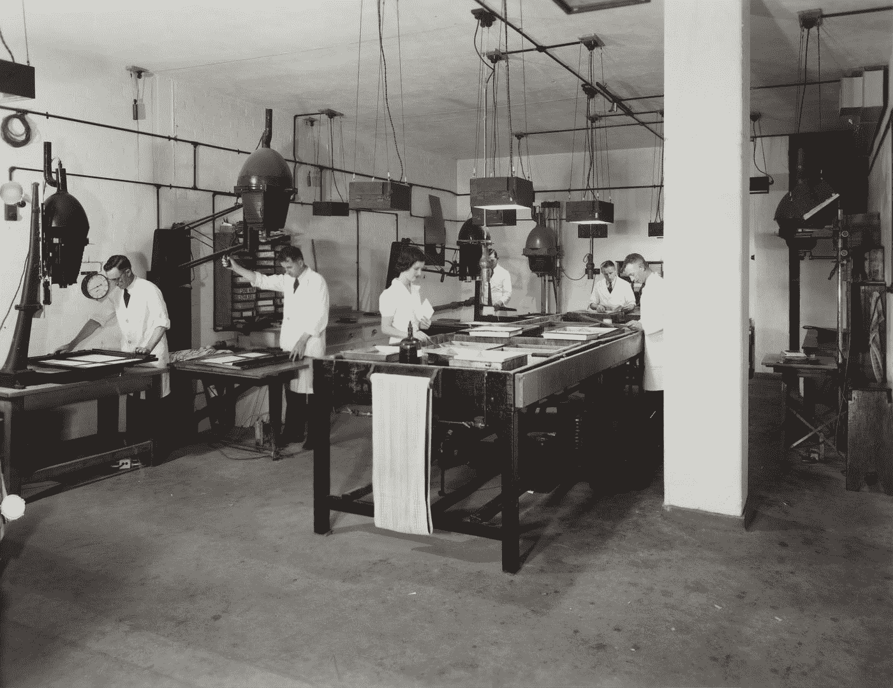
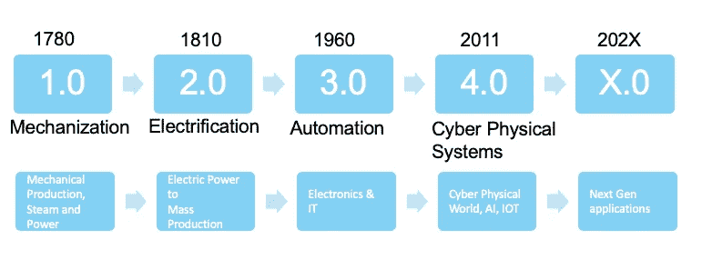
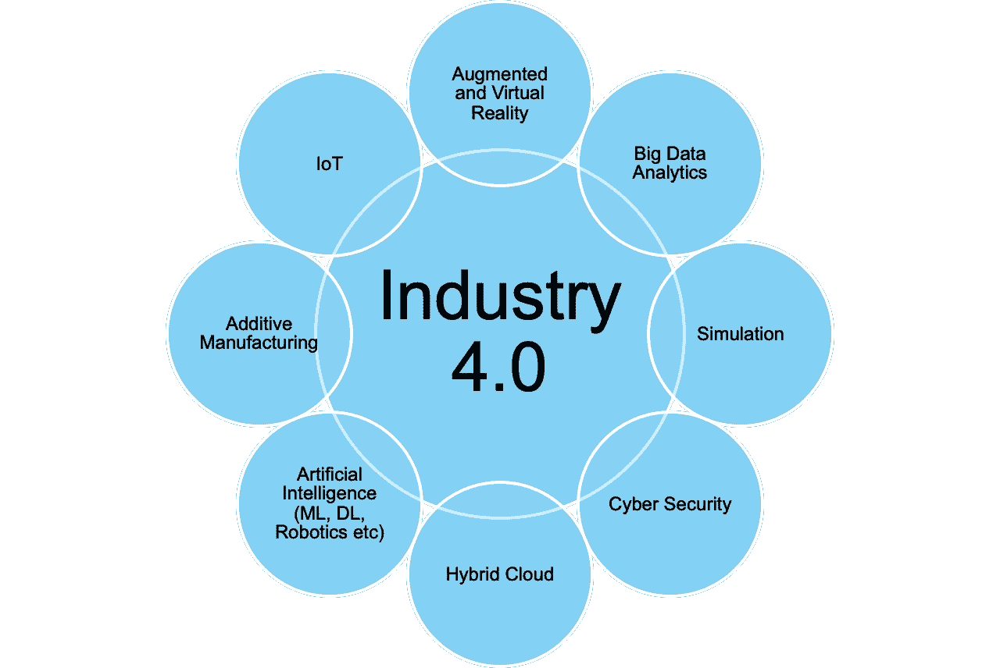

# 工业 4.0 还是互联网 4.0？

> 原文：<https://towardsdatascience.com/industry-4-0-or-internet-4-0-1d6a2fe7313?source=collection_archive---------43----------------------->

## 了解工业 4.0

纳蕾塔·马丁在 [Unsplash](https://unsplash.com?utm_source=medium&utm_medium=referral) 上的照片

在这篇博客中，我将发表我的观点，并写下与工业 4.0 革命的概念和进步相关的最新技术趋势，我们都在见证和经历这一革命，尽管我们中的一些人已经意识到这一点，而一些人却对此视而不见。现在，完全取决于你是否注意到它，看到它，了解它，体验它或者只是像鸽子一样闭上眼睛，相信工业 4.0 看不到你。

照片由[维多利亚博物馆](https://unsplash.com/@museumsvictoria?utm_source=medium&utm_medium=referral)在 [Unsplash](https://unsplash.com?utm_source=medium&utm_medium=referral) 拍摄

# 那么，什么是工业 4.0，我为什么要关心？

根据维基百科，“工业 4.0 是对制造技术中当前[自动化](https://en.wikipedia.org/wiki/Automation)和数据交换趋势的一个名称。它包括[信息物理系统](https://en.wikipedia.org/wiki/Cyber-physical_system)、[物联网](https://en.wikipedia.org/wiki/Internet_of_things)、[云计算](https://en.wikipedia.org/wiki/Cloud_computing)、[、【1】、](https://en.wikipedia.org/wiki/Industry_4.0#cite_note-Definition-I4.0-1)、[、【2】、](https://en.wikipedia.org/wiki/Industry_4.0#cite_note-2)、【3】、[、【4】、](https://en.wikipedia.org/wiki/Industry_4.0#cite_note-4)、[认知计算](https://en.wikipedia.org/wiki/Cognitive_computing)。

然而，用外行人的话来说，我可以把它定义为，新的或当前的工业革命，它利用了物理、数字系统和现代技术的综合力量，以这种方式，机器将执行大部分(如果不是全部)工作。

# 物联网

它是事物的互联网络；这里的事物可以是任何东西，如“设备”、“建筑物”、“汽车”、“桌子”、“椅子”，以及“你现在正在想的”或“以后可能想的”。所有这些和其他任何东西都可以通过互联网连接起来。工业 4.0(德国人怎么叫)或互联网 4.0(美国人怎么叫)或第四次工业革命，都可以归结为人、系统、设备，当然还有物联网中的“物”的前所未有的合并或连接。

这产生了新的业务方式，从而创造了新的增长和收入机会，这些机会可以通过利用互联设备和海量数据来实现(对不起，我指的是“大”或“智能”数据；在他们之间提供和交换。你绝对错了；等一下…这是一种夸张的说法，但老实说，如果你认为人工智能、机器学习、深度学习、大数据、物联网及其家族成员只是时髦的词汇，那你就错了。不，他们不是，他们已经成为日常业务，并将继续流行，甚至很快接管(在良好的意义上，而不是电影中显示的那种)每个行业。

# 工业革命:

2020，Chan Naseeb。保留所有权利。

第一次工业革命开始于 18 世纪 80 年代，产生了利用水和蒸汽动力机械生产设施。

第二个时代，开始于 30 年后，它带来了:大规模生产的电力

第三次工业革命开始于 20 世纪 60 年代末，提供了电子和信息技术。

第四，为互联世界和设备铺平道路。这意味着物理系统将通过使用机器学习、人工智能等由自动化系统控制。。尽管有好消息也有坏消息，但人类干预将保持在最低限度。好消息是我们将获得更好的表现，减少对人类的依赖，坏消息是，机器将接管许多(如果不是大部分的话)人类费力的工作。

虽然它的全面影响还有待观察，但我们可以看到它的潜力以及它迄今为止给我们带来了什么。

多梅尼科·洛亚在 [Unsplash](https://unsplash.com?utm_source=medium&utm_medium=referral) 上拍摄的照片

工业 4.0 中的一些流行词汇

*   物联网连接
*   机器学习
*   实时洞察
*   预测建模
*   流式分析等…

随着分析、物联网、数据科学和云计算的进步，更定制、更便宜、更可扩展的工厂解决方案成为可能，并且正在被发明。技术进步正在改变我们的日常生活和我们感知生活的方式。过去，经济只受几个因素的影响…但今天，它正受到技术突破和其他因素的影响，如商业发展、供应链和世界的全球连通性。如今，消费者行为比以往任何时候都更加重要。通过观察这些如今被称为预测智能的见解，企业可以规划他们的运营和供应链计划。

消费商品比任何人想象的都要容易。你可以足不出户，仅仅通过互联网就能买到任何东西。这意味着更多的竞争，以及对客户满意度和更好的消费者体验的更高要求。未能达到预期或迟到的企业将会被遗忘在尘埃中。你必须敏捷并适应不断变化的客户需求。如果你不能回答快速和频繁发生的动态，你最好选择一些其他业务是'没有业务'。作为一家企业，你必须积极主动，不断发展，否则就要做好被淘汰或至少被惩罚的准备。

工业 4.0 的主要构成要素如下图所示:

2020，Chan Naseeb。保留所有权利。

毫无疑问，工业 4.0 正在重新定义很多我们过去习以为常的事物、概念和想法。一些担忧包括与机器接管原本由人类承担的角色相关的风险。然而，它同时也是无可争议的事实和令人无比愉快的现象，为积极、迅速和巨大的变化提供了潜力。总之，我想让你放心，未来是关于协作智能的，而不仅仅是机器接管，正如我在早期的一篇关于增强人类智能的博客中所讨论的。

2020，Chan Naseeb。保留所有权利。

之前在 https://www.linkedin.com[发布](https://www.linkedin.com/pulse/industry-40-internet-chan-naseeb-pdeng-psm-i-sps-nexus-/)