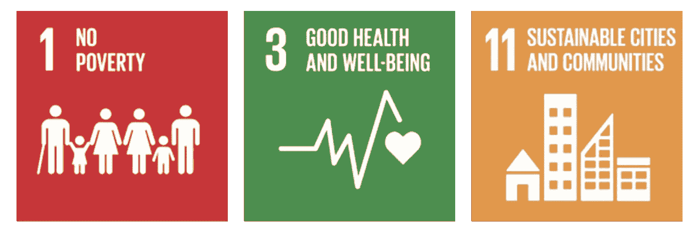

# 工业 4.0:第四次工业革命现在

> 原文：<https://towardsdatascience.com/industry-4-0-the-fourth-industrial-revolution-is-now-38361fb509da?source=collection_archive---------15----------------------->

## 工业 4.0 正在彻底改变我们的生活、工作、与环境互动以及彼此互动的方式，为所有人创造一个更美好的世界

来源:Shutterstock

二十年前被认为是科幻小说的许多内容正在推动世界走向第四次工业革命。工业 4.0 将彻底改变商业格局，以及人类与环境和彼此之间的互动方式。

许多人预测它将开创一个慷慨的新时代:延长寿命，改善医疗保健，减少全球贫困，等等。其他人在革命期间用来推动变革的大量数据中看到了更黑暗的可能性。

无论如何，现实是，全球 GDP 预计将接近 90 万亿美元[**——比 20 年前的 1 万亿美元还要多。**](https://www.imf.org/external/datamapper/NGDPD@WEO/OEMDC/ADVEC/WEOWORLD/EUQ/NMQ)

正是这种快速的经济增长和技术创新将世界推向了第四次工业革命——工业 4.0。

# 工业 4.0 的技术

第四次工业革命的技术与训练人工智能和其他关键形式的现代技术所需的大量数据密不可分。对数据的需求导致数据收集呈指数级增长。

数据分析和商业智能已经需要对信息技术、数学和统计学的高度掌握。人工智能和机器学习算法有能力自动化和优化分析流程，这反过来又创造了变革性的商业洞察力。

在过去的两年里， [**世界产生了 90%**](https://www.weforum.org/agenda/2017/09/the-value-of-data/)——每天 2.5 万亿字节——所有的数据。

这个数据和内容不一样。这是原始的、无组织的信息。

许多正在研究的尖端技术涉及设计人工智能系统，这些系统可以以有意义的方式筛选数据集，以便这些数据集可以被输入到神经网络中。

除了人工智能将继续在工业 4.0 中发挥核心作用，量子计算、3D 打印和物联网(IoT)都有望成为这一变化的基础。

2017 年欧洲专利局的一项研究**发现，在过去三年中，与工业 4.0 相关的专利申请增加了 54%。**

**然而，标志着这场革命的不仅仅是这些技术进步。**

**世界经济论坛创始人兼执行主席克劳斯·施瓦布创造了“第四次工业革命”一词，他在 2016 年提出，这场革命“正在模糊物理、数字和生物领域之间的界限”。**

**这包括向智能设备的转移，从智能住宅到智能手表。这是物联网与人类物理生活的融合。**

**这次合并不仅仅是为了方便。它将彻底改变人们、企业和政府的运作方式。**

**“不是每个人都需要成为数据科学家，但每个人都需要有数据素养，”分析公司 Qlik、 [**的数据素养负责人乔丹·莫罗告诉美国消费者新闻与商业频道**](https://www.cnbc.com/2019/01/16/fourth-industrial-revolution-explained-davos-2019.html) 。Morrow 继续指出，目前许多人和企业缺乏以有意义的方式分析和解释数据的必要技能。**

# **第四次工业革命带来的社会变革**

**技术是一种工具。它不好也不坏。但是，它是为了什么目的而实施的，当然可以使它如此。**

**最经典的例子就是核技术，无论是核电站还是核弹，核技术都是基础。**

**第四次工业革命将把世界带向何方，将取决于推动变革者的目标。**

**施瓦布说:“从来没有一个时代有更大的希望，也没有一个时代有更大的潜在危险。”他预测，与革命相关的最大社会问题将是不平等。**

## **推动积极变化**

**We Forum 发现，作为联合国 17 项全球目标**基础的 169 项目标中，有 70%可以通过作为第四次工业革命一部分的现有技术来实现。****

****按照这些思路，一家盈利性社会企业 Cangler 表示 [**其使命是解决**](https://www.analyticsinsight.net/The-10-Most-Innovative-Big-Data-Analytics-Companies-in-2019/#page=15) 三个联合国可持续发展目标:一个没有贫困的世界，增加良好的健康和福祉，以及创建可持续发展的城市和社区。****

********

****来源:联合国可持续发展目标****

****在一个数据盲阻碍许多组织在世界上做好事的时代，Cangler 提供了企业数据分析的自动化和民主化。****

****“我相信面对新技术，人类将能够利用它们来造福我们。大多数人渴望美好的生活，而不是悲惨的生活，”华为首席执行官任郑飞在聚焦第四次工业革命的达沃斯科技会议 期间说道。****

****一般来说，与革命相关的一些预期社会趋势将是中产阶级的崛起、反向人才流失、清真经济和妇女赋权。****

****“零创新”的意图也会越来越强烈。这是产品开发和技术的重点，对世界产生“零”负面影响。这可能涉及从零排放和零事故的汽车到碳中和城市的一切。哥本哈根已经表示，它正在努力成为世界上第一个碳中和首都**。******

******智能产品将无处不在，从智能服装、手表和手机，到智能建筑和智能城市。一个有望极大改善人们生活的智能产品将是智能城市:到 2025 年，这个行业的价值预计将达到 2.57 万亿美元。******

******这些 [**智慧城市**](https://www.cbinsights.com/research/what-are-smart-cities/) 依靠物联网来收集数据，这些数据可用于提供更好地管理资产、资源和服务的见解。这些包括从垃圾收集系统到城市规划的一切。******

****到 2050 年，预计世界三分之二的人口将居住在城市地区，智能城市将成为为人口分配必要资源的关键。“大区域”也将崛起，这将是投资的关键中心，导致企业“城市作为客户”战略的想法——而不是专注于目标国家。****

****ABI 研究公司的一份报告已经敦促在城市中更积极地部署 5G ，以开辟新的经济价值。****

****到 2028 年，该技术预计将产生 2.5 万亿美元的直接贡献，8660 亿美元的间接贡献，以及 3.2 万亿美元的生产率增长。****

# ****工业 4.0 的阴暗面****

****虽然郑飞在达沃斯科技会议上对第四次工业革命技术持乐观态度，但历史学家尤瓦尔·诺亚·哈拉里显然不这么认为。****

****哈拉里说:“从最浅显的层面来看，这可能是 19 世纪工业革命的重演，当时领导人有机会在经济和政治上主宰世界。”“我把当前的军备竞赛理解为帝国主义的军备竞赛……如果你掌握了一个国家的所有数据，你就不需要派遣士兵。”****

****社会运作越来越依赖技术，这使社会更容易受到网络攻击和各种其他网络威胁。****

****安全性 的 [**提升，尤其是与物联网相关的，对于第四次工业革命的蓬勃发展至关重要。这是因为这些网络威胁可以做任何事情，从危及物理安全到造成生产停机，从而导致重大经济损失。**](https://www.enisa.europa.eu/news/enisa-news/cybersecurity-is-a-key-enabler-for-industry-4-0-adoption)****

****然而，在社会方面，也许更大的威胁将以不平等加剧的形式出现。****

****施瓦布并不是唯一一个担心第四次工业革命可能导致世界不平等加剧的人。****

****共同基金 的一份 [**报告指出:“由于在接入互联网、获得资金和技术能力方面的起点不同，第四次工业革命的技术采用不平等，可能会导致经济增长进一步不平衡。”。**](https://www.common-fund.org/wp-content/uploads/2019/07/CFC-AR-2018_4th-Industrial-Revolution.pdf)****

****随着自动化和人工智能继续取代越来越多的工作场所人员，这种不平等还可能产生雪球效应。****

# ****这些变化将与以往的工业革命有何不同？****

****无论这些变化是为了人类和地球的更好，还是为了双方都付出巨大代价，工业 4.0 都不像它的前辈。****

****Schwab 认为，变化的指数速度和新技术的引进速度将对社会产生前所未有的影响。****

****可以这样想:1 亿人 用了 [**75 年才开始使用电话。游戏 Pokemon Go 在一个月内就有这么多用户。**](https://www.cnbc.com/2019/01/16/fourth-industrial-revolution-explained-davos-2019.html)****

****新技术的采用比人类历史上任何时候都要快。****

# ****最后的想法:工业 4.0——第四次工业革命就在眼前****

****随着世界进一步进入第四次工业革命，数据无处不在。无组织的和原始的，它塞满了企业的数字基础设施和拖垮系统。然而，从中获得的见解将继续推动智能世界的变革。****

****为了创造更好的产品和服务，以及做出更好的业务决策，您的团队必须精通数据。此外，您需要适当的系统来协调各种人工智能系统，以防止人工智能孤岛。****

****革命至此， [**85%的数据科学项目失败**](https://www.bmc.com/blogs/cio-ai-artificial-intelligence/) ， [**92%的此类失败**](https://hbr.org/2019/02/companies-are-failing-in-their-efforts-to-become-data-driven) 都是因为人和流程障碍。****

****加入 [**Cangler 早期采用者计划**](https://www.getcangler.com/trial/) 成为第四次工业革命的一份子。使用这项新兴技术为您的公司赢得竞争优势，并为每个人创造一个更美好的世界。****