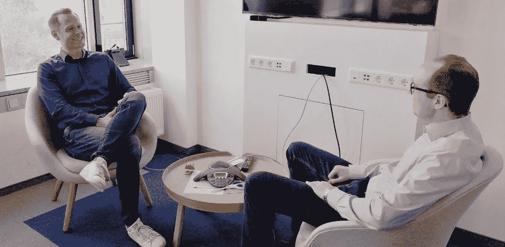

# “行业知识是数据科学家的一大优势”

> 原文：<https://towardsdatascience.com/industry-knowledge-is-a-great-advantage-for-data-scientists-97db3086f4e5?source=collection_archive---------47----------------------->

**数据科学招聘人员** [**马可·霍夫勒**](https://www.linkedin.com/in/marcohoefler/) **接受了我关于他的工作和数据科学职位选拔流程的采访。他告诉我申请人需要具备哪些素质才能在这个过程中取得成功，哪些技能是次要的。**

在大多数情况下，任何经验水平的求职者与公司的第一次接触都是通过招聘人员或人才获取合作伙伴。对于数据科学家来说，这是放置简历和其他文档的人。招聘人员实际上做什么来填补数据科学职位？他在申请过程中注意什么，她(他)有什么影响？招聘人员如何将数据科学视为外部专家？我在对马尔科·霍夫勒的采访中讨论了这些问题。他是总部位于德国的全球性批发公司 METRO AG 的人才收购合伙人。他负责 IT 和数字化领域的所有职位空缺。

*Marco，您为数据科学职位招聘了多长时间？*

自从三年前开始专业招聘以来，这些职位一直是我关注的焦点之一。然而，作为一名勤工俭学的学生，我也有一些这样的角色要扮演。

*那么，这些年来你收到了多少份这些职位的申请？*

我估计做了大概 125 次面试，看了大概 300 到 400 人的申请文件。

*所以你也是一名把关人，负责做出第一次选择的决定？*

这个性质必然是一个结果。然而，我会完全不同地定义我在这里的主要角色。首先，我是一名顾问，在感兴趣的候选人和我们公司的需求之间进行调解。在与候选人的一次联合对话中，我了解了去地铁的步骤是否对双方都合适，是否提供了令人兴奋的发展机会。对我来说，为我们的候选人提供关于潜在机会、任务和团队环境的良好的进一步信息流，以丰富看到招聘广告后的第一印象，这是非常重要的。这确保了双方在进入深入的招聘流程之前有一个良好的预期管理。

如果在第一次审查文件的过程中，已经发现没有合适的交叉点，那么就会出现你所说的守门人效应。

*你会如何描述向你提出申请的候选人？*

好的一面是，通常没有典型的候选人，我与各种不同的人物和背景进行了讨论。趋势当然是数学、统计、物理的学术背景。在几个案例中，我还与毕业后最初在大学研究环境中工作的候选人进行了交谈。

底线是，整个光谱可以分为两个极端，在这两个极端之间有各种混合形式，甚至是完全的职业改变者:一方面，有一些人主要专门解决对精确度/准确性有学术要求的问题。他们的目标是找到最 100%有效的解决方案、预测等。现在想转投商界。另一方面，有些候选人已经在私营经济中工作过，因此他们不仅追求最大的精确性，而且更注重有效地计划和投资时间。这个范围还体现在沟通能力上。在数据科学中，这是客户需求和该领域可开发内容之间的桥梁。

你能描述一下申请过程吗？

我们目前的招聘流程从预选面试开始。诸如候选人目前的工作、他/她的优势和愿望等问题将会被讨论。这个人改变的动机是什么，我首先要求的是专业技能，比如敏捷方法的知识，这对我们很重要。我还特别关注沟通技巧，以及候选人是否能够优先考虑并回应客户的愿望。我喜欢以视频面试的方式进行这一步，因为成本低，但你仍然可以找到个人的水平。

如果我在这第一步发现有一个共同的基础，下一步将是与部门的第一次讨论。这取决于候选人目前的位置，无论是在我们公司还是远程进行。

如果这种技术性更强的讨论也成功了，接下来就是下一次对话，无论如何都要在现场进行。除了进一步的技术讨论之外，主要重点是公司的价值观和文化。如果双方达成一致，那么这个过程就离开了我的职责范围，转而制定雇佣合同。这可以在两周内快速完成。

*作为人才获取合作伙伴，你如何影响最终的招聘决定？*

当然，最终的决定是由招聘经理做出的。然而，当然在参与这个过程的人之间有很多对话，比如他/她的员工和我。作为整个过程的主持人，我负责协调所有相关方之间的校准对话，很自然地，我对候选人的看法至少也会通过讨论间接地影响决策。

然而，对于招聘经理来说，一个非常相关的部分也是我对候选人是否能够以一种可理解的方式向来自该领域以外的同事展示和解释数据科学和机器学习的复杂主题的看法。毕竟，这是未来工作必不可少的一部分，招聘经理只需要具备技术知识，这样我的观点就能带来附加值。

*如何看待以下属性或技能的意义:PhD？*

根据我的经验，在德国的企业环境中，博士学位对我们来说并不重要。我不知道有哪个招聘经理会明确倾向于一个拥有研究生学位的候选人。

*行业经验，以你的情况批发？*

这些知识非常重要，或者至少绝对是一个很大的优势。定量方法是大多数考生所熟知的。然而，来自行业的背景知识允许员工更有针对性地进行分析。例如，在零售业，这些是某些易腐性或特殊的营销场合。

*具体公司的财务数字？*

我个人的看法是，这个信息相当不重要。我对此不太感兴趣。然而，候选人试图理解商业模式并得出相关的挑战，这是我明确感兴趣的。

*技术技能在线认证？*

在线教育提供商的认证对我来说是次要的。很明显，我更喜欢候选人能够令人信服地、全面地向我解释他们是如何在哪些问题和项目上使用技术的。作为一名非数据科学家，我需要了解他们是如何提出切实可行的解决方案的。由于有大量的证书提供者，对每个证书背后的价值进行详细分类并不总是容易的。

*贵公司在选择数据科学家时是否使用了用例挑战？如果有，它们长什么样？*

这样的挑战在我们公司总是适用。我们提前给候选人发了一份案例研究，里面包含了真实的数据。然后，他们应该想出一个解决方案，并考虑演示。我们将询问候选人从他或她的分析中学到了什么。

*在这些情况下有最终的解决方案吗，或者这个任务还没有完成？*

我们的案子总是公开讨论的。这反映了我们的日常生活，在日常生活中，最终必须做出假设，必须讨论结果。不仅仅是简单的事实，日常工作生活对它来说也太复杂了。

但是，我们希望在演示中使用某些核心论点。我们提前与组织中的相关人员协调这些一般要求以获得某些结果。

你希望达到什么样的硬性淘汰标准？

不是那个意思。除非有人给出很差的评价。这主要是指明显的技术缺陷。以我的经验，这是，例如，处理统计异常值，如何对待它们，最重要的是，如何证明这是合理的。然而，这些案例中并没有隐藏的、候选人必须发现的有意识的陷阱。

*贵公司的数据科学团队是什么样的？*

从组织上讲，它更像是一个枢纽，而不是一个封闭的团队。这意味着数据科学家在他们参与项目的部门和直接的数据科学同事之间来回奔波。现在，我们有了一个矩阵组织，数据科学家被分配到部门和数据科学部门。

就个性而言，我们有非常广泛的范围。学科范围从数学家、统计学家、物理学家到越来越多的计算机科学家。我们既有大约 26 岁的大学毕业生，也有 45 岁左右有大约 7 年具体工作经验的同事。对了，我们的性别比例差不多是 50/50，这让我们很开心。

*一个数据科学家如何在你的组织中成就一番事业？有哪些进一步发展的途径？*

我们的目标是让我们的员工在纵向和横向上都得到发展。这意味着积极的发展并不需要更高的职称紧随其后。每个人都应该为自己决定如何在组织内发展，而这个决定不受任何评估。举个例子，这通常意味着某个来自技术领域的人想要向经理的方向发展。但是也可以向产品发展。因此，产品负责人的角色可以是个人发展和职业生涯的一步。然而，总是有可能回到不同的焦点。

*所以这也意味着一个想要多年做完全相同工作的数据科学家不会被批判性地看待？*

完全正确。我们不拘泥于自动指令的发展或变化。当然，对新事物的普遍兴趣是必要的，但这可以发生在一个人自己的领域内。

*如何看待数据科学家在贵公司以及总体上的波动？*

在我看来，METRO 的数据科学家波动很低。不过我也觉得低波动是比较德国的现象。根据我的经验，在德国文化中，需要在雇主那里呆更长时间是根深蒂固的。这就是为什么我通常会从我的观察中得出结论，没有任何评估，一个团队越国际化，与本地招聘的团队相比，波动就越大，主要是在德国。

然而，对于数据科学家来说，市场需求也很高。这意味着市场机制表明，数据科学家比技术工人供应更多或需求更少的其他学科具有更高的波动率。

*在您积极接触数据科学领域潜在候选人的工作过程中，有什么变化吗？*

市场竞争变得更加激烈。即使是高度个性化的沟通也往往不会带来成功，因为许多公司和机构都是这样做的。这意味着你不会因此受到人们的关注。其他方法更有前途，可以说:在我们的办公室里举行技术活动，与我们的员工共同开发开源项目，等等。

*最后，很高兴听到你对一个热门话题的个人看法:作为一个与数据科学家密切合作的人，但不是该领域的技术专家，你如何评估数据科学、机器学习和人工智能复合体的未来发展？积极的感受是否超过了对严重负面后果的恐惧？*

首先，我觉得发展速度很令人振奋。可能性的范围不是线性发展的，而是指数发展的。就我个人而言，我在日常生活中注意到，在后台运行的自动化被越来越频繁地使用，然后以闪电般的速度在实现中。如果这会让我们的生活更舒适，我非常欢迎。我不想表达恐惧，但我很好奇社会将如何在这种舒适和失去匿名之间进行权衡。我相信，不同的国家也会有非常不同的趋势和发展，这当然今天已经可以看到。

我不相信“终结者情节”，我也不相信人类自我毁灭的事实。然而，我认为未来最令人兴奋的问题将是我们如何避免或补偿由于智能机器接管的日益自动化的环境而导致的社会扭曲。社会抗议会显著增加吗？社会阶层会分化还是会有足够多的新领域出现在劳动力市场上？因此，我们谈论的是数字化、人工智能、完全自动化和量子计算机时代的世界秩序。

*你是否在质疑自己在数据科学领域的工作？那么为什么不使用 CRISP-DM 进行这次审查呢？你可以在* [*阅读我关于数据科学职业反思的文章*](/data-science-career-reflection-based-on-crisp-dm-process-model-aedd8542b019) *。*