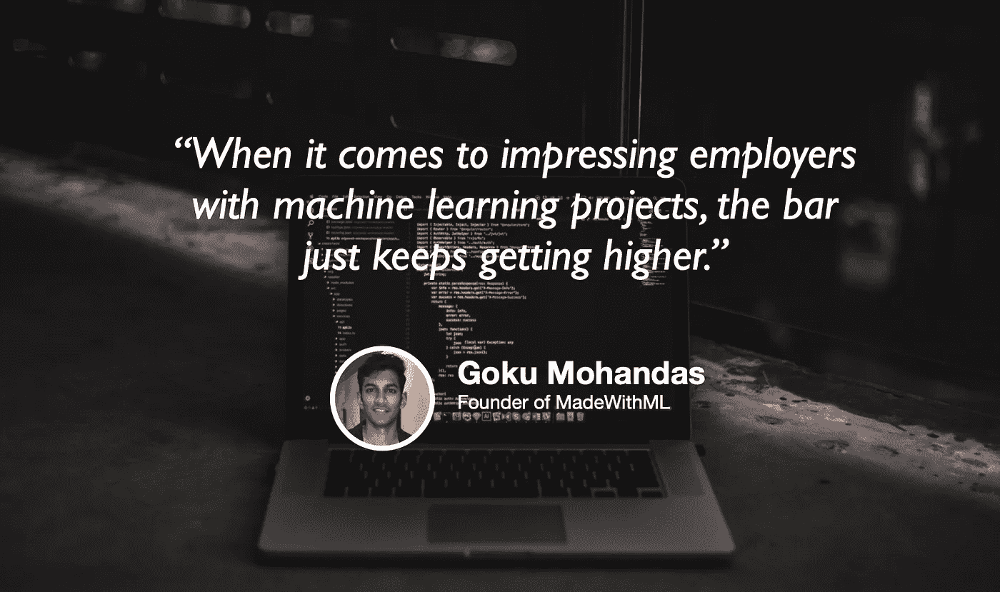

# 行业研究和如何展示你的项目

> 原文：<https://towardsdatascience.com/industry-research-and-how-to-show-off-your-projects-6aa2bfebf01a?source=collection_archive---------54----------------------->

## [苹果](https://podcasts.apple.com/ca/podcast/towards-data-science/id1470952338?mt=2) | [谷歌](https://www.google.com/podcasts?feed=aHR0cHM6Ly9hbmNob3IuZm0vcy8zNmI0ODQ0L3BvZGNhc3QvcnNz) | [SPOTIFY](https://open.spotify.com/show/63diy2DtpHzQfeNVxAPZgU) | [其他](https://anchor.fm/towardsdatascience)

## 悟空莫汉达斯在 [TDS 播客](https://towardsdatascience.com/podcast/home)

背景图片由[布莱克·康纳利](https://unsplash.com/@blakeconnally)

*编者按:迈向数据科学播客的“攀登数据科学阶梯”系列由 Jeremie Harris 主持。Jeremie 帮助运营一家名为*[*sharpes minds*](http://sharpestminds.com)*的数据科学导师初创公司。可以听下面的播客:*

如果你试图保持你的机器学习技能敏锐或进入数据科学，项目建设是你可以着手的最重要的活动。但是一个项目不会给你带来太多好处，除非你能有效地展示它，并获得反馈来迭代它——直到最近，你还没有很多地方可以这样做。

最近，一个名为 [MadeWithML](https://madewithml.com/) 的开源项目正在试图改变这种情况，它创建了一个易于共享的众包数据科学和机器学习项目库，其创始人、前苹果 ML 研究员和初创公司创始人悟空·莫汉达斯在这一集的 TDS 播客中与我坐在一起，讨论数据科学项目、他在行业中进行研究的经历以及 MadeWithML 项目。

以下是我最喜欢的外卖:

*   雇主对机器学习项目的期望越来越高。制作一个 jupyter 笔记本并使用机器学习模型进行有趣的预测已经不够好了，超越这一阶段的关键一步是收集你自己的数据，以确保你解决了其他竞争对手没有解决的利基问题。
*   在项目中包含的另一个关键步骤是部署:将您的模型包装在一个基本的 web 应用程序中，使其易于共享和展示，这一点非常重要。你最不想做的事情就是向招聘经理介绍自己，给他们发 400 行代码让他们审查——相反，给他们发一个部署好的网络应用程序就像给他们一个有趣的玩具，让他们更有可能想与你合作。
*   机器学习从一开始就有一种开源文化，这迫使许多过去孤立、孤立甚至神秘的公司更新他们的运营，以便能够吸引机器学习人才。尤其是苹果公司很好地完成了这一转变，小悟空讲述了一些必要的重大文化转变。
*   许多人认为你需要一个 CS 学位才能从事数据科学或机器学习，但这与事实相去甚远。随着数据科学的成熟，重点已经从纯粹的技术技能转移到业务和产品技能。数据科学家和 ML 工程师能够解决重要问题已经不够了:他们现在必须善于识别值得解决的问题。这就是专业知识至关重要的地方——这也是那些来自非计算机专业背景的人经常开始做的事情。如果你以前是经济学家、金融家、社会工作者，或者你在任何特定领域有过经验，即使不是技术性的，你也能很好地理解在哪里可以利用 ML 来解决实际问题。

你可以在这里的推特上[关注小悟空，查看用 ML 制作的](https://twitter.com/GokuMohandas)和[他们的推特账号](https://twitter.com/madewithml)，你也可以在这里的推特上[关注我。](https://twitter.com/jeremiecharris)