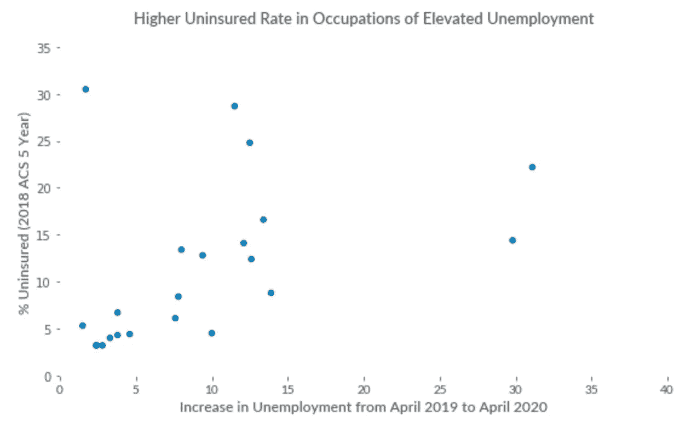

# 不平等和失业率最高的职业

> 原文：<https://towardsdatascience.com/inequality-and-the-occupations-with-the-deepest-unemployment-b163ce422efd?source=collection_archive---------85----------------------->

根据新的就业数据，美国劳工统计局发现 13%的美国人失业，尽管这一总体数字代表着巨大的困难，但这一问题在劳动力的某些领域甚至更加严重。与去年同期相比，一些职业如“计算机和数学职业”的失业率从 1%上升到 4%，但其他职业如“食品准备和服务相关职业”的失业率从 5%飙升到 37%(2019 年 5 月对 20 年 5 月)。没有人做得很好，但经济的某些部分比其他部分更糟糕。事实上，由于失业的形式，不平等可能会放大 COVID 的经济影响。因此，经济复苏可能不仅需要了解 T4 是如何让许多人失业的，还需要了解在劳动力中受影响最深的领域。

[链接至完整图像](https://gleap.org/static/img/viz/unemployment.png)。2020 年 5 月，与前一年相比，BLS 每个主要职业群体的失业率都有所上升(显示了未经季节调整的失业率，但进行了年份比较)。这些职业在疫情之前的工资和他们的未保险率在这次复苏中也可能被证明是至关重要的。

**首先，失业增加最多的职业也是那些收入较低的职业。**数据显示，一个职业的失业率增长(与前一年相比)与其典型的(疫情之前的)收入中位数之间存在显著的负相关关系(p<0.05；斯皮尔曼的等级秩序；2019 年 5 月至 2010 年 5 月的失业率。换句话说，准备或应对此类事件所需财政资源较少的劳动力群体，也可能是失业率上升方面面临最大经济压力的地区。考虑到整整 39%的美国人甚至在疫情之前就已经无法轻松应对 400 美元的意外开支，COVID 的经济影响对那些财力最弱的人影响最大的可能性表明，许多人正面临严重的困难和可能的债务。

每个点代表一种职业。垂直位置显示工资中位数，水平位置显示失业率增加(2019 年 5 月至 2020 年 5 月)。分析使用主要职业类别。

第二，从事这些职业的人也是那些不太可能拥有健康保险的人。社会希望患病者寻求治疗，以减缓 COVID 等疾病的传播，并帮助患者康复。考虑到这一点，大约 9%的美国人表示，即使他们认为自己感染了 COVID，他们也不会寻求医疗服务，因为担心支付不起费用。对于目前压力最大的部分劳动力来说，情况可能尤其如此，因为数据显示，与前一年相比，某个职业的典型(疫情之前)未投保率与失业率的增加之间存在显著的相关性(p<0.05；斯皮尔曼的等级秩序；2019 年 5 月至 2010 年 5 月的失业率。这意味着那些处于劳动力“高度受影响”地区的人也可能是那些不太可能拥有保险和不太能够获得医疗保健的人。*

每个点代表一种职业。垂直位置显示未保险率，水平位置显示失业增加(2019 年 5 月至 2020 年 5 月)。分析使用主要职业类别。

收入和获得可负担得起的医疗服务方面的这些差距相互累积，对工作和失业人员都产生了影响。对于那些仍在工作的人来说，以高失业率衡量压力最大的职业群体(食品准备和服务相关)不仅看到超过五分之一的工人没有保险，而且工资也可能使他们难以为未来潜在的失业做准备。考虑到在本行业工作机会稀缺的情况下，出于必要继续工作的可能压力，美国应该担心这些工人在寻求护理或生病时需要工作方面的犹豫。对于最近失业的人来说，不到一半的人有资格获得医疗补助，五分之一的人根本没有资格获得任何公共保险补贴。这在德克萨斯和佛罗里达等 15 个州可能尤其如此，这些州尚未实施患者保护与平价医疗法案(奥巴马医改)下的医疗补助扩展计划，因为这些地方的新失业人员预计有资格获得较低费率的医疗补助(p<0.05；威尔科克森署名排名)[ [8](https://www.kff.org/medicaid/issue-brief/status-of-state-medicaid-expansion-decisions-interactive-map/) 。这使得失业者面临巨大的开支(有资格获得补贴的人平均每月 145 美元，但没有资格获得补贴的人通常每月 300 至 700 美元)，或者拿自己的健康做赌注。简而言之，由于许多专家预计 COVID 期间无保险率将会上升，在这个国家最需要医疗以向前发展的时候，获得医疗可能会变得更加遥不可及。

> 当国家为了前进而最需要医疗服务的时候，获得医疗服务可能变得更加遥不可及

由于许多人失去了工资，并可能经历一个无法获得负担得起的医疗保健的疫情，本分析强调了 COVID 之前存在的结构性动态，这可能使疫情加深了其经济影响。美国需要考虑它可能会让一些劳动力承担什么样的金融和健康风险，以及这些风险会如何影响整个社会。正如许多州发现的那样，即使“重新开放”，解决失业问题仍然非常复杂。考虑到这一点，这些数据突显出工资和保险的差距可能会加剧新就业者的困境，表明政府可能需要考虑额外的援助来度过难关。尽管如此，仍有机会通过改善对未来的反应来尊重最近的所有困难，这种反应理解如何对美国部分劳动力不利。

**请注意，联邦政府确实在运行专门为 COVID 护理覆盖未保险者的计划[* [*13*](https://www.hrsa.gov/coviduninsuredclaim) *]。尽管如此，它仍然面临挑战，数据表明使用率仍然很低，报告表明一些人仍然看到大额账单[*[*14*](https://www.modernhealthcare.com/payment/tiny-fraction-2-billion-federal-uninsured-covid-19-testing-funds-have-gone-out)*][*[*15*](https://www.businessinsider.com/coronavirus-patients-medical-bills-hospitals-doctors-insurance-2020-5)*]。*

[Github 上可用的数据、引用的作品和代码](https://github.com/sampottinger/unemployment_analysis)。

感谢 Shreyas Jayanna 和 Lisa Nash 对这篇文章的帮助。

想要在数据、设计和系统的交叉点上做更多的实验吗？ [*关注我获取更多*](https://tinyletter.com/SamPottinger) *！*