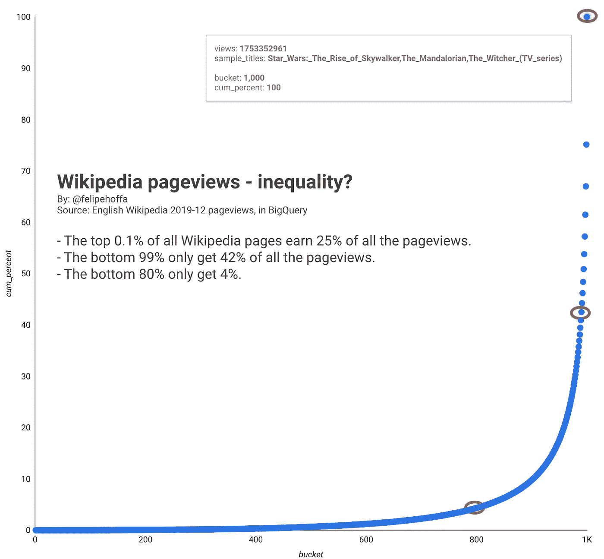
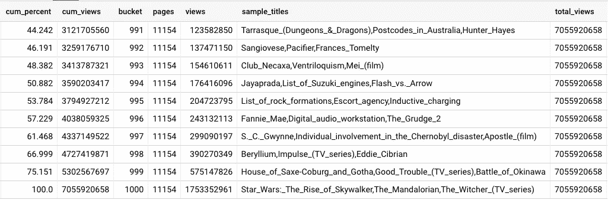
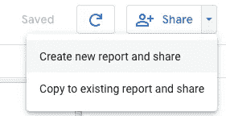
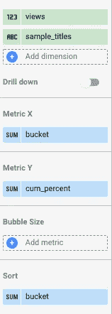

# 不等式:如何用 SQL、BigQuery 和 Data Studio 绘制洛伦兹曲线

> 原文：<https://towardsdatascience.com/inequality-how-to-draw-a-lorenz-curve-with-sql-bigquery-and-data-studio-c70824b0748d?source=collection_archive---------21----------------------->



## 所有维基百科页面中排名前 0.1%的页面获得了 25%的浏览量。最底层的 99%只获得了 42%的浏览量。而底层的 80% —只得到 4%。这只是一个例子——在本帖中，我们将回顾如何获得这个数据集和任何其他数据集的这些数字。

我们如何从 SQL 表中获取这些数字呢？

# 第 0 步:什么是 BigQuery？

如果这是您第一次使用 BigQuery，请准备好体验一次有趣的旅程。看看这篇文章:

[](/bigquery-without-a-credit-card-discover-learn-and-share-199e08d4a064) [## 没有信用卡的 BigQuery:发现、学习和分享

### 如果你在注册 BigQuery 时遇到了困难，不用担心——现在注册和开始使用比以往任何时候都容易

towardsdatascience.com](/bigquery-without-a-credit-card-discover-learn-and-share-199e08d4a064) 

# 步骤 1:您的数据、BigQuery 和 SQL

首先，我们需要定义数据集。在这种情况下，它是 2019 年 12 月期间英文维基百科中的所有浏览量-在删除所有特殊页面后:

```
WITH wiki_prefixes AS (
  SELECT ['File:', 'Draft:', 'Help:', 'en:', '...'] x
)

, data AS (
  SELECT *
  FROM `fh-bigquery.wikipedia_extracts.201912_en_totals`
  WHERE title NOT IN ('-', 'Main_Page')
  AND (
    title NOT LIKE '%:%'
    OR REGEXP_EXTRACT(title, '[^:]*:') 
      NOT IN UNNEST((SELECT(x) FROM wiki_prefixes))
  )
)
```

您需要为此数据集中的每一行提供一个连续的行号，按页面浏览量排序:

```
SELECT title, views, ROW_NUMBER() OVER (ORDER BY views) rn
FROM data
```

现在，您可以使用该行号将所有页面分成 1，000 个不同的存储桶:

```
SELECT 1+fhoffa.x.int(rn/(SELECT (1+COUNT(*))/1000 FROM data)) bucket
  , COUNT(*) pages
  , SUM(views) views
  , STRING_AGG(title ORDER BY views DESC LIMIT 3) sample_titles
FROM (
  SELECT title, views, ROW_NUMBER() OVER (ORDER BY views) rn
  FROM data
)
GROUP BY 1
```

为了得到一个桶，我在第一行有一个子查询:`(SELECT (1+COUNT(*))/1000 FROM data)`。这得到了一个基于我的数据集中的总行数的数字，通过将每个行号除以这个值，我们得到了 1k 个不同的桶，从 0 到 999。这些桶中的每一个都有其页面的`SUM(views)`，`STRING_AGG(title ORDER BY views DESC LIMIT 3)`用来保存一些样本标题以识别每个桶。

现在，我们将用一个新的查询来包围这个查询，该查询计算我们遍历 1k 个存储桶时的累计浏览量，以及所有这些页面的总浏览量:

```
SELECT SUM(views) OVER(ORDER BY bucket) cum_views
  , SUM(views) OVER() total_views
FROM (
...
)
```

获得每一行的累计值和总计值的方法是`OVER(ORDER BY bucket)`对仅仅是`OVER()`。

下一步:获取视图的累积数量，然后除以总数:

```
SELECT ROUND(100*cum_views/total_views,3) cum_percent
FROM (
  ...
)
```

现在我们有了一个可以在 Data Studio 中绘制的累计百分比。让我们将所有内容放在一起，创建一个新表:

```
CREATE TABLE `wikipedia_extracts.201912_lorenz_curve`
AS
WITH wiki_prefixes AS (SELECT ['File:', 'Talk:', 'Template_talk:', 'Wikipedia:', 'Category:', 'User_talk:', 'Page:', 'Template:', 'Category_talk:' , 'User:', 'Author:', 'Portal:', 'Wikipedia_talk:', 'Portal_talk:', 'File_talk:', 'Draft:', 'Help:', 'Draft_talk:', 'en:', 'Book_talk:', 'Module:', 'MOS:', 'Special:', 'Book:'] x)

, data AS (
  SELECT *
  FROM `fh-bigquery.wikipedia_extracts.201912_en_totals`
  WHERE title NOT IN ('-', 'Main_Page')
  AND (
    title NOT LIKE '%:%'
    OR REGEXP_EXTRACT(title, '[^:]*:') NOT IN UNNEST((SELECT(x) FROM wiki_prefixes))
  )
)SELECT ROUND(100*cum_views/total_views,3) cum_percent, *
FROM (
  SELECT SUM(views) OVER(ORDER BY bucket) cum_views, *, SUM(views) OVER() total_views
  FROM (
    SELECT 1+fhoffa.x.int(rn/(SELECT (1+COUNT(*))/1000 FROM data)) bucket, COUNT(*) pages, SUM(views) views
      , STRING_AGG(title ORDER BY views DESC LIMIT 3) sample_titles
    FROM (
      SELECT title, views, ROW_NUMBER() OVER (ORDER BY views) rn
      FROM data
    )
    GROUP BY 1
  ) 
)# 34.1 sec elapsed, 805.8 MB processed)
```



存储桶#991 到#1000，前 1%

# 步骤 2:在 Data Studio 中可视化

转到刚刚在 BigQuery 中创建的新表，按照以下步骤操作:

> 使用 Data Studio 探索
> 
> →保存
> 
> →创建新报告并共享



使用 Data Studio 浏览→保存→创建新报告并共享

> →添加到报告中
> 
> →添加图表
> 
> →分散
> 
> → X:时段 Y:累计百分比



添加到报表→添加图表→散点图→ X:时段 Y:累计百分比

这就是如何使用 Data Studio 和 BigQuery 通过几个步骤获得漂亮的洛伦兹曲线:

[互动数据工作室报告](https://datastudio.google.com/s/orrjF5Dsv6Y)

# 笔记

维基百科刚刚公布了他们的第 600 万篇文章，在这份报告中，我们统计了超过 1100 万页。这份报告是基于维基百科报告每小时的页面浏览量，来自他们的日志(加载在 BigQuery 中)——这些查询已经删除了我能找到的大多数“特殊”页面。[如果你知道更好的清理这些日志的方法，请告诉我。](https://twitter.com/felipehoffa)

为了平衡这一点，我没有计算任何在 12 月份获得 0 浏览量的页面——我们在这里查看浏览量日志，所以零不会出现。

[](https://en.wikipedia.org/wiki/Wikipedia:Six_million_articles) [## 维基百科:六百万篇文章

### 英语维基百科已经有 600 万篇文章，作者是 19 世纪加拿大学校的玛丽亚·伊莉斯·特纳·劳德…

en.wikipedia.org](https://en.wikipedia.org/wiki/Wikipedia:Six_million_articles)  [## 维基百科:什么是文章？

### “文章”属于维基百科页面的主命名空间(也称为“文章命名空间”或简称“主空间”)…

en.m.wikipedia.org](https://en.m.wikipedia.org/wiki/Wikipedia:What_is_an_article%3F) [](https://en.wikipedia.org/wiki/Pareto_distribution) [## 帕累托分布

### 以意大利土木工程师、经济学家和社会学家维尔弗雷多·帕累托[1]的名字命名的帕累托分布是一种…

en.wikipedia.org](https://en.wikipedia.org/wiki/Pareto_distribution) [](https://en.wikipedia.org/wiki/Lorenz_curve) [## 罗伦兹曲线

### 在经济学中，洛伦茨曲线是收入或财富分布的图形表示。那是…

en.wikipedia.org](https://en.wikipedia.org/wiki/Lorenz_curve) 

> [洛伦兹曲线](https://en.wikipedia.org/wiki/Lorenz_curve)是一个图表，显示了底层 *x* %的人承担的总收入或财富的比例，尽管这对于有限的人口来说并不严格成立(见下文)。它通常用于表示收入分配，显示底层家庭占总收入的百分比。家庭的百分比标绘在 x 轴上，收入的百分比标绘在 y 轴上。它也可以用来显示资产的分布。在这种用法中，许多经济学家认为它是衡量社会不平等的一种手段。

# 后续步骤

*   要用 BigQuery 计算基尼系数，查看来自 [Evgeny Medvedev](https://medium.com/u/b6a4cbbd2e57?source=post_page-----c70824b0748d--------------------------------) 的帖子:

[](https://medium.com/google-cloud/calculating-gini-coefficient-in-bigquery-3bc162c82168) [## 在 BigQuery 中计算基尼系数

### 下面是在给定每日余额的情况下输出每天的基尼系数的查询:

medium.com](https://medium.com/google-cloud/calculating-gini-coefficient-in-bigquery-3bc162c82168) 

*   要通过 BigQuery 和 Data Studio 互动查看[2019 年顶级维基百科浏览量，请查看我的帖子:](/interactive-the-top-2019-wikipedia-pages-d3b96335b6ae)

[](/interactive-the-top-2019-wikipedia-pages-d3b96335b6ae) [## 互动:2019 年维基百科页面排行榜

### 维基媒体公布了他们 2019 年最受欢迎的页面——但我们能更深入吗？当然，这里有 BigQuery 和…

towardsdatascience.com](/interactive-the-top-2019-wikipedia-pages-d3b96335b6ae) 

# 想要更多吗？

我是 Felipe Hoffa，谷歌云的开发者倡导者。在 [@felipehoffa](https://twitter.com/felipehoffa) 上关注我，在【medium.com/@hoffa】的[上找到我之前的帖子](https://medium.com/@hoffa)，在[的【reddit.com/r/bigquery】上找到所有关于 BigQuery 的帖子](https://reddit.com/r/bigquery)。