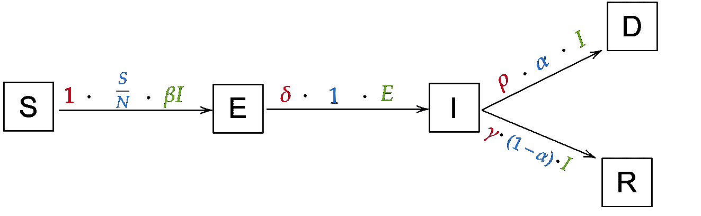

# 传染病建模:超越基本 SIR 模型

> 原文：<https://towardsdatascience.com/infectious-disease-modelling-beyond-the-basic-sir-model-216369c584c4?source=collection_archive---------2----------------------->


我的上一篇文章解释了背景，并介绍了传染病建模的主题。如果你对 SIR 方程还没有很好的理解，你可能想先读一下那个来理解这个。这篇文章关注的是基本 SIR 模型的更复杂的变体，它将使你能够实现和编码你自己的变体和想法。[下一篇文章](https://medium.com/@hf2000510/infectious-disease-modelling-fit-your-model-to-coronavirus-data-2568e672dbc7)将关注模型与现实世界数据的拟合，并将新冠肺炎作为案例研究。

[**你可以在这里找到整篇文章的 python 笔记本。**](https://github.com/henrifroese/infectious_disease_modelling/blob/master/part_two.ipynb)

首先，我们将从一个稍微不同的更直观的角度快速探索 SIR 模型。之后，我们派生并实现了以下扩展:

*   **“死亡”状态**,指死于疾病的个体
*   **一种“暴露”状态**，针对已感染疾病但尚未传染的个体(这被称为 *SEIR* 模型)
*   **依赖于时间的 R₀-values** 这将允许我们对隔离、锁定等进行建模
*   **与资源和年龄相关的死亡率**这将使我们能够模拟过度拥挤的医院、有很多年轻人的人群……

# 作为状态转换的模型

快速回顾一下，看看我们定义的变量:

*   N: 总人口
*   S(t): 第 t 天易感人数
*   **I(t):** 第 t 天感染人数
*   **R(t):** 第 t 天康复的人数
*   **β:** 感染者每天感染的预期人数
*   **D:** 一个感染者已经并可能传播疾病的天数
*   **γ:** 感染者每日痊愈的比例(γ = 1/D)
*   **R₀:** 一个感染者感染的总人数(R₀ = β / γ)

这是基本方程:


在推导方程时，我们已经直观地将它们视为“方向”，它告诉我们第二天人口会发生什么(例如，当 10 个人被感染，康复率为 1/5(即伽马)，那么第二天康复的人数应该增加 1/5 * 10 = 2)。我们现在将对方程的理解固化为从一个区间 S、I 或 R 到另一个区间的“方向”或*【跃迁】*——这将极大地简化事情，当我们稍后引入更多区间时，方程会变得混乱。

下面是我们需要的符号:

隔间是盒子(“状态”)，就像这样:


从一个隔室到另一个隔室的过渡由箭头表示，其标签如下:


*率*描述了转变需要多长时间，*人口*是这种转变适用的个体群体，*概率*是个体发生转变的概率。

作为一个例子，让我们看看 SIR 方程中从易感者到被感染者的转变，β= 2，总人口为 100，10 人被感染，90 人易感。比率是 1，因为感染是立即发生的；过渡适用的人群是 2 * 10 = 20 个人，因为 10 个被感染的人每个感染 2 个人；可能性是 90%，因为 90/100 的人仍然会被感染。它对应于这个直观的符号:


而且更一般的，现在对于整个模型(对于 I → R，速率为γ，概率为 1 随着每个人的恢复):


正如你所看到的，箭头*指向*一个隔间*在等式中加上*；指向远离一个隔间的箭头*减去*。那不是太糟糕，是吗？花点时间去真正理解新的符号，看看它是如何用另一种方式来写方程的。**

对，我们现在理解了 SIR 模型，可以用 python 编码了，但是它已经有用了吗？它能告诉我们任何关于真实世界传染病的事情吗？答案是*不*在目前的状态下，该模型更多的是一个玩具，而不是一个有用的工具。让我们改变这一切！

# 引入新隔间

## 导出暴露隔间

许多传染病在具有传染性之前都有一个潜伏期，在此期间宿主还不能传播疾病。我们将这样的个体——以及整个隔间——称为***E****exposed*。

直觉上，我们会有 S → E → I → R 形式的转变:易感人群会感染病毒，从而暴露，然后被感染，然后康复。新的转变 S → E 将具有与当前的 S → I 转变相同的箭头，因为概率是相同的(所有易感者都可以被暴露)，速率是相同的(“暴露”立即发生)并且群体是相同的(感染个体可以传播疾病并且每个每天暴露β个新个体)。从 I 到 R 的过渡也没有改变的理由。唯一的新转变是从 E 到 I 的转变:概率是 1(每个暴露的人都会被感染)，总体是 E(所有暴露的人都会被感染)，比率得到一个新的变量，δ (delta)。我们实现了这些转变:


从这些转换，我们可以立即推导出这些方程(再次，比较状态转换和方程，直到它对你有意义):


## 对暴露隔间进行编程

这应该不会太难，我们只需要修改上一篇文章中的几行代码( [**再次，完整的代码在这里沿着**](https://github.com/hf2000510/infectious_disease_modelling/blob/master/part_two.ipynb) **，**我只是在这里展示重要的位)。我们将在 100 万人口中模拟一种高传染性(R₀ =5.0)疾病，潜伏期为 5 天，恢复期为 7 天。

```
Imports needed: 
from scipy.integrate import odeint
import numpy as np
import matplotlib.pyplot as plt
%matplotlib inline
```

方程和初始值现在看起来像这样:

我们随时间计算 S、E、I 和 R:

(标绘后)得到这个:


我们现在能够更真实地模拟真实的疾病，尽管仍然肯定缺少一个部分；我们现在将添加它:

## 导出死舱

对于非常致命的疾病，这个隔间非常重要。对于其他一些情况，您可能希望添加完全不同的区间和动态(例如在长时间研究一种疾病时的出生和非疾病相关的死亡)；这些模型可以变得像你想要的那样复杂！


我们当前的状态转换

让我们考虑一下如何利用当前的转换添加一个 ***D*** *ead* 状态。人什么时候会死于这种疾病？只有在他们被感染的时候！这意味着我们必须增加一个过渡 I → D。当然，人不会马上死去；我们为人们的死亡率定义了一个新的变量*ρ(rho)*(例如，当死亡需要 6 天时，ρ将是 1/6)。回收率γ没有理由改变。所以我们的新模型看起来会像这样:


唯一缺少的是从感染到康复以及从感染到死亡的概率。这将是又一个变量(现在的最后一个！)，即*死亡率α。*例如，如果α=5%，ρ = 1，γ = 1(因此人们在 1 天内死亡或康复，这是一个更简单的例子)，100 人被感染，那么 5% ⋅ 100 = 5 人将死亡。剩下 95%的⋅ 100 = 95 人正在康复。总而言之，I → D 的概率是α，因此 I → R 的概率是 1-α。我们最终得出了这个模型:



这自然会转化为这些等式:


## 对死区进行编程

我们只需要对代码做一些细微的修改(我们将α设置为 20%，ρ设置为 1/9)…

…我们得出这样的结论:


请注意，我添加了一个“总计”，将每个时间步长的 S、E、I、R 和 D 相加，作为“健全检查”:区间的总和总是为 N；这可以给你一个提示，说明你的方程是否正确。

您现在应该知道如何向模型中添加一个新的区间:考虑需要添加和更改哪些转换；想想这些新转变的概率、人口和速率；画图表；最后写下方程式。对于这些模型来说，编码绝对是*而不是*最难的部分！

例如，您可能想要为需要去 ICU 的受感染个体添加一个“ICU”隔间(我们将在下一篇文章中完成)。想想人可以从哪个车厢进 ICU，出了 ICU 后可以去哪里等等。

# 时间相关变量

以下是我们目前使用的变量的更新列表:

*   **总人口**
*   **S(t):** 第 t 天易感人数
*   **E(t):** 第 t 天暴露的人数
*   **I(t):** 第 t 天感染人数
*   **R(t):** 第 t 天康复人数
*   **D(t):**t 日死亡人数
*   **β:** 感染者每天感染的预期人数
*   **D:** 感染者已经并可能传播疾病的天数
*   **γ:** 感染者每日痊愈的比例(γ = 1/D)
*   **R₀:** 一个感染者感染的总人数(R₀ = β / γ)
*   **δ:** 潜伏期的长短
*   **α:** 病死率
*   人的死亡率(= 1/从感染到死亡的天数)

如您所见，只有区间会随时间变化(它们不是恒定的)。当然，这是极不现实的！举个例子，为什么 R₀-value 应该是常数？当然，全国范围内的封锁减少了感染者的感染人数，*这就是它们的意义所在*！自然地，为了更接近模拟真实世界的发展，我们必须让我们的变量随着时间而变化。

## 时间相关 R₀

首先，我们实现一个简单的改变:在第 *L* 天，一个严格的“锁定”被强制执行，将 R₀推至 0.9。在方程中，我们用β而不是 R₀，但我们知道 R₀ = β / γ，所以β = R₀ ⋅ γ。这意味着我们定义了一个函数

```
def R_0(t):
    return 5.0 if t < L else 0.9
```

β的另一个函数调用这个函数:

```
def beta(t):
    return R_0(t) * gamma
```

对，似乎很容易；我们只需相应地更改代码:

让我们画出一些不同的 L 值:


几天的时间就能让疾病的整体传播发生巨大的变化！

事实上，R₀可能从来没有从一种价值观“跳到”另一种价值观。相反，它(或多或少地)不断变化(可能上下波动几次，例如，如果社会距离措施放松，然后再次收紧)。你可以为 R₀选择任何你想要的函数，我只想给出一个常见的选择来模拟社交距离的最初影响:一个 [*逻辑函数*](https://en.wikipedia.org/wiki/Logistic_function) 。

该函数(用于我们的目的)如下所示:


下面是这些参数的实际作用:

*   r0 _ start 和 r0 _ end 是第一天和最后一天的 r0 值
*   x_0 是拐点的 x 值(即 R_0 最急剧下降的日期，这可以被认为是主要的“锁定”日期)
*   k 让我们改变 R_0 下降的速度

这些图可能有助于您理解参数:


同样，相应地更改代码:

我们让 R₀在第 50 天左右从 5.0 快速下降到 0.5，现在可以真正看到曲线在第 50 天后变平:


## **与资源和年龄相关的死亡率**

与 R₀相似，对大多数真正的疾病来说，死亡率α可能不是常数。这可能取决于多种因素。我们将关注对资源和年龄的依赖性。

首先，让我们看看资源依赖。当更多的人被感染时，我们希望死亡率更高。想一想如何将它转化为一个函数:我们可能需要一个“基础”或“最佳”死亡率，用于只有少数人被感染(并因此得到最佳治疗)的情况，以及一些考虑到当前感染人口比例的因素。这是实现这些想法的函数的一个例子:


这里， *s* 是某个任意但固定的(这意味着我们为一个模型自由选择它一次，然后它随时间保持不变)比例因子，它控制感染比例应该有多大的影响；α_OPT 是最佳死亡率。例如，如果 s=1，有一半的人口在某一天被感染，那么 s ⋅ I(t) / N = 1/2，那么那一天的病死率α(t)为 50% + α_OPT。或者也许大多数人几乎没有任何症状，因此许多被感染的人不会阻塞医院。那么比例因子 0.1 可能是合适的(在同样的情况下，死亡率仅为 5% + α_OPT)。

更精细的模型可能会使死亡率取决于 ICU 病床或呼吸机的数量等。我们将在下一篇文章中对冠状病毒建模时做这件事。

年龄依赖就有点难了。为了完全实现它，我们必须为每个年龄组包括单独的隔间(例如，一个感染隔间用于 0-9 岁的人，另一个用于 10-19 岁的人……)。用 python 中的一个简单 for 循环就可以做到这一点，但是等式有点混乱。仍然能够产生良好结果的更简单的方法如下:

对于更简单的方法，我们需要两样东西:按年龄组的死亡率和该年龄组占总人口的比例。例如，我们可能有以下死亡率和按年龄组划分的人数(在 Python 字典中):

```
alpha_by_agegroup = {
    "0-29": 0.01, "30-59": 0.05, "60-89": 0.20, "89+": 0.30
}
proportion_of_agegroup = {
    "0-29": 0.1, "30-59": 0.3, "60-89": 0.4, "89+": 0.2
}
```

(这将是一个非常老的人口，40%在 60-89 岁之间，20%在 89 岁以上)。现在，我们通过将年龄组死亡率乘以该年龄组的人口比例相加来计算总平均死亡率:

α = 0.01 ⋅ 0.1 + 0.05 ⋅ 0.3 + 0.2 ⋅ 0.4 + 0.3 ⋅ 0.2 = 15.6%.或者在代码中:

```
alpha = sum(
    alpha_by_agegroup[agegroup] * proportion_of_agegroup[agegroup]  
    for agegroup in alpha_by_agegroup.keys()
)
```

相当年轻的人口比例如下…

```
proportion_of_agegroup = {
    "0-29": 0.4, "30-59": 0.4, "60-89": 0.1, "89+": 0.1
}
```

…平均死亡率仅为 7.4%！

如果我们想同时使用我们的资源依赖公式和年龄依赖公式，我们可以使用我们刚刚用来计算α_OPT 的资源公式，并在上面的资源依赖公式中使用它。

随着时间的推移，当然有更精细的方法来实现死亡率。例如，我们没有考虑到只有需要重症监护的危重病例才会挤满医院，并可能增加死亡率；或者死亡改变了我们最初用来计算死亡率的人口结构；或者感染对死亡率的影响应该在几天后发生，因为人们通常不会立即死亡，这将导致 [*延迟微分方程*](https://en.wikipedia.org/wiki/Delay_differential_equation) ，这在 Python 中很难处理！再次强调，尽你所能地发挥创造力！

## 实施与资源和年龄相关的死亡率

这相当简单，我们甚至不需要改变我们的主方程(我们在方程中定义 *alpha* ，因为我们需要访问当前值 I(t))。

根据上面按年龄组和老年人口统计的死亡率(以及比例因子 *s* 为 1，所以许多人被感染对死亡率有很大影响)，我们得出了这个图:


对于较年轻的人口(大约 8 万人而不是 15 万人死亡):


现在缩放系数只有 0.01:

对于年龄较大的人群(请注意，随着时间的推移，死亡率仅略微上升)…


…以及更年轻的人群:


# 概述

仅此而已！您现在应该能够添加自己的区间(可能是针对可能再次感染*的个人的区间，或者是针对糖尿病患者等特殊风险群体的区间)，首先通过状态转换符号以图形方式，然后正式通过等式，最后通过 Python 以编程方式！此外，您还看到了一些实现时间相关变量的示例，这使得模型更加通用。*

*所有这些应该可以让你设计出非常接近真实世界的 SIR 模型。当然，许多科学家目前正在研究这些模型([此链接](https://scholar.google.de/scholar?as_vis=1&q=coronavirus+SIR&hl=en&as_sdt=1,5&as_ylo=2020)可以帮助你找到一些当前的文章——注意，它们可能会变得非常复杂，但这仍然是深入了解该领域当前状态的一个很好的方式)。在下一篇文章中，我们将把重点放在设计模型并使其适合真实世界的数据，并将冠状病毒作为一个案例研究。*

****编者按:*** [*走向数据科学*](http://towardsdatascience.com) *是一份以数据科学和机器学习研究为主的中型刊物。我们不是健康专家或流行病学家，本文的观点不应被解释为专业建议。想了解更多关于疫情冠状病毒的信息，可以点击* [*这里*](https://www.who.int/emergencies/diseases/novel-coronavirus-2019/situation-reports) *。**